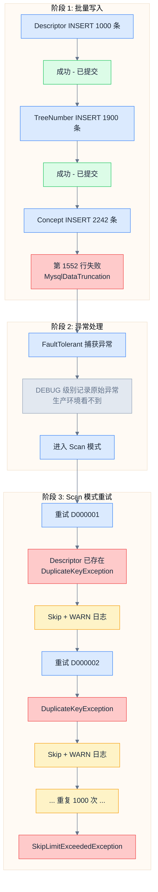

# Spring Batch FaultTolerant 模式掩盖原始异常

## 问题现象

MeSH desc2025.xml 导入时报错 `Duplicate entry 'D000105' for key 'uk_mesh_ui'`，Skip 超过 100 次导致 Job 失败。

**令人困惑的现象**：
- 数据库在导入前已清空（TRUNCATE）
- XML 源文件数据唯一（验证通过）
- 日志中只有大量"唯一键冲突"错误，**看不到任何其他类型的异常**

## 重现步骤

1. 清空 MeSH 相关表
2. 触发 MeSH Descriptor 导入 Job
3. Job 失败，查看日志只看到唯一键冲突

## 环境

- Spring Boot: 3.5.7
- Spring Batch: 5.x
- MyBatis-Plus: 3.5.8
- MySQL: 8.x
- Java: 25

## 根因分析（Five Whys）

| # | 问题 | 答案 |
|---|------|------|
| 1 | 为什么数据库报唯一键冲突？ | Scan 模式重试时，Descriptor 数据已存在 |
| 2 | 为什么 Descriptor 数据已存在？ | 第一次批量写入时 Descriptor INSERT 成功了 |
| 3 | 为什么批量写入会失败并进入 Scan 模式？ | Concept INSERT 失败，触发 FaultTolerant 重试 |
| 4 | 为什么 Concept INSERT 失败？ | `casn1_name` 列 VARCHAR(255) 不够长，MysqlDataTruncation |
| 5 | **为什么日志看不到 MysqlDataTruncation？** | **FaultTolerant 模式只在 DEBUG 级别记录原始异常** |

## 技术深度剖析

### Spring Batch FaultTolerant 的异常处理机制



### 关键代码位置

`FaultTolerantChunkProcessor` 的异常处理逻辑（简化）：

```java
try {
    doWrite(items);  // 批量写入
} catch (Exception e) {
    // ⚠️ 原始异常只在 DEBUG 级别记录！
    logger.debug("Chunk write failed, switching to scan mode", e);

    // 进入逐条重试
    scanForSkippableItems(items);
}
```

### 为什么这个设计会导致问题

| 日志级别 | 记录的内容 | 生产可见性 |
|----------|-----------|-----------|
| DEBUG | 批量写入失败的原始异常（如 MysqlDataTruncation） | ❌ 不可见 |
| INFO | Chunk 处理进度 | ✅ 可见 |
| WARN | Scan 模式中的每次 Skip（如 DuplicateKeyException） | ✅ 可见 |
| ERROR | SkipLimitExceededException（最终失败） | ✅ 可见 |

**结果**：你看到的全是 Scan 模式产生的"症状"（唯一键冲突），而不是"病因"（数据截断）。

## 解决方案

### 修复 1：扩展 `casn1_name` 列长度

直接修改原始迁移脚本（数据库尚未初始化）：

```sql
-- V0.2.0__create_classification_index.sql（修改）
`casn1_name` TEXT NULL DEFAULT NULL COMMENT 'CAS 类型 1 名称(化学物质专用,IUPAC 命名可能很长)',
```

### 修复 2：关闭 FaultTolerant 模式

移除 FaultTolerant 配置，让错误立即失败，避免原始异常被掩盖：

```java
// MeshDescriptorJobConfig.java（修改前）
return new StepBuilder("meshDescriptorImportStep", jobRepository)
    .<MeshDescriptorAggregate, MeshDescriptorAggregate>chunk(chunkSize, transactionManager)
    .reader(meshDescriptorItemReader(null, null))
    .writer(meshDescriptorItemWriter)
    .faultTolerant()
    .skipLimit(SKIP_LIMIT)
    .skip(DataIntegrityViolationException.class)
    .build();

// MeshDescriptorJobConfig.java（修改后）
return new StepBuilder("meshDescriptorImportStep", jobRepository)
    .<MeshDescriptorAggregate, MeshDescriptorAggregate>chunk(chunkSize, transactionManager)
    .reader(meshDescriptorItemReader(null, null))
    .writer(meshDescriptorItemWriter)
    .build();
```

**关闭 FaultTolerant 的好处**：

| 方面 | FaultTolerant 模式 | 简单模式（当前） |
|------|-------------------|-----------------|
| 错误可见性 | ❌ 原始错误被掩盖 | ✅ 错误立即暴露 |
| 事务边界 | ⚠️ Scan 模式事务复杂 | ✅ 失败即回滚 |
| 断点续传 | ✅ 支持跳过坏数据 | ❌ 需先修复数据 |
| 适用场景 | 容忍部分数据丢失 | 数据完整性优先 |

### 后续改进（可选）

- [ ] 在 ItemWriter 基类中添加统一的异常日志
- [ ] 注册 `ItemWriteListener.onWriteError()` 捕获批量写入异常
- [ ] 如需恢复 FaultTolerant，应同时注册 SkipListener 记录原始异常

## 排查 Spring Batch 问题的通用方法

### 1. 查询元数据表（最快）

```sql
SELECT step_name, status, exit_code, exit_message,
       read_count, write_count, skip_count
FROM batch_step_execution
WHERE job_execution_id = ?
ORDER BY start_time;
```

`exit_message` 字段可能包含原始异常堆栈。

### 2. 注册 SkipListener

```java
@Component
public class BatchErrorListener implements SkipListener<Object, Object> {
    @Override
    public void onSkipInWrite(Object item, Throwable t) {
        log.error("写入跳过 - item: {}, 原因: {}", item, t.getMessage(), t);
    }
}
```

### 3. 使用 ItemWriteListener

```java
@Override
public void onWriteError(Exception e, Chunk<?> items) {
    // 这里能捕获到批量写入的原始异常
    log.error("批量写入失败 - 原因: {}", e.getMessage(), e);
}
```

### 4. 临时开启 DEBUG 日志

```yaml
logging:
  level:
    org.springframework.batch: DEBUG
```

### 5. 减小 Chunk Size

```java
.<Input, Output>chunk(10)  // 从 1000 改为 10
```

## 经验教训

- **学到**：Spring Batch FaultTolerant 模式会在 DEBUG 级别"吞掉"原始异常，只在 WARN 级别记录 Scan 模式的重试异常
- **学到**：批量 INSERT 部分成功后，事务可能已提交（取决于事务边界配置）
- **学到**：FaultTolerant 的 Scan 模式会产生大量"症状"日志，掩盖真正的"病因"
- **决策**：对于数据导入场景，优先保证数据完整性，关闭 FaultTolerant 让错误立即暴露
- **改进**：如需使用 FaultTolerant，必须同时注册 SkipListener/ItemWriteListener 记录原始异常

## 相关资源

- commit: `待提交`
- 修改文件:
  - `V0.2.0__create_classification_index.sql` - `casn1_name` VARCHAR(255) → TEXT
  - `MeshDescriptorJobConfig.java` - 移除 FaultTolerant 配置
