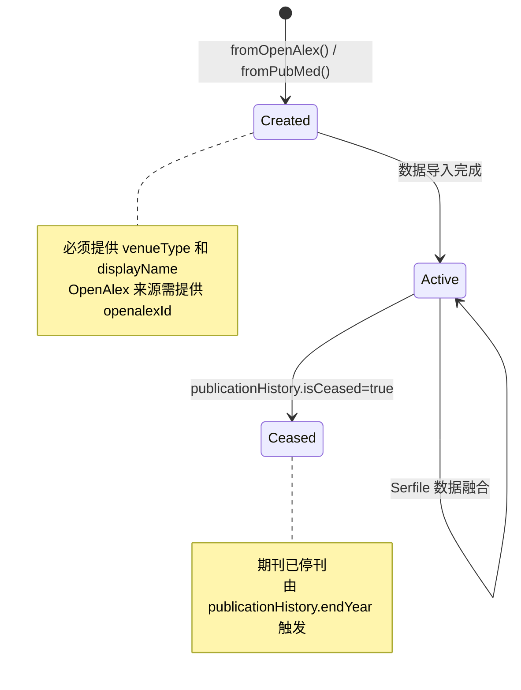

# Venue 聚合根

## 概念定义

### 定义

**Venue（载体）** 是学术出版物的发表渠道，包括期刊（Journal）、仓库（Repository）、会议（Conference）和电子书平台（eBook Platform）等类型。作为 Catalog 服务的核心聚合根，Venue 整合来自 OpenAlex、NLM Serfile 等多数据源的期刊元数据。

### 唯一标识

| 属性 | 说明 |
|------|------|
| 类型 | Long |
| 生成策略 | 雪花算法 |
| 业务标识 | ISSN-L（Linking ISSN）用于跨数据源去重 |

### 通用语言

| 术语 | 含义 |
|------|------|
| Venue | 载体，学术出版物的发表渠道 |
| ISSN-L | Linking ISSN，用于关联同一期刊的不同 ISSN 变体 |
| OpenAlex ID | OpenAlex 数据库中的唯一标识符（格式：S + 数字） |
| NLM ID | 美国国家医学图书馆分配的唯一标识符 |
| MeSH | Medical Subject Headings，医学主题词表 |
| Serfile | NLM 期刊元数据文件格式 |
| Provenance | 数据来源追踪信息 |

## 结构模型

```d2
classes: {
  aggregate_root: {
    shape: class
    style: {
      fill: "#dbeafe"
      stroke: "#3b82f6"
    }
  }
  value_object: {
    shape: class
    style: {
      fill: "#e1f5fe"
      stroke: "#0ea5e9"
    }
  }
}

venue_aggregate: VenueAggregate {
  class: aggregate_root
  +id: Long
  +venueType: VenueType
  +displayName: String
  +abbreviatedTitle: String
  +homepageUrl: String
  +openalexId: String
  +issnL: String
  +nlmId: String
  +coden: String
  +fromOpenAlex(): VenueAggregate
  +fromPubMed(): VenueAggregate
  +restore(): VenueAggregate
  +addIdentifier(): void
  +removeIdentifier(): void
  +withXxx(): VenueAggregate
}

venue_identifier: VenueIdentifier {
  class: value_object
  +type: VenueIdentifierType
  +value: String
}

venue_rating: VenueRating {
  class: value_object
  +ratingType: RatingType
  +quartile: Integer
  +impactFactor: BigDecimal
}

venue_stats: VenueStats {
  class: value_object
  +worksCount: Integer
  +citedByCount: Integer
  +hIndex: Integer
}

publication_history: PublicationHistory {
  class: value_object
  +startYear: Integer
  +endYear: Integer
  +isCeased: Boolean
}

indexing_info: IndexingInfo {
  class: value_object
  +isIndexedInMedline: Boolean
  +isPmc: Boolean
}

provenance_info: ProvenanceInfo {
  class: value_object
  +sourceType: SourceType
  +sourceId: String
  +fetchedAt: Instant
}

venue_aggregate -> venue_identifier: 1:N identifiers
venue_aggregate -> venue_rating: 1:1 latestRating
venue_aggregate -> venue_stats: 1:1 currentStats
venue_aggregate -> publication_history: 1:1 publicationHistory
venue_aggregate -> indexing_info: 1:1 indexingInfo
venue_aggregate -> provenance_info: 1:1 provenance
```

**图例说明**：
- 蓝色背景：聚合根
- 浅蓝色背景：值对象

### 补充数据（统一管理）

根据 [[ADR-014]]，以下值对象从聚合边界中分离，但仍通过 `VenueRepository` **统一入口**管理：

```d2
direction: down

classes: {
  repository: {
    shape: class
    style: {
      fill: "#dbeafe"
      stroke: "#2196f3"
      stroke-width: 2
    }
  }
  record_vo: {
    shape: class
    style: {
      fill: "#fff3e0"
      stroke: "#fb923c"
    }
  }
}

venue_repo: VenueRepository {
  class: repository
  // 聚合根方法
  +findById()
  +findByIssnL()
  +insertAll()
  +updateBatch()
  // 补充数据方法
  +findYearlyMetricsByVenueIds()
  +replaceYearlyMetricsBatch()
  +findMeshTermsByVenueIds()
  +replaceMeshTermsBatch()
  +findRelationsByVenueIds()
  +replaceRelationsBatch()
  +findIndexingHistoriesByVenueIds()
  +replaceIndexingHistoriesBatch()
  +replaceSerfileDataBatch()
}

publication_stats: VenuePublicationStats {
  class: record_vo
  +year: int
  +worksCount: int
  +citedByCount: int
  +oaWorksCount: Integer
}

venue_mesh: VenueMesh {
  class: record_vo
  +descriptorName: String
  +descriptorUi: String
  +isMajorTopic: boolean
  +qualifierName: String
  +qualifierUi: String
}

venue_relation: VenueRelation {
  class: record_vo
  +relatedTitle: String
  +relationType: VenueRelationType
  +relatedNlmId: String
  +effectiveDate: LocalDate
}

indexing_history: VenueIndexingHistory {
  class: record_vo
  +indexingSource: String
  +currentlyIndexed: boolean
  +startYear: Integer
  +endYear: Integer
}

venue_repo -> publication_stats: manages
venue_repo -> venue_mesh: manages
venue_repo -> venue_relation: manages
venue_repo -> indexing_history: manages
```

**图例说明**：
- 蓝色背景：聚合仓储接口（统一入口）
- 橙色背景：补充数据 Record 值对象（通过 venueId 关联到 VenueAggregate）

**设计理由**：虽然补充数据与聚合根无不变量依赖，但从 DDD 角度，所有与 Venue 相关的数据访问都应通过 `VenueRepository` 这个统一入口，避免 Repository 分散带来的认知负担。

## 生命周期与状态

Venue 聚合无显式状态机，采用**数据驱动**的隐式状态：



**状态判断方法**：

| 方法 | 含义 |
|------|------|
| `isCeased()` | 是否已停刊 |
| `isOa()` | 是否为开放获取 |
| `isIndexedInMedline()` | 是否被 MEDLINE 索引 |
| `hasRating()` | 是否有评级数据 |

## 不变性规则

聚合在任何时候都必须满足以下规则：

- **[载体类型必填]**: `venueType` 不能为空
- **[显示名称必填]**: `displayName` 不能为空
- **[OpenAlex 来源标识]**: 来自 OpenAlex 的载体必须提供 `openalexId`
- **[ISSN 格式]**: ISSN 类型标识符必须符合 `XXXX-XXXX` 格式
- **[标识符去重]**: 同类型同值的标识符只能存在一个

**详细说明**：

| 规则 | 说明 | 违反后果 |
|------|------|----------|
| 载体类型必填 | 区分 Journal/Repository/Conference/eBook Platform | `IllegalStateException` |
| 显示名称必填 | 期刊的主要显示名称 | `IllegalStateException` |
| OpenAlex 来源标识 | 确保数据可追溯 | `IllegalStateException` |
| ISSN 格式 | 国际标准连续出版物编号格式 | `IllegalArgumentException` |

## 行为能力

聚合根公开的命令方法（禁止暴露 Setter）：

### 工厂方法

| 方法 | 输入参数 | 说明 |
|------|----------|------|
| `fromOpenAlex` | venueType, displayName, openalexId | 从 OpenAlex 创建 |
| `fromPubMed` | venueType, displayName, nlmId | 从 PubMed/Serfile 创建 |
| `restore` | id, version, venueType, displayName | 从持久化恢复 |

### 属性设置方法（链式）

| 方法 | 输入参数 | 说明 |
|------|----------|------|
| `withAbbreviatedTitle` | abbreviatedTitle | 设置缩写标题 |
| `withAlternateTitles` | alternateTitles | 设置替代标题列表 |
| `withHomepageUrl` | homepageUrl | 设置主页 URL |
| `withPublisher` | publisher | 设置出版商 |
| `withPublicationHistory` | publicationHistory | 设置出版历史 |
| `withIndexingInfo` | indexingInfo | 设置索引信息 |
| `withHostOrganization` | hostOrganization | 设置主办机构 |
| `withOaStatus` | isOa, isInDoaj, isCore | 设置 OA 状态 |
| `withLatestRating` | latestRating | 设置最新评级 |
| `withCurrentStats` | currentStats | 设置当前统计 |
| `withProvenance` | provenance | 设置数据来源 |
| ... | ... | 其他 withXxx 方法 |

### 标识符管理方法

| 方法 | 输入参数 | 说明 |
|------|----------|------|
| `addIdentifier` | VenueIdentifier | 添加标识符（自动去重） |
| `addIdentifier` | type, value | 添加标识符（便捷方法） |
| `removeIdentifier` | type, value | 移除标识符 |
| `setIdentifiers` | List\<VenueIdentifier\> | 批量设置标识符 |

### 查询方法

| 方法 | 返回值 | 说明 |
|------|--------|------|
| `getIdentifier` | Optional\<VenueIdentifier\> | 获取指定类型的标识符 |
| `getIdentifiers()` | List\<VenueIdentifier\> | 获取所有标识符（不可变视图） |
| `getIdentifiers(type)` | List\<VenueIdentifier\> | 获取指定类型的所有标识符 |
| `isJournal` | boolean | 是否为期刊 |
| `isRepository` | boolean | 是否为仓库 |
| `isFromOpenAlex` | boolean | 是否来自 OpenAlex |
| `isFromPubMed` | boolean | 是否来自 PubMed |
| `isTopQuartile` | boolean | 是否为顶级分区（Q1） |

## 外部关系

该聚合与其他聚合的关系（只能通过 ID 引用）：

| 关联聚合 | 关系类型 | 引用方式 | 说明 |
|----------|----------|----------|------|
| [[PublicationAggregate]] | 1:N | publication.venueId | 文献发表在载体上 |
| [[MeshDescriptorAggregate]] | N:M | VenueMesh.descriptorUi | 期刊关联的 MeSH 主题词 |

**注意**：VenueMesh 中存储的是 MeSH UI（如 `D008511`），不存储 `MeshDescriptorAggregate` 的数据库 ID。

## 设计决策

### 为什么 `identifiers` 保留在聚合内？

基于 Vaughn Vernon 聚合设计规则分析：

1. **聚合级不变量**：存在 ISSN-L 唯一性约束，需要在添加标识符时验证
2. **生命周期一致**：标识符与 Venue 同生同灭
3. **查询频率高**：标识符是最常用的查询条件

### 为什么补充数据移出聚合？

详见 [[ADR-014]]，核心原因：

1. **无聚合级不变量**：`yearlyMetrics`、`meshTerms`、`relations`、`indexingHistories` 之间无业务关联
2. **独立更新周期**：OpenAlex 和 Serfile 数据分别导入
3. **聚合膨胀**：原聚合 1030 行，违反"设计小聚合"原则

### 为什么补充数据通过 VenueRepository 统一管理？

虽然补充数据与聚合根无不变量依赖，但采用单一 Repository 入口的原因：

1. **认知简化**：所有 Venue 相关数据通过一个入口访问，避免记忆多个 Repository
2. **事务边界清晰**：Application 层只需注入一个 Repository，事务协调更简单
3. **DDD 一致性**：聚合是一致性边界，Repository 是聚合的数据访问抽象，二者应 1:1 对应
4. **接口内聚**：补充数据方法通过注释分组，保持接口可读性

### 为什么使用 Record 而非 Class？

1. **不可变性**：Record 强制不可变，符合值对象语义
2. **简洁性**：自动生成 `equals()`/`hashCode()`/`toString()`
3. **层级分离**：Domain 层 Record 无 ID，Infrastructure 层 DO 有 ID

## 数据来源

| 属性/集合 | 数据来源 |
|-----------|----------|
| 基本信息 | OpenAlex Source API |
| `identifiers` | OpenAlex + Serfile |
| `yearlyMetrics` | OpenAlex counts_by_year |
| `meshTerms` | NLM Serfile MeshHeadingList |
| `relations` | NLM Serfile TitleRelated |
| `indexingHistories` | NLM Serfile IndexingHistoryList |

