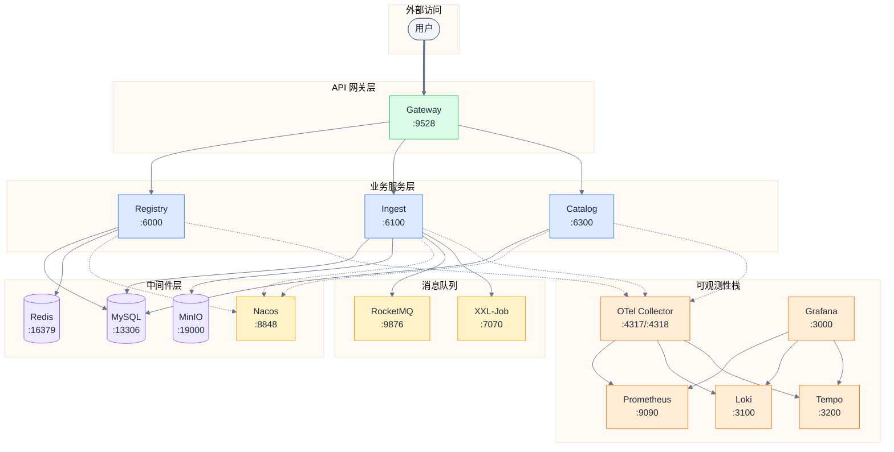

# 端口分配规范

> 本文档统一管理 Patra 项目所有服务的端口分配，确保开发、测试、生产环境的一致性。

## 端口分配原则

1. **非标准端口**：避免使用标准端口（如 3306、6379），防止与本地服务冲突
2. **范围划分**：按服务类型分配端口段，便于记忆和管理
3. **单一职责**：每个端口仅承载一种协议/功能

### 端口段规划

| 端口范围 | 分配给 |
|----------|--------|
| 3000-3999 | 可视化服务（Grafana、Loki、Tempo） |
| 4000-4999 | 注册中心与遥测（Nacos、OTel） |
| 6000-6999 | 业务微服务 |
| 7000-7999 | 任务调度（XXL-Job、RocketMQ Proxy） |
| 8000-8999 | API 与内部通信（Nacos、RocketMQ gRPC） |
| 9000-9999 | 监控告警（Prometheus、Alertmanager） |
| 10000-19999 | 中间件（RocketMQ、MySQL、Redis、MinIO） |

---

## 一、基础设施服务

**配置文件**：`docker/docker-compose.core.yaml`

| 服务 | 端口 | 协议 | 用途 | 健康检查 |
|------|------|------|------|----------|
| MySQL | 13306 | TCP | 数据库主服务 | `mysqladmin ping` |
| Redis | 16379 | TCP | 缓存与会话存储 | `redis-cli ping` |
| Nacos 控制台 | 4000 | HTTP | Nacos Web UI | `curl /nacos/health` |
| Nacos 服务发现 | 8848 | HTTP | 服务注册与发现 | - |
| Nacos gRPC | 9848 | gRPC | gRPC 服务发现 | - |
| Nacos gRPC 客户端 | 9849 | gRPC | 客户端通信 | - |

### 连接字符串

```bash
# MySQL
jdbc:mysql://localhost:13306/patra?useSSL=false&serverTimezone=Asia/Shanghai

# Redis
redis://localhost:16379

# Nacos
spring.cloud.nacos.discovery.server-addr=localhost:8848
spring.cloud.nacos.config.server-addr=localhost:8848
```

---

## 二、对象存储服务

**配置文件**：`docker/docker-compose.storage.yaml`

| 服务 | 端口 | 协议 | 用途 | 健康检查 |
|------|------|------|------|----------|
| MinIO API | 19000 | HTTP | S3 兼容 API | `curl /minio/health/live` |
| MinIO Console | 19001 | HTTP | Web 管理控制台 | - |

### 连接配置

```yaml
minio:
  endpoint: http://localhost:19000
  access-key: minioadmin
  secret-key: minioadmin
  bucket: patra
```

---

## 三、消息队列与任务调度

**配置文件**：`docker/docker-compose.jobs.yaml`

| 服务 | 端口 | 协议 | 用途 | 健康检查 |
|------|------|------|------|----------|
| RocketMQ NameServer | 9876 | TCP | 名称服务 | - |
| RocketMQ Broker | 10909 | TCP | 远程通信 | - |
| RocketMQ Broker | 10911 | TCP | 主通信端口 | - |
| RocketMQ HA | 10912 | TCP | 主从复制 | - |
| RocketMQ Proxy HTTP | 7071 | HTTP | Proxy 网关 | - |
| RocketMQ Proxy gRPC | 8081 | gRPC | Proxy gRPC | - |
| RocketMQ Dashboard | 4002 | HTTP | Web 管理界面 | - |
| XXL-Job Admin | 7070 | HTTP | 任务调度管理 | - |

### 连接配置

```yaml
rocketmq:
  name-server: localhost:9876
  producer:
    group: patra-producer

xxl:
  job:
    admin:
      addresses: http://localhost:7070/xxl-job-admin
```

---

## 四、可观测性栈

**配置文件**：`docker/docker-compose.observability.yaml`

| 服务 | 端口 | 协议 | 用途 | 健康检查 |
|------|------|------|------|----------|
| OTel Collector | 4317 | gRPC | OTLP 接收 | 手动验证 |
| OTel Collector | 4318 | HTTP | OTLP 接收 | 手动验证 |
| OTel Collector | 8889 | HTTP | Prometheus metrics | - |
| Prometheus | 9090 | HTTP | 指标存储 | `wget /-/healthy` |
| Loki | 3100 | HTTP | 日志聚合 | 手动验证 |
| Tempo | 3200 | HTTP | 链路追踪 | 手动验证 |
| Tempo 内部 | 9095 | TCP | 内部通信 | - |
| Grafana | 3000 | HTTP | 可视化 | `wget /api/health` |
| Alertmanager | 9093 | HTTP | 告警路由 | `wget /-/healthy` |

> [!note] FROM scratch 镜像限制
> OTel Collector、Loki、Tempo 使用 `FROM scratch` 镜像，无法使用 Docker 内置健康检查。
> 通过宿主机 `curl` 验证：
> - Loki: `curl http://localhost:3100/ready`
> - Tempo: `curl http://localhost:3200/ready`
> - OTel: `curl http://localhost:13133/health`（需暴露端口）

### 应用集成配置

```yaml
# application.yml
management:
  otlp:
    tracing:
      endpoint: http://localhost:4318/v1/traces
    metrics:
      export:
        endpoint: http://localhost:4318/v1/metrics
```

---

## 五、业务微服务

**配置文件**：各服务 `src/main/resources/application.yml`

| 服务 | 端口 | 协议 | 用途 | 配置位置 |
|------|------|------|------|----------|
| API Gateway | 9528 | HTTP | 统一 API 入口 | `patra-gateway-boot` |
| Registry | 6000 | HTTP | 元数据 SSOT | `patra-registry-boot` |
| Ingest | 6100 | HTTP | 数据采集 | `patra-ingest-boot` |
| Catalog | 6300 | HTTP | 目录服务 | `patra-catalog-boot` |

### 服务依赖关系

```
Gateway (9528) → Registry (6000)
                ↘ Ingest (6100)
                ↘ Catalog (6300)
```

---

## 网络拓扑图



---

## 端口汇总表

| 端口 | 服务 | 协议 | Docker Compose |
|------|------|------|----------------|
| 3000 | Grafana | HTTP | observability |
| 3100 | Loki | HTTP | observability |
| 3200 | Tempo | HTTP | observability |
| 4000 | Nacos Console | HTTP | core |
| 4002 | RocketMQ Dashboard | HTTP | jobs |
| 4317 | OTel Collector | gRPC | observability |
| 4318 | OTel Collector | HTTP | observability |
| 6000 | Registry | HTTP | 业务服务 |
| 6100 | Ingest | HTTP | 业务服务 |
| 6300 | Catalog | HTTP | 业务服务 |
| 7070 | XXL-Job Admin | HTTP | jobs |
| 7071 | RocketMQ Proxy | HTTP | jobs |
| 8081 | RocketMQ Proxy | gRPC | jobs |
| 8848 | Nacos | HTTP | core |
| 8889 | OTel Collector | HTTP | observability |
| 9090 | Prometheus | HTTP | observability |
| 9093 | Alertmanager | HTTP | observability |
| 9095 | Tempo Internal | TCP | observability |
| 9528 | API Gateway | HTTP | 业务服务 |
| 9848 | Nacos gRPC | gRPC | core |
| 9849 | Nacos gRPC Client | gRPC | core |
| 9876 | RocketMQ NameServer | TCP | jobs |
| 10909 | RocketMQ Broker | TCP | jobs |
| 10911 | RocketMQ Broker | TCP | jobs |
| 10912 | RocketMQ HA | TCP | jobs |
| 13306 | MySQL | TCP | core |
| 16379 | Redis | TCP | core |
| 19000 | MinIO API | HTTP | storage |
| 19001 | MinIO Console | HTTP | storage |

---

## 配置文件索引

| 文件 | 管理的服务 |
|------|-----------|
| `docker/docker-compose.core.yaml` | MySQL, Redis, Nacos |
| `docker/docker-compose.storage.yaml` | MinIO |
| `docker/docker-compose.jobs.yaml` | RocketMQ, XXL-Job |
| `docker/docker-compose.observability.yaml` | OTel, Prometheus, Loki, Tempo, Grafana, Alertmanager |
| `patra-gateway-boot/src/main/resources/application.yml` | Gateway |
| `patra-registry-boot/src/main/resources/application.yml` | Registry |
| `patra-ingest-boot/src/main/resources/application.yml` | Ingest |
| `patra-catalog-boot/src/main/resources/application.yml` | Catalog |

---

## 变更日志

| 日期 | 变更内容 |
|------|----------|
| 2025-11-29 | 初始版本：统一管理 29 个端口 |
