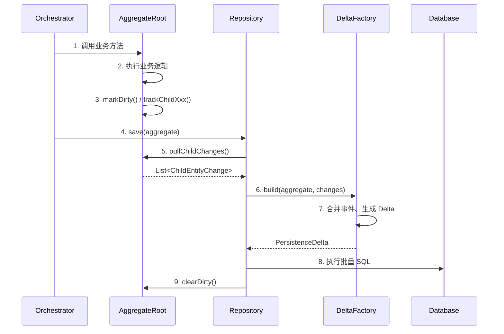

# 聚合根持久化设计

> 本文档定义 Patra 项目中聚合根（Aggregate Root）及其子实体的持久化策略，采用"三层事件模型"实现高性能、可维护的增量更新。

---

## 背景与问题

### 问题描述

在 DDD 六边形架构中，聚合根通常包含多个子实体和值对象。当聚合根被修改后，如何高效地将变更持久化到数据库是一个核心问题。

**传统方案的问题：**

| 方案 | 问题 |
|------|------|
| **全删全增** | 性能差、丢失 ID 稳定性、触发不必要的级联操作 |
| **Snapshot Diff** | O(n) 比较开销、深层对象图 diff 复杂、容易遗漏变化 |
| **ORM 变更跟踪** | 依赖框架（JPA/Hibernate）、与纯领域模型冲突 |

### 设计目标

1. **高性能**：只执行实际需要的 SQL（增量更新）
2. **职责分离**：聚合根负责业务逻辑，Repository 负责持久化
3. **无框架依赖**：Domain 层保持纯 Java，不依赖 ORM
4. **可维护性**：清晰的事件模型，易于理解和调试

---

## 设计决策

### 为什么选择"事件追踪"而非"快照对比"？

我们评估了两种主流方案：

| 维度 | 快照对比（Snapshot Diff） | 事件追踪（Event Sourcing Lite） |
|------|--------------------------|-------------------------------|
| **实现复杂度** | 需要深度对象图比较，处理循环引用 | 业务方法中显式记录变更，简单直接 |
| **性能** | 每次保存都需 O(n) 比较 | 只记录实际发生的变更，O(1) 追加 |
| **准确性** | 依赖 equals/hashCode 正确实现 | 业务逻辑明确知道什么被修改了 |
| **调试体验** | 难以追踪哪个操作导致了 diff | 变更事件清晰可追溯 |
| **领域纯粹性** | 需要框架支持（如 JaVers） | 纯 Java 实现，无框架依赖 |

**决策**：采用事件追踪方案，业务方法在修改状态时显式记录变更事件。

### 为什么使用"脏标记"而非"字段级事件"？

对于聚合根自身字段的更新，我们选择脏标记（Dirty Flag）而非为每个字段创建更新事件：

- **字段更新是整体的**：一个业务操作可能修改多个字段，但只需要一条 UPDATE SQL
- **避免事件爆炸**：10 个字段更新不需要 10 个事件，一个脏标记足够
- **简化 Repository**：检查 `isDirty()` 即可决定是否执行 UPDATE

**决策**：字段更新使用脏标记，集合增删改使用变更事件。

### 为什么直接增强 AggregateRoot 而非创建子类？

考虑过创建 `TrackingAggregateRoot` 子类，但选择直接增强现有 `AggregateRoot`：

1. **脏标记和子实体追踪是通用能力**：所有聚合根都可能需要
2. **单一基类更简洁**：避免不必要的继承层次
3. **选择性使用**：不调用追踪方法则不生效，向后兼容
4. **Greenfield 项目**：无历史包袱，可以直接修改

---

## 核心设计：三层事件模型

### 架构概览

```
┌─────────────────────────────────────────────────────────────────┐
│                        Application Layer                         │
│  ┌─────────────────────────────────────────────────────────┐    │
│  │ Orchestrator: 调用聚合根 → 发布业务领域事件 → 调用 Repository │    │
│  └─────────────────────────────────────────────────────────┘    │
└─────────────────────────────────────────────────────────────────┘
                              │
                              ▼
┌─────────────────────────────────────────────────────────────────┐
│                         Domain Layer                             │
│  ┌──────────────────────────────────────────────────────────┐   │
│  │ Aggregate Root:                                           │   │
│  │   - 执行业务逻辑、维护不变量                                 │   │
│  │   - 标记自身脏状态（dirty flag）                            │   │
│  │   - 记录子实体变更事件（ChildEntityChange）                  │   │
│  │   - 注册业务领域事件（DomainEvent）                         │   │
│  └──────────────────────────────────────────────────────────┘   │
└─────────────────────────────────────────────────────────────────┘
                              │
                              ▼
┌─────────────────────────────────────────────────────────────────┐
│                      Infrastructure Layer                        │
│  ┌────────────────────┐    ┌─────────────────────────────────┐  │
│  │ Repository:        │    │ DeltaFactory:                   │  │
│  │   - 读取变更事件    │ ─→ │   - 事件 → Delta                │  │
│  │   - 检查脏标记      │    │   - 合并同实体多次变更           │  │
│  │   - 执行批量 SQL   │ ←─ │   - 生成 INSERT/UPDATE/DELETE   │  │
│  └────────────────────┘    └─────────────────────────────────┘  │
└─────────────────────────────────────────────────────────────────┘
```

### 三种事件类型

| 事件类型 | 用途 | 位置 | 生命周期 |
|---------|------|------|---------|
| **业务领域事件** | 跨聚合通信、MQ 发布、外部通知 | Domain 层 | 持久化后由应用层发布 |
| **状态变更事件** | Repository 生成增量 SQL | Domain 层（内部） | 一次业务操作内，pull 后清空 |
| **持久化 Delta** | 数据库操作执行计划 | Infra 层 | Repository 内部使用 |

### 两种追踪机制

| 机制 | 适用场景 | SQL 效果 | 调用方式 |
|------|---------|---------|---------|
| **脏标记** | 聚合根/子实体字段更新 | 1 条 UPDATE（不管改了几个字段） | `markDirty()` |
| **变更事件** | 子实体集合的增删改 | 批量 INSERT/UPDATE/DELETE | `trackChildXxx()` |

---

## 数据流转

### 执行流程



### 变更合并规则

DeltaFactory 会智能合并同一实体的多次变更：

| 先前操作 | 后续操作 | 合并结果 |
|---------|---------|---------|
| Added | Updated | Added（使用更新后的数据） |
| Added | Removed | 忽略（相互抵消） |
| Updated | Updated | Updated（使用最后的数据） |
| Updated | Removed | Removed |
| Removed | 任何操作 | Removed（忽略后续操作） |

---

## 使用指南

### 聚合根中追踪变更

在业务方法中，根据修改类型调用相应的追踪方法：

```java
// 字段更新：使用脏标记
public void updateBasicInfo(String name, String issn) {
    this.name = name;
    this.issn = issn;
    markDirty();  // 多字段更新只需标记一次
}

// 子实体新增：使用变更事件
public void addAlias(String aliasName) {
    VenueAlias alias = new VenueAlias(aliasName);
    aliases.add(alias);
    trackChildAdded(VenueAlias.class, alias);
}

// 子实体删除：使用变更事件
public void removeAlias(Long aliasId) {
    aliases.removeIf(a -> a.getId().equals(aliasId));
    trackChildRemoved(VenueAlias.class, aliasId);
}
```

### Repository 处理变更

```java
public void save(Venue venue) {
    // 1. 获取变更事件
    List<ChildEntityChange> changes = venue.pullChildChanges();

    // 2. 生成持久化计划
    VenueDelta delta = deltaFactory.build(venue, changes);

    // 3. 执行数据库操作
    if (delta.hasOperations()) {
        executeDelta(delta);
    }

    // 4. 清理状态
    venue.clearDirty();
}
```

---

## 开发规范

### 必须遵守

1. **封装修改方法**：不暴露 setter，所有状态修改通过业务方法完成
2. **修改即追踪**：每个修改状态的方法必须调用 `markDirty()` 或 `trackChildXxx()`
3. **聚合根代理**：子实体操作必须通过聚合根方法，不直接操作子实体集合

### 代码审查 Checklist

- [ ] 业务方法是否调用了 `markDirty()` 或 `trackChildXxx()`？
- [ ] 子实体操作是否通过聚合根方法进行？
- [ ] 是否有遗漏的变更追踪？
- [ ] 单元测试是否覆盖了变更事件的正确性？

### 常见错误

| 错误 | 后果 | 正确做法 |
|------|------|---------|
| 修改字段后忘记 `markDirty()` | 变更不会持久化 | 每个修改方法末尾调用 |
| 直接操作子实体集合 | 变更事件丢失 | 通过聚合根方法操作 |
| 在循环中多次调用 `markDirty()` | 无害，但冗余 | 循环外调用一次 |

---

## 性能考虑

1. **批量操作**：使用 `insertBatchSomeColumn()` 而非循环 `insert()`
2. **事件合并**：DeltaFactory 自动合并同一实体的多次变更
3. **无变更跳过**：`!delta.hasOperations()` 时直接返回，不执行 SQL
4. **transient 字段**：追踪状态不参与序列化，不影响聚合根传输

---

## API 参考

### AggregateRoot 新增方法

| 方法 | 访问级别 | 用途 |
|------|---------|------|
| `markDirty()` | protected | 标记聚合根字段已修改 |
| `isDirty()` | public | Repository 检查是否需要 UPDATE |
| `clearDirty()` | public | Repository 持久化后清理 |
| `trackChildAdded(type, entity)` | protected | 记录子实体新增 |
| `trackChildUpdated(type, entity)` | protected | 记录子实体更新 |
| `trackChildRemoved(type, id)` | protected | 记录子实体删除 |
| `pullChildChanges()` | public | Repository 获取并清空变更事件 |
| `peekChildChanges()` | public | 调试用，不清空 |
| `hasChildChanges()` | public | 检查是否有变更 |

### ChildEntityChange 类型

`ChildEntityChange` 是 sealed interface，只有三种实现：

- `Added<E>(entityType, entity)` — 子实体新增
- `Updated<E>(entityType, entity)` — 子实体更新
- `Removed<E>(entityType, entityId)` — 子实体删除

Repository 可使用 Java 21 模式匹配处理：

```java
switch (change) {
    case Added(var type, var entity) -> insertChild(entity);
    case Updated(var type, var entity) -> updateChild(entity);
    case Removed(var type, var id) -> deleteChild(type, id);
}
```

---

## 文件位置

| 文件 | 模块 | 说明 |
|------|------|------|
| `AggregateRoot.java` | patra-common-core | 聚合根基类，含变更追踪 |
| `ChildEntityChange.java` | patra-common-core | 子实体变更事件（sealed interface） |
| `{Entity}PersistenceDelta.java` | 各服务 infra 层 | 持久化操作计划（每个聚合根一个） |
| `{Entity}DeltaFactory.java` | 各服务 infra 层 | Delta 生成工厂 |

---

## 变更日志

| 日期 | 变更内容 |
|------|----------|
| 2025-12-08 | 实现：增强 `AggregateRoot` 添加脏标记 + 子实体追踪 |
| 2025-12-07 | 初始版本：三层事件模型设计 |
