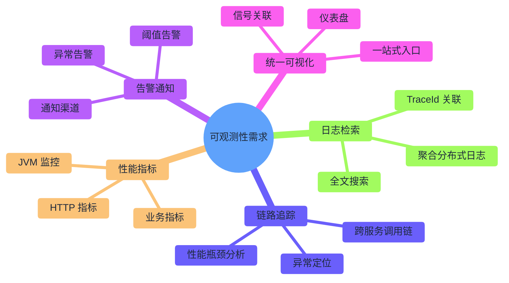

# 概述

## 一句话描述

基于 OpenTelemetry + Grafana Stack，构建统一的、厂商中立的可观测性平台。

## 问题陈述

### 设计目标

项目采用 OpenTelemetry 作为可观测性解决方案，具有以下优势：

| 优势 | 描述 |
|------|------|
| **厂商中立** | 基于 CNCF 开放标准，避免厂商锁定 |
| **行业标准** | 符合 OpenTelemetry 规范，与云厂商生态完全兼容 |
| **信号统一** | Metrics、Logs、Traces 三信号通过 OTLP 统一采集和关联 |
| **零代码侵入** | 通过 OTel Java Agent 实现自动埋点，业务代码无感知 |
| **生态活跃** | CNCF 孵化项目，全球社区活跃 |

### 核心需求

用户（开发者/运维）需要一个完整的可观测性系统，满足以下能力：

## 目标

### 功能目标

| 目标 | 描述 | 验收标准 |
|------|------|----------|
| **G1: 厂商中立** | 基于 OpenTelemetry 开放标准 | 无厂商专有 SDK 依赖 |
| **G2: 三信号统一采集** | Metrics/Logs/Traces 通过 OTLP 统一上报 | 三种信号均可在 Grafana 查询 |
| **G3: 本地一键启动** | Docker Compose 启动完整可观测性栈 | 单命令 `docker compose up` 完成部署 |
| **G4: 信号关联** | Traces ↔ Logs ↔ Metrics 互相跳转 | 从 Trace 跳转到对应日志 |
| **G5: 生产级告警** | 配置核心业务告警规则 | 错误率 > 1% 时收到通知 |

### 质量目标

| 目标 | 描述 | 度量 |
|------|------|------|
| **Q1: 零代码侵入** | 应用代码不依赖可观测性 SDK | 业务模块无 OTel 依赖 |
| **Q2: 配置即代码** | 所有配置可版本控制 | Grafana 仪表盘使用 Provisioning |
| **Q3: 资源高效** | 本地开发环境资源占用合理 | 全栈内存 < 4GB |

### 学习目标

| 目标 | 描述 |
|------|------|
| **L1** | 理解 OpenTelemetry 核心概念（Span、Trace、Context Propagation） |
| **L2** | 掌握 Grafana Stack（LGTM）的部署和配置 |
| **L3** | 能够设计生产级别的可观测性方案 |

## 非目标

> [!warning] 边界声明
> 以下内容明确不在本设计范围内，避免范围蔓延。

| 非目标 | 说明 |
|--------|------|
| **业务埋点规范** | 不涉及业务层手动 Span 创建的规范定义 |
| **日志内容规范** | 不涉及日志格式、级别、内容的规范（仅关注采集） |
| **APM 高级功能** | 不包含持续性能剖析（Continuous Profiling） |
| **多集群部署** | 仅设计单集群/本地开发环境方案 |
| **安全审计日志** | 不包含安全合规相关的审计日志方案 |

## 术语表

### OpenTelemetry 核心概念

| 术语 | 英文 | 定义 |
|------|------|------|
| **Span** | Span | 一个操作的执行单元，包含名称、时间戳、属性和事件 |
| **Trace** | Trace | 多个 Span 组成的有向无环图，表示一个完整请求的调用链 |
| **TraceId** | Trace ID | 全局唯一的 Trace 标识符（128 位十六进制） |
| **SpanId** | Span ID | 单个 Span 的标识符（64 位十六进制） |
| **Context Propagation** | 上下文传播 | 在服务间传递 TraceId 和 SpanId 的机制 |
| **Baggage** | 行李 | 随 Context 传播的业务数据（如用户 ID） |
| **OTLP** | OpenTelemetry Protocol | OTel 标准的遥测数据传输协议（基于 gRPC/HTTP） |
| **Instrumentation** | 埋点/插桩 | 向应用注入遥测数据采集逻辑的过程 |

### 指标相关

| 术语 | 英文 | 定义 |
|------|------|------|
| **Counter** | 计数器 | 只增不减的累计值（如请求总数） |
| **Gauge** | 仪表盘 | 可增可减的瞬时值（如当前连接数） |
| **Histogram** | 直方图 | 值的分布统计（如请求延迟的 P50/P99） |
| **Exemplar** | 示例 | 指标关联到具体 Trace 的采样数据 |
| **PromQL** | Prometheus Query Language | Prometheus 指标查询语言 |

### 日志相关

| 术语 | 英文 | 定义 |
|------|------|------|
| **Structured Logging** | 结构化日志 | JSON 格式的日志，便于机器解析 |
| **LogQL** | Loki Query Language | Loki 日志查询语言 |
| **Label** | 标签 | 日志的索引字段（如 app、level） |

### 采样相关

| 术语 | 英文 | 定义 |
|------|------|------|
| **Head Sampling** | 头部采样 | 在 Trace 开始时决定是否采样 |
| **Tail Sampling** | 尾部采样 | 在 Trace 完成后根据特征决定是否保留 |
| **Probabilistic Sampling** | 概率采样 | 按固定概率随机采样 |

### Grafana 相关

| 术语 | 英文 | 定义 |
|------|------|------|
| **Data Source** | 数据源 | Grafana 连接的后端存储（如 Prometheus） |
| **Dashboard** | 仪表盘 | 可视化面板的集合 |
| **Provisioning** | 配置供应 | 通过 YAML 文件自动配置 Grafana |
| **Alert Rule** | 告警规则 | 触发告警的条件定义 |

## 约束条件

### 技术约束

| 约束 | 说明 |
|------|------|
| **Spring Boot 3.5.7** | 必须与现有 Spring Boot 版本兼容 |
| **Java 25** | 运行时环境固定 |
| **Micrometer 保留** | 保留 Micrometer Observation API，通过 Bridge 集成 OTel |
| **Docker Compose** | 本地开发环境使用 Docker Compose 部署 |

### 资源约束

| 约束 | 值 | 说明 |
|------|-----|------|
| 开发环境内存 | ≤ 4GB | 全栈容器内存限制 |
| 存储保留期 | 7 天 | 本地开发环境数据保留 |

### 组织约束

| 约束 | 说明 |
|------|------|
| **单人开发** | 无团队协作成本，可激进重构 |
| **Greenfield** | 无历史包袱，直接采用最优方案 |
| **学习驱动** | 设计需兼顾教育价值 |

## 相关链接

- 下一章：[[02-architecture|架构设计]]
- 索引：[[_MOC|可观测性系统设计]]
- ADR：[[decisions/ADR-005-adopt-opentelemetry-grafana-stack-for-observability|ADR-005]]
