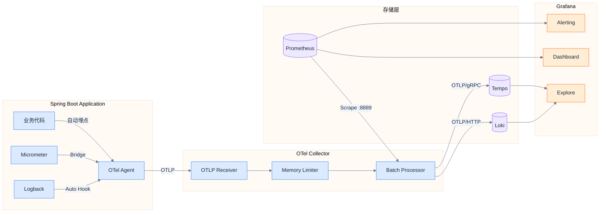
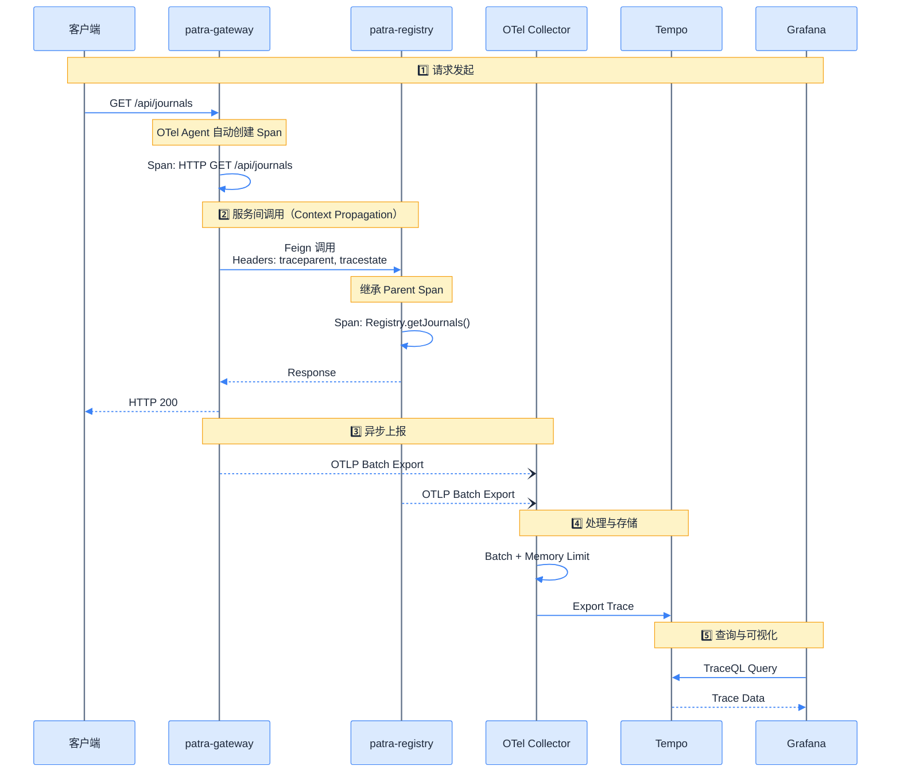

# 架构设计

## 整体架构图

```d2
direction: down

classes: {
  layer: {
    style: {
      fill: "#f8fafc"
      stroke: "#64748b"
      stroke-width: 2
      font-color: "#1e293b"
    }
  }
  service: {
    style: {
      fill: "#22c55e"
      stroke: "#16a34a"
      stroke-width: 2
      font-color: "#ffffff"
    }
  }
  component: {
    style: {
      fill: "#3b82f6"
      stroke: "#1d4ed8"
      stroke-width: 2
      font-color: "#ffffff"
    }
  }
  processor: {
    shape: hexagon
    style: {
      fill: "#10b981"
      stroke: "#059669"
      stroke-width: 2
      font-color: "#ffffff"
    }
  }
  storage: {
    shape: cylinder
    style: {
      fill: "#8b5cf6"
      stroke: "#6d28d9"
      stroke-width: 2
      font-color: "#ffffff"
    }
  }
  viz: {
    style: {
      fill: "#f97316"
      stroke: "#ea580c"
      stroke-width: 2
      font-color: "#ffffff"
    }
  }
}

patra: Patra 微服务集群 {
  class: layer
  gateway: patra-gateway {class: service}
  registry: patra-registry {class: service}
}

collection: 采集层 {
  class: layer
  agent: OTel Agent {class: component}
  micrometer: Micrometer {class: component}
  logback: Logback {class: component}
}

collector: OTel Collector {class: processor}

backends: 存储层 {
  class: layer
  prometheus: Prometheus {class: storage}
  loki: Loki {class: storage}
  tempo: Tempo {class: storage}
}

grafana: Grafana {class: viz}

patra -> collection.agent: 自动埋点
collection.micrometer -> collection.agent: Bridge
collection.logback -> collection.agent: Auto Hook
collection.agent -> collector: OTLP

backends.prometheus -> collector: Scrape
collector -> backends.loki: OTLP/HTTP
collector -> backends.tempo: OTLP/gRPC

backends.prometheus -> grafana
backends.loki -> grafana
backends.tempo -> grafana
```

## 数据流图

### 三信号数据流



### 单请求生命周期



## 信号关联设计

> [!tip] 可观测性三支柱的核心价值
> 单独的 Metrics、Logs、Traces 价值有限，**信号关联**才是可观测性的真正威力。

### 关联模型

```d2 width=800
direction: right

classes: {
  signal: {
    style: {
      fill: "#3b82f6"
      stroke: "#1d4ed8"
      stroke-width: 2
      font-color: "#ffffff"
      border-radius: 8
    }
  }
}

# 三大信号
metrics: Metrics {
  class: signal
  content: |md
    - `http_server_requests_total`
    - `jvm_memory_used`
    - `custom_business_metric`
  |
}

logs: Logs {
  class: signal
  content: |md
    - TraceId: `abc123...`
    - SpanId: `def456...`
    - Message: `User login failed`
  |
}

traces: Traces {
  class: signal
  content: |md
    - TraceId: `abc123...`
    - Spans: [Gateway, Registry, DB]
    - Duration: 150ms
  |
}

# 关联关系
metrics <-> traces: Exemplar {
  style.stroke: "#f97316"
  style.stroke-width: 2
}
traces <-> logs: TraceId/SpanId {
  style.stroke: "#f97316"
  style.stroke-width: 2
}
metrics <-> logs: 时间窗口 + Labels {
  style.stroke: "#f97316"
  style.stroke-width: 2
}
```

### 关联实现

| 关联类型 | 实现机制 | Grafana 配置 |
|----------|----------|--------------|
| **Metrics → Traces** | Prometheus Exemplar | Data Source → Exemplar 配置 Tempo |
| **Traces → Logs** | TraceId 字段匹配 | Tempo → Trace to Logs → Loki |
| **Logs → Traces** | TraceId 提取正则 | Loki → Derived Fields → Tempo |
| **Metrics → Logs** | Labels + 时间范围 | Dashboard 变量联动 |

### 关联查询示例

**从高延迟指标跳转到 Trace：**

```promql
# 找出 P99 延迟 > 1s 的请求（包含 Exemplar）
histogram_quantile(0.99,
  sum(rate(http_server_requests_seconds_bucket[5m])) by (le, uri)
) > 1
```

**从 Trace 查询关联日志：**

```logql
# 使用 TraceId 查询对应日志
{app="patra-registry"} |= "abc123def456..."
```

## 六边形架构视图

### Starter 模块分层

```d2 width=900
direction: down

classes: {
  layer: {
    style: {
      border-radius: 8
      fill: "#f8fafc"
      stroke: "#64748b"
      stroke-width: 2
      font-color: "#1e293b"
    }
  }
  port: {
    style: {
      fill: "#3b82f6"
      stroke: "#1d4ed8"
      stroke-width: 2
      font-color: "#ffffff"
    }
  }
  adapter: {
    style: {
      fill: "#22c55e"
      stroke: "#16a34a"
      stroke-width: 2
      font-color: "#ffffff"
    }
  }
}

starter: patra-spring-boot-starter-observability {
  class: layer

  # 配置层
  config: Config Layer {
    class: layer
    props: ObservabilityProperties
    otel_props: OtelExporterProperties
  }

  # 核心层（Ports）
  core: Core Layer (Ports) {
    class: layer

    observation: ObservationRegistry {class: port}
    meter: MeterRegistry {class: port}
    tracer: Tracer {class: port}
  }

  # MeterFilter 层（ObservationHandler/Filter 已移除，由 OTel Agent 处理）
  handler: MeterFilter Layer {
    class: layer

    cardinality_f: HighCardinalityMeterFilter
    tags_f: CommonTagsMeterFilter
  }

  # 适配器层（Adapters）
  adapter: Adapter Layer {
    class: layer

    otel_bridge: OTel Agent Micrometer Bridge {class: adapter}
    otlp_exp: OTLP Exporter {class: adapter}
  }

  # AutoConfiguration 层
  autoconfig: AutoConfiguration Layer {
    class: layer

    obs_auto: ObservabilityAutoConfiguration
    meter_auto: MicrometerAutoConfiguration
    interceptor_auto: ObservationInterceptorsAutoConfiguration
  }

  # 依赖关系
  config -> core: {style.stroke: "#64748b"; style.stroke-width: 2}
  core -> handler: {style.stroke: "#64748b"; style.stroke-width: 2}
  handler -> adapter: {style.stroke: "#64748b"; style.stroke-width: 2}
  adapter -> autoconfig: {style.stroke: "#64748b"; style.stroke-width: 2}
}

# 外部依赖
external: 外部组件 {
  class: layer

  spring: Spring Boot Actuator
  micrometer: Micrometer Core
  otel_agent: OTel Java Agent
  logback: Logback Classic
}

starter.adapter.otel_bridge -> external.otel_agent: {style.stroke: "#64748b"; style.stroke-width: 2}
starter.core.observation -> external.spring: {style.stroke: "#64748b"; style.stroke-width: 2}
starter.core.meter -> external.micrometer: {style.stroke: "#64748b"; style.stroke-width: 2}
```

### 组件职责表

| 层级 | 组件 | 职责 | 依赖 |
|------|------|------|------|
| **Config** | `ObservabilityProperties` | 统一配置入口 | Spring Boot |
| **Config** | `OtelExporterProperties` | OTLP 导出配置 | Spring Boot |
| **Core** | `ObservationRegistry` | 观测注册中心 | Micrometer |
| **Core** | `MeterRegistry` | 指标注册中心 | Micrometer |
| **MeterFilter** | `HighCardinalityMeterFilter` | 高基数过滤 | 无 |
| **MeterFilter** | `CommonTagsMeterFilter` | 公共标签注入 | 无 |
| **Adapter** | OTel Agent Micrometer Bridge | Micrometer → OTel Agent | OTel Agent |
| **Adapter** | OTLP Exporter | 远程导出 | OTel Agent |
| **AutoConfig** | `ObservabilityAutoConfiguration` | 核心配置 | Spring Boot |
| **AutoConfig** | `MicrometerAutoConfiguration` | MeterFilter + OTel Bridge | Micrometer |
| **AutoConfig** | `ObservationInterceptorsAutoConfiguration` | 拦截器注册 | Micrometer |

> **注意**：ObservationHandler 和 ObservationFilter 已移除，Tracing 由 OTel Java Agent 自动处理。

## 网络拓扑

### Docker Compose 服务网络

```d2 width=900
direction: right

classes: {
  service: {
    style: {
      fill: "#3b82f6"
      stroke: "#1d4ed8"
      stroke-width: 2
      font-color: "#ffffff"
      border-radius: 4
    }
  }
  storage: {
    shape: cylinder
    style: {
      fill: "#8b5cf6"
      stroke: "#6d28d9"
      stroke-width: 2
      font-color: "#ffffff"
    }
  }
  external: {
    style: {
      fill: "#e2e8f0"
      stroke: "#64748b"
      stroke-width: 2
      stroke-dash: 3
      font-color: "#475569"
    }
  }
}

# 网络
network: patra-net (Docker Bridge) {
  style: {
    fill: "#f1f5f9"
    stroke: "#64748b"
    stroke-width: 2
  }

  # 应用服务
  apps: 应用服务 {
    gateway: patra-gateway\n:8080 {class: service}
    registry: patra-registry\n:8081 {class: service}
    ingest: patra-ingest\n:8082 {class: service}
    catalog: patra-catalog\n:8083 {class: service}
  }

  # 可观测性服务
  observability: 可观测性服务 {
    collector: otel-collector\n:4317 gRPC\n:4318 HTTP {class: service}
    prometheus: prometheus\n:9090 {class: storage}
    loki: loki\n:3100 {class: storage}
    tempo: tempo\n:3200 {class: storage}
    grafana: grafana\n:3000 {
      style: {
        fill: "#f97316"
        stroke: "#ea580c"
        stroke-width: 2
        font-color: "#ffffff"
      }
    }
    alertmanager: alertmanager\n:9093 {
      style: {
        fill: "#eab308"
        stroke: "#ca8a04"
        stroke-width: 2
        font-color: "#ffffff"
      }
    }
  }

  # 内部连接
  apps.gateway -> observability.collector: OTLP :4317 {style.stroke: "#64748b"; style.stroke-width: 2}
  apps.registry -> observability.collector: OTLP :4317 {style.stroke: "#64748b"; style.stroke-width: 2}
  apps.ingest -> observability.collector: OTLP :4317 {style.stroke: "#64748b"; style.stroke-width: 2}
  apps.catalog -> observability.collector: OTLP :4317 {style.stroke: "#64748b"; style.stroke-width: 2}

  observability.prometheus -> observability.collector: Scrape :8889 {style.stroke: "#64748b"; style.stroke-width: 2}
  observability.collector -> observability.loki: OTLP/HTTP :3100 {style.stroke: "#64748b"; style.stroke-width: 2}
  observability.collector -> observability.tempo: OTLP/gRPC :4317 {style.stroke: "#64748b"; style.stroke-width: 2}

  observability.grafana -> observability.prometheus: Query :9090 {style.stroke: "#64748b"; style.stroke-width: 2}
  observability.grafana -> observability.loki: Query :3100 {style.stroke: "#64748b"; style.stroke-width: 2}
  observability.grafana -> observability.tempo: Query :3200 {style.stroke: "#64748b"; style.stroke-width: 2}
  observability.grafana -> observability.alertmanager: Alert :9093 {style.stroke: "#64748b"; style.stroke-width: 2}
}

# 外部访问
host: Host Machine {class: external}

host -> network.observability.grafana: :3000 {style.stroke: "#64748b"; style.stroke-width: 2}
host -> network.observability.prometheus: :9090 {style.stroke: "#64748b"; style.stroke-width: 2}
host -> network.apps.gateway: :8080 {style.stroke: "#64748b"; style.stroke-width: 2}
```

### 端口映射表

| 服务 | 容器端口 | 主机端口 | 协议 | 说明 |
|------|----------|----------|------|------|
| **otel-collector** | 4317 | 4317 | gRPC | OTLP 接收（应用上报） |
| **otel-collector** | 4318 | 4318 | HTTP | OTLP 接收（备用） |
| **otel-collector** | 8889 | 8889 | HTTP | Prometheus 抓取端点（Metrics 暴露） |
| **prometheus** | 9090 | 9090 | HTTP | PromQL 查询 + Web UI |
| **loki** | 3100 | 3100 | HTTP | LogQL 查询 + Push API |
| **tempo** | 3200 | 3200 | HTTP | TraceQL 查询 |
| **tempo** | 4317 | - | gRPC | OTLP 接收（内部） |
| **grafana** | 3000 | 3000 | HTTP | Web UI |
| **alertmanager** | 9093 | 9093 | HTTP | Web UI + API |

## 相关链接

- 上一章：[[01-overview|概述]]
- 下一章：[[03-starter-module|Starter 模块设计]]
- 索引：[[_MOC|可观测性系统设计]]
