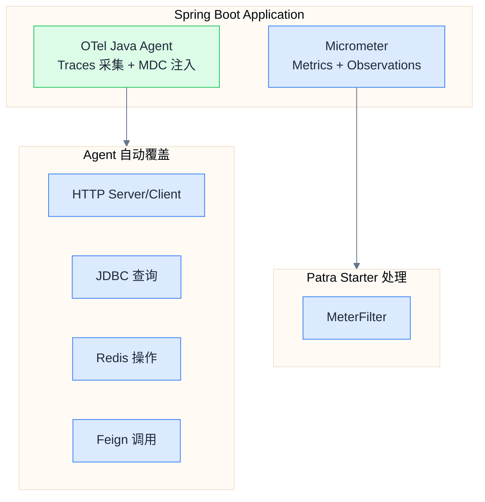
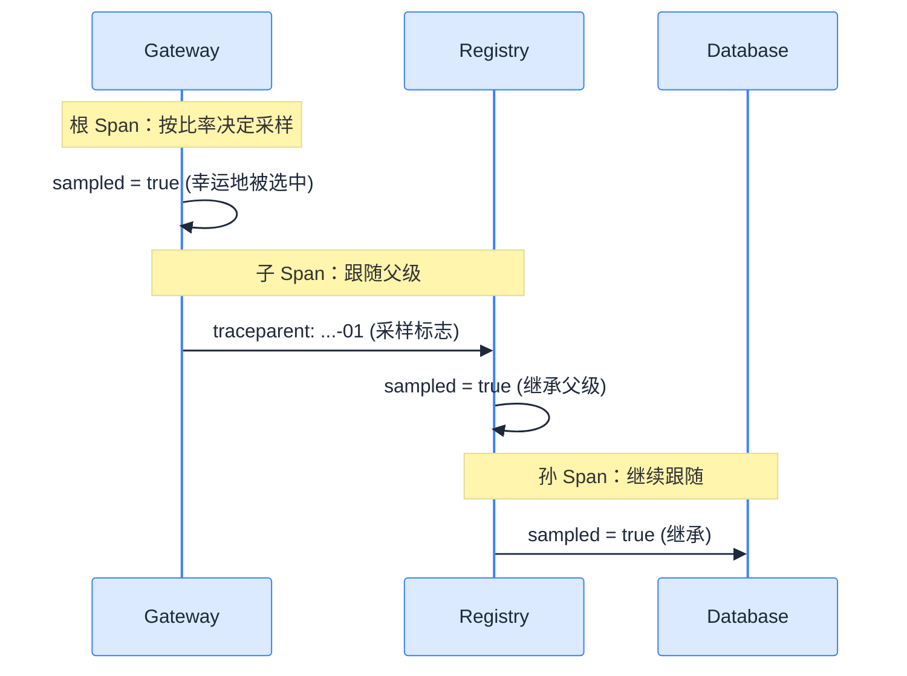
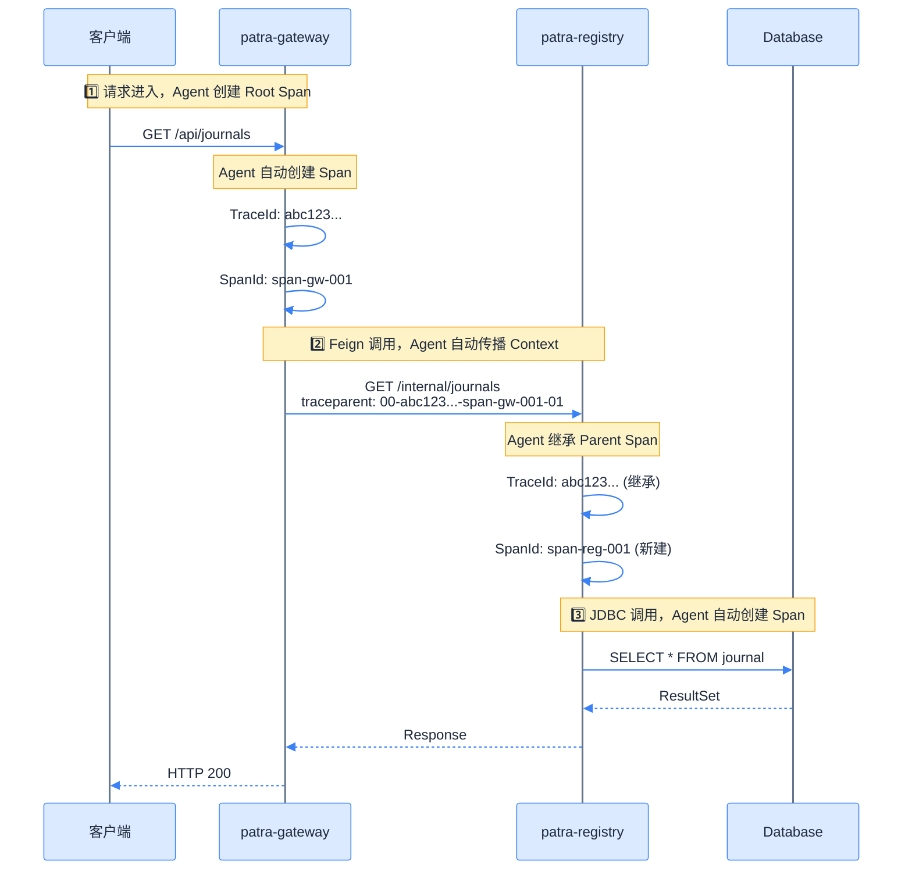

# OpenTelemetry 集成方案

## 采集策略

### 决策：采用 OTel Java Agent

本项目采用 **OTel Java Agent** 作为 Tracing 采集方案：

| 优势 | 说明 |
|------|------|
| **零代码侵入** | 通过 `-javaagent` JVM 参数注入，业务代码无 OTel 依赖 |
| **自动覆盖** | 自动覆盖 Spring Web、RestClient、Feign、JDBC、Redis 等 100+ 框架 |
| **简化维护** | 升级只需替换 Agent JAR，无需修改代码 |
| **官方推荐** | OpenTelemetry 官方首推方案 |

### 架构分工



## OTel Java Agent 配置

### 下载与部署

```bash
# 下载 Agent（v2.22.0）
curl -L -o docker/otel-agent/opentelemetry-javaagent.jar \
  https://github.com/open-telemetry/opentelemetry-java-instrumentation/releases/download/v2.22.0/opentelemetry-javaagent.jar
```

### JVM 参数配置

```bash
# ============================================================
# 1. Agent 加载
# ============================================================
# 通过 -javaagent 加载 OTel Agent JAR
# Agent 使用 ByteBuddy 进行字节码注入，自动 instrument 100+ 框架
-javaagent:/path/to/opentelemetry-javaagent.jar

# ============================================================
# 2. 服务标识
# ============================================================
# 服务名称，在 Trace/Log/Metrics 中标识来源服务
# 建议与 spring.application.name 保持一致
-Dotel.service.name=patra-registry

# ============================================================
# 3. OTLP 导出配置
# ============================================================
# OTLP 接收端地址，所有遥测数据（Traces/Logs）发送到此端点
# 开发环境：http://localhost:4317
# 生产环境：http://otel-collector:4317（通过服务发现）
-Dotel.exporter.otlp.endpoint=http://otel-collector:4317

# 传输协议：grpc（高效，推荐）或 http/protobuf
-Dotel.exporter.otlp.protocol=grpc

# ============================================================
# 4. 采样配置（详见下方"采样策略详解"）
# ============================================================
# 采样器类型：parentbased_traceidratio = 父级决策 + TraceID 比率采样
-Dotel.traces.sampler=parentbased_traceidratio

# 采样率：0.0~1.0，表示被采样的比例
# 开发环境：1.0（100% 采样，便于调试）
# 生产环境：0.01~0.1（1%~10%，平衡可观测性与性能开销）
-Dotel.traces.sampler.arg=1.0

# ============================================================
# 5. 日志导出
# ============================================================
# 启用日志导出，通过 OTLP 发送到 Collector
# Agent 自动 hook Logback/Log4j2，将日志转换为 OTel LogRecord
-Dotel.logs.exporter=otlp

# ============================================================
# 6. 指标导出（OTLP 统一导出）
# ============================================================
# 启用 OTLP 指标导出，统一遥测管道
# Traces/Metrics/Logs 全部走 OTLP → OTel Collector
-Dotel.metrics.exporter=otlp

# ============================================================
# 7. Micrometer Bridge（启用）
# ============================================================
# 启用 Micrometer 桥接（Agent 2.0+ 默认禁用）
# 将 Spring Boot/Micrometer 指标（HikariCP、Spring Batch、HTTP 等）桥接到 OTel
-Dotel.instrumentation.micrometer.enabled=true
```

### 采样策略详解

采样是控制 Trace 数据量的关键机制，合理的采样策略可以在**可观测性**和**性能开销**之间取得平衡。

#### 可用采样器类型

| 采样器 | 说明 | 适用场景 |
|--------|------|----------|
| `always_on` | 100% 采样所有请求 | 开发调试 |
| `always_off` | 不采样任何请求 | 禁用 Tracing |
| `traceidratio` | 按 TraceID 哈希值比率采样 | 简单场景 |
| `parentbased_always_on` | 有父则跟随父，无父则 100% | 入口服务 |
| `parentbased_always_off` | 有父则跟随父，无父则 0% | 内部服务 |
| `parentbased_traceidratio` | 有父则跟随父，无父则按比率 | **推荐** |

#### parentbased_traceidratio 详解

这是我们选用的采样策略，它是 `parentbased` 和 `traceidratio` 的组合：

```d2 width=800
direction: down

classes: {
  decision: {
    shape: diamond
    style: {
      fill: "#fef3c7"
      stroke: "#f59e0b"
      font-color: "#1e293b"
    }
  }
  action: {
    style: {
      fill: "#dcfce7"
      stroke: "#22c55e"
      font-color: "#1e293b"
    }
  }
  reject: {
    style: {
      fill: "#fecaca"
      stroke: "#ef4444"
      font-color: "#1e293b"
    }
  }
}

start: 收到请求 {style.fill: "#dbeafe"; style.stroke: "#3b82f6"}
has_parent: 是否有父 Span？ {class: decision}
parent_sampled: 父 Span 是否被采样？ {class: decision}
ratio_check: TraceID % 100 < arg * 100？ {class: decision}
sample_yes: 采样此请求 {class: action}
sample_no: 不采样 {class: reject}

start -> has_parent
has_parent -> parent_sampled: 是
has_parent -> ratio_check: 否（根 Span）
parent_sampled -> sample_yes: 是
parent_sampled -> sample_no: 否
ratio_check -> sample_yes: 是
ratio_check -> sample_no: 否
```

**决策逻辑**：

| 情况 | 采样决策 | 说明 |
|------|----------|------|
| **有父 Span 且父被采样** | ✅ 采样 | 保证调用链完整性 |
| **有父 Span 且父未采样** | ❌ 不采样 | 跟随父级决策 |
| **无父 Span（根 Span）** | 按 `arg` 比率决定 | 入口请求随机采样 |

**为什么选用 `parentbased`？**



**好处**：保证一个完整的分布式调用链要么**全部被采样**，要么**全部不采样**，避免出现"断链"。

#### 采样率配置建议

| 环境 | `arg` 值 | 说明 |
|------|----------|------|
| 开发 | `1.0` | 100% 采样，便于调试，查看每个请求的完整链路 |
| 测试 | `0.5` | 50% 采样，验证采样逻辑，减少存储压力 |
| 预发布 | `0.1` | 10% 采样，模拟生产环境 |
| 生产 | `0.01~0.1` | 1%~10%，根据流量规模调整 |

**生产环境采样率计算公式**：

```
推荐采样率 = min(目标每日 Trace 数 / 日均 QPS / 86400, 最大采样率)

简化公式（目标每日 10000 条 Trace，上限 10%）：
采样率 = min(10000 / 日均 QPS / 86400, 0.1)

示例（假设日均 QPS 指每秒请求数）：
- 100 QPS → min(10000/100/86400, 0.1) ≈ 0.001 → 取 0.01 (1%)
- 1000 QPS → min(10000/1000/86400, 0.1) ≈ 0.0001 → 取 0.01 (1%)

实用经验值：
- 低流量（<100 QPS）: 0.1 (10%)
- 中等流量（100-1000 QPS）: 0.05 (5%)
- 高流量（1000-10000 QPS）: 0.01 (1%)
- 超高流量（>10000 QPS）: 0.001 (0.1%)
```

> [!tip] 采样率调整
> 生产环境可通过环境变量 `OTEL_TRACES_SAMPLER_ARG` 动态调整采样率，无需重启应用。

### 本地开发启动示例

```bash
java -javaagent:docker/otel-agent/opentelemetry-javaagent.jar \
     -Dotel.service.name=patra-registry \
     -Dotel.exporter.otlp.endpoint=http://localhost:4317 \
     -Dotel.exporter.otlp.protocol=grpc \
     -Dotel.traces.sampler=parentbased_traceidratio \
     -Dotel.traces.sampler.arg=1.0 \
     -Dotel.metrics.exporter=otlp \
     -Dotel.instrumentation.micrometer.enabled=true \
     -Dotel.logs.exporter=otlp \
     -jar patra-registry-boot.jar \
     --spring.profiles.active=dev
```

### Docker Compose 配置

```yaml
services:
  patra-registry:
    image: patra/patra-registry:latest
    environment:
      # Agent 加载（通过 JAVA_TOOL_OPTIONS 注入，无需修改 Dockerfile）
      JAVA_TOOL_OPTIONS: "-javaagent:/opt/otel/opentelemetry-javaagent.jar"
      # 服务标识
      OTEL_SERVICE_NAME: "patra-registry"
      # OTLP 导出端点
      OTEL_EXPORTER_OTLP_ENDPOINT: "http://otel-collector:4317"
      OTEL_EXPORTER_OTLP_PROTOCOL: "grpc"
      # 资源属性
      OTEL_RESOURCE_ATTRIBUTES: "service.version=0.1.0,deployment.environment=dev"
      # 采样配置
      OTEL_TRACES_SAMPLER: "parentbased_traceidratio"
      OTEL_TRACES_SAMPLER_ARG: "1.0"
      # 导出器配置
      OTEL_METRICS_EXPORTER: "otlp"      # OTLP 统一导出
      OTEL_INSTRUMENTATION_MICROMETER_ENABLED: "true"  # 启用 Micrometer Bridge
      OTEL_LOGS_EXPORTER: "otlp"         # 启用日志导出到 Collector
    volumes:
      - ./docker/otel-agent/opentelemetry-javaagent.jar:/opt/otel/opentelemetry-javaagent.jar:ro
```

## 日志集成

### 架构设计

OTel Agent 自动将 `trace_id`/`span_id` 注入到 SLF4J MDC，Patra 通过自定义 Logback Converter 提取并格式化。

```d2 width=800
direction: right

classes: {
  app: {
    style: {
      fill: "#22c55e"
      stroke: "#16a34a"
      stroke-width: 2
      font-color: "#ffffff"
    }
  }
  component: {
    style: {
      fill: "#3b82f6"
      stroke: "#1d4ed8"
      stroke-width: 2
      font-color: "#ffffff"
    }
  }
  storage: {
    shape: cylinder
    style: {
      fill: "#8b5cf6"
      stroke: "#6d28d9"
      stroke-width: 2
      font-color: "#ffffff"
    }
  }
}

agent: OTel Agent {class: app}
mdc: SLF4J MDC {class: component}
logback: Logback {class: component}
converter: Patra Converters {class: component}
collector: OTel Collector {class: component}
loki: Loki {class: storage}

agent -> mdc: 自动注入 trace_id/span_id {style.stroke: "#64748b"; style.stroke-width: 2}
mdc -> logback: MDC 传播 {style.stroke: "#64748b"; style.stroke-width: 2}
logback -> converter: 格式化 {style.stroke: "#64748b"; style.stroke-width: 2}
agent -> collector: OTLP/Logs {style.stroke: "#64748b"; style.stroke-width: 2}
collector -> loki: OTLP/HTTP {style.stroke: "#64748b"; style.stroke-width: 2}
```

### Logback 配置

```xml
<?xml version="1.0" encoding="UTF-8"?>
<configuration>
    <include resource="org/springframework/boot/logging/logback/defaults.xml"/>

    <springProperty scope="context" name="appName" source="spring.application.name" defaultValue="application"/>

    <!-- 注册自定义 Converter（Logback 1.5+ 使用 class 替代 converterClass） -->
    <conversionRule conversionWord="traceId"
                    class="com.patra.starter.core.logging.TraceIdConverter"/>
    <conversionRule conversionWord="spanId"
                    class="com.patra.starter.core.logging.SpanIdConverter"/>

    <!-- Console Appender -->
    <appender name="CONSOLE" class="ch.qos.logback.core.ConsoleAppender">
        <encoder>
            <pattern>%clr(%d{yyyy-MM-dd HH:mm:ss.SSS}){faint} %clr(%5p) %clr([${appName}]){blue} %clr([%traceId/%spanId]){magenta} %clr([%t]){faint} %clr(%-40.40logger{39}){cyan} %clr(:){faint} %m%n%wEx</pattern>
        </encoder>
    </appender>

    <root level="INFO">
        <appender-ref ref="CONSOLE"/>
    </root>
</configuration>
```

### 自定义 Logback Converter

Patra 实现了 2 个自定义 Converter，兼容 OTel Agent 和 Micrometer Tracing 两种 MDC 键格式：

| Converter | 用途 | 查找顺序 |
|-----------|------|----------|
| `TraceIdConverter` | 提取 Trace ID (32 位) | `trace_id` → `traceId` |
| `SpanIdConverter` | 提取 Span ID (16 位) | `span_id` → `spanId` |

**TraceIdConverter 实现逻辑：**

```java
public class TraceIdConverter extends ClassicConverter {
  @Override
  public String convert(ILoggingEvent event) {
    // 从事件的 MDC 快照读取（日志格式化时当前线程 MDC 可能已被清理）
    Map<String, String> mdcMap = event.getMDCPropertyMap();

    // 1. 优先尝试 OTel Agent 键（snake_case）
    String traceId = mdcMap.get("trace_id");
    if (isValidTraceId(traceId)) {
      return traceId;
    }

    // 2. 回退到 Micrometer 键（camelCase）
    traceId = mdcMap.get("traceId");
    if (isValidTraceId(traceId)) {
      return traceId;
    }

    // 3. 备选：尝试从当前线程 MDC 读取（异步场景）
    traceId = MDC.get("trace_id");
    if (isValidTraceId(traceId)) {
      return traceId;
    }

    return "N/A";
  }
}
```

### MDC 键格式差异

| 来源 | Trace ID 键 | Span ID 键 | 命名风格 |
|------|-------------|------------|----------|
| **OTel Agent** | `trace_id` | `span_id` | snake_case |
| **Micrometer Tracing** | `traceId` | `spanId` | camelCase |

> [!note] 自动兼容
> Patra 的 Logback Converter 自动处理这种差异，优先读取 OTel Agent 格式。

### 日志输出示例

```
2025-11-29 10:30:45.123  INFO [patra-registry] [1d990b105aed7666951ce1520bb961a2/141498c2e4fe4b33] [http-nio-8081-exec-1] c.p.registry.service.JournalService      : Processing journal: 12345
```

**格式说明**：`[traceId(32位)/spanId(16位)]` — 简洁的追踪上下文标识，便于在 Grafana Tempo 中快速定位完整链路。

## Context Propagation

### W3C Trace Context

OTel Agent 自动处理 W3C Trace Context 规范的 Header 传播：

```http
GET /api/journals HTTP/1.1
Host: patra-registry:8081
traceparent: 00-0af7651916cd43dd8448eb211c80319c-b7ad6b7169203331-01
tracestate: patra=sampleRate:1.0
```

**Header 格式：**

| Header | 格式 | 说明 |
|--------|------|------|
| `traceparent` | `{version}-{traceId}-{spanId}-{flags}` | 标准追踪上下文 |
| `tracestate` | `{vendor}={value},...` | 厂商扩展数据 |

### 跨服务传播流程



## Micrometer Observation 使用

虽然 Tracing 由 Agent 处理，但业务代码可使用 Micrometer Observation API 创建业务 Span：

```java
@Service
public class JournalService {

    private final ObservationRegistry observationRegistry;

    /// 使用 @Observed 注解自动创建 Observation
    @Observed(name = "journal.search", contextualName = "search-journals")
    public List<Journal> search(String query) {
        return journalRepository.findByQuery(query);
    }

    /// 手动创建 Observation
    public Journal getById(Long id) {
        return Observation.createNotStarted("journal.get", observationRegistry)
            .lowCardinalityKeyValue("journal.id.range", getIdRange(id))
            .observe(() -> journalRepository.findById(id));
    }
}
```

> [!tip] Agent 与 Micrometer 协作
> OTel Agent 会自动检测 Micrometer Observation 创建的 Span 并纳入同一 Trace 上下文。
> 无需额外配置，两者共享 `TraceContext`。

## 相关链接

- 上一章：[[03-starter-module|Starter 模块设计]]
- 下一章：[[05-infrastructure|基础设施部署]]
- 索引：[[_MOC|可观测性系统设计]]
