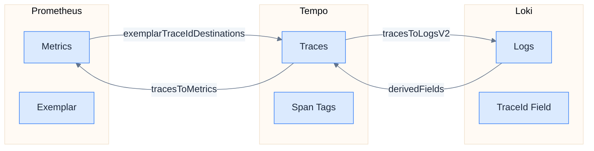
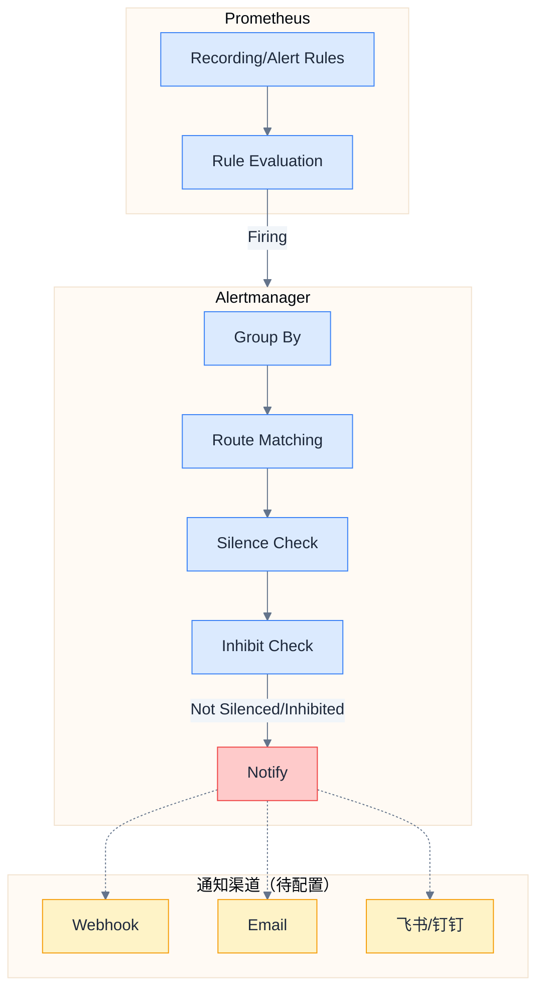

# Grafana 可视化

## 数据源配置

### Provisioning 目录结构

```
docker/grafana/provisioning/
├── datasources/
│   └── datasources.yaml          # 数据源自动配置
└── dashboards/
    ├── dashboards.yaml           # 仪表盘加载配置
    ├── patra/                    # 服务仪表盘
    │   ├── http-server.json      # HTTP 服务端监控
    │   ├── http-client.json      # HTTP 客户端监控
    │   ├── jvm-service-health.json # JVM 健康监控
    │   ├── hikaricp.json         # 数据库连接池监控
    │   ├── spring-batch.json     # Spring Batch 任务监控
    │   ├── traces.json           # 链路追踪面板
    │   └── logs.json             # 日志查询面板
    └── infrastructure/           # 基础设施仪表盘（预留）
```

> [!note] 告警配置位置
> 告警通过 Alertmanager 管理，配置在 `docker/alertmanager/alertmanager.yml`。
> Grafana 的 Unified Alerting 已启用但主要用于可视化，实际告警路由由 Alertmanager 处理。

### datasources.yaml

```yaml
# ============================================
# Grafana 数据源配置
# ============================================
# 自动配置 Prometheus、Loki、Tempo、Alertmanager 数据源
# 启用三信号（Metrics/Logs/Traces）之间的关联跳转

apiVersion: 1

# 删除旧数据源（确保配置更新生效）
deleteDatasources:
  - name: Prometheus
    orgId: 1
  - name: Loki
    orgId: 1
  - name: Tempo
    orgId: 1

datasources:
  # ----------------------------------------
  # Prometheus - 指标数据源
  # ----------------------------------------
  - name: Prometheus
    type: prometheus
    access: proxy
    url: http://prometheus:9090
    isDefault: true
    uid: prometheus
    jsonData:
      httpMethod: POST
      # Exemplar 配置 - 从指标跳转到链路
      # 当指标带有 traceID 标签时，可点击跳转到 Tempo
      exemplarTraceIdDestinations:
        - name: traceID
          datasourceUid: tempo
          urlDisplayLabel: View Trace
      # 增量查询优化（减少大范围查询压力）
      incrementalQuerying: true
      incrementalQueryOverlapWindow: 10m

  # ----------------------------------------
  # Loki - 日志数据源
  # ----------------------------------------
  - name: Loki
    type: loki
    access: proxy
    url: http://loki:3100
    uid: loki
    jsonData:
      maxLines: 1000
      # 派生字段 - 从日志跳转到链路
      # 支持两种 TraceID 格式：JSON 格式和 OTel Key=Value 格式
      derivedFields:
        # JSON 格式: {"traceId":"abc123"}
        - name: TraceID
          matcherRegex: '"traceId":"([a-f0-9]+)"'
          url: '$${__value.raw}'
          datasourceUid: tempo
          urlDisplayLabel: View Trace
        # OTel 格式: trace_id=abc123
        - name: TraceID (OTel)
          matcherRegex: 'trace_id=([a-f0-9]+)'
          url: '$${__value.raw}'
          datasourceUid: tempo
          urlDisplayLabel: View Trace

  # ----------------------------------------
  # Tempo - 链路数据源
  # ----------------------------------------
  - name: Tempo
    type: tempo
    access: proxy
    url: http://tempo:3200
    uid: tempo
    jsonData:
      httpMethod: GET
      # Service Graph 配置（服务调用图）
      serviceMap:
        datasourceUid: prometheus
      # Node Graph 启用
      nodeGraph:
        enabled: true
      # 链路到日志关联（V2 API - Grafana 10+）
      tracesToLogsV2:
        datasourceUid: loki
        spanStartTimeShift: '-1h'      # 时间窗口向前扩展
        spanEndTimeShift: '1h'         # 时间窗口向后扩展
        filterByTraceID: true
        filterBySpanID: false
        customQuery: true
        # 自定义 LogQL 查询：按服务名和 trace_id 过滤
        query: '{service_name="${__span.tags.service.name}"} | json | trace_id="${__trace.traceId}"'
      # 链路到指标关联
      tracesToMetrics:
        datasourceUid: prometheus
        spanStartTimeShift: '-1h'
        spanEndTimeShift: '1h'
        queries:
          # 请求速率
          - name: Request Rate
            query: 'sum(rate(http_server_request_duration_seconds_count{service_name="${__span.tags.service.name}"}[5m]))'
          # 错误率
          - name: Error Rate
            query: 'sum(rate(http_server_request_duration_seconds_count{service_name="${__span.tags.service.name}", http_response_status_code=~"5.."}[5m])) / sum(rate(http_server_request_duration_seconds_count{service_name="${__span.tags.service.name}"}[5m]))'
          # P95 延迟
          - name: P95 Latency
            query: 'histogram_quantile(0.95, sum(rate(http_server_request_duration_seconds_bucket{service_name="${__span.tags.service.name}"}[5m])) by (le))'
      # Loki 搜索集成
      lokiSearch:
        datasourceUid: loki

  # ----------------------------------------
  # Alertmanager - 告警数据源
  # ----------------------------------------
  - name: Alertmanager
    type: alertmanager
    access: proxy
    url: http://alertmanager:9093
    uid: alertmanager
    jsonData:
      implementation: prometheus
```

## 信号关联配置

### 关联路径



### Metrics → Traces（Exemplar）

**工作原理：**

1. OTel Agent 在导出指标时，将当前 Span 的 `traceID` 附加到指标的 Exemplar 中
2. Prometheus 启用 `--enable-feature=exemplar-storage` 存储 Exemplar
3. Grafana 查询指标时，渲染 Exemplar 点为可点击链接
4. 点击跳转到 Tempo 查看完整链路

> [!note] Metrics 导出方式
> Metrics 通过 OTel Agent + Micrometer Bridge 自动导出到 OTel Collector，
> 再由 **Prometheus 主动抓取 Collector 的 :8889 端口**（Pull 模式）。
> 无需配置 `/actuator/prometheus` 端点，也无需 Remote Write。

**查询示例（带 Exemplar）：**

```promql
# 带 Exemplar 的直方图查询
histogram_quantile(0.99,
  sum(rate(patra_http_server_request_duration_seconds_bucket{application="patra-catalog"}[5m])) by (le)
)
```

### Traces → Logs

**Tempo 数据源配置（tracesToLogsV2）：**

```yaml
jsonData:
  tracesToLogsV2:
    datasourceUid: loki
    spanStartTimeShift: '-1h'
    spanEndTimeShift: '1h'
    filterByTraceID: true
    customQuery: true
    query: '{service_name="${__span.tags.service.name}"} | json | trace_id="${__trace.traceId}"'
```

**效果：** 在 Tempo Trace 详情页，点击 "Logs for this span" 按钮跳转到 Loki，自动填充服务名和 trace_id 过滤条件。

### Logs → Traces

**Loki 数据源配置（derivedFields）：**

```yaml
jsonData:
  derivedFields:
    # 匹配 JSON 格式的 traceId
    - name: TraceID
      matcherRegex: '"traceId":"([a-f0-9]+)"'
      url: '$${__value.raw}'
      datasourceUid: tempo
      urlDisplayLabel: View Trace
    # 匹配 OTel 格式的 trace_id
    - name: TraceID (OTel)
      matcherRegex: 'trace_id=([a-f0-9]+)'
      url: '$${__value.raw}'
      datasourceUid: tempo
      urlDisplayLabel: View Trace
```

**效果：** 在日志行中，TraceID 显示为可点击链接（蓝色），点击跳转到 Tempo 查看完整链路。

## 仪表盘设计

### 仪表盘列表

| 仪表盘 | 文件 | 用途 | 数据源 |
|--------|------|------|--------|
| **HTTP Server** | `http-server.json` | HTTP 服务端请求监控（QPS、延迟、错误率） | Prometheus |
| **HTTP Client** | `http-client.json` | HTTP 客户端调用监控（出站请求） | Prometheus |
| **JVM Service Health** | `jvm-service-health.json` | JVM 内存、GC、线程监控 | Prometheus |
| **HikariCP** | `hikaricp.json` | 数据库连接池监控 | Prometheus |
| **Spring Batch** | `spring-batch.json` | 批处理任务监控 | Prometheus |
| **Traces** | `traces.json` | 链路追踪查询和分析 | Tempo |
| **Logs** | `logs.json` | 日志搜索和分析 | Loki |

### 指标命名规范

> [!important] OTel 语义惯例
> 所有指标使用 OTel 语义惯例命名，并由 OTel Collector 添加 `patra_` 前缀：
> - `patra_http_server_request_duration_seconds_*` - HTTP 服务端指标
> - `patra_http_client_request_duration_seconds_*` - HTTP 客户端指标
> - `patra_jvm_*` - JVM 指标
> - `patra_hikaricp_*` - HikariCP 连接池指标
> - `patra_spring_batch_*` - Spring Batch 指标

### HTTP Server Dashboard

**面板布局：**

| 行 | 面板 | 类型 | 说明 |
|---|------|------|------|
| API 概览 | QPS | Stat | 总请求速率 |
| | P99 Latency | Stat | 99 分位延迟 |
| | Error Rate | Stat | 5xx 错误率 |
| | Success Rate | Gauge | 成功率仪表 |
| 请求趋势 | Request Rate | Time Series | 按端点分组的请求速率 |
| | Latency Percentiles | Time Series | P50/P90/P99 延迟趋势 |
| 详细分析 | Status Codes | Pie | 状态码分布 |
| | Top Endpoints | Table | 慢端点 Top 10 |

**关键 PromQL 查询：**

```promql
# QPS（每秒请求数）
sum(rate(patra_http_server_request_duration_seconds_count{application=~"$application"}[5m]))

# P99 延迟
histogram_quantile(0.99,
  sum(rate(patra_http_server_request_duration_seconds_bucket{application=~"$application"}[5m])) by (le)
)

# 错误率
sum(rate(patra_http_server_request_duration_seconds_count{application=~"$application", http_response_status_code=~"5.."}[5m]))
/
sum(rate(patra_http_server_request_duration_seconds_count{application=~"$application"}[5m]))

# 按端点分组的请求速率
sum(rate(patra_http_server_request_duration_seconds_count{application=~"$application"}[5m])) by (http_route)

# 慢端点 Top 10
topk(10,
  histogram_quantile(0.99,
    sum(rate(patra_http_server_request_duration_seconds_bucket{application=~"$application"}[5m])) by (le, http_route)
  )
)
```

### JVM Service Health Dashboard

**关键 PromQL 查询：**

```promql
# Heap 使用量
patra_jvm_memory_used_bytes{application=~"$application", area="heap"}

# Heap 使用率
patra_jvm_memory_used_bytes{application=~"$application", area="heap"}
/
patra_jvm_memory_max_bytes{application=~"$application", area="heap"}

# GC 暂停时间（平均）
rate(patra_jvm_gc_pause_seconds_sum{application=~"$application"}[5m])
/
rate(patra_jvm_gc_pause_seconds_count{application=~"$application"}[5m])

# 线程数（按状态）
patra_jvm_threads_states_threads{application=~"$application"}
```

### HikariCP Dashboard

**关键 PromQL 查询：**

```promql
# 活跃连接数
patra_hikaricp_connections_active{application=~"$application"}

# 连接池使用率
patra_hikaricp_connections_active{application=~"$application"}
/
patra_hikaricp_connections_max{application=~"$application"}

# 连接等待数
patra_hikaricp_connections_pending{application=~"$application"}

# 连接获取时间（平均）
rate(patra_hikaricp_connections_acquire_seconds_sum{application=~"$application"}[5m])
/
rate(patra_hikaricp_connections_acquire_seconds_count{application=~"$application"}[5m])
```

## 告警配置

### 告警架构

> [!note] 告警策略
> 当前使用 **Alertmanager** 作为主要告警路由组件，而非 Grafana Unified Alerting。
> 原因：
> 1. Alertmanager 是 Prometheus 生态的标准组件，与 Prometheus 告警规则无缝集成
> 2. 支持更灵活的分组、抑制、静默规则
> 3. 便于与现有 Prometheus 告警规则迁移

### 告警流程



### 建议告警规则

以下告警规则可添加到 Prometheus 配置或 Alertmanager 中：

```yaml
# prometheus/alert.rules.yml（示例，当前未启用）
groups:
  - name: patra-http-alerts
    rules:
      # 高错误率告警
      - alert: HighErrorRate
        expr: |
          sum(rate(patra_http_server_request_duration_seconds_count{http_response_status_code=~"5.."}[5m])) by (application)
          /
          sum(rate(patra_http_server_request_duration_seconds_count[5m])) by (application)
          > 0.01
        for: 5m
        labels:
          severity: critical
        annotations:
          summary: "服务 {{ $labels.application }} 错误率过高"
          description: "错误率: {{ $value | humanizePercentage }}"

      # P99 高延迟告警
      - alert: HighP99Latency
        expr: |
          histogram_quantile(0.99,
            sum(rate(patra_http_server_request_duration_seconds_bucket[5m])) by (le, application)
          ) > 1
        for: 5m
        labels:
          severity: warning
        annotations:
          summary: "服务 {{ $labels.application }} P99 延迟过高"
          description: "P99 延迟: {{ $value | humanizeDuration }}"

  - name: patra-jvm-alerts
    rules:
      # Heap 使用率过高
      - alert: HighHeapUsage
        expr: |
          patra_jvm_memory_used_bytes{area="heap"}
          /
          patra_jvm_memory_max_bytes{area="heap"}
          > 0.9
        for: 5m
        labels:
          severity: warning
        annotations:
          summary: "服务 {{ $labels.application }} Heap 使用率过高"
          description: "Heap 使用率: {{ $value | humanizePercentage }}"
```

## Grafana 配置

### grafana.ini

```ini
# ============================================
# Grafana 配置
# ============================================

[paths]
data = /var/lib/grafana
logs = /var/log/grafana
plugins = /var/lib/grafana/plugins
provisioning = /etc/grafana/provisioning

[server]
protocol = http
http_port = 3000
domain = localhost
root_url = %(protocol)s://%(domain)s:%(http_port)s/

[database]
type = sqlite3
path = grafana.db

[analytics]
reporting_enabled = false
check_for_updates = true
check_for_plugin_updates = true

[security]
admin_user = admin
admin_password = patra123
disable_gravatar = true

[users]
allow_sign_up = false
allow_org_create = false
auto_assign_org = true
auto_assign_org_role = Viewer

# 开发环境禁用匿名访问
[auth.anonymous]
enabled = false

[log]
mode = console
level = info

# 启用 Unified Alerting（用于可视化，实际路由由 Alertmanager 处理）
[unified_alerting]
enabled = true

[alerting]
enabled = false

# Feature Toggles - 启用 Tempo 相关功能
[feature_toggles]
tempoSearch = true           # Tempo 搜索
tempoBackendSearch = true    # Tempo 后端搜索
tempoServiceGraph = true     # 服务依赖图
traceqlEditor = true         # TraceQL 编辑器
explore = true               # Explore 面板
correlations = true          # 信号关联功能
```

## 相关链接

- 上一章：[[05-infrastructure|基础设施部署]]
- 下一章：[[07-implementation-roadmap|实现路线图]]
- 索引：[[_MOC|可观测性系统设计]]
