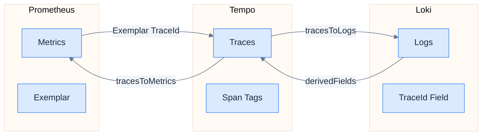
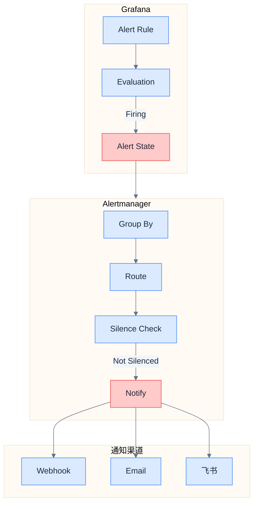

# Grafana 可视化

## 数据源配置

### Provisioning 目录结构

```
docker/grafana/provisioning/
├── datasources/
│   └── datasources.yaml      # 数据源配置
├── dashboards/
│   ├── dashboards.yaml       # 仪表盘加载配置
│   ├── jvm-dashboard.json    # JVM 监控
│   ├── http-dashboard.json   # HTTP 请求监控
│   └── services-dashboard.json # 服务概览
└── alerting/
    └── alerting.yaml         # 告警规则
```

### datasources.yaml

```yaml
apiVersion: 1

datasources:
  # Prometheus（指标）
  - name: Prometheus
    type: prometheus
    uid: prometheus
    access: proxy
    url: http://prometheus:9090
    isDefault: true
    jsonData:
      httpMethod: POST
      exemplarTraceIdDestinations:
        - name: traceId
          datasourceUid: tempo
          urlDisplayLabel: "View Trace"
      incrementalQuerying: true
      incrementalQueryOverlapWindow: 10m

  # Loki（日志）
  - name: Loki
    type: loki
    uid: loki
    access: proxy
    url: http://loki:3100
    jsonData:
      maxLines: 1000
      derivedFields:
        - name: TraceId
          matcherRegex: "traceId=([\\w]+)"
          url: "$${__value.raw}"
          datasourceUid: tempo
          urlDisplayLabel: "View Trace"

  # Tempo（链路）
  - name: Tempo
    type: tempo
    uid: tempo
    access: proxy
    url: http://tempo:3200
    jsonData:
      httpMethod: GET
      tracesToLogs:
        datasourceUid: loki
        filterByTraceID: true
        filterBySpanID: false
        mapTagNamesEnabled: true
        mappedTags:
          - key: service.name
            value: app
      tracesToMetrics:
        datasourceUid: prometheus
        queries:
          - name: Request Rate
            query: 'sum(rate(http_server_requests_seconds_count{service="$${__span.tags.service.name}"}[5m]))'
          - name: Error Rate
            query: 'sum(rate(http_server_requests_seconds_count{service="$${__span.tags.service.name}",status=~"5.."}[5m]))'
      serviceMap:
        datasourceUid: prometheus
      nodeGraph:
        enabled: true

  # Alertmanager
  - name: Alertmanager
    type: alertmanager
    uid: alertmanager
    access: proxy
    url: http://alertmanager:9093
    jsonData:
      implementation: prometheus
```

## 信号关联配置

### 关联路径



### Metrics → Traces（Exemplar）

**Prometheus 配置要求：**

```yaml
# prometheus.yml
global:
  scrape_interval: 15s
  # 启用 Exemplar 存储
command:
  - '--enable-feature=exemplar-storage'
```

> [!note] Metrics 导出方式
> Metrics 通过 OTel Agent + Micrometer Bridge 自动导出到 OTel Collector，
> 再由 Collector 通过 Prometheus Remote Write 导出到 Prometheus。
> 无需配置 `/actuator/prometheus` 端点。

**查询示例：**

```promql
# 带 Exemplar 的直方图查询
histogram_quantile(0.99,
  sum(rate(http_server_requests_seconds_bucket[5m])) by (le)
)
```

### Traces → Logs

**Tempo 数据源配置：**

```yaml
jsonData:
  tracesToLogs:
    datasourceUid: loki
    filterByTraceID: true
    tags:
      - service.name
    mappedTags:
      - key: service.name
        value: app
    spanStartTimeShift: -1h
    spanEndTimeShift: 1h
```

**效果：** 在 Tempo Trace 详情页，点击 "Logs for this span" 按钮跳转到 Loki。

### Logs → Traces

**Loki 数据源配置：**

```yaml
jsonData:
  derivedFields:
    - name: TraceId
      matcherRegex: 'traceId=(\w+)'
      url: '$${__value.raw}'
      datasourceUid: tempo
      urlDisplayLabel: "View Trace"
```

**效果：** 在日志行中，TraceId 显示为可点击链接，跳转到 Tempo。

## 仪表盘设计

### 仪表盘列表

| 仪表盘 | 用途 | 数据源 |
|--------|------|--------|
| **Services Overview** | 服务整体健康状态 | Prometheus |
| **JVM Metrics** | JVM 内存、GC、线程 | Prometheus |
| **HTTP Metrics** | HTTP 请求、延迟、错误 | Prometheus |
| **Logs Explorer** | 日志搜索和分析 | Loki |
| **Traces Explorer** | 链路追踪分析 | Tempo |

### Services Overview Dashboard

**面板布局：**

```
┌─────────────────────────────────────────────────────────────┐
│                    Services Overview                         │
├─────────────────┬─────────────────┬─────────────────────────┤
│  Total Services │  Healthy        │  Unhealthy              │
│       4         │      4          │       0                 │
├─────────────────┴─────────────────┴─────────────────────────┤
│                    Request Rate (5m)                         │
│  ████████████████████████████████████████████████            │
├─────────────────────────────────────────────────────────────┤
│                    Error Rate (5m)                           │
│  ████░░░░░░░░░░░░░░░░░░░░░░░░░░░░░░░░░░░░░░░░░░              │
├──────────────────────────┬──────────────────────────────────┤
│    P50 Latency           │    P99 Latency                   │
│      45ms                │      320ms                       │
├──────────────────────────┴──────────────────────────────────┤
│                  Service Dependency Graph                    │
│              [Tempo Service Map]                             │
└─────────────────────────────────────────────────────────────┘
```

**关键 PromQL 查询：**

```promql
# 服务存活数
sum(up{job="patra-services"})

# 请求速率
sum(rate(http_server_requests_seconds_count[5m])) by (service)

# 错误率
sum(rate(http_server_requests_seconds_count{status=~"5.."}[5m])) by (service)
/
sum(rate(http_server_requests_seconds_count[5m])) by (service)

# P99 延迟
histogram_quantile(0.99,
  sum(rate(http_server_requests_seconds_bucket[5m])) by (le, service)
)
```

### JVM Metrics Dashboard

**面板布局：**

```
┌─────────────────────────────────────────────────────────────┐
│                     JVM Metrics - $service                   │
├─────────────────┬─────────────────┬─────────────────────────┤
│  Heap Used      │  Non-Heap Used  │  Thread Count           │
│   512MB / 1GB   │     128MB       │      45                 │
├─────────────────┴─────────────────┴─────────────────────────┤
│                    Heap Memory Usage                         │
│  [Timeseries: Used / Committed / Max]                        │
├──────────────────────────┬──────────────────────────────────┤
│    GC Pause Time         │    GC Count                      │
│  [Timeseries]            │  [Timeseries]                    │
├──────────────────────────┴──────────────────────────────────┤
│                    Thread States                             │
│  [Stacked Area: Runnable/Blocked/Waiting/Timed-Waiting]      │
└─────────────────────────────────────────────────────────────┘
```

**关键 PromQL 查询：**

```promql
# Heap 使用
jvm_memory_used_bytes{area="heap", service="$service"}

# GC 暂停时间
rate(jvm_gc_pause_seconds_sum{service="$service"}[5m])
/
rate(jvm_gc_pause_seconds_count{service="$service"}[5m])

# 线程数
jvm_threads_states_threads{service="$service"}
```

### HTTP Metrics Dashboard

**面板布局：**

```
┌─────────────────────────────────────────────────────────────┐
│                   HTTP Metrics - $service                    │
├─────────────────┬─────────────────┬─────────────────────────┤
│  Requests/sec   │  Error Rate     │  Avg Latency            │
│     125.3       │     0.5%        │      85ms               │
├─────────────────┴─────────────────┴─────────────────────────┤
│                    Request Rate by Endpoint                  │
│  [Timeseries: /api/journals, /api/articles, ...]             │
├──────────────────────────┬──────────────────────────────────┤
│    Latency Distribution  │    Status Code Distribution      │
│  [Heatmap]               │  [Pie: 2xx/4xx/5xx]              │
├──────────────────────────┴──────────────────────────────────┤
│                    Top Slow Endpoints                        │
│  [Table: uri, count, p50, p99]                               │
└─────────────────────────────────────────────────────────────┘
```

**关键 PromQL 查询：**

```promql
# 请求速率（按端点）
sum(rate(http_server_requests_seconds_count{service="$service"}[5m])) by (uri)

# 延迟热力图
sum(rate(http_server_requests_seconds_bucket{service="$service"}[5m])) by (le)

# 状态码分布
sum(rate(http_server_requests_seconds_count{service="$service"}[5m])) by (status)

# 慢端点 Top 10
topk(10,
  histogram_quantile(0.99,
    sum(rate(http_server_requests_seconds_bucket{service="$service"}[5m])) by (le, uri)
  )
)
```

## 告警规则设计

### Grafana Alerting 配置

**alerting/alerting.yaml**

```yaml
apiVersion: 1

groups:
  - name: patra-alerts
    folder: Patra
    interval: 1m
    rules:
      # 高错误率
      - uid: high-error-rate
        title: High Error Rate
        condition: C
        data:
          - refId: A
            datasourceUid: prometheus
            model:
              expr: |
                sum(rate(http_server_requests_seconds_count{status=~"5.."}[5m])) by (service)
                /
                sum(rate(http_server_requests_seconds_count[5m])) by (service)
          - refId: B
            datasourceUid: __expr__
            model:
              type: reduce
              reducer: last
              expression: A
          - refId: C
            datasourceUid: __expr__
            model:
              type: threshold
              expression: B
              conditions:
                - evaluator:
                    type: gt
                    params: [0.01]  # > 1%
        for: 5m
        labels:
          severity: critical
        annotations:
          summary: "Service {{ $labels.service }} has high error rate"
          description: "Error rate is {{ $values.B.Value | printf \"%.2f\" }}%"

      # P99 高延迟
      - uid: high-latency
        title: High P99 Latency
        condition: C
        data:
          - refId: A
            datasourceUid: prometheus
            model:
              expr: |
                histogram_quantile(0.99,
                  sum(rate(http_server_requests_seconds_bucket[5m])) by (le, service)
                )
          - refId: B
            datasourceUid: __expr__
            model:
              type: reduce
              reducer: last
              expression: A
          - refId: C
            datasourceUid: __expr__
            model:
              type: threshold
              expression: B
              conditions:
                - evaluator:
                    type: gt
                    params: [1]  # > 1s
        for: 5m
        labels:
          severity: warning
        annotations:
          summary: "Service {{ $labels.service }} has high latency"
          description: "P99 latency is {{ $values.B.Value | printf \"%.3f\" }}s"

      # 服务下线
      - uid: service-down
        title: Service Down
        condition: C
        data:
          - refId: A
            datasourceUid: prometheus
            model:
              expr: up{job="patra-services"}
          - refId: B
            datasourceUid: __expr__
            model:
              type: reduce
              reducer: last
              expression: A
          - refId: C
            datasourceUid: __expr__
            model:
              type: threshold
              expression: B
              conditions:
                - evaluator:
                    type: lt
                    params: [1]  # == 0
        for: 1m
        labels:
          severity: critical
        annotations:
          summary: "Service {{ $labels.instance }} is down"

contactPoints:
  - name: default
    receivers:
      - uid: webhook
        type: webhook
        settings:
          url: http://host.docker.internal:8080/api/alerts/webhook
          httpMethod: POST

policies:
  - receiver: default
    group_by: ['alertname', 'service']
    group_wait: 30s
    group_interval: 5m
    repeat_interval: 4h
```

### 告警流程



## Grafana 配置

### grafana.ini

```ini
[server]
root_url = http://localhost:3000

[security]
admin_user = admin
admin_password = patra123
allow_embedding = true

[auth.anonymous]
enabled = true
org_role = Viewer

[users]
allow_sign_up = false

[dashboards]
default_home_dashboard_path = /etc/grafana/provisioning/dashboards/services-dashboard.json

[alerting]
enabled = true

[unified_alerting]
enabled = true

[feature_toggles]
enable = traceqlEditor tempoServiceGraph tempoSearch
```

## 相关链接

- 上一章：[[05-infrastructure|基础设施部署]]
- 下一章：[[07-implementation-roadmap|实现路线图]]
- 索引：[[_MOC|可观测性系统设计]]
