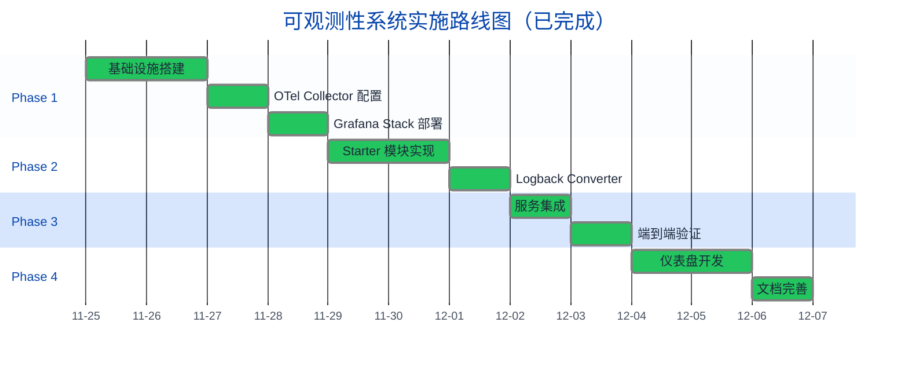
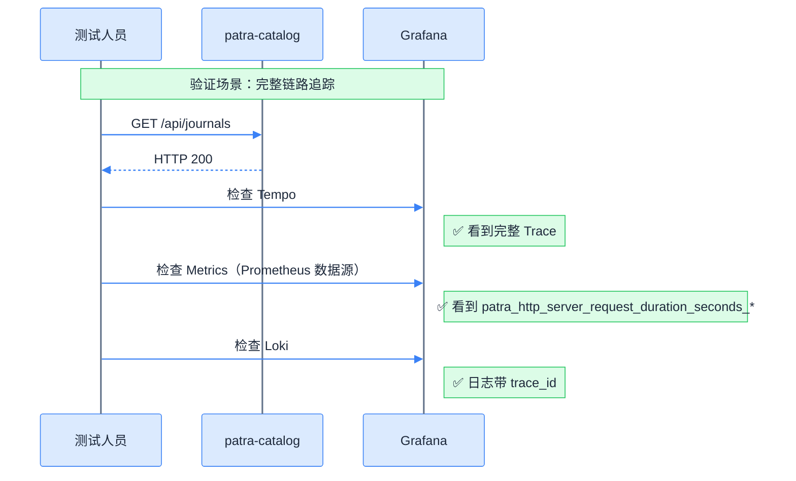
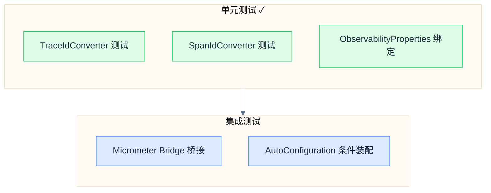

# 实现路线图

## 实施阶段概览



## Phase 1：基础设施搭建 ✓

### 目标

搭建完整的可观测性基础设施，包括 OTel Collector、Prometheus、Loki、Tempo、Grafana。

### 任务清单

| 任务 | 产出物 | 状态 |
|------|--------|------|
| 创建 Docker Compose 配置 | `docker/docker-compose.observability.yaml` | ✅ |
| 配置 OTel Collector | `docker/otel-collector/config.yaml` | ✅ |
| 配置 Prometheus | `docker/prometheus/prometheus.yml` | ✅ |
| 配置 Loki | `docker/loki/loki-config.yaml` | ✅ |
| 配置 Tempo | `docker/tempo/tempo.yaml` | ✅ |
| 配置 Grafana Provisioning | `docker/grafana/provisioning/*` | ✅ |
| 配置 OTel Agent | `docker/otel-agent/otel-dev.properties` | ✅ |

### 目录结构

```
docker/
├── docker-compose.observability.yaml
├── otel-agent/
│   ├── opentelemetry-javaagent.jar   # OTel Java Agent
│   └── otel-dev.properties           # Agent 开发环境配置
├── otel-collector/
│   └── config.yaml                   # Collector 配置
├── prometheus/
│   └── prometheus.yml                # Prometheus 配置
├── loki/
│   └── loki-config.yaml              # Loki 配置
├── tempo/
│   └── tempo.yaml                    # Tempo 配置
├── alertmanager/
│   └── alertmanager.yml              # Alertmanager 配置
└── grafana/
    ├── grafana.ini                   # Grafana 主配置
    └── provisioning/
        ├── datasources/
        │   └── datasources.yaml      # 数据源配置
        └── dashboards/
            ├── dashboards.yaml       # 仪表盘加载配置
            ├── patra/                # 服务仪表盘（7 个）
            └── infrastructure/       # 基础设施仪表盘（预留）
```

### 验证命令

```bash
# 1. 启动基础设施
docker compose -f docker/docker-compose.observability.yaml up -d

# 2. 验证服务健康
curl http://localhost:13133/         # OTel Collector Health
curl http://localhost:9090/-/healthy  # Prometheus
curl http://localhost:3100/ready      # Loki
curl http://localhost:3200/ready      # Tempo
curl http://localhost:3000/api/health # Grafana
```

## Phase 2：Starter 模块实现 ✓

### 目标

实现 `patra-spring-boot-starter-observability` 模块，采用 OTel Agent + Micrometer 混合模式。

### 架构决策

| 职责 | 方案 | 说明 |
|------|------|------|
| Tracing | OTel Java Agent | 通过 `-javaagent` JVM 参数注入，零代码侵入 |
| Metrics | OTel Agent + Micrometer Bridge | Micrometer 指标通过 Agent 桥接，统一走 OTLP 导出 |
| Logging | Agent MDC 注入 + 自定义 Converter | Agent 自动注入 `trace_id`/`span_id` 到 MDC |

### 任务清单

| 任务 | 产出物 | 状态 |
|------|--------|------|
| 核心自动配置 | `ObservabilityAutoConfiguration.java` | ✅ |
| Micrometer 配置 | `MicrometerAutoConfiguration.java`（含 OTel Bridge） | ✅ |
| 拦截器配置 | `ObservationInterceptorsAutoConfiguration.java` | ✅ |
| 配置属性 | `ObservabilityProperties.java` | ✅ |
| MeterFilter | `HighCardinalityMeterFilter`、`CommonTagsMeterFilter` | ✅ |
| 自定义 Logback Converter | `TraceIdConverter`、`SpanIdConverter` | ✅ |
| Converter 单元测试 | `*ConverterTest.java` | ✅ |

> [!note] 架构简化
> ObservationHandler 和 ObservationFilter 已移除，Tracing 由 OTel Java Agent 自动处理。

### 依赖配置

```xml
<!-- 实际依赖（无 OpenTelemetry SDK） -->
<dependencies>
    <!-- Micrometer (Metrics + Observations) -->
    <dependency>
        <groupId>io.micrometer</groupId>
        <artifactId>micrometer-observation</artifactId>
    </dependency>
    <dependency>
        <groupId>io.micrometer</groupId>
        <artifactId>micrometer-core</artifactId>
    </dependency>

    <!-- Spring Boot Actuator -->
    <dependency>
        <groupId>org.springframework.boot</groupId>
        <artifactId>spring-boot-starter-actuator</artifactId>
    </dependency>
</dependencies>
```

> [!note] Metrics 导出架构
> Metrics 通过 OTel Agent 的 Micrometer Bridge 自动桥接，无需 `micrometer-registry-prometheus`。
> Agent 配置 `otel.instrumentation.micrometer.enabled=true` 后，Micrometer 指标统一走 OTLP 导出。

> [!note] 零代码侵入
> Tracing 由 OTel Java Agent 通过 `-javaagent` 参数自动处理，无需在应用代码中引入 OTel SDK 依赖。

### 验证命令

```bash
# 1. 编译验证
mvn clean compile -pl patra-spring-boot-starter-observability

# 2. 测试验证
mvn test -pl patra-spring-boot-starter-observability

# 3. 依赖检查（不应包含 OpenTelemetry SDK）
mvn dependency:tree -pl patra-spring-boot-starter-observability | grep opentelemetry
# 期望输出：无输出（仅 Agent 运行时使用）
```

## Phase 3：服务集成验证 ✓

### 目标

将微服务接入可观测性系统，验证三信号（Metrics/Traces/Logs）完整链路。

### 任务清单

| 任务 | 涉及服务 | 状态 |
|------|----------|------|
| 下载 OTel Agent | 所有服务 | ✅ |
| 配置 Agent 属性文件 | `otel-dev.properties` | ✅ |
| 验证 Metrics | patra-catalog | ✅ |
| 验证 Traces | patra-catalog | ✅ |
| 验证 Logs | patra-catalog | ✅ |

### OTel Agent 配置

> [!important] Metrics Exporter 配置
> Metrics 使用 `otlp` 导出（非 `none`），配合 Micrometer Bridge 将 Spring Boot 指标统一导出到 OTel Collector。

**otel-dev.properties**（完整配置）：

```properties
# ============================================================
# 服务标识
# ============================================================
# otel.service.name 会自动从 spring.application.name 读取
otel.resource.attributes=service.namespace=patra,deployment.environment=dev

# ============================================================
# OTLP 导出配置
# ============================================================
otel.exporter.otlp.endpoint=http://localhost:4317
otel.exporter.otlp.protocol=grpc

# ============================================================
# Traces 配置
# ============================================================
otel.traces.exporter=otlp
otel.traces.sampler=parentbased_traceidratio
otel.traces.sampler.arg=1.0

# ============================================================
# Metrics 配置
# ============================================================
# 启用 OTLP 指标导出，统一遥测管道
otel.metrics.exporter=otlp

# 启用 Micrometer 桥接（Agent 2.0+ 默认禁用）
# 将 Spring Boot/Micrometer 指标桥接到 OTel
otel.instrumentation.micrometer.enabled=true

# ============================================================
# Logs 配置
# ============================================================
otel.logs.exporter=otlp
```

### 服务启动配置

**本地开发（使用配置文件）：**

```bash
java -javaagent:docker/otel-agent/opentelemetry-javaagent.jar \
     -Dotel.javaagent.configuration-file=docker/otel-agent/otel-dev.properties \
     -Dotel.service.name=patra-catalog \
     -jar patra-catalog-boot.jar \
     --spring.profiles.active=dev
```

**Docker Compose 配置：**

```yaml
services:
  patra-catalog:
    environment:
      JAVA_TOOL_OPTIONS: "-javaagent:/opt/otel/opentelemetry-javaagent.jar"
      OTEL_SERVICE_NAME: "patra-catalog"
      OTEL_EXPORTER_OTLP_ENDPOINT: "http://otel-collector:4317"
      OTEL_RESOURCE_ATTRIBUTES: "service.namespace=patra,deployment.environment=dev"
      OTEL_TRACES_SAMPLER: "parentbased_traceidratio"
      OTEL_TRACES_SAMPLER_ARG: "1.0"
      # Metrics 使用 OTLP 导出 + Micrometer Bridge
      OTEL_METRICS_EXPORTER: "otlp"
      OTEL_INSTRUMENTATION_MICROMETER_ENABLED: "true"
      OTEL_LOGS_EXPORTER: "otlp"
    volumes:
      - ./docker/otel-agent/opentelemetry-javaagent.jar:/opt/otel/opentelemetry-javaagent.jar:ro
```

### 验证场景



## Phase 4：仪表盘与文档 ✓

### 目标

开发 Grafana 仪表盘，完成设计文档。

### 任务清单

| 任务 | 产出物 | 状态 |
|------|--------|------|
| HTTP Server 仪表盘 | `patra/http-server.json` | ✅ |
| HTTP Client 仪表盘 | `patra/http-client.json` | ✅ |
| JVM Service Health 仪表盘 | `patra/jvm-service-health.json` | ✅ |
| HikariCP 仪表盘 | `patra/hikaricp.json` | ✅ |
| Spring Batch 仪表盘 | `patra/spring-batch.json` | ✅ |
| Traces 仪表盘 | `patra/traces.json` | ✅ |
| Logs 仪表盘 | `patra/logs.json` | ✅ |
| 设计文档系列 | `docs/designs/observability/*` | ✅ |
| ADR 决策记录 | `ADR-005` | ✅ |

### 仪表盘验收

| 仪表盘 | 核心面板 | 状态 |
|--------|----------|------|
| HTTP Server | QPS、P99 延迟、错误率、状态码分布 | ✅ |
| HTTP Client | 出站请求速率、延迟、错误率 | ✅ |
| JVM Service Health | Heap 使用、GC 暂停、线程状态 | ✅ |
| HikariCP | 连接池使用率、等待数、获取时间 | ✅ |
| Spring Batch | Job 执行状态、Step 耗时、失败率 | ✅ |
| Traces | TraceQL 查询、Service Graph | ✅ |
| Logs | LogQL 查询、日志流 | ✅ |

## 测试策略

### 测试层级



### 已完成测试用例

| 测试类 | 测试点 | 状态 |
|--------|--------|------|
| `TraceIdConverterTest` | OTel/Micrometer MDC 键兼容 | ✅ |
| `SpanIdConverterTest` | OTel/Micrometer MDC 键兼容 | ✅ |

## 风险评估与缓解

### 风险矩阵

| 风险 | 可能性 | 影响 | 缓解措施 | 状态 |
|------|--------|------|----------|------|
| OTel Agent 性能开销 | 中 | 中 | 采样率调优 | ✅ 已验证 |
| OTLP 网络故障 | 低 | 中 | Collector 重试配置 | ✅ 已配置 |
| 配置复杂度高 | 高 | 中 | 模板化配置，详细文档 | ✅ 文档完善 |
| Collector 内存溢出 | 中 | 高 | memory_limiter 配置 | ✅ 已配置 |

### 采样配置

```yaml
# 开发环境：100% 采样
OTEL_TRACES_SAMPLER: "parentbased_traceidratio"
OTEL_TRACES_SAMPLER_ARG: "1.0"

# 生产环境：10% 采样（推荐）
OTEL_TRACES_SAMPLER: "parentbased_traceidratio"
OTEL_TRACES_SAMPLER_ARG: "0.1"
```

## 回滚策略

### 快速回滚步骤

如果可观测性系统出现严重问题，可按以下步骤快速回滚：

```bash
# 1. 禁用 OTel Agent（移除 JAVA_TOOL_OPTIONS）
docker compose down
# 编辑 docker-compose.yaml，注释 JAVA_TOOL_OPTIONS
docker compose up -d

# 2. 验证服务正常
curl http://localhost:8083/actuator/health
```

### 回滚检查清单

- [x] 服务正常启动
- [x] 核心业务功能正常
- [x] 无性能异常
- [x] 日志正常输出（控制台）

## 验收标准总览

### Phase 1 验收 ✅

- [x] Docker Compose 一键启动所有组件
- [x] Grafana 自动加载所有数据源
- [x] 各组件健康检查通过

### Phase 2 验收 ✅

- [x] 基于 OTel Java Agent 模式（零代码侵入）
- [x] Micrometer 用于 Metrics 和 Observations
- [x] 自定义 Logback Converter 实现 MDC 提取
- [x] Converter 单元测试全部通过

### Phase 3 验收 ✅

- [x] OTel Agent 成功加载（日志显示 Agent 初始化）
- [x] HTTP Tracing 自动集成
- [x] 服务 Traces 可在 Tempo 查看
- [x] 日志带 trace_id（MDC 注入正常）
- [x] Micrometer 指标通过 OTLP 导出

### Phase 4 验收 ✅

- [x] 7 个 Grafana 仪表盘可用
- [x] 设计文档系列完整（8 篇）
- [x] ADR-005 决策记录完成

## 相关链接

- 上一章：[[06-grafana-visualization|Grafana 可视化]]
- 下一章：[[08-version-matrix|版本矩阵]]
- 索引：[[_MOC|可观测性系统设计]]
- ADR：[[../../decisions/ADR-005-adopt-opentelemetry-grafana-stack-for-observability|ADR-005]]
