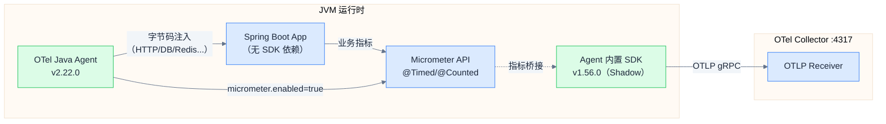
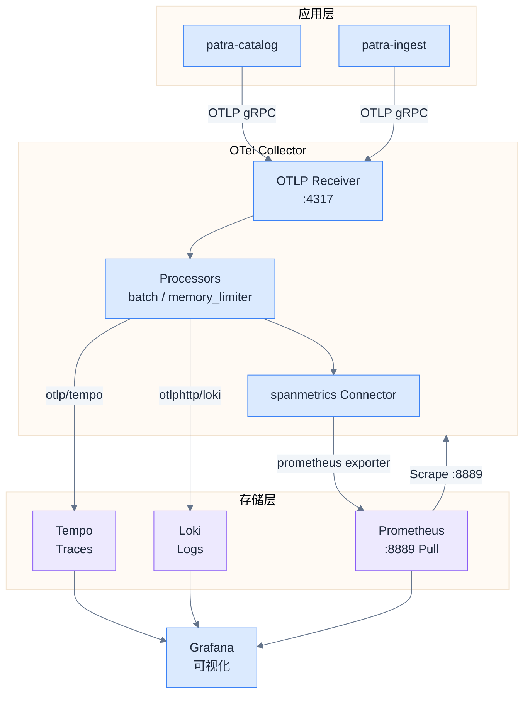
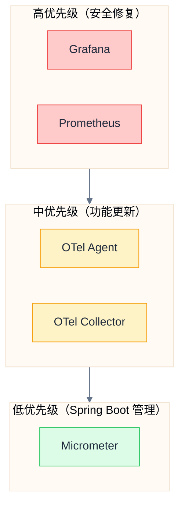

# 版本矩阵

## 推荐版本组合

> [!important] 版本选择原则
> 1. **Zero SDK 架构**：应用程序不依赖 OTel SDK，仅使用 Micrometer API
> 2. **Agent 全权负责**：所有遥测数据导出由 OTel Java Agent 处理
> 3. **基础设施稳定版**：Grafana Stack 选择最新稳定版，避免 RC/Beta

### 应用依赖版本

| 组件 | 版本 | 版本来源 | 用途 |
|------|------|----------|------|
| **Spring Boot** | 3.5.7 | 项目 POM | 基础框架 |
| **Micrometer Core** | 1.15.5 | Spring Boot BOM | 指标收集 API |
| **Micrometer Observation** | 1.15.5 | Spring Boot BOM | 观察 API（Traces 抽象） |

> [!note] Zero SDK 架构说明
> 项目采用 **OTel Agent + Agent 内置 Micrometer Bridge** 架构：
> - 应用程序**仅依赖 Micrometer API**，无任何 OTel SDK 依赖
> - OTel Agent 通过 `otel.instrumentation.micrometer.enabled=true` 桥接 Micrometer 指标
> - Agent 统一负责 Traces/Metrics/Logs 的 OTLP 导出
> - 这种架构避免了 SDK 版本冲突，简化了依赖管理

### 基础设施版本

| 组件 | 版本 | Docker 镜像 | 职责 |
|------|------|-------------|------|
| **OTel Java Agent** | 2.22.0 | N/A (JAR) | 字节码注入、遥测导出 |
| **OTel Collector** | 0.140.1 | `otel/opentelemetry-collector-contrib:0.140.1` | 遥测数据处理与路由 |
| **Prometheus** | 3.7.3 | `prom/prometheus:v3.7.3` | 指标存储与查询 |
| **Grafana** | 12.3.0 | `grafana/grafana:12.3.0` | 可视化与告警 |
| **Loki** | 3.6.2 | `grafana/loki:3.6.2` | 日志聚合与查询 |
| **Tempo** | 2.9.0 | `grafana/tempo:2.9.0` | 分布式追踪存储 |
| **Alertmanager** | 0.29.0 | `prom/alertmanager:v0.29.0` | 告警路由与通知 |

## 架构与数据流

### OTel Agent 工作原理



> [!tip] Agent Shadow Packaging
> OTel Java Agent 使用 **Shadow Packaging** 技术：
> - Agent 内置的 OTel SDK 包路径被重命名（如 `io.opentelemetry` → `io.opentelemetry.javaagent.shaded`）
> - 与应用程序 classpath 完全隔离，不可能发生版本冲突
> - Agent v2.22.0 内置 SDK 1.56.0，但应用程序**完全感知不到**

### 遥测数据流向



## Maven 依赖配置

### patra-spring-boot-starter-observability

```xml
<!-- 实际依赖（无 OTel SDK） -->
<dependencies>
    <!-- Micrometer 核心：指标收集 API -->
    <dependency>
        <groupId>io.micrometer</groupId>
        <artifactId>micrometer-core</artifactId>
    </dependency>

    <!-- Micrometer Observation：观察 API（Traces 抽象层） -->
    <dependency>
        <groupId>io.micrometer</groupId>
        <artifactId>micrometer-observation</artifactId>
    </dependency>

    <!-- 注意：不需要以下依赖 -->
    <!-- ❌ micrometer-tracing-bridge-otel（Agent 内置桥接） -->
    <!-- ❌ opentelemetry-exporter-otlp（Agent 负责导出） -->
    <!-- ❌ opentelemetry-sdk（Agent Shadow 内置） -->
</dependencies>
```

### Logback OTLP Appender（可选）

如果需要结构化日志直接发送到 OTel Collector（而非通过 Agent），可添加：

```xml
<properties>
    <!-- 与 OTel Agent 版本对齐 -->
    <opentelemetry-logback-appender.version>2.22.0-alpha</opentelemetry-logback-appender.version>
</properties>

<dependency>
    <groupId>io.opentelemetry.instrumentation</groupId>
    <artifactId>opentelemetry-logback-appender-1.0</artifactId>
    <version>${opentelemetry-logback-appender.version}</version>
</dependency>
```

> [!warning] 当前配置
> 项目当前使用 **Agent 日志导出**（`otel.logs.exporter=otlp`），不需要 Logback Appender 依赖。
> `opentelemetry-logback-appender.version` 在 patra-parent 中定义但未实际使用。

## OTel Agent 配置

### 启动参数

```bash
# JVM 启动参数
java -javaagent:/path/to/opentelemetry-javaagent.jar \
     -Dotel.javaagent.configuration-file=/path/to/otel-dev.properties \
     -jar application.jar
```

### otel-dev.properties

```properties
# ===== 服务标识 =====
otel.service.name=${SERVICE_NAME}
otel.resource.attributes=service.namespace=patra,deployment.environment=dev

# ===== Traces 配置 =====
otel.traces.exporter=otlp
otel.exporter.otlp.traces.endpoint=http://otel-collector:4317

# ===== Metrics 配置 =====
otel.metrics.exporter=otlp
otel.exporter.otlp.metrics.endpoint=http://otel-collector:4317

# ===== Logs 配置 =====
otel.logs.exporter=otlp
otel.exporter.otlp.logs.endpoint=http://otel-collector:4317

# ===== Micrometer Bridge（关键配置） =====
# 启用 Agent 内置的 Micrometer 桥接
# Agent 会注入 OpenTelemetryMeterRegistry 到 Metrics.globalRegistry
# MicrometerAutoConfiguration 将其暴露为 Primary Bean
otel.instrumentation.micrometer.enabled=true

# ===== 采样配置 =====
otel.traces.sampler=parentbased_traceidratio
otel.traces.sampler.arg=1.0

# ===== 自动检测范围 =====
# 禁用不需要的检测以减少噪音
otel.instrumentation.jdbc.enabled=true
otel.instrumentation.spring-web.enabled=true
otel.instrumentation.spring-webmvc.enabled=true
otel.instrumentation.lettuce.enabled=true
otel.instrumentation.okhttp.enabled=true
```

## Docker Compose 版本配置

```yaml
# docker/docker-compose.observability.yaml
services:
  otel-collector:
    image: otel/opentelemetry-collector-contrib:0.140.1
    # 必须使用 contrib 版本（包含 spanmetrics connector）

  prometheus:
    image: prom/prometheus:v3.7.3
    # Prometheus 3.x：全新 UI、UTF-8 支持

  loki:
    image: grafana/loki:3.6.2
    # Schema v13：性能优化

  tempo:
    image: grafana/tempo:2.9.0
    # TraceQL、MCP Server 支持

  grafana:
    image: grafana/grafana:12.3.0
    # 交互式学习、日志面板重构

  alertmanager:
    image: prom/alertmanager:v0.29.0
    # 告警路由与通知
```

## OTel Java Agent 下载

```bash
# 下载 OTel Java Agent v2.22.0
curl -L -o docker/otel-agent/opentelemetry-javaagent.jar \
  https://github.com/open-telemetry/opentelemetry-java-instrumentation/releases/download/v2.22.0/opentelemetry-javaagent.jar

# 验证 SHA256
curl -L -o opentelemetry-javaagent.jar.sha256 \
  https://github.com/open-telemetry/opentelemetry-java-instrumentation/releases/download/v2.22.0/opentelemetry-javaagent.jar.sha256
sha256sum -c opentelemetry-javaagent.jar.sha256
```

## 版本兼容性矩阵

### Grafana Stack 兼容性

| 组件组合 | 兼容性 | 验证状态 |
|----------|--------|----------|
| Grafana 12.3 + Tempo 2.9 | ✅ | TraceQL、Service Map 正常 |
| Grafana 12.3 + Loki 3.6 | ✅ | LogQL v2、Derived Fields 正常 |
| Grafana 12.3 + Prometheus 3.7 | ✅ | Exemplar、PromQL 正常 |
| Tempo 2.9 + Loki 3.6 | ✅ | tracesToLogsV2 关联正常 |
| Prometheus 3.7 + Tempo 2.9 | ✅ | Exemplar-to-Traces 关联正常 |

### OTLP 协议版本

| 组件 | OTLP 版本 | gRPC 端口 | HTTP 端口 |
|------|-----------|-----------|-----------|
| OTel Collector 0.140.x | v1.3.0 | 4317 | 4318 |
| OTel Java Agent 2.22.0 | v1.3.0 | ✅ | ✅ |
| Tempo 2.9.0 | v1.3.0 | 4317 | 4318 |
| Loki 3.6.x | v1.3.0 | N/A | /otlp |

> [!note] Loki OTLP 端点
> Loki 3.x 使用 HTTP `/otlp` 端点接收 OTLP 日志，不支持 gRPC。
> OTel Collector 需使用 `otlphttp/loki` exporter（而非 `otlp`）。

## 版本升级策略

### 升级优先级



### 升级检查清单

| 组件 | 检查频率 | 升级触发条件 |
|------|----------|--------------|
| Grafana | 每月 | CVE 修复、重大功能 |
| Prometheus | 每月 | CVE 修复、性能改进 |
| OTel Agent | 每季度 | 新框架支持、Bug 修复 |
| OTel Collector | 每季度 | 新 Exporter/Connector、Bug 修复 |
| Micrometer | 随 Spring Boot | Spring Boot 升级时一起升级 |

## 新特性亮点

### OTel Java Agent 2.22.0 (2025-11)

- **Micrometer Bridge 优化**：更好的指标名称映射
- **Spring Boot 3.5 支持**：完整的自动检测
- **内存占用优化**：减少 Agent overhead

### Grafana 12.3 (2025-11)

- **交互式学习体验**：平台内置学习资源
- **日志面板重构**：毫秒/纳秒精度、颜色高亮、客户端过滤
- **日志上下文**：查看日志行前后的事件

### Tempo 2.9 (2025-10)

- **MCP Server 支持**：LLM/AI 助手可直接查询 TraceQL
- **TraceQL 采样**：查询提示加速近似结果
- **语义约定对齐**：更好的 OTel 兼容性

### Loki 3.6 (2025-11)

- **Schema v13**：性能优化、TSDB 集成
- **OTLP 原生支持**：无需 promtail
- **安全更新**：CVE 修复

### Prometheus 3.x (2024-11)

- **全新 UI**：七年来首次大版本更新
- **UTF-8 支持**：标签值支持 UTF-8 字符
- **性能改进**：查询引擎优化

## 相关链接

- 上一章：[[07-implementation-roadmap|实现路线图]]
- 索引：[[_MOC|可观测性系统设计]]

## 参考资料

- [OpenTelemetry Java Agent Releases](https://github.com/open-telemetry/opentelemetry-java-instrumentation/releases)
- [OTel Collector Contrib Releases](https://github.com/open-telemetry/opentelemetry-collector-contrib/releases)
- [Grafana Tempo 2.9 Release](https://grafana.com/blog/2025/10/22/grafana-tempo-2-9-release-mcp-server-support-traceql-metrics-sampling-and-more/)
- [Grafana 12.3 Release](https://grafana.com/blog/2025/11/19/grafana-12-3-release-all-the-latest-features/)
- [Prometheus Releases](https://github.com/prometheus/prometheus/releases)
- [Spring Boot Observability](https://docs.spring.io/spring-boot/reference/actuator/observability.html)
