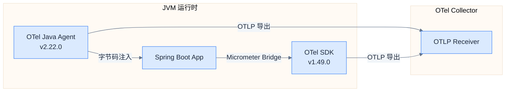
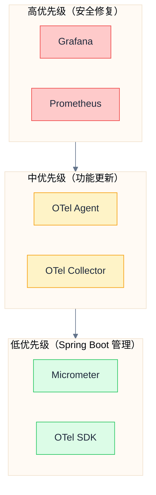

# 版本矩阵

## 推荐版本组合

> [!important] 版本选择原则
> 1. **Spring Boot 管理优先**：Micrometer、OpenTelemetry SDK 使用 Spring Boot BOM 管理的版本
> 2. **Agent 独立升级**：OTel Java Agent 独立于应用 SDK，可使用最新稳定版
> 3. **基础设施稳定版**：Grafana Stack 选择最新稳定版，避免 RC/Beta

### 确定版本（锁定）

| 组件 | 版本 | 版本来源 | 备注 |
|------|------|----------|------|
| **Spring Boot** | 3.5.7 | 项目 POM | 基础框架版本 |
| **Micrometer** | 1.15.5 | Spring Boot BOM | 指标收集 |
| **Micrometer Tracing** | 1.5.5 | Spring Boot BOM | 追踪抽象层 |
| **OpenTelemetry SDK** | 1.49.0 | Spring Boot BOM | OTel API/SDK |

### 基础设施版本

| 组件 | 推荐版本 | Docker 镜像 | 发布日期 |
|------|----------|-------------|----------|
| **OTel Java Agent** | 2.22.0 | N/A (JAR) | 2025-11-20 |
| **OTel Collector** | 0.140.1 | `otel/opentelemetry-collector-contrib:0.140.1` | 2025-11-18 |
| **Prometheus** | 3.7.3 | `prom/prometheus:v3.7.3` | 2025-10-29 |
| **Grafana** | 12.3.0 | `grafana/grafana:12.3.0` | 2025-11-13 |
| **Loki** | 3.6.2 | `grafana/loki:3.6.2` | 2025-11-25 |
| **Tempo** | 2.9.0 | `grafana/tempo:2.9.0` | 2025-10-13 |
| **Alertmanager** | 0.29.0 | `prom/alertmanager:v0.29.0` | 2025-11-01 |

## 版本兼容性说明

### OTel Java Agent vs SDK



> [!note] Agent 独立性
> OTel Java Agent 使用 **Shadow Packaging** 技术，将其依赖的 OTel SDK 重命名包路径后打包。
> 因此 Agent 内置的 SDK 版本与应用程序使用的 SDK 版本**完全隔离**，不会冲突。
>
> - Agent v2.22.0 内置 SDK 1.56.0
> - 应用使用 Spring Boot 管理的 SDK 1.49.0
> - 两者可以共存，互不影响

### Grafana Stack 兼容性

| 组件组合 | 兼容性 | 验证状态 |
|----------|--------|----------|
| Grafana 12.3 + Tempo 2.9 | ✅ | TraceQL、Service Map 正常 |
| Grafana 12.3 + Loki 3.6 | ✅ | LogQL v2、Derived Fields 正常 |
| Grafana 12.3 + Prometheus 3.7 | ✅ | Exemplar、PromQL 正常 |
| Tempo 2.9 + Loki 3.6 | ✅ | Traces-to-Logs 关联正常 |
| Prometheus 3.7 + Tempo 2.9 | ✅ | Exemplar-to-Traces 关联正常 |

### OTLP 协议版本

| 组件 | OTLP 版本 | gRPC 端口 | HTTP 端口 |
|------|-----------|-----------|-----------|
| OTel Collector 0.140.x | v1.3.0 | 4317 | 4318 |
| OTel Java Agent 2.22.0 | v1.3.0 | ✅ | ✅ |
| Tempo 2.9.0 | v1.3.0 | 4317 | 4318 |
| Loki 3.6.x | v1.3.0 | 4317 | 4318 |

## Maven 依赖配置

### pom.xml 版本属性

```xml
<properties>
    <!-- Spring Boot 管理（不要覆盖） -->
    <!-- micrometer.version: 1.15.5 -->
    <!-- micrometer-tracing.version: 1.5.5 -->
    <!-- opentelemetry.version: 1.49.0 -->

    <!-- 额外依赖版本 -->
    <opentelemetry-logback-appender.version>2.22.0-alpha</opentelemetry-logback-appender.version>
</properties>
```

### 核心依赖

```xml
<dependencies>
    <!-- Micrometer 核心（Spring Boot 管理版本） -->
    <dependency>
        <groupId>io.micrometer</groupId>
        <artifactId>micrometer-core</artifactId>
    </dependency>

    <!-- Micrometer Tracing + OTel Bridge（Spring Boot 管理版本） -->
    <dependency>
        <groupId>io.micrometer</groupId>
        <artifactId>micrometer-tracing-bridge-otel</artifactId>
    </dependency>

    <!-- OTLP Exporter（Spring Boot 管理版本） -->
    <dependency>
        <groupId>io.opentelemetry</groupId>
        <artifactId>opentelemetry-exporter-otlp</artifactId>
    </dependency>

    <!-- Logback OTLP Appender（需要指定版本，与 Agent 版本对齐） -->
    <dependency>
        <groupId>io.opentelemetry.instrumentation</groupId>
        <artifactId>opentelemetry-logback-appender-1.0</artifactId>
        <version>${opentelemetry-logback-appender.version}</version>
    </dependency>
</dependencies>
```

## Docker Compose 版本配置

```yaml
# docker/docker-compose.observability.yaml
services:
  otel-collector:
    image: otel/opentelemetry-collector-contrib:0.140.1
    # ...

  prometheus:
    image: prom/prometheus:v3.7.3
    # ...

  loki:
    image: grafana/loki:3.6.2
    # ...

  tempo:
    image: grafana/tempo:2.9.0
    # ...

  grafana:
    image: grafana/grafana:12.3.1
    # ...

  alertmanager:
    image: prom/alertmanager:v0.29.0
    # ...
```

## OTel Java Agent 下载

```bash
# 下载 OTel Java Agent v2.22.0
curl -L -o docker/otel-agent/opentelemetry-javaagent.jar \
  https://github.com/open-telemetry/opentelemetry-java-instrumentation/releases/download/v2.22.0/opentelemetry-javaagent.jar

# 验证 SHA256
curl -L -o opentelemetry-javaagent.jar.sha256 \
  https://github.com/open-telemetry/opentelemetry-java-instrumentation/releases/download/v2.22.0/opentelemetry-javaagent.jar.sha256
sha256sum -c opentelemetry-javaagent.jar.sha256
```

## 版本升级策略

### 升级优先级



### 升级检查清单

| 组件 | 检查频率 | 升级触发条件 |
|------|----------|--------------|
| Grafana | 每月 | CVE 修复、重大功能 |
| Prometheus | 每月 | CVE 修复、性能改进 |
| OTel Agent | 每季度 | 新框架支持、Bug 修复 |
| OTel Collector | 每季度 | 新 Exporter、Bug 修复 |
| Micrometer/SDK | 随 Spring Boot | Spring Boot 升级时一起升级 |

## 新特性亮点

### Grafana 12.3 (2025-11)

- **交互式学习体验**：平台内置学习资源
- **日志面板重构**：毫秒/纳秒精度、颜色高亮、客户端过滤
- **日志上下文**：查看日志行前后的事件

### Tempo 2.9 (2025-10)

- **MCP Server 支持**：LLM/AI 助手可直接查询 TraceQL
- **TraceQL 采样**：查询提示加速近似结果
- **语义约定对齐**：更好的 OTel 兼容性

### Loki 3.6 (2025-11)

- **Schema v13**：性能优化、TSDB 集成
- **安全更新**：CVE 修复

### Prometheus 3.x (2024-11)

- **全新 UI**：七年来首次大版本更新
- **UTF-8 支持**：标签值支持 UTF-8 字符
- **性能改进**：查询引擎优化

## 相关链接

- 上一章：[[07-implementation-roadmap|实现路线图]]
- 索引：[[_MOC|可观测性系统设计]]

## 参考资料

- [OpenTelemetry Java Agent Releases](https://github.com/open-telemetry/opentelemetry-java-instrumentation/releases)
- [OTel Collector Contrib Releases](https://github.com/open-telemetry/opentelemetry-collector-contrib/releases)
- [Grafana Tempo 2.9 Release](https://grafana.com/blog/2025/10/22/grafana-tempo-2-9-release-mcp-server-support-traceql-metrics-sampling-and-more/)
- [Grafana 12.3 Release](https://grafana.com/blog/2025/11/19/grafana-12-3-release-all-the-latest-features/)
- [Prometheus Releases](https://github.com/prometheus/prometheus/releases)
- [Spring Boot Observability](https://docs.spring.io/spring-boot/reference/actuator/observability.html)
