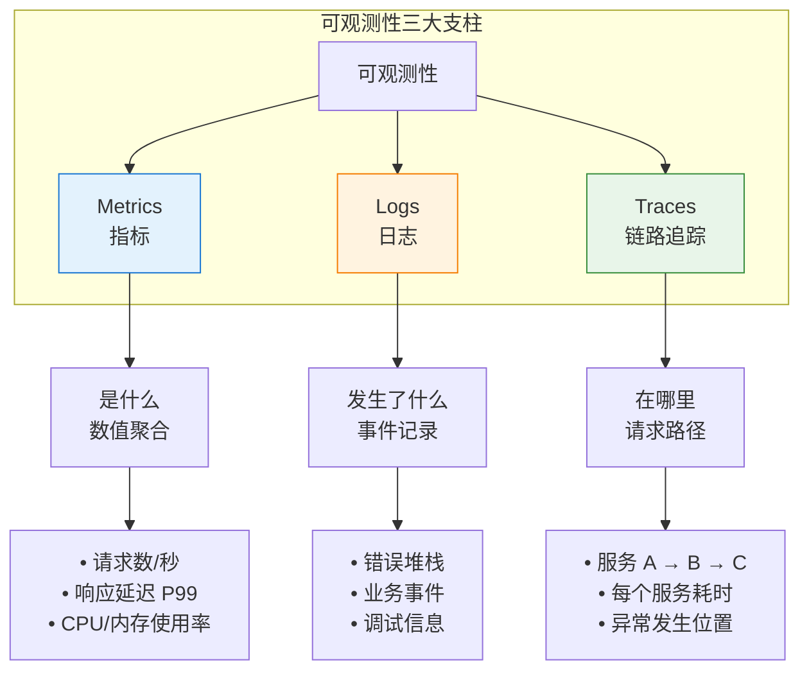
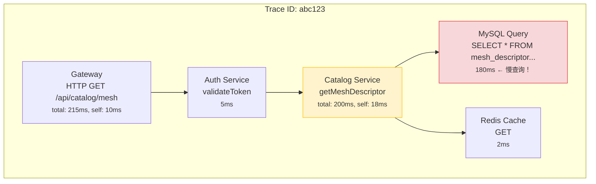
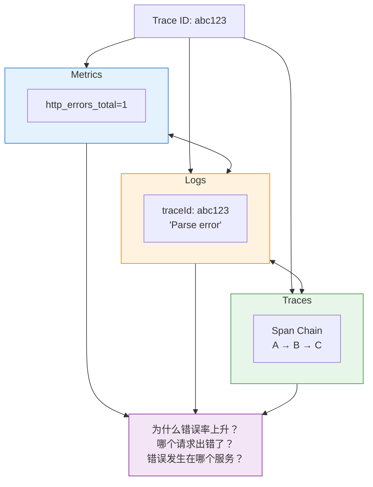

# 第一章：可观测性核心概念

> 本章学习目标：理解可观测性的本质、掌握三大支柱的定义与用途、理解信号关联的重要性

---

## 1.1 什么是可观测性？

### 定义

**可观测性（Observability）** 源自控制理论，定义为：

> "通过系统的外部输出，推断系统内部状态的能力"

简单来说：
- **监控（Monitoring）** 是被动的——告诉你"系统坏了"
- **可观测性（Observability）** 是主动的——帮你回答"为什么坏了"

### 监控 vs 可观测性

| 维度 | 监控（Monitoring） | 可观测性（Observability） |
|------|-------------------|--------------------------|
| **问题类型** | 已知问题（Known Unknowns） | 未知问题（Unknown Unknowns） |
| **方法** | 预定义阈值和告警 | 探索性数据分析 |
| **时机** | 事后响应 | 事中理解 + 事后分析 |
| **典型问题** | "CPU 超过 80%" | "为什么这个请求慢？" |

### 为什么需要可观测性？

在微服务架构中，一个请求可能经过 10+ 个服务。当出现问题时：


传统监控只能告诉你"Payment 服务超时"，但无法回答：
- 是 Payment 服务本身的问题，还是它依赖的数据库？
- 这个请求的完整路径是什么？
- 为什么只有部分用户受影响？

**可观测性**通过关联 Metrics、Logs、Traces 三种信号，让你能够回答这些问题。

---

## 1.2 三大支柱

可观测性由三大支柱组成，它们各有分工、相互补充：



---

### 1.2.1 Metrics（指标）

#### 定义

**Metrics** 是在一段时间内聚合的数值数据。

#### 特点

| 特点 | 说明 |
|------|------|
| **存储成本低** | 只存聚合值，不存原始数据 |
| **查询速度快** | 数值查询，无需全文搜索 |
| **适合告警** | 数值阈值判断简单直接 |
| **适合趋势分析** | 时间序列天然支持趋势图 |

#### 数据格式示例

```prometheus
# 请求总数（累计值）
http_requests_total{method="GET", path="/api/users", status="200"} 12345

# 响应延迟的 99 分位数
http_request_duration_seconds{quantile="0.99"} 0.234

# 当前活跃连接数
db_connections_active{pool="primary"} 42

# JVM 堆内存使用量
jvm_memory_used_bytes{area="heap"} 536870912
```

#### 回答的问题

- 系统现在的状态是什么？
- 过去一小时的请求量趋势？
- 当前错误率是多少？
- 哪个接口的响应时间最长？

---

### 1.2.2 Logs（日志）

#### 定义

**Logs** 是带时间戳的离散事件记录。

#### 特点

| 特点 | 说明 |
|------|------|
| **信息最丰富** | 可包含任意上下文信息 |
| **存储成本高** | 每条日志都要存储 |
| **适合调试** | 详细的错误信息和堆栈 |
| **适合审计** | 记录用户操作和系统事件 |

#### 数据格式示例

**非结构化日志**（传统格式）：
```
2025-11-28 10:30:45.123 ERROR [patra-catalog] - Failed to parse XML descriptor: Invalid UTF-8 sequence at line 42
```

**结构化日志**（推荐格式）：
```json
{
  "timestamp": "2025-11-28T10:30:45.123Z",
  "level": "ERROR",
  "service": "patra-catalog",
  "traceId": "abc123",
  "spanId": "def456",
  "logger": "com.patra.catalog.parser.XmlParser",
  "message": "Failed to parse XML descriptor",
  "error": {
    "type": "XmlParseException",
    "message": "Invalid UTF-8 sequence at line 42",
    "stackTrace": "..."
  },
  "context": {
    "fileName": "desc2025.xml",
    "fileSize": 1024000
  }
}
```

#### 回答的问题

- 具体发生了什么？
- 错误的详细信息是什么？
- 某个用户做了哪些操作？
- 这个 Bug 是什么时候开始出现的？

---

### 1.2.3 Traces（链路追踪）

#### 定义

**Traces** 是请求在分布式系统中的完整路径记录。

#### 核心概念

| 概念 | 说明 |
|------|------|
| **Trace** | 一个完整请求的全部信息，由多个 Span 组成 |
| **Span** | 一个操作/调用的信息（如一次 HTTP 请求、一次 DB 查询） |
| **Trace ID** | 全局唯一标识，贯穿整个请求链路 |
| **Span ID** | 当前操作的唯一标识 |
| **Parent Span ID** | 父操作的标识，形成调用树 |

#### 数据格式示例



> [!tip] 瓶颈定位
> 通过 Trace 可以清晰看到：Catalog Service 耗时 200ms，其中 MySQL 查询占用 180ms，是性能瓶颈的根因。

#### 回答的问题

- 这个请求经过了哪些服务？
- 延迟主要消耗在哪里？
- 错误是从哪个服务开始的？
- 服务之间的调用关系是什么？

---

## 1.3 信号之间的关联

三大支柱的**真正威力**在于它们可以**互相关联**。关联的核心是 **Trace ID**。

### 关联架构图



### 实际排查流程示例

**场景**：收到告警"Catalog 服务错误率超过 1%"

**Step 1: Metrics 发现问题**
```
在 Grafana 仪表盘看到：
- http_server_requests_seconds_count{status="500"} 突然上升
- 错误率从 0.1% 上升到 2.3%
- 时间点：10:30 左右
```

**Step 2: Logs 定位细节**
```
在 Loki 查询：
{app="patra-catalog"} |= "ERROR" | json

发现日志：
{
  "timestamp": "2025-11-28T10:30:45.123Z",
  "level": "ERROR",
  "traceId": "abc123",
  "message": "Failed to parse XML descriptor",
  "error": "Invalid UTF-8 sequence at line 42"
}
```

**Step 3: Traces 追溯路径**
```
在 Tempo 查询 traceId=abc123，发现：

Gateway → Catalog → XmlParser.parse() ← 错误发生位置
                         ↓
              错误详情：文件来自上游 Ingest 服务
```

**Step 4: 根因定位**
```
追溯到 Ingest 服务，发现：
- 10:25 有一批新数据入库
- 这批数据的 XML 编码有问题
- 根因：数据源提供了错误编码的文件
```

### Exemplar：从指标跳转到链路

**Exemplar（范例）** 是 Prometheus 的一个强大功能，可以在指标中嵌入 Trace ID：

```prometheus
# 普通指标
http_request_duration_seconds_bucket{le="0.5"} 1000

# 带 Exemplar 的指标（# 后面是 Exemplar）
http_request_duration_seconds_bucket{le="0.5"} 1000 # {traceID="abc123"} 0.48
```

**好处**：在 Grafana 中看到"响应时间突然变慢"时，可以一键跳转到那个慢请求的完整链路，无需手动查找。

---

## 1.4 小结

### 核心概念速查表

| 概念 | 定义 | 用途 |
|------|------|------|
| **可观测性** | 通过外部输出推断内部状态 | 回答"未知的未知" |
| **Metrics** | 聚合的数值数据 | 告警、趋势分析、容量规划 |
| **Logs** | 离散的事件记录 | 调试、审计、详细分析 |
| **Traces** | 请求的完整路径 | 定位瓶颈、理解依赖、根因分析 |
| **Trace ID** | 全局唯一请求标识 | 关联三种信号的纽带 |
| **Exemplar** | 指标中嵌入的 Trace ID | 从指标跳转到链路 |

### 三大支柱对比

| 维度 | Metrics | Logs | Traces |
|------|---------|------|--------|
| **数据类型** | 数值 | 文本/JSON | 结构化调用链 |
| **存储成本** | 低 | 高 | 中 |
| **查询速度** | 快 | 中（需索引） | 快（按 ID 查） |
| **信息密度** | 低（聚合） | 高（原始） | 中（结构化） |
| **最佳用途** | 告警、仪表盘 | 调试、审计 | 追踪、依赖分析 |

---

## 延伸阅读

- [OpenTelemetry Observability Primer](https://opentelemetry.io/docs/concepts/observability-primer/)
- [Google SRE Book - Monitoring Distributed Systems](https://sre.google/sre-book/monitoring-distributed-systems/)
- [The Future of Observability: Trends Shaping 2025](https://leapcell.medium.com/the-future-of-observability-trends-shaping-2025-427fc9d0cd34)

## 相关设计文档

- [[designs/observability/01-overview|设计文档：概述]] - 问题陈述、目标、术语表
- [[decisions/ADR-005-adopt-opentelemetry-grafana-stack-for-observability|ADR-005]] - 为什么选择 OTel + Grafana Stack

---

> **下一章**：[[02-metrics|第二章：Metrics（指标）]] - 深入学习指标类型、Micrometer API 和 Prometheus
