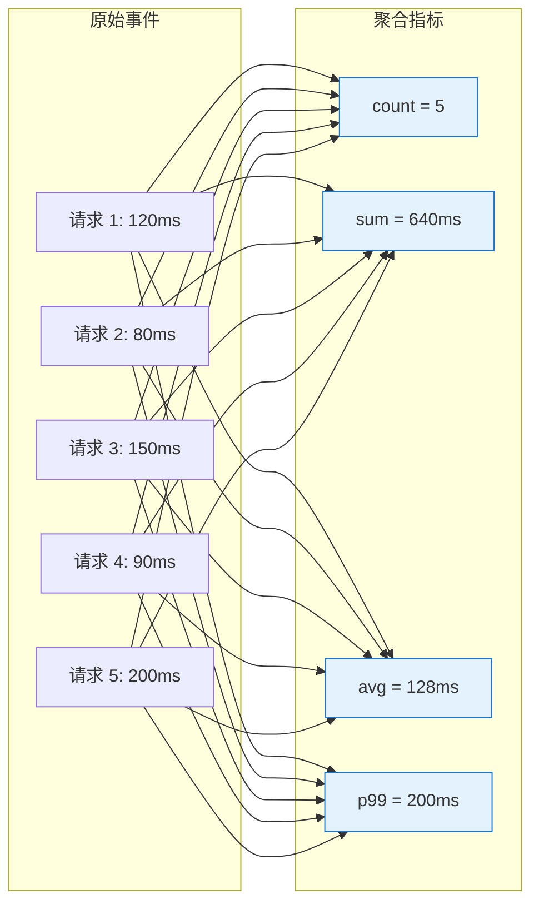
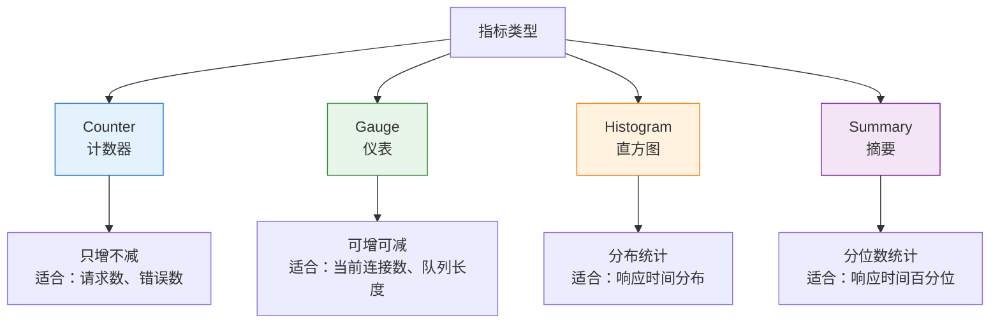
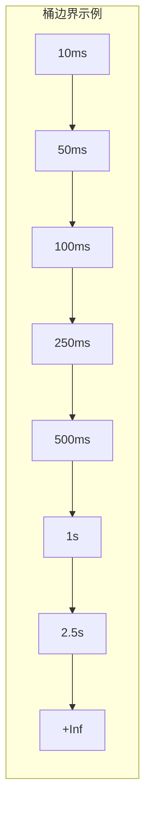
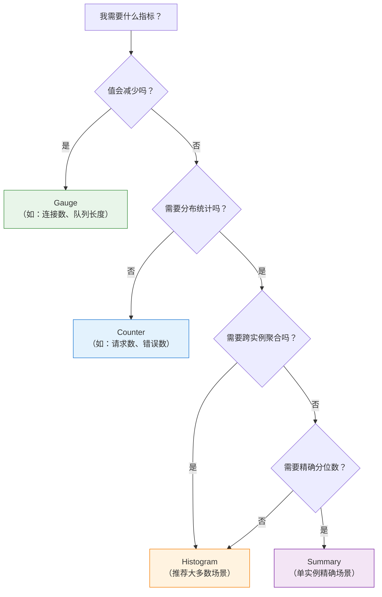
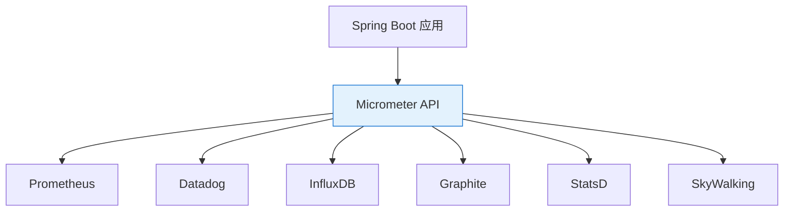
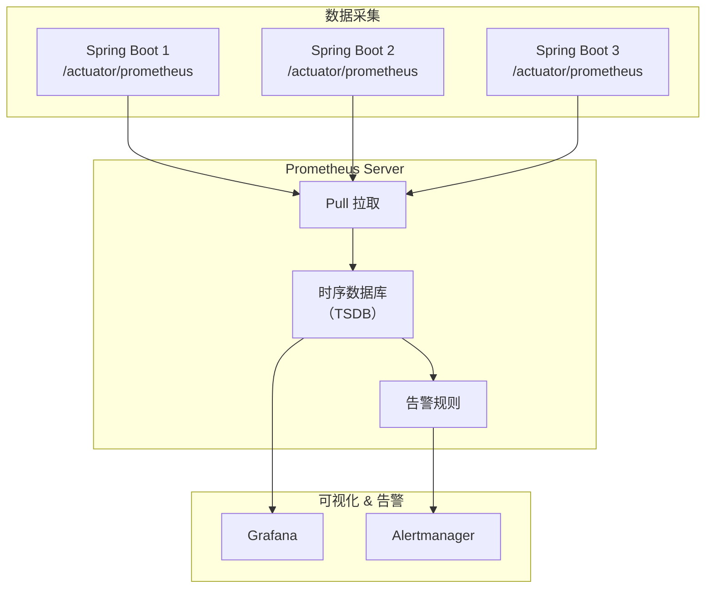

# 第二章：Metrics（指标）

> 本章学习目标：掌握四种指标类型的特点与适用场景、理解 Micrometer API 的使用、学会 Prometheus 的数据模型和 PromQL 查询、能够设计和实现自定义业务指标

---

## 2.1 指标基础

### 什么是指标（Metrics）？

**指标**是在一段时间内**聚合**的数值数据。与日志不同，指标不记录每个事件的详情，而是记录统计数据。



### 指标的优势

| 优势 | 说明 |
|------|------|
| **存储成本低** | 只存储聚合值，不存储原始数据 |
| **查询速度快** | 数值查询，无需全文搜索 |
| **适合告警** | 数值阈值判断简单直接 |
| **适合趋势分析** | 时间序列天然支持趋势图 |
| **低开销** | 应用运行时开销极小 |

### 指标的命名约定

Prometheus 风格的指标命名遵循以下约定：

```
{namespace}_{subsystem}_{name}_{unit}
```

| 组成部分 | 说明 | 示例 |
|----------|------|------|
| **namespace** | 应用或库名称 | `patra`、`http`、`jvm` |
| **subsystem** | 子系统或模块 | `catalog`、`server`、`memory` |
| **name** | 指标含义 | `requests`、`duration`、`used` |
| **unit** | 单位后缀 | `_total`、`_seconds`、`_bytes` |

> [!tip] 命名最佳实践
> - 使用蛇形命名法（snake_case）
> - Counter 类型以 `_total` 结尾
> - 时间单位使用秒（`_seconds`），大小使用字节（`_bytes`）
> - 避免使用 `rate`、`avg` 等聚合词（由查询时计算）

**示例**：

```prometheus
# 好的命名 ✅
http_server_requests_seconds_total
jvm_memory_used_bytes
patra_catalog_mesh_parse_duration_seconds

# 不好的命名 ❌
httpRequestCount          # 驼峰命名
request_rate_per_second   # 包含聚合词
latency                   # 缺少上下文和单位
```

---

## 2.2 四种指标类型

Prometheus / Micrometer 定义了四种核心指标类型，每种有其特定的用途：



---

### 2.2.1 Counter（计数器）

#### 定义

**Counter** 是一个**只增不减**的累计计数器。它只能增加或重置为 0（重启时）。

#### 使用场景

| 场景 | 示例指标 |
|------|----------|
| 请求总数 | `http_requests_total` |
| 错误总数 | `http_errors_total` |
| 处理的消息数 | `messages_processed_total` |
| 发送的字节数 | `bytes_sent_total` |

#### 数据示例

```prometheus
# 请求总数（带标签）
http_requests_total{method="GET", path="/api/users", status="200"} 12345
http_requests_total{method="POST", path="/api/users", status="201"} 678
http_requests_total{method="GET", path="/api/users", status="500"} 42

# 随时间的累计值
# t=0:   http_requests_total = 0
# t=10:  http_requests_total = 100
# t=20:  http_requests_total = 250
# t=30:  http_requests_total = 480
```

#### 如何使用

Counter 的**原始值通常没有意义**（因为是累计值），需要用 `rate()` 或 `increase()` 函数计算速率或增量：

```promql
# 每秒请求数（QPS）
rate(http_requests_total[5m])

# 5 分钟内的请求增量
increase(http_requests_total[5m])

# 错误率
rate(http_requests_total{status=~"5.."}[5m]) / rate(http_requests_total[5m])
```

#### Micrometer 代码示例

```java
import io.micrometer.core.instrument.Counter;
import io.micrometer.core.instrument.MeterRegistry;

@Service
public class MeshImportService {

    private final Counter importSuccessCounter;
    private final Counter importFailureCounter;

    public MeshImportService(MeterRegistry registry) {
        // 创建 Counter
        this.importSuccessCounter = Counter.builder("patra.mesh.import")
            .description("Number of mesh descriptor imports")
            .tag("status", "success")
            .register(registry);

        this.importFailureCounter = Counter.builder("patra.mesh.import")
            .tag("status", "failure")
            .register(registry);
    }

    public void importDescriptor(MeshDescriptor descriptor) {
        try {
            // 业务逻辑...
            importSuccessCounter.increment();  // 成功计数
        } catch (Exception e) {
            importFailureCounter.increment();  // 失败计数
            throw e;
        }
    }
}
```

> [!warning] Counter 陷阱
> - **永远不要用 Counter 记录可能减少的值**（如当前连接数）
> - Counter 重启后会重置为 0，使用 `rate()` 可以正确处理这种情况
> - 避免为每个请求创建新的 Counter（会导致标签爆炸）

---

### 2.2.2 Gauge（仪表）

#### 定义

**Gauge** 是一个**可增可减**的瞬时值，表示某个时间点的状态。

#### 使用场景

| 场景 | 示例指标 |
|------|----------|
| 当前活跃连接数 | `db_connections_active` |
| 队列长度 | `queue_size` |
| 内存使用量 | `jvm_memory_used_bytes` |
| CPU 使用率 | `process_cpu_usage` |
| 温度 | `room_temperature_celsius` |

#### 数据示例

```prometheus
# 数据库连接池状态
db_connections_active{pool="primary"} 42
db_connections_idle{pool="primary"} 8
db_connections_max{pool="primary"} 100

# JVM 内存
jvm_memory_used_bytes{area="heap"} 536870912
jvm_memory_max_bytes{area="heap"} 2147483648

# 随时间波动
# t=0:   db_connections_active = 42
# t=10:  db_connections_active = 55  （增加）
# t=20:  db_connections_active = 38  （减少）
# t=30:  db_connections_active = 61  （增加）
```

#### 如何使用

Gauge 的值可以直接使用，也可以进行聚合：

```promql
# 当前值
db_connections_active

# 平均连接数
avg_over_time(db_connections_active[5m])

# 最大连接数
max_over_time(db_connections_active[5m])

# 连接池使用率
db_connections_active / db_connections_max * 100
```

#### Micrometer 代码示例

```java
import io.micrometer.core.instrument.Gauge;
import io.micrometer.core.instrument.MeterRegistry;

@Service
public class TaskQueueService {

    private final Queue<Task> taskQueue = new ConcurrentLinkedQueue<>();

    public TaskQueueService(MeterRegistry registry) {
        // 方式一：通过 lambda 动态获取值
        Gauge.builder("patra.task.queue.size", taskQueue, Queue::size)
            .description("Current number of tasks in queue")
            .tag("queue", "default")
            .register(registry);

        // 方式二：绑定到一个 Number 对象
        AtomicInteger pendingTasks = new AtomicInteger(0);
        Gauge.builder("patra.task.pending", pendingTasks, AtomicInteger::get)
            .register(registry);
    }
}
```

> [!tip] Gauge vs Counter
> - 问自己："这个值会减少吗？"
>   - 是 → 使用 Gauge
>   - 否 → 使用 Counter
> - 例如："处理中的请求数"用 Gauge，"已处理的请求总数"用 Counter

---

### 2.2.3 Histogram（直方图）

#### 定义

**Histogram** 将观测值分配到**可配置的桶（bucket）**中，用于统计值的分布。

#### 核心概念

Histogram 会产生多个指标：

| 指标后缀 | 说明 |
|----------|------|
| `_bucket{le="X"}` | 小于等于 X 的观测值数量 |
| `_sum` | 所有观测值的总和 |
| `_count` | 观测值的总数 |

#### 使用场景

| 场景 | 为什么用 Histogram |
|------|-------------------|
| 请求延迟分布 | 需要知道"有多少请求在 100ms 以内" |
| 请求大小分布 | 需要知道"大部分请求体有多大" |
| 数据库查询时间 | 需要计算 P99、P95 等分位数 |

#### 数据示例

```prometheus
# HTTP 请求延迟直方图
# 桶：50ms, 100ms, 200ms, 500ms, 1s, +Inf
http_request_duration_seconds_bucket{le="0.05"} 24054    # ≤50ms 的请求数
http_request_duration_seconds_bucket{le="0.1"} 33444     # ≤100ms 的请求数
http_request_duration_seconds_bucket{le="0.2"} 100392    # ≤200ms 的请求数
http_request_duration_seconds_bucket{le="0.5"} 129389    # ≤500ms 的请求数
http_request_duration_seconds_bucket{le="1"} 133988      # ≤1s 的请求数
http_request_duration_seconds_bucket{le="+Inf"} 144320   # 所有请求数
http_request_duration_seconds_sum 53423.5                # 总耗时
http_request_duration_seconds_count 144320               # 总请求数
```

#### 如何使用

```promql
# 计算 P99（第 99 百分位）
histogram_quantile(0.99, rate(http_request_duration_seconds_bucket[5m]))

# 计算 P95
histogram_quantile(0.95, rate(http_request_duration_seconds_bucket[5m]))

# 计算平均延迟
rate(http_request_duration_seconds_sum[5m]) / rate(http_request_duration_seconds_count[5m])

# 超过 500ms 的请求比例
1 - (
  rate(http_request_duration_seconds_bucket{le="0.5"}[5m])
  /
  rate(http_request_duration_seconds_count[5m])
)
```

#### 桶边界的选择



> [!tip] 桶边界最佳实践
> - 使用指数增长的边界（如 10, 25, 50, 100, 250, 500, 1000...）
> - 确保覆盖预期的值范围
> - SLA 相关的边界要包含（如 SLA 是 500ms，确保有 500ms 的桶）
> - 太多的桶会增加存储成本

#### Micrometer 代码示例

```java
import io.micrometer.core.instrument.DistributionSummary;
import io.micrometer.core.instrument.Timer;
import io.micrometer.core.instrument.MeterRegistry;

@Service
public class XmlParserService {

    private final Timer parseTimer;
    private final DistributionSummary fileSizeDistribution;

    public XmlParserService(MeterRegistry registry) {
        // Timer 默认就是 Histogram 类型
        this.parseTimer = Timer.builder("patra.xml.parse.duration")
            .description("XML parsing duration")
            .publishPercentiles(0.5, 0.95, 0.99)       // 客户端计算分位数
            .publishPercentileHistogram()              // 服务端计算分位数（推荐）
            .serviceLevelObjectives(
                Duration.ofMillis(100),
                Duration.ofMillis(500),
                Duration.ofSeconds(1)
            )
            .register(registry);

        // 文件大小分布
        this.fileSizeDistribution = DistributionSummary.builder("patra.xml.file.size")
            .description("XML file size distribution")
            .baseUnit("bytes")
            .publishPercentileHistogram()
            .register(registry);
    }

    public MeshDescriptor parse(InputStream input, long fileSize) {
        fileSizeDistribution.record(fileSize);

        return parseTimer.record(() -> {
            // 解析逻辑...
            return doParse(input);
        });
    }
}
```

---

### 2.2.4 Summary（摘要）

#### 定义

**Summary** 类似于 Histogram，但它在**客户端**计算分位数，而不是在服务端。

#### Histogram vs Summary

| 维度 | Histogram | Summary |
|------|-----------|---------|
| **分位数计算** | 服务端（PromQL） | 客户端（应用内） |
| **可聚合** | ✅ 可以跨实例聚合 | ❌ 不能跨实例聚合 |
| **精确度** | 取决于桶边界 | 精确（但有内存成本） |
| **性能开销** | 低 | 较高 |
| **推荐场景** | 大多数场景 | 单实例、需要精确分位数 |

#### 数据示例

```prometheus
# Summary 产生的指标
http_request_duration_seconds{quantile="0.5"} 0.042    # P50
http_request_duration_seconds{quantile="0.9"} 0.12     # P90
http_request_duration_seconds{quantile="0.99"} 0.5     # P99
http_request_duration_seconds_sum 29623.5
http_request_duration_seconds_count 144320
```

> [!warning] Summary 的局限性
> - **不能跨实例聚合**：多个 Pod 的 P99 无法求平均
> - **分位数固定**：必须在代码中预定义，无法在查询时动态计算
> - **推荐优先使用 Histogram**，除非你的场景需要精确分位数且只有单实例

---

### 2.2.5 类型选择决策树



---

## 2.3 Micrometer：Spring Boot 指标 API

### 什么是 Micrometer？

**Micrometer** 是 Java 应用的**指标采集门面（Facade）**，类似于 SLF4J 之于日志。它提供统一的 API，支持多种监控后端：



### 核心组件

| 组件 | 说明 |
|------|------|
| **MeterRegistry** | 指标注册中心，所有指标都要注册到这里 |
| **Meter** | 指标的基类，包含 Counter、Gauge、Timer 等 |
| **Tag** | 指标的标签（维度），用于过滤和分组 |
| **Binder** | 自动注册一组相关指标的组件 |

### 常用 Meter 类型

| Micrometer 类型 | 对应 Prometheus 类型 | 用途 |
|-----------------|---------------------|------|
| `Counter` | Counter | 只增计数 |
| `Gauge` | Gauge | 瞬时值 |
| `Timer` | Histogram | 记录时间（带分布） |
| `DistributionSummary` | Histogram/Summary | 记录值分布 |
| `LongTaskTimer` | Gauge | 长任务计时 |
| `FunctionCounter` | Counter | 从函数获取计数 |
| `FunctionTimer` | Histogram | 从函数获取计时 |

### Timer 详解

`Timer` 是最常用的类型，用于记录操作耗时：

```java
@Service
public class CatalogService {

    private final Timer queryTimer;

    public CatalogService(MeterRegistry registry) {
        this.queryTimer = Timer.builder("patra.catalog.query")
            .description("Catalog query duration")
            .tag("type", "mesh")
            .register(registry);
    }

    /// 方式一：使用 record() + lambda
    public List<MeshDescriptor> queryByIds(List<Long> ids) {
        return queryTimer.record(() -> {
            return meshRepository.findByIds(ids);
        });
    }

    /// 方式二：使用 Sample（手动控制开始/结束）
    public MeshDescriptor queryById(Long id) {
        Timer.Sample sample = Timer.start();
        try {
            return meshRepository.findById(id);
        } finally {
            sample.stop(queryTimer);
        }
    }

    /// 方式三：使用 @Timed 注解（需要 AOP 支持）
    @Timed(value = "patra.catalog.query", extraTags = {"method", "findAll"})
    public List<MeshDescriptor> findAll() {
        return meshRepository.findAll();
    }
}
```

### 标签（Tags）最佳实践

标签用于给指标添加维度，允许按不同维度查询和聚合：

```java
// 好的标签使用 ✅
Counter.builder("http.requests")
    .tag("method", "GET")           // HTTP 方法
    .tag("path", "/api/users")      // 路径
    .tag("status", "200")           // 状态码
    .register(registry);

// 坏的标签使用 ❌
Counter.builder("http.requests")
    .tag("userId", userId)          // 高基数！用户 ID 可能有百万个
    .tag("requestId", uuid)         // 高基数！每个请求都不同
    .tag("timestamp", time)         // 完全错误！时间戳应该由指标自带
    .register(registry);
```

> [!danger] 高基数标签陷阱
> **标签的不同值组合 = 时间序列数量**
>
> 如果有 3 个标签，每个有 100 个不同的值：
> - 时间序列数 = 100 × 100 × 100 = **1,000,000**
>
> 这会导致：
> - Prometheus 内存爆炸
> - 查询性能严重下降
> - 存储成本剧增
>
> **原则**：单个指标的标签组合不应超过 **1000** 个

### 常用 Binder（自动指标）

Micrometer 提供了多个开箱即用的 Binder：

| Binder | 提供的指标 |
|--------|-----------|
| `JvmMemoryMetrics` | JVM 内存使用（堆、非堆） |
| `JvmGcMetrics` | GC 次数、耗时 |
| `JvmThreadMetrics` | 线程数、状态 |
| `ProcessorMetrics` | CPU 使用率 |
| `UptimeMetrics` | 应用运行时间 |
| `LogbackMetrics` | 日志级别计数 |
| `DataSourceMetrics` | 数据库连接池状态 |

Spring Boot Actuator 自动注册这些 Binder，无需手动配置。

---

## 2.4 Prometheus：时序数据库与 PromQL

### Prometheus 架构



### Pull vs Push 模型

Prometheus 使用 **Pull 模型**（主动拉取）：

| 模型 | Pull（Prometheus） | Push（如 StatsD） |
|------|-------------------|-------------------|
| **工作方式** | Prometheus 主动抓取 | 应用主动推送 |
| **服务发现** | 需要（知道去哪抓） | 不需要 |
| **高可用** | 多个 Prometheus 独立抓取 | 需要考虑推送失败 |
| **短生命周期任务** | 需要 Pushgateway | 原生支持 |

### 数据模型

Prometheus 的数据模型非常简单：

```
<metric_name>{<label_name>=<label_value>, ...} <value> [<timestamp>]
```

**示例**：

```prometheus
# 指标名：http_requests_total
# 标签：method, path, status
# 值：12345
# 时间戳：（可选，默认当前时间）

http_requests_total{method="GET", path="/api/users", status="200"} 12345
http_requests_total{method="POST", path="/api/users", status="201"} 678
http_requests_total{method="GET", path="/api/users", status="500"} 42
```

每个**唯一的标签组合**就是一个**时间序列（Time Series）**。

### PromQL 基础

PromQL（Prometheus Query Language）是 Prometheus 的查询语言。

#### 选择器（Selector）

```promql
# 精确匹配
http_requests_total{method="GET"}

# 正则匹配
http_requests_total{path=~"/api/.*"}

# 负向匹配
http_requests_total{status!="200"}

# 负向正则匹配
http_requests_total{path!~"/health.*"}
```

#### 范围向量（Range Vector）

```promql
# 最近 5 分钟的数据
http_requests_total[5m]

# 最近 1 小时的数据
http_requests_total[1h]

# 最近 1 天的数据
http_requests_total[1d]
```

#### 常用函数

| 函数 | 用途 | 示例 |
|------|------|------|
| `rate()` | 计算每秒速率 | `rate(http_requests_total[5m])` |
| `increase()` | 计算增量 | `increase(http_requests_total[1h])` |
| `sum()` | 求和 | `sum(http_requests_total)` |
| `avg()` | 平均值 | `avg(http_request_duration_seconds)` |
| `max()` / `min()` | 最大/最小值 | `max(memory_usage_bytes)` |
| `topk()` | 前 K 个 | `topk(5, http_requests_total)` |
| `histogram_quantile()` | 分位数 | `histogram_quantile(0.99, rate(...))` |

#### 聚合操作

```promql
# 按 path 聚合求和
sum by (path) (rate(http_requests_total[5m]))

# 按 method 和 status 聚合
sum by (method, status) (rate(http_requests_total[5m]))

# 忽略某些标签聚合
sum without (instance, pod) (rate(http_requests_total[5m]))
```

#### 常用查询示例

```promql
# 1. 每秒请求数（QPS）
rate(http_requests_total[5m])

# 2. 错误率
sum(rate(http_requests_total{status=~"5.."}[5m]))
/
sum(rate(http_requests_total[5m]))

# 3. P99 延迟
histogram_quantile(0.99,
  sum by (le) (rate(http_request_duration_seconds_bucket[5m]))
)

# 4. 平均延迟
rate(http_request_duration_seconds_sum[5m])
/
rate(http_request_duration_seconds_count[5m])

# 5. 最繁忙的 5 个接口
topk(5, sum by (path) (rate(http_requests_total[5m])))

# 6. 内存使用率
jvm_memory_used_bytes{area="heap"}
/
jvm_memory_max_bytes{area="heap"}
* 100

# 7. CPU 使用率（多核）
100 - (avg by (instance) (rate(process_cpu_seconds_total[5m])) * 100)
```

---

## 2.5 实践：设计业务指标

### 业务指标设计原则

#### RED 方法（面向服务）

| 指标 | 含义 | 示例 |
|------|------|------|
| **R**ate | 每秒请求数 | `rate(http_requests_total[5m])` |
| **E**rrors | 错误率 | `rate(http_errors_total[5m]) / rate(http_requests_total[5m])` |
| **D**uration | 请求耗时分布 | `histogram_quantile(0.99, ...)` |

#### USE 方法（面向资源）

| 指标 | 含义 | 示例 |
|------|------|------|
| **U**tilization | 资源使用率 | `db_connections_active / db_connections_max` |
| **S**aturation | 资源饱和度 | `queue_length` |
| **E**rrors | 资源错误 | `disk_errors_total` |

### Patra 项目业务指标示例

```java
@Configuration
public class PatraCatalogMetricsConfig {

    /// MeSH 描述符导入指标
    @Bean
    public MeshImportMetrics meshImportMetrics(MeterRegistry registry) {
        return new MeshImportMetrics(registry);
    }
}

@Component
@RequiredArgsConstructor
public class MeshImportMetrics {

    private final MeterRegistry registry;

    // Counter：导入成功/失败数
    private Counter importSuccess;
    private Counter importFailure;

    // Timer：导入耗时
    private Timer importDuration;

    // Gauge：待处理队列长度
    private AtomicInteger pendingImports = new AtomicInteger(0);

    // DistributionSummary：文件大小分布
    private DistributionSummary fileSizeDistribution;

    @PostConstruct
    void init() {
        // Counter
        this.importSuccess = Counter.builder("patra.mesh.import")
            .description("Number of mesh descriptor imports")
            .tag("status", "success")
            .register(registry);

        this.importFailure = Counter.builder("patra.mesh.import")
            .tag("status", "failure")
            .register(registry);

        // Timer with histogram
        this.importDuration = Timer.builder("patra.mesh.import.duration")
            .description("Time spent importing mesh descriptors")
            .publishPercentileHistogram()
            .serviceLevelObjectives(
                Duration.ofSeconds(1),
                Duration.ofSeconds(5),
                Duration.ofSeconds(30)
            )
            .register(registry);

        // Gauge
        Gauge.builder("patra.mesh.import.pending", pendingImports, AtomicInteger::get)
            .description("Number of pending mesh imports")
            .register(registry);

        // DistributionSummary
        this.fileSizeDistribution = DistributionSummary.builder("patra.mesh.file.size")
            .description("Size of imported mesh XML files")
            .baseUnit("bytes")
            .publishPercentileHistogram()
            .register(registry);
    }

    /// 记录导入开始
    public void recordImportStart() {
        pendingImports.incrementAndGet();
    }

    /// 记录导入成功
    public void recordImportSuccess(Duration duration, long fileSize) {
        pendingImports.decrementAndGet();
        importSuccess.increment();
        importDuration.record(duration);
        fileSizeDistribution.record(fileSize);
    }

    /// 记录导入失败
    public void recordImportFailure() {
        pendingImports.decrementAndGet();
        importFailure.increment();
    }
}
```

### 使用示例

```java
@Service
@RequiredArgsConstructor
public class MeshImportOrchestrator {

    private final MeshImportMetrics metrics;
    private final XmlParserPort xmlParser;
    private final MeshDescriptorRepository repository;

    public void importFromFile(Path filePath) {
        long fileSize = Files.size(filePath);
        metrics.recordImportStart();

        Instant start = Instant.now();
        try {
            MeshDescriptor descriptor = xmlParser.parse(filePath);
            repository.save(descriptor);

            Duration duration = Duration.between(start, Instant.now());
            metrics.recordImportSuccess(duration, fileSize);

        } catch (Exception e) {
            metrics.recordImportFailure();
            throw e;
        }
    }
}
```

---

## 2.6 小结

### 核心概念速查表

| 概念 | 定义 | 关键点 |
|------|------|--------|
| **Counter** | 只增不减的计数器 | 用 `rate()` 计算速率 |
| **Gauge** | 可增可减的瞬时值 | 直接使用或用 `avg_over_time()` |
| **Histogram** | 值分布统计（桶） | 用 `histogram_quantile()` 计算分位数 |
| **Summary** | 客户端分位数计算 | 不能跨实例聚合 |
| **Micrometer** | Java 指标采集门面 | 类似 SLF4J 的作用 |
| **Prometheus** | 时序数据库 | Pull 模型，PromQL 查询 |

### 类型选择速查

| 我想记录... | 使用类型 | 示例 |
|------------|----------|------|
| 请求总数 | Counter | `http_requests_total` |
| 错误总数 | Counter | `http_errors_total` |
| 当前连接数 | Gauge | `db_connections_active` |
| 队列长度 | Gauge | `queue_size` |
| 请求耗时 | Timer (Histogram) | `http_request_duration_seconds` |
| 文件大小 | DistributionSummary | `file_size_bytes` |

### 常见陷阱

| 陷阱 | 后果 | 避免方法 |
|------|------|----------|
| 高基数标签 | 内存爆炸 | 限制标签值的数量 |
| Counter 用于可变值 | 数据失真 | 可变值用 Gauge |
| Summary 跨实例聚合 | 错误结果 | 用 Histogram |
| 过多的桶边界 | 存储成本高 | 使用指数增长边界 |
| 忘记使用 `rate()` | 曲线断裂 | Counter 总是用 `rate()` |

---

## 延伸阅读

- [Prometheus Metric Types](https://prometheus.io/docs/concepts/metric_types/)
- [Micrometer Documentation](https://micrometer.io/docs)
- [PromQL Cheat Sheet](https://promlabs.com/promql-cheat-sheet/)
- [RED Method](https://grafana.com/blog/2018/08/02/the-red-method-how-to-instrument-your-services/)
- [USE Method](https://www.brendangregg.com/usemethod.html)

## 相关设计文档

- [[designs/observability/02-architecture|设计文档：架构设计]] - 整体架构、数据流
- [[designs/observability/03-starter-module|设计文档：Starter 模块]] - Micrometer 配置、MeterFilter

---

> **下一章**：[[03-logs|第三章：Logs（日志）]] - 学习结构化日志、Loki 查询语言 LogQL、日志与 Trace 关联
