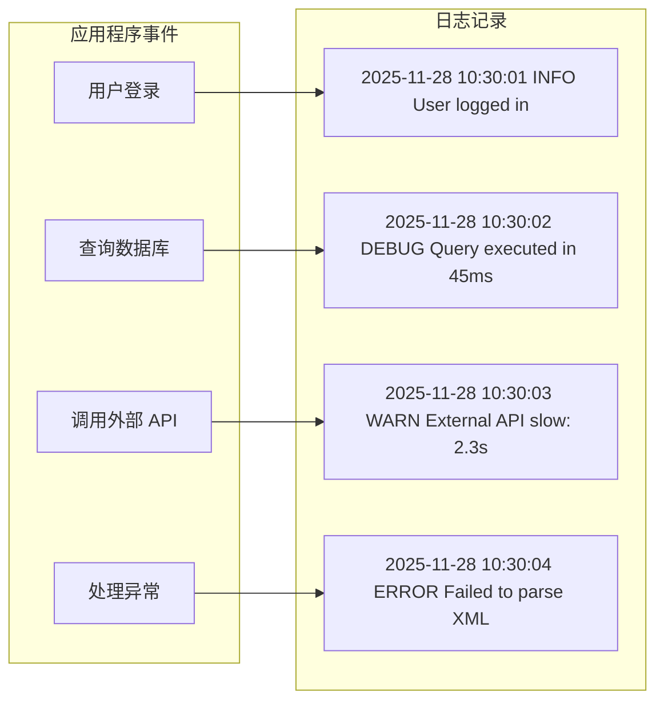
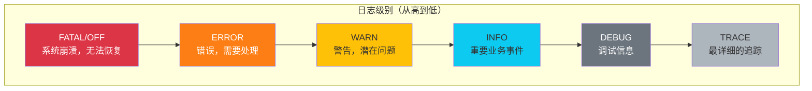
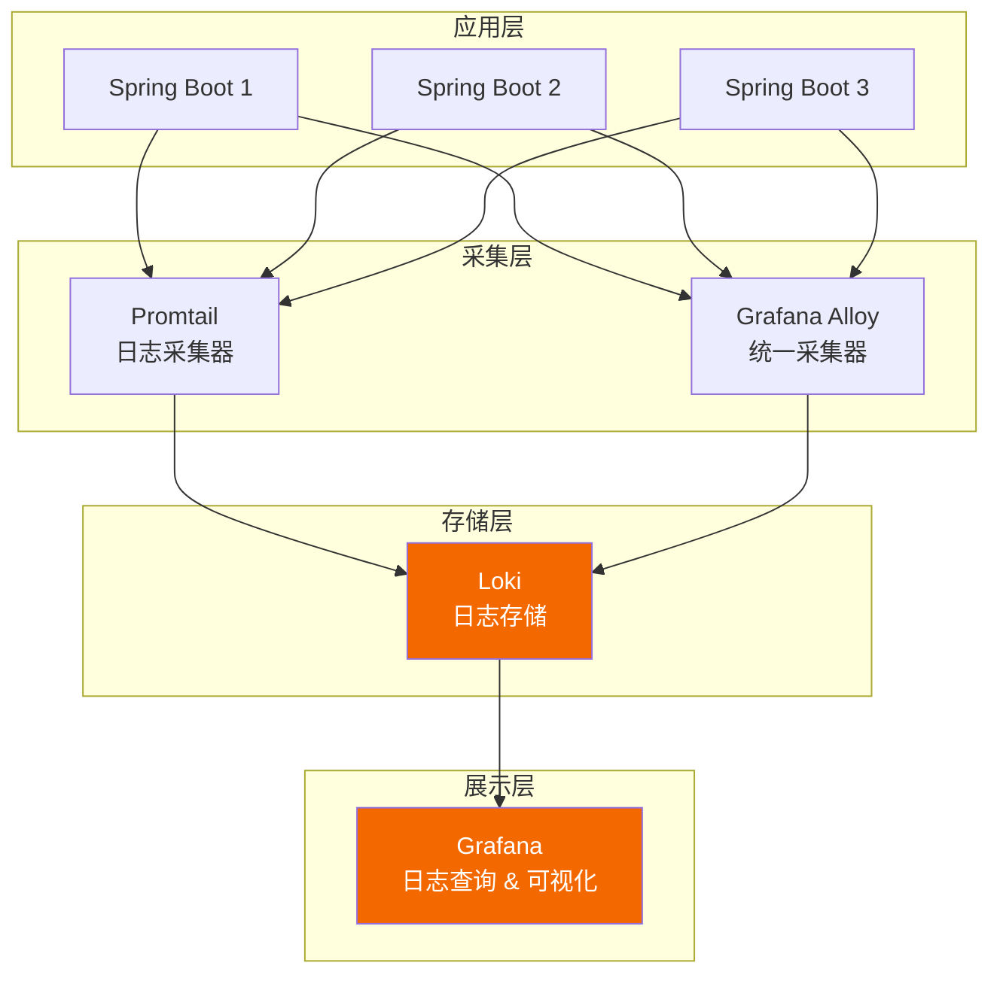
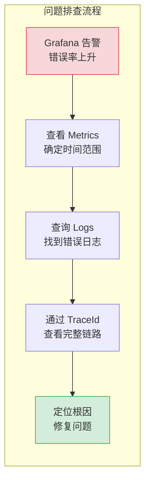
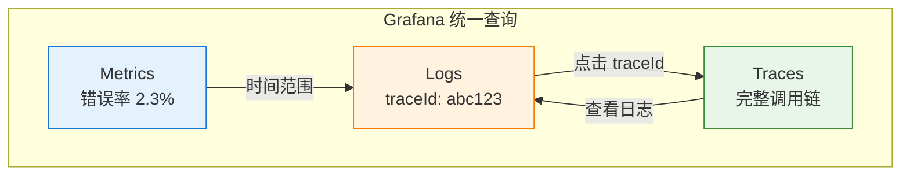

# 第三章：Logs（日志）

> 本章学习目标：理解结构化日志的优势、掌握日志级别的正确使用、学会 Loki 和 LogQL 查询、实现日志与 Trace 的关联

---

## 3.1 日志基础

### 什么是日志？

**日志（Logs）** 是应用程序运行过程中产生的**离散事件记录**。每条日志都是一个独立的事件，带有时间戳和上下文信息。



### 日志 vs 指标 vs 链路

| 维度 | Logs（日志） | Metrics（指标） | Traces（链路） |
|------|-------------|-----------------|----------------|
| **数据类型** | 文本/JSON | 数值 | 结构化调用链 |
| **粒度** | 每个事件 | 聚合统计 | 每个请求 |
| **存储成本** | 高 | 低 | 中 |
| **查询方式** | 全文/字段搜索 | 数值计算 | ID 查询 |
| **最佳用途** | 调试、审计 | 告警、仪表盘 | 追踪、依赖分析 |

### 日志的价值

| 场景 | 日志能做什么 |
|------|-------------|
| **调试问题** | 查看详细的错误信息和堆栈 |
| **安全审计** | 记录用户操作和系统事件 |
| **业务分析** | 统计用户行为和业务事件 |
| **合规要求** | 满足法规对日志保留的要求 |
| **根因分析** | 结合 Trace ID 追溯问题 |

---

## 3.2 结构化日志 vs 非结构化日志

### 非结构化日志（传统格式）

传统日志是**纯文本**格式，人类可读但机器难以解析：

```
2025-11-28 10:30:45.123 ERROR [patra-catalog] [http-nio-8080-exec-1] c.p.c.parser.XmlParser - Failed to parse XML descriptor: Invalid UTF-8 sequence at line 42, file=desc2025.xml, size=1024000
```

**问题**：
- 需要正则表达式解析
- 字段顺序固定，难以扩展
- 不同服务格式不一致
- 搜索效率低

### 结构化日志（推荐格式）

结构化日志使用 **JSON** 或其他机器可读格式：

```json
{
  "timestamp": "2025-11-28T10:30:45.123Z",
  "level": "ERROR",
  "logger": "com.patra.catalog.parser.XmlParser",
  "message": "Failed to parse XML descriptor",
  "service": "patra-catalog",
  "traceId": "abc123def456",
  "spanId": "789xyz",
  "thread": "http-nio-8080-exec-1",
  "error": {
    "type": "XmlParseException",
    "message": "Invalid UTF-8 sequence at line 42",
    "stackTrace": "com.patra.catalog.parser.XmlParser.parse(XmlParser.java:89)..."
  },
  "context": {
    "fileName": "desc2025.xml",
    "fileSize": 1024000,
    "userId": "user-123"
  }
}
```

**优势**：
- 字段可直接查询（如 `level=ERROR`）
- 易于扩展新字段
- 支持嵌套结构
- 跨服务格式统一

### 对比总结

| 维度 | 非结构化 | 结构化 |
|------|----------|--------|
| **可读性** | ✅ 人类友好 | ⚠️ 需要格式化 |
| **可解析** | ❌ 需正则 | ✅ 直接解析 |
| **查询效率** | ❌ 全文搜索 | ✅ 字段索引 |
| **扩展性** | ❌ 格式固定 | ✅ 随意添加字段 |
| **存储大小** | ✅ 较小 | ⚠️ JSON 开销 |

> [!tip] 最佳实践
> **生产环境使用结构化日志（JSON）**，开发环境可以同时输出人类可读格式。

---

## 3.3 日志级别

### 标准日志级别



### 各级别使用场景

| 级别 | 何时使用 | 示例 |
|------|----------|------|
| **ERROR** | 需要立即关注的错误 | 数据库连接失败、支付处理失败 |
| **WARN** | 潜在问题，但系统仍可运行 | 重试成功、降级服务启用 |
| **INFO** | 重要的业务事件 | 用户登录、订单创建、任务完成 |
| **DEBUG** | 开发调试信息 | 方法参数、中间状态、SQL 语句 |
| **TRACE** | 最详细的执行追踪 | 循环迭代、详细流程 |

### 日志级别最佳实践

```java
@Service
@Slf4j
public class MeshImportService {

    public void importDescriptor(Path filePath) {
        // TRACE：非常详细的追踪信息
        log.trace("Entering importDescriptor with path: {}", filePath);

        // DEBUG：调试信息，开发时有用
        log.debug("Reading file: {}, size: {} bytes", filePath, Files.size(filePath));

        try {
            MeshDescriptor descriptor = parse(filePath);

            // INFO：重要业务事件
            log.info("Successfully imported MeSH descriptor: id={}, name={}",
                descriptor.getId(), descriptor.getName());

        } catch (ValidationException e) {
            // WARN：可以恢复的问题
            log.warn("Validation warning for file {}: {}", filePath, e.getMessage());
            // 继续处理...

        } catch (ParseException e) {
            // ERROR：需要关注的错误
            log.error("Failed to parse MeSH descriptor from file: {}", filePath, e);
            throw e;
        }
    }
}
```

### 日志级别配置

```yaml
# application.yml
logging:
  level:
    root: INFO                                    # 默认 INFO
    com.patra: DEBUG                              # 项目代码 DEBUG
    com.patra.catalog.parser: TRACE               # 特定包 TRACE
    org.springframework: WARN                     # Spring 框架 WARN
    org.hibernate.SQL: DEBUG                      # 显示 SQL
    org.hibernate.type.descriptor.sql: TRACE     # 显示 SQL 参数
```

> [!warning] 生产环境注意事项
> - **不要在生产环境启用 DEBUG/TRACE**：日志量巨大，影响性能
> - **敏感数据不要记录**：密码、token、信用卡号等
> - **考虑日志采样**：高流量场景下按比例记录

---

## 3.4 Logback 配置（Spring Boot）

### 基础配置

Spring Boot 默认使用 Logback。创建 `logback-spring.xml`：

```xml
<?xml version="1.0" encoding="UTF-8"?>
<configuration>

    <!-- 从 Spring 环境获取变量 -->
    <springProperty name="APP_NAME" source="spring.application.name" defaultValue="app"/>
    <springProperty name="LOG_PATH" source="logging.file.path" defaultValue="./logs"/>

    <!-- 控制台输出（开发环境） -->
    <appender name="CONSOLE" class="ch.qos.logback.core.ConsoleAppender">
        <encoder>
            <pattern>%d{HH:mm:ss.SSS} %highlight(%-5level) [%thread] %cyan(%logger{36}) - %msg%n</pattern>
        </encoder>
    </appender>

    <!-- JSON 格式输出（生产环境） -->
    <appender name="JSON" class="ch.qos.logback.core.ConsoleAppender">
        <encoder class="net.logstash.logback.encoder.LogstashEncoder">
            <includeMdcKeyName>traceId</includeMdcKeyName>
            <includeMdcKeyName>spanId</includeMdcKeyName>
            <customFields>{"service":"${APP_NAME}"}</customFields>
        </encoder>
    </appender>

    <!-- 文件输出（滚动） -->
    <appender name="FILE" class="ch.qos.logback.core.rolling.RollingFileAppender">
        <file>${LOG_PATH}/${APP_NAME}.log</file>
        <rollingPolicy class="ch.qos.logback.core.rolling.SizeAndTimeBasedRollingPolicy">
            <fileNamePattern>${LOG_PATH}/${APP_NAME}.%d{yyyy-MM-dd}.%i.log.gz</fileNamePattern>
            <maxFileSize>100MB</maxFileSize>
            <maxHistory>30</maxHistory>
            <totalSizeCap>3GB</totalSizeCap>
        </rollingPolicy>
        <encoder class="net.logstash.logback.encoder.LogstashEncoder"/>
    </appender>

    <!-- 开发环境：控制台 -->
    <springProfile name="dev,local">
        <root level="INFO">
            <appender-ref ref="CONSOLE"/>
        </root>
        <logger name="com.patra" level="DEBUG"/>
    </springProfile>

    <!-- 生产环境：JSON + 文件 -->
    <springProfile name="prod">
        <root level="INFO">
            <appender-ref ref="JSON"/>
            <appender-ref ref="FILE"/>
        </root>
    </springProfile>

</configuration>
```

### JSON 日志输出示例

使用 `LogstashEncoder` 后的输出：

```json
{
  "@timestamp": "2025-11-28T10:30:45.123+08:00",
  "@version": "1",
  "message": "Successfully imported MeSH descriptor",
  "logger_name": "com.patra.catalog.MeshImportService",
  "thread_name": "http-nio-8080-exec-1",
  "level": "INFO",
  "level_value": 20000,
  "service": "patra-catalog",
  "traceId": "abc123def456",
  "spanId": "789xyz",
  "descriptorId": "D001",
  "descriptorName": "Cardiovascular Diseases"
}
```

### 添加自定义字段

```java
import org.slf4j.MDC;
import net.logstash.logback.argument.StructuredArguments;
import static net.logstash.logback.argument.StructuredArguments.*;

@Service
@Slf4j
public class MeshImportService {

    public void importDescriptor(MeshDescriptor descriptor) {
        // 方式一：使用 MDC（会添加到所有后续日志）
        MDC.put("descriptorId", descriptor.getId());
        try {
            // 业务逻辑...

            // 方式二：使用 StructuredArguments（只添加到当前日志）
            log.info("Imported descriptor: {}",
                keyValue("descriptor", Map.of(
                    "id", descriptor.getId(),
                    "name", descriptor.getName(),
                    "treeNumbers", descriptor.getTreeNumbers().size()
                ))
            );
        } finally {
            MDC.remove("descriptorId");
        }
    }
}
```

---

## 3.5 Loki：轻量级日志聚合

### Loki 是什么？

**Loki** 是 Grafana Labs 开发的日志聚合系统，设计理念是"像 Prometheus，但用于日志"。



### Loki vs ELK

| 维度 | Loki | ELK (Elasticsearch) |
|------|------|---------------------|
| **索引策略** | 只索引标签（元数据） | 全文索引 |
| **存储成本** | 低（压缩存储原文） | 高（索引 + 原文） |
| **内存需求** | 低（~1GB 起步） | 高（~4GB 起步） |
| **查询能力** | 标签过滤 + 全文搜索 | 强大的全文搜索 |
| **运维复杂度** | 低（单二进制） | 高（多组件） |
| **最佳场景** | 云原生、Kubernetes | 大规模、复杂搜索 |

> [!tip] 为什么选择 Loki？
> - **轻量级**：资源占用是 ELK 的 1/10
> - **Grafana 原生集成**：与 Metrics/Traces 统一查询
> - **成本效益**：个人/小团队的最佳选择
> - **Prometheus 风格**：熟悉 PromQL 就能快速上手 LogQL

### Loki 核心概念

| 概念 | 说明 | 示例 |
|------|------|------|
| **Stream** | 具有相同标签集的日志流 | `{app="patra-catalog", env="prod"}` |
| **Label** | 用于索引和查询的键值对 | `app`, `env`, `level`, `host` |
| **Chunk** | 日志数据的存储单元 | 压缩的日志块 |
| **Index** | 标签到 Chunk 的映射 | 仅索引标签，不索引内容 |

### 日志采集方式

#### 方式一：Promtail（传统文件采集）

```yaml
# promtail-config.yaml
server:
  http_listen_port: 9080

positions:
  filename: /tmp/positions.yaml

clients:
  - url: http://loki:3100/loki/api/v1/push

scrape_configs:
  - job_name: patra-logs
    static_configs:
      - targets:
          - localhost
        labels:
          job: patra
          __path__: /var/log/patra/*.log
    pipeline_stages:
      - json:
          expressions:
            level: level
            service: service
            traceId: traceId
      - labels:
          level:
          service:
```

#### 方式二：Loki4j（直接推送，推荐）

无需 Promtail，应用直接推送到 Loki：

```xml
<!-- pom.xml -->
<dependency>
    <groupId>com.github.loki4j</groupId>
    <artifactId>loki-logback-appender</artifactId>
    <version>1.5.1</version>
</dependency>
```

```xml
<!-- logback-spring.xml -->
<appender name="LOKI" class="com.github.loki4j.logback.Loki4jAppender">
    <http>
        <url>http://loki:3100/loki/api/v1/push</url>
    </http>
    <format>
        <label>
            <pattern>app=${APP_NAME},host=${HOSTNAME},level=%level</pattern>
        </label>
        <message class="com.github.loki4j.logback.JsonLayout">
            <customFields>{"service":"${APP_NAME}"}</customFields>
        </message>
    </format>
</appender>

<root level="INFO">
    <appender-ref ref="CONSOLE"/>
    <appender-ref ref="LOKI"/>
</root>
```

#### 方式三：OpenTelemetry Collector（统一采集）

```yaml
# otel-collector-config.yaml
receivers:
  otlp:
    protocols:
      grpc:
        endpoint: 0.0.0.0:4317

exporters:
  loki:
    endpoint: http://loki:3100/loki/api/v1/push
    labels:
      attributes:
        service.name: "service"
        level: "level"

service:
  pipelines:
    logs:
      receivers: [otlp]
      exporters: [loki]
```

---

## 3.6 LogQL：Loki 查询语言

### 基础语法

LogQL 的基本结构：

```
{<label-selector>} |<filter> |<parser> |<format>
```

### 标签选择器（Stream Selector）

```logql
# 精确匹配
{app="patra-catalog"}

# 正则匹配
{app=~"patra-.*"}

# 多标签
{app="patra-catalog", env="prod"}

# 排除
{app="patra-catalog", level!="DEBUG"}
```

### 日志过滤（Line Filter）

```logql
# 包含字符串
{app="patra-catalog"} |= "error"

# 不包含字符串
{app="patra-catalog"} != "health"

# 正则匹配
{app="patra-catalog"} |~ "user-[0-9]+"

# 不匹配正则
{app="patra-catalog"} !~ "DEBUG|TRACE"

# 组合过滤
{app="patra-catalog"} |= "error" != "timeout" |~ "user-.*"
```

### JSON 解析

```logql
# 解析 JSON 字段
{app="patra-catalog"} | json

# 解析后过滤
{app="patra-catalog"} | json | level="ERROR"

# 解析特定字段
{app="patra-catalog"} | json traceId="traceId", userId="context.userId"

# 解析后格式化输出
{app="patra-catalog"} | json | line_format "{{.level}} - {{.message}}"
```

### 聚合函数（Metric Queries）

LogQL 可以将日志转换为指标：

```logql
# 每秒日志行数（QPS）
rate({app="patra-catalog"}[5m])

# 每分钟错误数
count_over_time({app="patra-catalog", level="ERROR"}[1m])

# 按 level 分组统计
sum by (level) (count_over_time({app="patra-catalog"}[5m]))

# 按服务统计错误率
sum(rate({level="ERROR"}[5m])) by (app)
/
sum(rate({}[5m])) by (app)
```

### 常用查询示例

```logql
# 1. 查看最近的错误日志
{app="patra-catalog", level="ERROR"} | json

# 2. 搜索包含特定 traceId 的日志
{app=~"patra-.*"} |= "abc123def456"

# 3. 查看特定用户的操作日志
{app="patra-catalog"} | json | context_userId="user-123"

# 4. 统计各服务的错误数
sum by (app) (count_over_time({level="ERROR"}[1h]))

# 5. 查找慢查询日志（解析耗时字段）
{app="patra-catalog"} | json | duration > 1000

# 6. 查看异常堆栈
{app="patra-catalog", level="ERROR"} | json | line_format "{{.message}}\n{{.error_stackTrace}}"

# 7. 最近 1 小时每分钟的日志量趋势
sum(count_over_time({app="patra-catalog"}[1m])) by (level)
```

### LogQL vs PromQL 对比

| 操作 | LogQL | PromQL |
|------|-------|--------|
| 选择 | `{app="xxx"}` | `metric{app="xxx"}` |
| 速率 | `rate({...}[5m])` | `rate(metric[5m])` |
| 求和 | `sum by (x) (...)` | `sum by (x) (...)` |
| 计数 | `count_over_time(...)` | `count(...)` |
| 过滤 | `\|= "error"` | `{status=~"5.."}` |

---

## 3.7 日志与 Trace 关联

### 为什么需要关联？



关联的核心是 **Trace ID**，它贯穿整个请求的所有日志和链路数据。

### 实现方式

#### Step 1：配置 MDC（Mapped Diagnostic Context）

OpenTelemetry 自动将 Trace ID 注入 MDC：

```xml
<!-- logback-spring.xml -->
<encoder class="net.logstash.logback.encoder.LogstashEncoder">
    <!-- 包含 MDC 中的 traceId 和 spanId -->
    <includeMdcKeyName>traceId</includeMdcKeyName>
    <includeMdcKeyName>spanId</includeMdcKeyName>
</encoder>
```

或使用 pattern：

```xml
<pattern>%d{HH:mm:ss.SSS} [%X{traceId:-},%X{spanId:-}] %-5level %logger{36} - %msg%n</pattern>
```

#### Step 2：日志输出示例

```json
{
  "@timestamp": "2025-11-28T10:30:45.123Z",
  "level": "ERROR",
  "message": "Failed to parse XML descriptor",
  "traceId": "abc123def456789",
  "spanId": "xyz789",
  "service": "patra-catalog"
}
```

#### Step 3：在 Grafana 中关联查询

**从日志跳转到链路**：

```logql
# 在 Loki 中查询
{app="patra-catalog", level="ERROR"} | json

# 找到 traceId 后，在 Tempo 中查询
# Grafana 支持点击 traceId 直接跳转
```

**从链路跳转到日志**：

```logql
# 在 Tempo 中找到问题 Trace 后
# 用 traceId 查询相关日志
{app=~"patra-.*"} |= "abc123def456789"
```

### Grafana 数据源关联配置

```yaml
# grafana/provisioning/datasources/datasources.yaml
apiVersion: 1
datasources:
  - name: Loki
    type: loki
    url: http://loki:3100
    jsonData:
      derivedFields:
        - datasourceUid: tempo
          matcherRegex: '"traceId":"(\w+)"'
          name: TraceID
          url: '$${__value.raw}'

  - name: Tempo
    type: tempo
    url: http://tempo:3200
    uid: tempo
    jsonData:
      tracesToLogs:
        datasourceUid: loki
        tags: ['app', 'service']
        mappedTags: [{ key: 'service.name', value: 'app' }]
        mapTagNamesEnabled: true
        spanStartTimeShift: '-1h'
        spanEndTimeShift: '1h'
        filterByTraceID: true
        filterBySpanID: false
```

### 关联效果



---

## 3.8 日志最佳实践

### DO（推荐做法）

```java
// ✅ 使用参数化日志（避免字符串拼接）
log.info("Processing descriptor: id={}, name={}", descriptor.getId(), descriptor.getName());

// ✅ 记录业务上下文
log.info("Order created: orderId={}, userId={}, amount={}",
    order.getId(), order.getUserId(), order.getAmount());

// ✅ 异常日志包含完整堆栈
log.error("Failed to process order: orderId={}", orderId, exception);

// ✅ 使用 MDC 添加请求上下文
MDC.put("requestId", requestId);
try {
    // 业务逻辑...
} finally {
    MDC.clear();
}

// ✅ 结构化日志字段
log.info("Import completed: {}",
    keyValue("result", Map.of(
        "total", 1000,
        "success", 995,
        "failed", 5,
        "duration", "45s"
    )));
```

### DON'T（避免做法）

```java
// ❌ 字符串拼接（性能差）
log.debug("Processing " + descriptor.getId() + " with name " + descriptor.getName());

// ❌ 敏感信息
log.info("User login: username={}, password={}", username, password);

// ❌ 循环内大量日志
for (int i = 0; i < 10000; i++) {
    log.debug("Processing item {}", i);  // 10000 条日志！
}

// ❌ 无上下文的日志
log.error("Error occurred");  // 什么错误？在哪里？

// ❌ 忘记判断日志级别（复杂对象）
log.debug("Full object: {}", expensiveObject.toDetailedString());
// 应该：
if (log.isDebugEnabled()) {
    log.debug("Full object: {}", expensiveObject.toDetailedString());
}
```

### 日志级别使用指南

| 场景 | 推荐级别 | 说明 |
|------|----------|------|
| 系统启动/关闭 | INFO | 重要生命周期事件 |
| 配置加载 | INFO/DEBUG | INFO 记录关键配置，DEBUG 记录全部 |
| 请求入口/出口 | DEBUG | 避免 INFO 造成日志过多 |
| 业务关键节点 | INFO | 订单创建、支付成功等 |
| 外部调用 | DEBUG | 记录请求/响应摘要 |
| 重试成功 | WARN | 虽然成功但有隐患 |
| 业务异常 | WARN | 可预期的业务错误 |
| 系统异常 | ERROR | 需要关注的技术错误 |
| 性能警告 | WARN | 慢查询、超时等 |

---

## 3.9 小结

### 核心概念速查表

| 概念 | 定义 | 关键点 |
|------|------|--------|
| **结构化日志** | JSON 格式的日志 | 字段可查询，易解析 |
| **日志级别** | ERROR/WARN/INFO/DEBUG/TRACE | 生产环境用 INFO |
| **Loki** | 轻量级日志聚合 | 只索引标签，低成本 |
| **LogQL** | Loki 查询语言 | 类似 PromQL |
| **MDC** | 线程上下文 | 存储 traceId 等 |
| **日志关联** | 通过 Trace ID 关联 | 从日志跳转到链路 |

### 日志配置检查清单

- [ ] 使用结构化日志（JSON 格式）
- [ ] 配置合适的日志级别（生产环境 INFO）
- [ ] 日志包含 traceId 和 spanId
- [ ] 敏感信息已脱敏
- [ ] 配置日志轮转（避免磁盘写满）
- [ ] 关键业务事件有日志记录
- [ ] 异常日志包含堆栈信息

### LogQL 速查

| 操作 | 语法 | 示例 |
|------|------|------|
| 选择流 | `{label="value"}` | `{app="patra"}` |
| 包含 | `\|= "text"` | `\|= "error"` |
| 不包含 | `!= "text"` | `!= "health"` |
| 正则 | `\|~ "regex"` | `\|~ "user-[0-9]+"` |
| JSON 解析 | `\| json` | `\| json \| level="ERROR"` |
| 速率 | `rate(...[5m])` | `rate({app="x"}[5m])` |
| 计数 | `count_over_time(...)` | `count_over_time({...}[1m])` |

---

## 延伸阅读

- [Grafana Loki Documentation](https://grafana.com/docs/loki/latest/)
- [LogQL Query Examples](https://grafana.com/docs/loki/latest/logql/)
- [Structured Logging Best Practices](https://www.baeldung.com/java-structured-logging)
- [The Twelve-Factor App - Logs](https://12factor.net/logs)

## 相关设计文档

- [[designs/observability/04-otel-integration|设计文档：OTel 集成]] - Logback OTLP Appender 配置、日志与 Trace 关联
- [[designs/observability/05-infrastructure|设计文档：基础设施]] - Loki 部署配置

---

> **下一章**：[[04-traces|第四章：Traces（链路追踪）]] - 学习 OpenTelemetry 核心概念、Span 生命周期、Context Propagation
