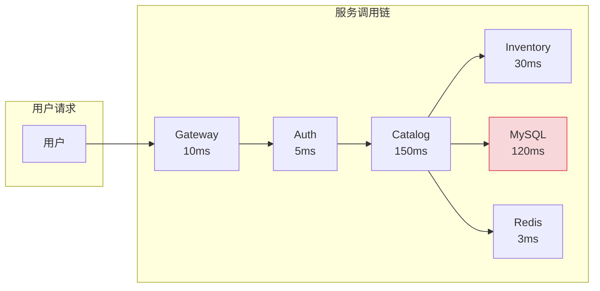
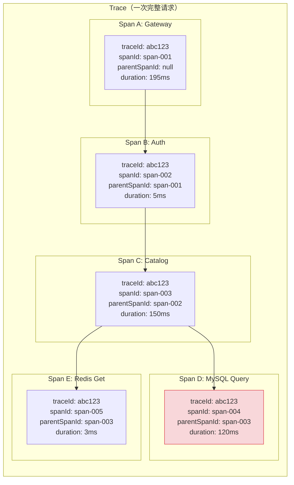
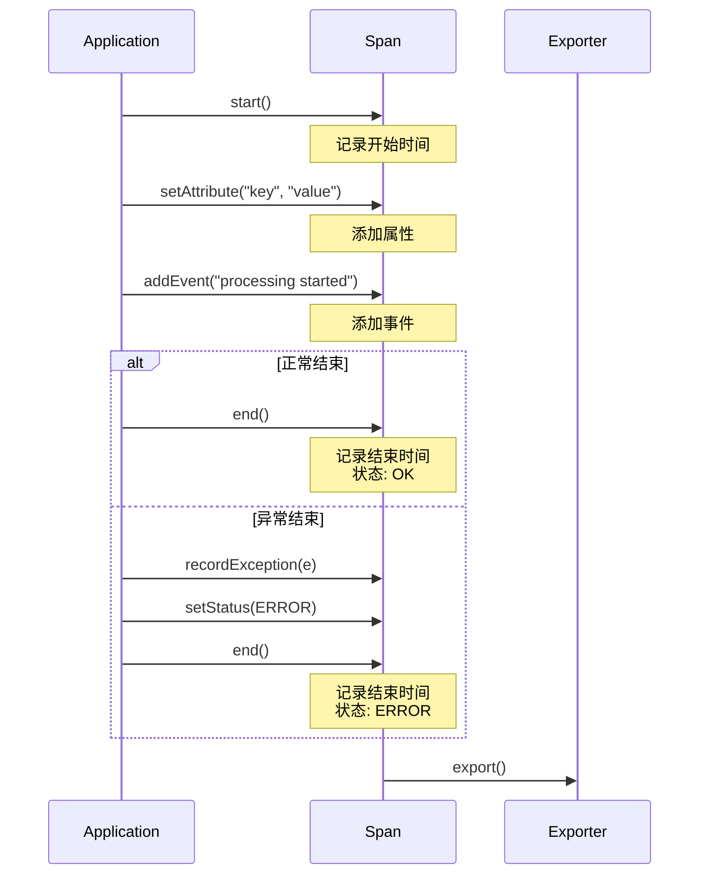
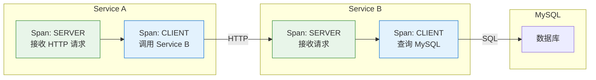
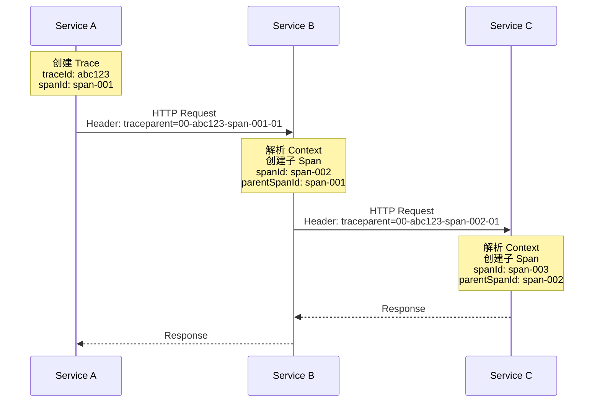
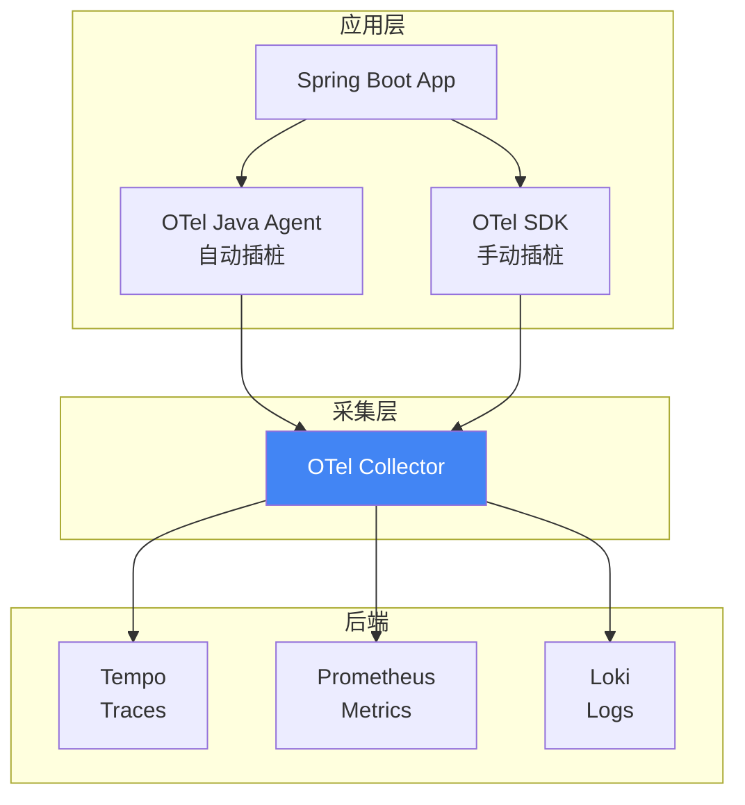
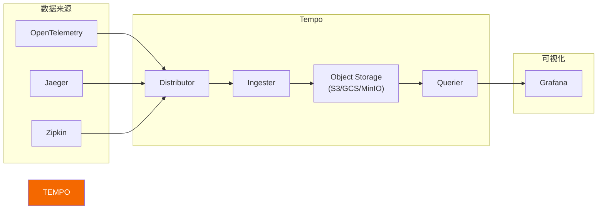
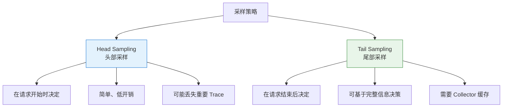
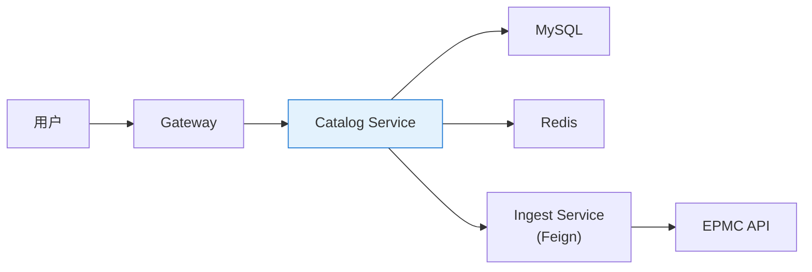

# 第四章：Traces（链路追踪）

> 本章学习目标：理解分布式追踪的核心概念、掌握 OpenTelemetry 的 Trace 模型、学会 Context Propagation 原理、能够在 Spring Boot 中配置和使用追踪

---

## 4.1 为什么需要分布式追踪？

### 微服务带来的挑战

在单体应用中，一个请求的完整执行路径在一个进程内，可以通过堆栈信息追踪。但在微服务架构中：



**问题**：
- 请求跨越多个服务，日志分散在不同地方
- 无法知道总延迟 195ms 中，哪个服务最慢
- 错误发生时，难以确定是哪个服务引起的
- 服务之间的依赖关系不清晰

### 分布式追踪解决什么？

| 问题 | 追踪如何解决 |
|------|-------------|
| 请求路径不清晰 | 完整记录请求经过的所有服务 |
| 性能瓶颈难定位 | 每个服务/操作的耗时都被记录 |
| 错误难以追溯 | 错误发生的位置和上下文一目了然 |
| 依赖关系模糊 | 可视化服务拓扑图 |

---

## 4.2 核心概念

### Trace、Span、SpanContext



### 概念定义

| 概念 | 定义 | 类比 |
|------|------|------|
| **Trace** | 一个请求的完整执行记录，由多个 Span 组成 | 一次完整的旅程 |
| **Span** | 一个操作/调用的信息单元 | 旅程中的一段行程 |
| **Trace ID** | 全局唯一标识，贯穿整个请求 | 旅程的订单号 |
| **Span ID** | 当前操作的唯一标识 | 每段行程的票号 |
| **Parent Span ID** | 父操作的标识，形成调用树 | 上一段行程的票号 |
| **SpanContext** | Span 的不可变上下文（Trace ID + Span ID + Flags） | 行程单据 |

### Span 的生命周期



### Span 的数据模型

一个 Span 包含以下信息：

```json
{
  "traceId": "abc123def456789012345678",
  "spanId": "span-003",
  "parentSpanId": "span-002",
  "operationName": "HTTP GET /api/catalog/mesh",
  "serviceName": "patra-catalog",
  "startTime": "2025-11-28T10:30:45.123Z",
  "endTime": "2025-11-28T10:30:45.273Z",
  "duration": "150ms",
  "status": {
    "code": "OK"
  },
  "attributes": {
    "http.method": "GET",
    "http.url": "/api/catalog/mesh/D001",
    "http.status_code": 200,
    "http.user_agent": "Mozilla/5.0...",
    "db.system": "mysql",
    "db.statement": "SELECT * FROM mesh_descriptor WHERE id = ?"
  },
  "events": [
    {
      "name": "cache.miss",
      "timestamp": "2025-11-28T10:30:45.130Z",
      "attributes": {
        "cache.key": "mesh:D001"
      }
    }
  ],
  "links": []
}
```

### Span Kind（类型）

| Kind | 说明 | 示例 |
|------|------|------|
| **SERVER** | 服务端接收请求 | HTTP 请求处理 |
| **CLIENT** | 客户端发起请求 | HTTP 客户端调用、DB 查询 |
| **PRODUCER** | 消息生产者 | 发送 Kafka 消息 |
| **CONSUMER** | 消息消费者 | 接收 Kafka 消息 |
| **INTERNAL** | 内部操作 | 本地方法调用、业务逻辑 |



---

## 4.3 Context Propagation（上下文传播）

### 什么是 Context Propagation？

**Context Propagation** 是分布式追踪的核心机制——将 SpanContext（Trace ID、Span ID 等）从一个服务传递到另一个服务。



### 传播协议

#### W3C Trace Context（推荐）

W3C Trace Context 是**标准化的传播协议**，由 W3C 制定，被 OpenTelemetry 作为默认协议：

```http
GET /api/catalog/mesh/D001 HTTP/1.1
Host: catalog-service
traceparent: 00-abc123def456789012345678901234-span001234567890-01
tracestate: vendor=value
```

**traceparent 格式**：
```
00-{trace-id}-{parent-span-id}-{trace-flags}
│   │          │               │
│   │          │               └─ 采样标志（01=采样）
│   │          └─ 父 Span ID（16 字符）
│   └─ Trace ID（32 字符）
└─ 版本号
```

#### B3 Propagation（Zipkin 风格）

旧版 Zipkin 使用的格式，仍被广泛支持：

```http
X-B3-TraceId: abc123def456789012345678901234
X-B3-SpanId: span001234567890
X-B3-ParentSpanId: parent0123456789
X-B3-Sampled: 1
```

或单头格式：
```http
b3: abc123def456789012345678901234-span001234567890-1-parent0123456789
```

### 传播方式对比

| 协议 | 标准化 | 单头/多头 | 推荐度 |
|------|--------|-----------|--------|
| **W3C Trace Context** | ✅ W3C 标准 | 单头 | ⭐⭐⭐⭐⭐ |
| **B3 Multi-Header** | ❌ Zipkin 私有 | 多头 | ⭐⭐⭐ |
| **B3 Single-Header** | ❌ Zipkin 私有 | 单头 | ⭐⭐⭐ |
| **Jaeger** | ❌ Jaeger 私有 | 单头 | ⭐⭐ |

> [!tip] 最佳实践
> 使用 **W3C Trace Context** 作为默认协议，同时配置 B3 兼容以支持旧系统。

### 不同传输方式的传播

#### HTTP（最常见）

```java
// 自动注入（OpenTelemetry Agent 处理）
// 请求头中自动添加 traceparent
RestClient.builder()
    .baseUrl("http://catalog-service")
    .build()
    .get()
    .uri("/api/mesh/{id}", "D001")
    .retrieve()
    .body(MeshDescriptor.class);
```

#### 消息队列（Kafka/RabbitMQ）

```java
// 生产者：Context 存入消息头
Message<String> message = MessageBuilder
    .withPayload(data)
    .setHeader("traceparent", currentContext.getTraceparent())
    .build();

// 消费者：从消息头提取 Context
@KafkaListener(topics = "mesh-events")
public void onMessage(Message<String> message) {
    // OpenTelemetry 自动从消息头提取并恢复 Context
    processMessage(message.getPayload());
}
```

#### gRPC

```java
// gRPC 使用 Metadata 传播
// OpenTelemetry 自动处理
ManagedChannel channel = ManagedChannelBuilder
    .forAddress("catalog-service", 9090)
    .usePlaintext()
    .build();
```

### Baggage（行李）

**Baggage** 是跨服务传播的键值对数据，随 Trace 一起传递：

```java
// 设置 Baggage
Baggage.current()
    .toBuilder()
    .put("user.id", "user-123")
    .put("tenant.id", "tenant-abc")
    .build()
    .makeCurrent();

// 在下游服务中读取
String userId = Baggage.current().getEntryValue("user.id");
```

**用途**：
- 传递用户 ID、租户 ID
- 传递请求来源信息
- 传递 A/B 测试标记

> [!warning] Baggage 注意事项
> - Baggage 会随每个请求传播，**增加网络开销**
> - 不要存放敏感信息（如密码、token）
> - 限制 Baggage 的数量和大小

---

## 4.4 OpenTelemetry 介绍

### 什么是 OpenTelemetry？

**OpenTelemetry（OTel）** 是 CNCF 的可观测性项目，提供：

1. **统一的 API 和 SDK**：采集 Traces、Metrics、Logs
2. **自动插桩（Auto-Instrumentation）**：无需修改代码
3. **Collector**：接收、处理、导出遥测数据
4. **OTLP 协议**：标准化的数据传输格式



### OpenTelemetry vs 其他方案

| 维度 | OpenTelemetry | Jaeger | Zipkin | SkyWalking |
|------|---------------|--------|--------|------------|
| **定位** | 标准 + 采集器 | 追踪后端 | 追踪后端 | APM 平台 |
| **厂商中立** | ✅ | ⚠️ | ⚠️ | ⚠️ |
| **CNCF 状态** | 毕业项目 | 毕业项目 | - | 顶级项目 |
| **信号支持** | Traces+Metrics+Logs | Traces | Traces | Traces+Metrics |
| **语言支持** | 12+ 语言 | 10+ 语言 | 8+ 语言 | 10+ 语言 |
| **学习曲线** | 中等 | 低 | 低 | 低 |

### OpenTelemetry Java Agent

**OTel Java Agent** 是一个 Java Agent，通过字节码增强实现**零代码修改**的自动追踪：

```bash
java -javaagent:opentelemetry-javaagent.jar \
     -Dotel.service.name=patra-catalog \
     -Dotel.exporter.otlp.endpoint=http://otel-collector:4317 \
     -jar patra-catalog.jar
```

**自动支持的框架**：

| 类别 | 支持的框架 |
|------|-----------|
| **Web** | Spring MVC, Spring WebFlux, JAX-RS, Servlet |
| **HTTP Client** | RestTemplate, WebClient, OkHttp, Apache HttpClient |
| **Database** | JDBC, Hibernate, MyBatis, R2DBC |
| **Messaging** | Kafka, RabbitMQ, JMS |
| **RPC** | gRPC, Dubbo |
| **Cache** | Redis (Jedis, Lettuce), Caffeine |

---

## 4.5 Spring Boot 集成

### 依赖配置

#### 方式一：使用 Spring Boot 3 原生支持

Spring Boot 3 内置了 Micrometer Tracing，可与 OpenTelemetry 集成：

```xml
<!-- pom.xml -->
<dependencies>
    <!-- Micrometer Tracing 核心 -->
    <dependency>
        <groupId>io.micrometer</groupId>
        <artifactId>micrometer-tracing</artifactId>
    </dependency>

    <!-- OpenTelemetry Bridge -->
    <dependency>
        <groupId>io.micrometer</groupId>
        <artifactId>micrometer-tracing-bridge-otel</artifactId>
    </dependency>

    <!-- OTLP Exporter -->
    <dependency>
        <groupId>io.opentelemetry</groupId>
        <artifactId>opentelemetry-exporter-otlp</artifactId>
    </dependency>
</dependencies>
```

#### 方式二：使用 OpenTelemetry Java Agent（推荐）

无需修改代码，通过 JVM 参数启动：

```yaml
# docker-compose.yml
services:
  patra-catalog:
    image: patra-catalog:latest
    environment:
      JAVA_TOOL_OPTIONS: >
        -javaagent:/otel/opentelemetry-javaagent.jar
        -Dotel.service.name=patra-catalog
        -Dotel.exporter.otlp.endpoint=http://otel-collector:4317
        -Dotel.exporter.otlp.protocol=grpc
        -Dotel.metrics.exporter=otlp
        -Dotel.logs.exporter=otlp
    volumes:
      - ./otel/opentelemetry-javaagent.jar:/otel/opentelemetry-javaagent.jar:ro
```

### 配置选项

```yaml
# application.yml
management:
  tracing:
    enabled: true
    sampling:
      probability: 1.0  # 采样率（1.0 = 100%）
    propagation:
      type: w3c         # W3C Trace Context
    baggage:
      correlation:
        enabled: true
        fields:
          - X-Request-Id
          - X-Correlation-Id
```

### 手动创建 Span

虽然 Agent 会自动创建大多数 Span，但有时需要手动添加业务 Span：

```java
import io.micrometer.tracing.Tracer;
import io.micrometer.tracing.Span;

@Service
@RequiredArgsConstructor
public class MeshImportOrchestrator {

    private final Tracer tracer;
    private final XmlParserPort xmlParser;
    private final MeshDescriptorRepository repository;

    public void importFromFile(Path filePath) {
        // 创建一个新的 Span
        Span span = tracer.nextSpan()
            .name("mesh-import")
            .tag("file.path", filePath.toString())
            .tag("file.size", String.valueOf(Files.size(filePath)))
            .start();

        try (Tracer.SpanInScope ws = tracer.withSpan(span)) {
            // 在 Span 范围内执行业务逻辑
            MeshDescriptor descriptor = parseFile(filePath);

            // 添加事件
            span.event("parsing-completed");

            // 添加更多属性
            span.tag("descriptor.id", descriptor.getId());
            span.tag("descriptor.name", descriptor.getName());

            repository.save(descriptor);
            span.event("save-completed");

        } catch (Exception e) {
            // 记录异常
            span.error(e);
            throw e;
        } finally {
            // 结束 Span
            span.end();
        }
    }

    private MeshDescriptor parseFile(Path filePath) {
        // 创建子 Span
        Span parseSpan = tracer.nextSpan()
            .name("xml-parse")
            .start();

        try (Tracer.SpanInScope ws = tracer.withSpan(parseSpan)) {
            return xmlParser.parse(filePath);
        } finally {
            parseSpan.end();
        }
    }
}
```

### 使用 @Observed 注解

Spring Boot 3 提供了 `@Observed` 注解简化追踪：

```java
import io.micrometer.observation.annotation.Observed;

@Service
public class CatalogService {

    @Observed(
        name = "catalog.query",
        contextualName = "query-mesh-descriptor",
        lowCardinalityKeyValues = {"type", "mesh"}
    )
    public MeshDescriptor findById(Long id) {
        return repository.findById(id)
            .orElseThrow(() -> new NotFoundException("Mesh not found: " + id));
    }

    @Observed(name = "catalog.import")
    public void importDescriptor(MeshDescriptor descriptor) {
        repository.save(descriptor);
    }
}
```

需要添加 AOP 依赖：

```xml
<dependency>
    <groupId>org.springframework.boot</groupId>
    <artifactId>spring-boot-starter-aop</artifactId>
</dependency>
```

并配置 ObservedAspect：

```java
@Configuration
public class ObservationConfig {

    @Bean
    public ObservedAspect observedAspect(ObservationRegistry registry) {
        return new ObservedAspect(registry);
    }
}
```

---

## 4.6 Tempo：分布式追踪后端

### Tempo 简介

**Tempo** 是 Grafana Labs 开发的分布式追踪后端，设计理念是"简单、低成本、高扩展"。



### Tempo vs 其他追踪后端

| 维度 | Tempo | Jaeger | Zipkin |
|------|-------|--------|--------|
| **存储** | 对象存储（低成本） | ES/Cassandra | ES/MySQL/Cassandra |
| **索引** | 无索引（按 Trace ID 查） | 有索引（支持搜索） | 有索引 |
| **成本** | 低 | 中-高 | 中 |
| **查询方式** | Trace ID / TraceQL | Trace ID / 标签搜索 | Trace ID / 标签搜索 |
| **Grafana 集成** | 原生 | 插件 | 插件 |

### TraceQL 查询语言

Tempo 2.0+ 支持 **TraceQL**，一种类似 PromQL 的追踪查询语言：

```traceql
# 查询特定服务的所有 Traces
{ resource.service.name = "patra-catalog" }

# 查询耗时超过 1 秒的 Spans
{ duration > 1s }

# 查询错误 Spans
{ status = error }

# 查询特定 HTTP 路径
{ span.http.url =~ "/api/catalog/.*" }

# 组合查询：Catalog 服务中耗时超过 500ms 的错误请求
{
  resource.service.name = "patra-catalog" &&
  status = error &&
  duration > 500ms
}

# 查询包含数据库调用的 Traces
{ span.db.system = "mysql" }

# 查询特定用户的请求
{ span.user.id = "user-123" }
```

### Tempo 部署配置

```yaml
# tempo-config.yaml
server:
  http_listen_port: 3200

distributor:
  receivers:
    otlp:
      protocols:
        grpc:
          endpoint: 0.0.0.0:4317
        http:
          endpoint: 0.0.0.0:4318
    jaeger:
      protocols:
        grpc:
          endpoint: 0.0.0.0:14250
    zipkin:
      endpoint: 0.0.0.0:9411

storage:
  trace:
    backend: local
    local:
      path: /var/tempo/traces
    wal:
      path: /var/tempo/wal

query_frontend:
  search:
    duration_slo: 5s
    throughput_bytes_slo: 1073741824
```

---

## 4.7 采样策略

### 为什么需要采样？

高流量系统每秒可能产生数百万个 Span，全部存储：
- 存储成本极高
- 网络带宽压力大
- 查询性能下降

**采样**：只保留部分 Traces，同时确保重要的 Traces 不丢失。

### 采样类型



### Head Sampling（头部采样）

在请求**开始时**决定是否采样：

```yaml
# application.yml
management:
  tracing:
    sampling:
      probability: 0.1  # 10% 采样率
```

**优点**：
- 实现简单
- 开销低

**缺点**：
- 可能丢失错误请求
- 无法基于请求结果决策

### Tail Sampling（尾部采样）

在请求**结束后**，基于完整信息决定是否保留：

```yaml
# otel-collector-config.yaml
processors:
  tail_sampling:
    decision_wait: 10s
    num_traces: 100000
    policies:
      # 始终保留错误请求
      - name: error-policy
        type: status_code
        status_code:
          status_codes: [ERROR]

      # 始终保留慢请求（>1s）
      - name: latency-policy
        type: latency
        latency:
          threshold_ms: 1000

      # 其他请求按 10% 采样
      - name: probabilistic-policy
        type: probabilistic
        probabilistic:
          sampling_percentage: 10
```

**优点**：
- 可以保证错误和慢请求不丢失
- 基于完整请求信息决策

**缺点**：
- Collector 需要缓存完整 Trace
- 配置更复杂

### 推荐采样策略

| 场景 | 策略 | 配置 |
|------|------|------|
| **开发环境** | 100% 采样 | `probability: 1.0` |
| **测试环境** | 100% 采样 | `probability: 1.0` |
| **生产环境（低流量）** | 50-100% | `probability: 0.5 ~ 1.0` |
| **生产环境（高流量）** | Tail Sampling | 错误 100% + 慢请求 100% + 正常 5% |

---

## 4.8 实践：追踪 Patra 服务调用

### 场景描述



### 查看 Trace 示例

在 Grafana 中查看 Trace：

```
┌─────────────────────────────────────────────────────────────────────────┐
│ Trace: abc123def456789                              Total: 235ms        │
├─────────────────────────────────────────────────────────────────────────┤
│                                                                         │
│ ├── Gateway                                                    10ms     │
│ │   └── HTTP GET /api/catalog/mesh/D001                                 │
│ │                                                                       │
│ ├── Catalog Service                                           220ms     │
│ │   ├── HTTP GET /api/catalog/mesh/D001 (SERVER)              220ms     │
│ │   │                                                                   │
│ │   ├── Redis GET mesh:D001                                    2ms      │
│ │   │   └── cache.miss                                                  │
│ │   │                                                                   │
│ │   ├── MySQL SELECT                                          180ms  ⚠️ │
│ │   │   └── SELECT * FROM mesh_descriptor WHERE id = ?                  │
│ │   │                                                                   │
│ │   └── Redis SET mesh:D001                                    3ms      │
│ │                                                                       │
│ └── Response                                                            │
│                                                                         │
└─────────────────────────────────────────────────────────────────────────┘
```

### 添加业务 Span

```java
@Service
@RequiredArgsConstructor
public class MeshQueryOrchestrator {

    private final Tracer tracer;
    private final MeshDescriptorRepository repository;
    private final CachePort cache;

    public MeshDescriptor queryById(Long id) {
        Span span = tracer.nextSpan()
            .name("mesh-query")
            .tag("mesh.id", String.valueOf(id))
            .start();

        try (Tracer.SpanInScope ws = tracer.withSpan(span)) {
            // 1. 尝试从缓存获取
            Optional<MeshDescriptor> cached = cache.get("mesh:" + id);
            if (cached.isPresent()) {
                span.event("cache.hit");
                span.tag("cache.hit", "true");
                return cached.get();
            }

            span.event("cache.miss");
            span.tag("cache.hit", "false");

            // 2. 从数据库查询
            MeshDescriptor descriptor = repository.findById(id)
                .orElseThrow(() -> {
                    span.tag("error.type", "not_found");
                    return new NotFoundException("Mesh not found: " + id);
                });

            // 3. 写入缓存
            cache.set("mesh:" + id, descriptor, Duration.ofHours(1));
            span.event("cache.set");

            return descriptor;

        } catch (Exception e) {
            span.error(e);
            throw e;
        } finally {
            span.end();
        }
    }
}
```

### 从 Trace 跳转到 Logs

在 Grafana 中配置 Tempo → Loki 关联：

```yaml
# grafana/provisioning/datasources/tempo.yaml
apiVersion: 1
datasources:
  - name: Tempo
    type: tempo
    url: http://tempo:3200
    jsonData:
      tracesToLogsV2:
        datasourceUid: loki
        spanStartTimeShift: '-5m'
        spanEndTimeShift: '5m'
        tags:
          - key: service.name
            value: app
        filterByTraceID: true
        filterBySpanID: false
        customQuery: true
        query: '{app="$${__span.tags.service.name}"} |= "$${__trace.traceId}"'
```

---

## 4.9 常见问题与最佳实践

### 常见问题

#### 问题 1：Trace ID 没有跨服务传播

**原因**：未正确配置 Context Propagation

**解决**：
```yaml
management:
  tracing:
    propagation:
      type: w3c, b3  # 支持多种格式
```

#### 问题 2：数据库查询没有 Span

**原因**：JDBC 驱动未被自动插桩

**解决**：使用 OTel Java Agent，或添加 JDBC 追踪依赖：
```xml
<dependency>
    <groupId>io.opentelemetry.instrumentation</groupId>
    <artifactId>opentelemetry-jdbc</artifactId>
</dependency>
```

#### 问题 3：Trace 数据量过大

**原因**：采样率过高或 Span 过多

**解决**：
1. 降低采样率
2. 使用 Tail Sampling
3. 避免在循环中创建 Span

### 最佳实践

#### DO（推荐做法）

```java
// ✅ 为关键业务操作创建 Span
Span span = tracer.nextSpan().name("order-create").start();

// ✅ 添加有意义的属性
span.tag("order.id", orderId);
span.tag("order.amount", String.valueOf(amount));
span.tag("user.id", userId);

// ✅ 记录关键事件
span.event("payment-started");
span.event("payment-completed");

// ✅ 正确处理异常
try {
    // 业务逻辑
} catch (Exception e) {
    span.error(e);
    throw e;
} finally {
    span.end();
}
```

#### DON'T（避免做法）

```java
// ❌ 在循环中创建 Span（产生大量 Span）
for (int i = 0; i < 10000; i++) {
    Span span = tracer.nextSpan().name("process-item").start();
    processItem(i);
    span.end();
}

// ❌ 高基数属性（每个请求不同的值）
span.tag("request.id", UUID.randomUUID().toString());
span.tag("timestamp", System.currentTimeMillis());

// ❌ 敏感信息
span.tag("user.password", password);
span.tag("credit.card", cardNumber);

// ❌ 忘记结束 Span
Span span = tracer.nextSpan().start();
// ... 业务逻辑，但没有 span.end()
```

### Span 命名规范

| 类型 | 命名格式 | 示例 |
|------|----------|------|
| HTTP Server | `HTTP {method}` | `HTTP GET` |
| HTTP Client | `HTTP {method} {host}` | `HTTP GET catalog-service` |
| 数据库 | `{db.system} {operation}` | `MySQL SELECT` |
| 消息发送 | `{queue} send` | `mesh-events send` |
| 消息接收 | `{queue} receive` | `mesh-events receive` |
| 业务操作 | `{domain}-{action}` | `mesh-import`, `order-create` |

---

## 4.10 小结

### 核心概念速查表

| 概念 | 定义 | 关键点 |
|------|------|--------|
| **Trace** | 完整请求的执行记录 | 由多个 Span 组成 |
| **Span** | 一个操作的信息单元 | 有开始时间、结束时间、属性 |
| **Trace ID** | 全局唯一请求标识 | 32 字符十六进制 |
| **Span ID** | 当前操作标识 | 16 字符十六进制 |
| **Context Propagation** | 跨服务传递上下文 | W3C Trace Context 是标准 |
| **Baggage** | 跨服务传递的键值对 | 注意性能开销 |

### 技术选型对比

| 组件 | 选择 | 理由 |
|------|------|------|
| **插桩方式** | OTel Java Agent | 零代码侵入，支持全面 |
| **传播协议** | W3C Trace Context | 行业标准 |
| **追踪后端** | Tempo | 低成本，Grafana 原生 |
| **采样策略** | Tail Sampling | 保证重要 Trace 不丢失 |

### 配置检查清单

- [ ] 配置了 OpenTelemetry Java Agent
- [ ] 设置了正确的服务名（`otel.service.name`）
- [ ] 配置了 Exporter 端点
- [ ] 启用了 W3C Trace Context 传播
- [ ] 配置了合适的采样率
- [ ] Grafana 配置了 Tempo → Loki 关联
- [ ] 关键业务操作添加了自定义 Span

---

## 延伸阅读

- [OpenTelemetry Java Documentation](https://opentelemetry.io/docs/instrumentation/java/)
- [W3C Trace Context Specification](https://www.w3.org/TR/trace-context/)
- [Grafana Tempo Documentation](https://grafana.com/docs/tempo/latest/)
- [Distributed Tracing Best Practices](https://www.datadoghq.com/blog/distributed-tracing-best-practices/)
- [Spring Boot Observability](https://spring.io/blog/2022/10/12/observability-with-spring-boot-3/)

## 相关设计文档

- [[designs/observability/04-otel-integration|设计文档：OTel 集成]] - OTel Java Agent 配置、Context Propagation
- [[designs/observability/05-infrastructure|设计文档：基础设施]] - OTel Collector、Tempo 部署配置

---

> **下一章**：[[05-alerting|第五章：告警]] - 学习 Alertmanager 配置、告警规则设计、通知渠道配置
