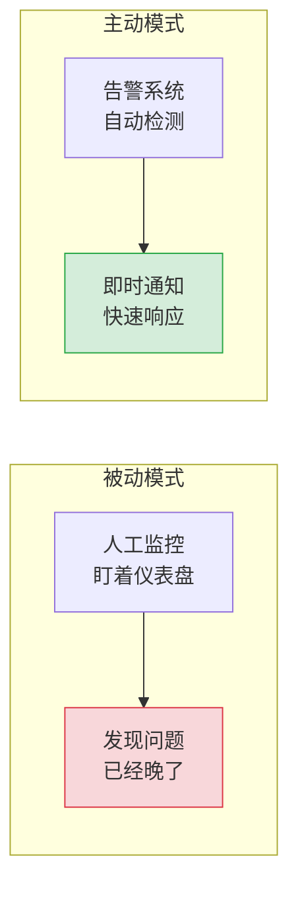
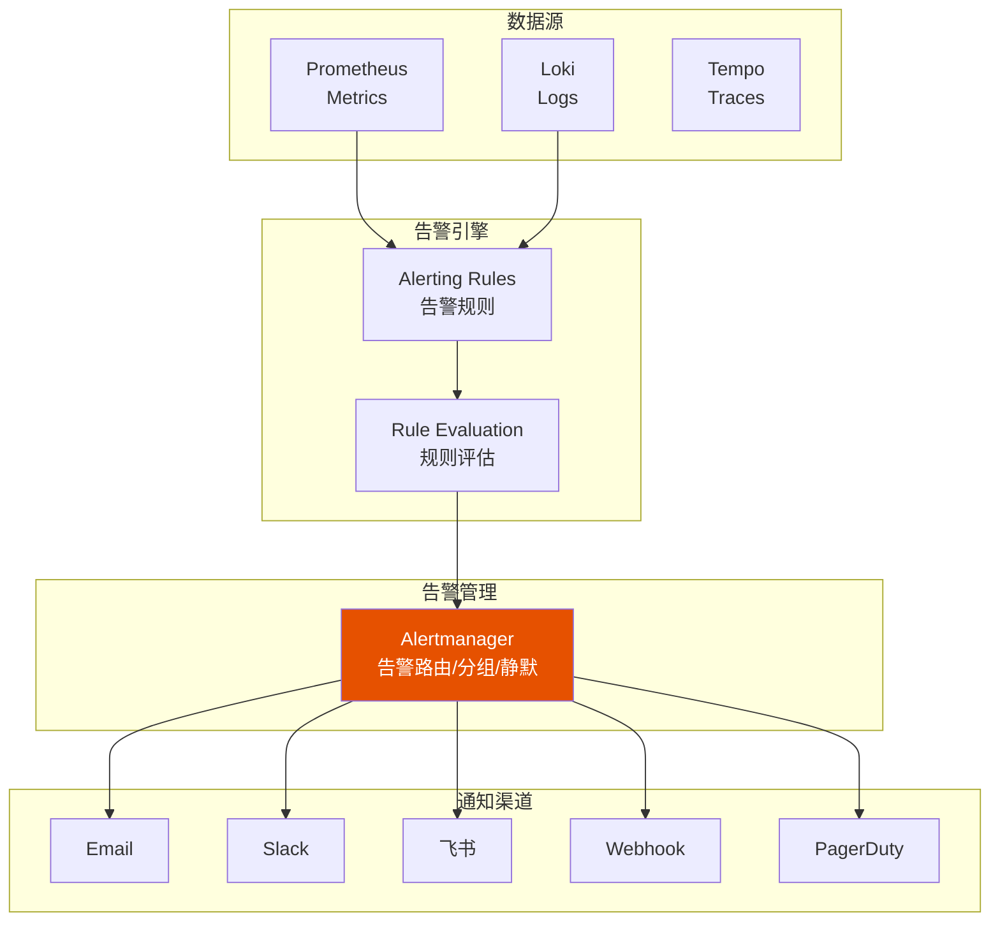
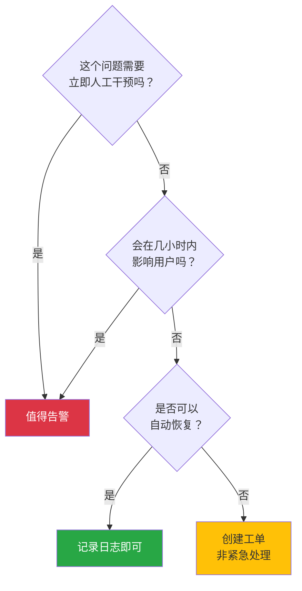
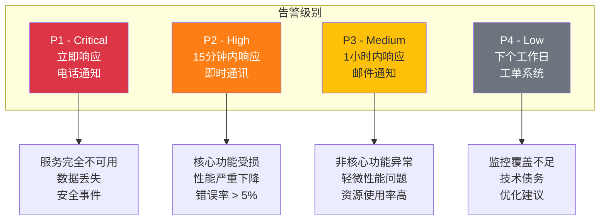
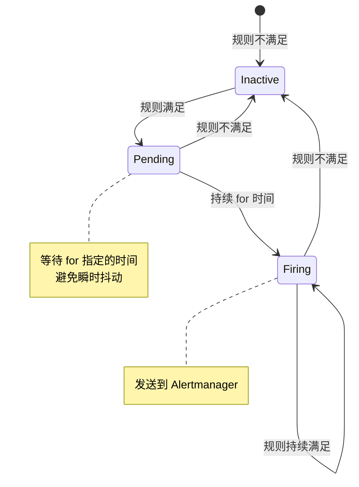
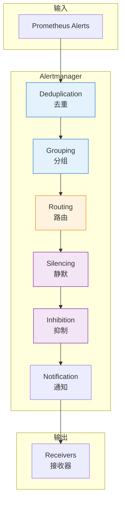
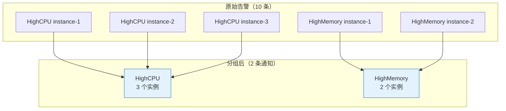
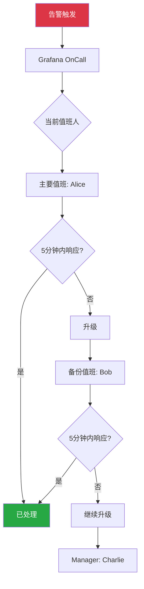

# 第五章：告警

> 本章学习目标：理解告警系统的设计原则、掌握 Prometheus Alerting Rules 编写、学会 Alertmanager 配置（路由、分组、静默）、能够配置多种通知渠道

---

## 5.1 告警基础

### 为什么需要告警？

可观测性让你能够"看到"系统状态，但你不可能 24 小时盯着仪表盘。**告警**让系统主动通知你问题的发生。



### 告警系统的目标

| 目标 | 说明 |
|------|------|
| **及时性** | 问题发生后尽快通知 |
| **准确性** | 减少误报（False Positive） |
| **可操作性** | 收到告警后知道该做什么 |
| **优先级** | 区分紧急和普通问题 |
| **可追溯** | 告警历史可查询 |

### 告警架构



---

## 5.2 告警规则设计

### 什么值得告警？

**告警疲劳（Alert Fatigue）** 是最常见的问题——太多告警导致团队忽视所有告警。



### 告警原则：Actionable Alerts

| 原则 | 说明 | 示例 |
|------|------|------|
| **可操作** | 收到告警后有明确的响应动作 | "重启服务"、"扩容"、"回滚" |
| **有意义** | 告警与业务影响相关 | 用户体验下降、收入损失 |
| **紧急性** | 需要立即处理 | 服务不可用、数据丢失风险 |
| **不重复** | 避免同一问题多次告警 | 使用分组和静默 |

### 告警分级



### SLO 驱动的告警

基于**服务级别目标（SLO）** 设计告警，而不是基于任意阈值：

| SLO | 告警条件 | 说明 |
|-----|----------|------|
| 可用性 99.9% | 错误率 > 0.1% 持续 5 分钟 | 每月允许 43 分钟不可用 |
| P99 延迟 < 500ms | P99 > 500ms 持续 5 分钟 | 99% 请求在 500ms 内完成 |
| 成功率 > 99.5% | 失败率 > 0.5% 持续 3 分钟 | 业务成功率要求 |

**Error Budget（错误预算）告警**：

```
当前月份已消耗的错误预算超过预期进度时告警
```

---

## 5.3 Prometheus Alerting Rules

### 规则文件结构

```yaml
# prometheus/rules/patra-alerts.yml
groups:
  - name: patra-catalog-alerts
    interval: 30s  # 规则评估间隔
    rules:
      - alert: HighErrorRate
        expr: |
          sum(rate(http_server_requests_seconds_count{
            application="patra-catalog",
            status=~"5.."
          }[5m]))
          /
          sum(rate(http_server_requests_seconds_count{
            application="patra-catalog"
          }[5m]))
          > 0.01
        for: 5m
        labels:
          severity: critical
          service: patra-catalog
        annotations:
          summary: "Catalog 服务错误率过高"
          description: "错误率 {{ $value | humanizePercentage }}，超过 1% 阈值"
          runbook_url: "https://wiki.patra.dev/runbooks/high-error-rate"
```

### 规则字段详解

| 字段 | 说明 | 示例 |
|------|------|------|
| `alert` | 告警名称 | `HighErrorRate` |
| `expr` | PromQL 表达式 | 返回布尔值或数值 |
| `for` | 持续时间（避免瞬时抖动） | `5m` |
| `labels` | 附加标签 | `severity: critical` |
| `annotations` | 告警描述信息 | `summary`, `description` |

### 告警状态流转



### 常用告警规则示例

#### 1. 服务可用性

```yaml
# 服务不可用（没有健康实例）
- alert: ServiceDown
  expr: up{job="patra-catalog"} == 0
  for: 1m
  labels:
    severity: critical
  annotations:
    summary: "服务 {{ $labels.job }} 不可用"
    description: "实例 {{ $labels.instance }} 已下线超过 1 分钟"

# 实例数量不足
- alert: InsufficientInstances
  expr: count(up{job="patra-catalog"} == 1) < 2
  for: 5m
  labels:
    severity: high
  annotations:
    summary: "Catalog 服务实例不足"
    description: "当前只有 {{ $value }} 个健康实例，预期至少 2 个"
```

#### 2. 错误率

```yaml
# HTTP 5xx 错误率
- alert: HighErrorRate
  expr: |
    sum by (application) (
      rate(http_server_requests_seconds_count{status=~"5.."}[5m])
    ) / sum by (application) (
      rate(http_server_requests_seconds_count[5m])
    ) > 0.01
  for: 5m
  labels:
    severity: critical
  annotations:
    summary: "{{ $labels.application }} 错误率过高"
    description: "5xx 错误率 {{ $value | humanizePercentage }}"

# 特定接口错误率
- alert: MeshImportFailureRate
  expr: |
    rate(patra_mesh_import_total{status="failure"}[5m])
    / rate(patra_mesh_import_total[5m]) > 0.1
  for: 10m
  labels:
    severity: high
  annotations:
    summary: "MeSH 导入失败率过高"
    description: "失败率 {{ $value | humanizePercentage }}，超过 10% 阈值"
```

#### 3. 延迟

```yaml
# P99 延迟
- alert: HighLatencyP99
  expr: |
    histogram_quantile(0.99,
      sum by (le, application) (
        rate(http_server_requests_seconds_bucket[5m])
      )
    ) > 1
  for: 5m
  labels:
    severity: high
  annotations:
    summary: "{{ $labels.application }} P99 延迟过高"
    description: "P99 延迟 {{ $value | humanizeDuration }}"

# 慢查询
- alert: SlowDatabaseQueries
  expr: |
    histogram_quantile(0.95,
      sum by (le) (
        rate(db_query_duration_seconds_bucket[5m])
      )
    ) > 0.5
  for: 5m
  labels:
    severity: medium
  annotations:
    summary: "数据库查询缓慢"
    description: "P95 查询延迟 {{ $value | humanizeDuration }}"
```

#### 4. 资源使用

```yaml
# JVM 堆内存使用率
- alert: HighHeapUsage
  expr: |
    jvm_memory_used_bytes{area="heap"}
    / jvm_memory_max_bytes{area="heap"} > 0.85
  for: 10m
  labels:
    severity: high
  annotations:
    summary: "{{ $labels.application }} 堆内存使用率过高"
    description: "堆内存使用 {{ $value | humanizePercentage }}"

# 数据库连接池
- alert: DatabaseConnectionPoolExhausted
  expr: |
    hikaricp_connections_active
    / hikaricp_connections_max > 0.9
  for: 5m
  labels:
    severity: high
  annotations:
    summary: "数据库连接池即将耗尽"
    description: "连接池使用率 {{ $value | humanizePercentage }}"

# 磁盘空间
- alert: DiskSpaceLow
  expr: |
    (node_filesystem_avail_bytes / node_filesystem_size_bytes) < 0.15
  for: 10m
  labels:
    severity: high
  annotations:
    summary: "磁盘空间不足"
    description: "剩余空间 {{ $value | humanizePercentage }}"
```

#### 5. 业务指标

```yaml
# 业务队列积压
- alert: ImportQueueBacklog
  expr: patra_mesh_import_pending > 1000
  for: 15m
  labels:
    severity: medium
  annotations:
    summary: "MeSH 导入队列积压"
    description: "待处理任务 {{ $value }} 个，超过 1000 阈值"

# 长时间无数据
- alert: NoIngestActivity
  expr: |
    increase(patra_ingest_task_completed_total[1h]) == 0
  for: 1h
  labels:
    severity: medium
  annotations:
    summary: "Ingest 服务长时间无活动"
    description: "过去 1 小时没有完成任何采集任务"
```

### Prometheus 配置

```yaml
# prometheus.yml
global:
  scrape_interval: 15s
  evaluation_interval: 15s

alerting:
  alertmanagers:
    - static_configs:
        - targets:
          - alertmanager:9093

rule_files:
  - /etc/prometheus/rules/*.yml
```

---

## 5.4 Alertmanager 配置

### Alertmanager 架构



### 核心概念

| 概念 | 说明 | 用途 |
|------|------|------|
| **Grouping** | 将相似告警合并 | 避免收到 100 个实例的独立告警 |
| **Routing** | 根据标签路由到不同接收器 | 不同团队收不同告警 |
| **Silencing** | 临时静默告警 | 计划维护、已知问题 |
| **Inhibition** | 告警抑制 | 服务挂了时，不再告知依赖服务的问题 |

### 完整配置示例

```yaml
# alertmanager.yml
global:
  # 全局配置
  resolve_timeout: 5m
  smtp_smarthost: 'smtp.example.com:587'
  smtp_from: 'alertmanager@patra.dev'
  smtp_auth_username: 'alertmanager@patra.dev'
  smtp_auth_password: '${SMTP_PASSWORD}'

# 模板
templates:
  - '/etc/alertmanager/templates/*.tmpl'

# 路由树
route:
  # 默认接收器
  receiver: 'default-receiver'

  # 分组规则
  group_by: ['alertname', 'service']

  # 分组等待时间（收集同一组的告警）
  group_wait: 30s

  # 分组间隔（同一组新告警的发送间隔）
  group_interval: 5m

  # 重复间隔（已发送告警的重复通知间隔）
  repeat_interval: 4h

  # 子路由
  routes:
    # Critical 告警 -> 电话 + 即时通讯
    - match:
        severity: critical
      receiver: 'critical-receiver'
      group_wait: 10s
      repeat_interval: 1h
      continue: true  # 继续匹配后续规则

    # Catalog 服务告警 -> Catalog 团队
    - match:
        service: patra-catalog
      receiver: 'catalog-team'
      routes:
        - match:
            severity: critical
          receiver: 'catalog-team-urgent'

    # Ingest 服务告警 -> Ingest 团队
    - match:
        service: patra-ingest
      receiver: 'ingest-team'

    # 数据库告警 -> DBA 团队
    - match_re:
        alertname: '.*Database.*|.*MySQL.*|.*Connection.*'
      receiver: 'dba-team'

# 抑制规则
inhibit_rules:
  # 服务挂了时，抑制该服务的其他告警
  - source_match:
      alertname: 'ServiceDown'
    target_match_re:
      service: '.*'
    equal: ['service']

  # Critical 告警存在时，抑制同服务的 Warning 告警
  - source_match:
      severity: 'critical'
    target_match:
      severity: 'warning'
    equal: ['alertname', 'service']

# 接收器
receivers:
  # 默认接收器
  - name: 'default-receiver'
    email_configs:
      - to: 'ops-team@patra.dev'
        send_resolved: true

  # Critical 接收器
  - name: 'critical-receiver'
    email_configs:
      - to: 'oncall@patra.dev'
    webhook_configs:
      - url: 'http://feishu-webhook-service/alert'
        send_resolved: true
    # pagerduty_configs:
    #   - service_key: '${PAGERDUTY_SERVICE_KEY}'

  # Catalog 团队
  - name: 'catalog-team'
    email_configs:
      - to: 'catalog-team@patra.dev'
    webhook_configs:
      - url: 'http://feishu-webhook-service/catalog'

  # Catalog 团队紧急
  - name: 'catalog-team-urgent'
    email_configs:
      - to: 'catalog-team@patra.dev'
    webhook_configs:
      - url: 'http://feishu-webhook-service/catalog-urgent'

  # Ingest 团队
  - name: 'ingest-team'
    email_configs:
      - to: 'ingest-team@patra.dev'

  # DBA 团队
  - name: 'dba-team'
    email_configs:
      - to: 'dba@patra.dev'
```

### 分组（Grouping）详解



**分组配置**：

```yaml
route:
  group_by: ['alertname', 'service']  # 按告警名和服务分组
  group_wait: 30s      # 等待 30s 收集同组告警
  group_interval: 5m   # 同组新告警的发送间隔
```

### 静默（Silencing）

在 Alertmanager UI 或 API 创建静默：

```bash
# 创建静默
amtool silence add \
  alertname="HighCPU" \
  service="patra-catalog" \
  --duration=2h \
  --comment="计划维护窗口"
```

**静默场景**：
- 计划内维护
- 已知问题正在修复
- 测试环境告警
- 误报调查中

### 抑制（Inhibition）

```yaml
inhibit_rules:
  # 当 ServiceDown 存在时，抑制该服务的其他告警
  - source_match:
      alertname: 'ServiceDown'
    target_match_re:
      alertname: '.*'
    equal: ['service']
```

**效果**：
```
ServiceDown (patra-catalog) 触发
  ↓
抑制以下告警：
  - HighErrorRate (patra-catalog)
  - HighLatency (patra-catalog)
  - DatabaseConnectionHigh (patra-catalog)
```

---

## 5.5 通知渠道配置

### 飞书 Webhook

```yaml
# 飞书自定义机器人
receivers:
  - name: 'feishu-webhook'
    webhook_configs:
      - url: 'https://open.feishu.cn/open-apis/bot/v2/hook/xxx'
        send_resolved: true
        http_config:
          authorization:
            type: 'Bearer'
            credentials: '${FEISHU_TOKEN}'
```

**飞书消息模板**（需要中间服务转换）：

```json
{
  "msg_type": "interactive",
  "card": {
    "header": {
      "title": {
        "tag": "plain_text",
        "content": "🚨 告警通知"
      },
      "template": "red"
    },
    "elements": [
      {
        "tag": "div",
        "text": {
          "tag": "lark_md",
          "content": "**告警名称**: {{ .GroupLabels.alertname }}\n**服务**: {{ .GroupLabels.service }}\n**级别**: {{ .CommonLabels.severity }}\n**描述**: {{ range .Alerts }}{{ .Annotations.description }}{{ end }}"
        }
      },
      {
        "tag": "action",
        "actions": [
          {
            "tag": "button",
            "text": {
              "tag": "plain_text",
              "content": "查看详情"
            },
            "url": "{{ .ExternalURL }}",
            "type": "primary"
          }
        ]
      }
    ]
  }
}
```

### Email

```yaml
receivers:
  - name: 'email-alerts'
    email_configs:
      - to: 'team@patra.dev'
        from: 'alertmanager@patra.dev'
        smarthost: 'smtp.example.com:587'
        auth_username: 'alertmanager@patra.dev'
        auth_password: '${SMTP_PASSWORD}'
        send_resolved: true
        headers:
          Subject: '[{{ .Status | toUpper }}] {{ .GroupLabels.alertname }}'
        html: '{{ template "email.html" . }}'
```

### Slack

```yaml
receivers:
  - name: 'slack-alerts'
    slack_configs:
      - api_url: 'https://hooks.slack.com/services/xxx'
        channel: '#alerts'
        username: 'Alertmanager'
        icon_emoji: ':warning:'
        send_resolved: true
        title: '{{ .Status | toUpper }}: {{ .GroupLabels.alertname }}'
        text: '{{ range .Alerts }}{{ .Annotations.description }}{{ end }}'
        actions:
          - type: button
            text: 'View in Grafana'
            url: '{{ .ExternalURL }}'
```

### PagerDuty（企业级）

```yaml
receivers:
  - name: 'pagerduty-critical'
    pagerduty_configs:
      - service_key: '${PAGERDUTY_SERVICE_KEY}'
        severity: 'critical'
        description: '{{ .GroupLabels.alertname }}'
        details:
          firing: '{{ range .Alerts.Firing }}{{ .Annotations.summary }}{{ end }}'
          resolved: '{{ range .Alerts.Resolved }}{{ .Annotations.summary }}{{ end }}'
```

### 自定义 Webhook

```yaml
receivers:
  - name: 'custom-webhook'
    webhook_configs:
      - url: 'http://alert-gateway/webhook'
        send_resolved: true
        max_alerts: 10
        http_config:
          bearer_token: '${WEBHOOK_TOKEN}'
```

**Webhook 请求体格式**：

```json
{
  "version": "4",
  "groupKey": "alertname:HighErrorRate,service:patra-catalog",
  "status": "firing",
  "receiver": "custom-webhook",
  "groupLabels": {
    "alertname": "HighErrorRate",
    "service": "patra-catalog"
  },
  "commonLabels": {
    "severity": "critical"
  },
  "commonAnnotations": {
    "summary": "Catalog 服务错误率过高"
  },
  "externalURL": "http://alertmanager:9093",
  "alerts": [
    {
      "status": "firing",
      "labels": {
        "alertname": "HighErrorRate",
        "service": "patra-catalog",
        "severity": "critical"
      },
      "annotations": {
        "summary": "Catalog 服务错误率过高",
        "description": "错误率 2.3%，超过 1% 阈值"
      },
      "startsAt": "2025-11-28T10:30:00.000Z",
      "endsAt": "0001-01-01T00:00:00Z",
      "generatorURL": "http://prometheus:9090/graph?..."
    }
  ]
}
```

---

## 5.6 Grafana Alerting

### Grafana Alerting vs Alertmanager

| 维度 | Grafana Alerting | Alertmanager |
|------|------------------|--------------|
| **数据源** | 多数据源（Prometheus、Loki 等） | 仅 Prometheus |
| **UI** | 图形化配置 | YAML 配置 |
| **功能** | 基础路由和通知 | 完整的路由、分组、抑制 |
| **推荐场景** | 简单告警、快速上手 | 复杂路由、企业级 |

### 在 Grafana 中配置告警


**Grafana Alert Rule 配置**：

```yaml
# grafana/provisioning/alerting/rules.yaml
apiVersion: 1
groups:
  - orgId: 1
    name: patra-alerts
    folder: Patra
    interval: 1m
    rules:
      - uid: high-error-rate
        title: High Error Rate
        condition: C
        data:
          - refId: A
            relativeTimeRange:
              from: 300
              to: 0
            datasourceUid: prometheus
            model:
              expr: |
                sum(rate(http_server_requests_seconds_count{status=~"5.."}[5m]))
                / sum(rate(http_server_requests_seconds_count[5m]))
              instant: true
          - refId: B
            relativeTimeRange:
              from: 300
              to: 0
            datasourceUid: __expr__
            model:
              conditions:
                - evaluator:
                    params: [0.01]
                    type: gt
                  reducer:
                    type: last
                  query:
                    params: [A]
              refId: B
              type: threshold
          - refId: C
            datasourceUid: __expr__
            model:
              conditions:
                - evaluator:
                    params: [0]
                    type: gt
              refId: C
              type: reduce
              expression: B
              reducer: last
        for: 5m
        labels:
          severity: critical
        annotations:
          summary: Error rate is too high
          description: The error rate is {{ $values.A }}
```

### Contact Points 配置

```yaml
# grafana/provisioning/alerting/contactpoints.yaml
apiVersion: 1
contactPoints:
  - orgId: 1
    name: ops-team
    receivers:
      - uid: email-ops
        type: email
        settings:
          addresses: ops@patra.dev
          singleEmail: true
      - uid: feishu-ops
        type: webhook
        settings:
          url: https://open.feishu.cn/open-apis/bot/v2/hook/xxx
          httpMethod: POST
```

### Notification Policies

```yaml
# grafana/provisioning/alerting/policies.yaml
apiVersion: 1
policies:
  - orgId: 1
    receiver: ops-team
    group_by:
      - alertname
      - service
    routes:
      - receiver: catalog-team
        matchers:
          - service = patra-catalog
      - receiver: critical-team
        matchers:
          - severity = critical
        continue: true
```

---

## 5.7 Grafana OnCall（值班管理）

### OnCall 简介

**Grafana OnCall** 是开源的值班管理系统，提供：
- 值班排班
- 告警升级
- 多渠道通知
- 值班交接



### 排班配置

```yaml
# OnCall Schedule 示例
schedules:
  - name: "Patra Primary On-Call"
    type: web
    timezone: Asia/Shanghai
    shifts:
      - start: "2025-11-28 09:00"
        end: "2025-11-29 09:00"
        user: alice
      - start: "2025-11-29 09:00"
        end: "2025-11-30 09:00"
        user: bob
    overrides:
      - start: "2025-11-28 18:00"
        end: "2025-11-28 22:00"
        user: charlie
        reason: "Alice 请假"
```

### 升级策略

```yaml
# Escalation Chain
escalation_chains:
  - name: "Critical Alerts"
    steps:
      - type: notify_on_call
        schedule: "Patra Primary On-Call"
        wait: 0m
      - type: wait
        duration: 5m
      - type: notify_on_call
        schedule: "Patra Backup On-Call"
        wait: 0m
      - type: wait
        duration: 10m
      - type: notify_users
        users:
          - manager@patra.dev
```

---

## 5.8 告警最佳实践

### DO（推荐做法）

```yaml
# ✅ 有意义的告警名称
- alert: CatalogServiceHighErrorRate
  # 不是：Alert1, HighRate

# ✅ 清晰的描述
annotations:
  summary: "Catalog 服务错误率 {{ $value | humanizePercentage }}"
  description: |
    服务: {{ $labels.service }}
    实例: {{ $labels.instance }}
    当前错误率: {{ $value | humanizePercentage }}
    阈值: 1%
    可能原因: 数据库连接问题、上游服务故障
    处理步骤: 1. 检查日志 2. 检查数据库 3. 联系 DBA
  runbook_url: "https://wiki.patra.dev/runbooks/high-error-rate"

# ✅ 合理的 for 时间（避免抖动）
for: 5m

# ✅ 使用标签分类
labels:
  severity: critical
  team: catalog
  component: api
```

### DON'T（避免做法）

```yaml
# ❌ 无意义的告警名称
- alert: Alert1

# ❌ 阈值过于敏感（造成告警风暴）
expr: cpu_usage > 50
for: 10s

# ❌ 缺少 for 时间
- alert: HighCPU
  expr: cpu_usage > 90
  # 缺少 for，瞬时抖动就会告警

# ❌ 模糊的描述
annotations:
  summary: "Something is wrong"
  description: "Please check"

# ❌ 缺少可操作信息
annotations:
  summary: "Error occurred"
  # 没有告诉人该做什么
```

### 告警命名规范

| 格式 | 示例 |
|------|------|
| `{Service}{Metric}{Condition}` | `CatalogServiceHighErrorRate` |
| `{Component}{Issue}` | `DatabaseConnectionPoolExhausted` |
| `{Resource}{State}` | `DiskSpaceLow` |

### 告警 Runbook

每个告警应该有对应的 Runbook：

```markdown
# Runbook: HighErrorRate

## 告警描述
服务的 HTTP 5xx 错误率超过阈值。

## 影响
用户请求失败，可能影响业务功能。

## 排查步骤

### 1. 检查告警详情
- 确认哪个服务、哪个实例
- 查看错误率具体数值

### 2. 查看日志
{app="patra-catalog", level="ERROR"} | json


### 3. 检查依赖服务
- 数据库连接是否正常
- 上游服务是否可用

### 4. 常见原因
- 数据库连接池耗尽
- 外部 API 超时
- 配置错误

## 临时缓解
- 重启服务实例
- 扩容实例数量

## 升级
如果 15 分钟内无法解决，升级到 Team Lead。
```

---

## 5.9 小结

### 核心概念速查表

| 概念 | 定义 | 关键点 |
|------|------|--------|
| **Alerting Rule** | 告警规则 | PromQL + for + labels + annotations |
| **Alertmanager** | 告警管理器 | 路由、分组、静默、通知 |
| **Grouping** | 告警分组 | 减少通知数量 |
| **Routing** | 告警路由 | 不同告警发给不同团队 |
| **Silencing** | 告警静默 | 临时屏蔽告警 |
| **Inhibition** | 告警抑制 | 高优先级告警抑制低优先级 |

### 告警设计检查清单

- [ ] 告警是否 **可操作**（收到后知道做什么）
- [ ] 告警是否有 **业务影响**（值得立即处理）
- [ ] 阈值是否 **合理**（避免误报和漏报）
- [ ] `for` 时间是否 **足够**（避免瞬时抖动）
- [ ] 描述是否 **清晰**（包含上下文和处理步骤）
- [ ] 是否有 **Runbook**（标准化处理流程）
- [ ] 路由是否 **正确**（告警发给正确的人）
- [ ] 分组是否 **合理**（避免告警风暴）

### 常用 PromQL 告警模式

| 场景 | PromQL 模式 |
|------|-------------|
| 错误率 | `rate(errors[5m]) / rate(total[5m]) > 0.01` |
| P99 延迟 | `histogram_quantile(0.99, rate(duration_bucket[5m])) > 1` |
| 服务下线 | `up == 0` |
| 实例不足 | `count(up == 1) < 2` |
| 资源使用率 | `used / max > 0.9` |
| 队列积压 | `queue_length > 1000` |
| 无活动 | `increase(counter[1h]) == 0` |

---

## 延伸阅读

- [Prometheus Alerting](https://prometheus.io/docs/alerting/latest/overview/)
- [Alertmanager Configuration](https://prometheus.io/docs/alerting/latest/configuration/)
- [Grafana Alerting](https://grafana.com/docs/grafana/latest/alerting/)
- [Grafana OnCall](https://grafana.com/docs/oncall/latest/)
- [Google SRE: Alerting on SLOs](https://sre.google/workbook/alerting-on-slos/)
- [PagerDuty Incident Response Guide](https://response.pagerduty.com/)

## 相关设计文档

- [[designs/observability/06-grafana-visualization|设计文档：Grafana 可视化]] - 告警规则配置、Alertmanager 集成
- [[designs/observability/05-infrastructure|设计文档：基础设施]] - Alertmanager 部署配置

---

> **下一章**：[[06-grafana|第六章：Grafana 可视化]] - 学习数据源配置、仪表盘设计、统一查询界面
