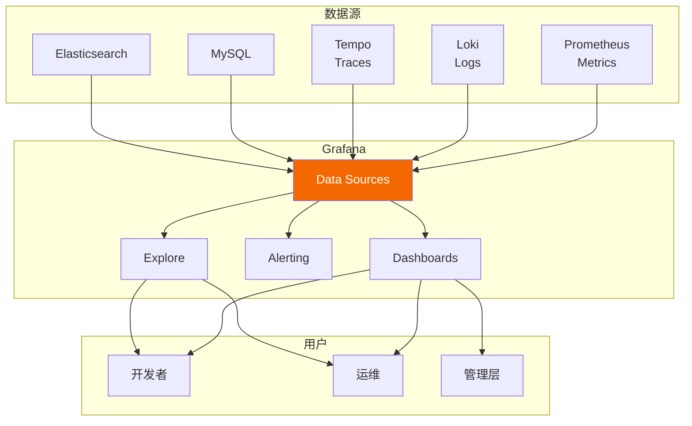
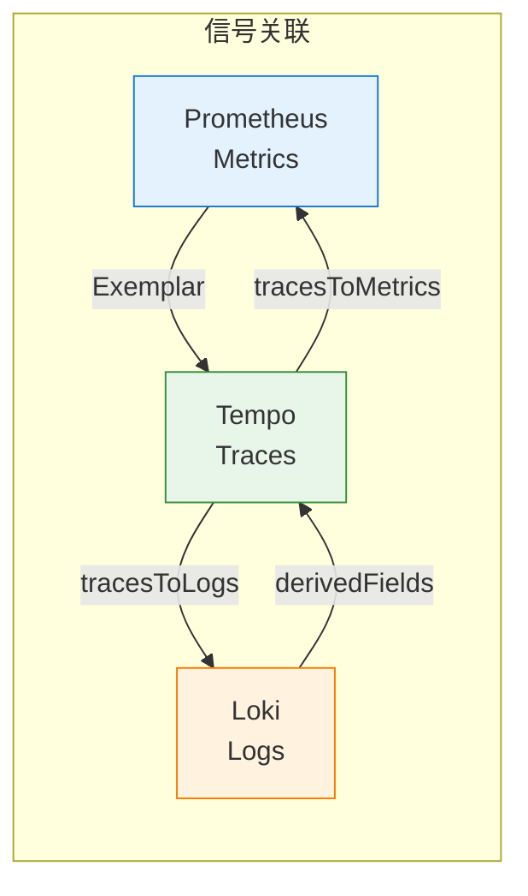
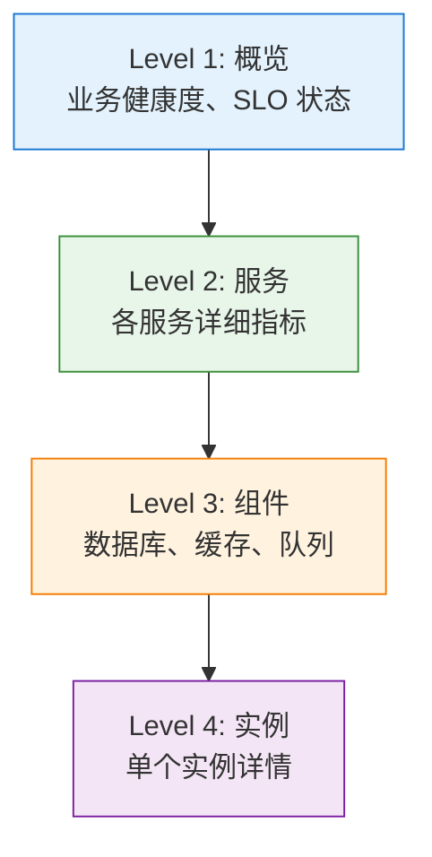

# 第六章：Grafana 可视化

> 本章学习目标：掌握 Grafana 数据源配置、学会设计有效的仪表盘、理解 Metrics/Logs/Traces 的统一查询、能够实现信号之间的关联跳转

---

## 6.1 Grafana 简介

### 什么是 Grafana？

**Grafana** 是开源的可观测性平台，提供：
- 多数据源统一查询
- 丰富的可视化组件
- 告警和通知
- 仪表盘分享和权限管理



### Grafana 核心功能

| 功能 | 说明 | 使用场景 |
|------|------|----------|
| **Dashboards** | 可视化仪表盘 | 日常监控、业务看板 |
| **Explore** | 临时查询界面 | 问题排查、数据探索 |
| **Alerting** | 告警配置 | 主动发现问题 |
| **Annotations** | 事件标注 | 标记部署、事件 |

---

## 6.2 数据源配置

### 支持的数据源类型

| 类别 | 数据源 | 用途 |
|------|--------|------|
| **时序数据库** | Prometheus, InfluxDB, Graphite | Metrics |
| **日志系统** | Loki, Elasticsearch | Logs |
| **追踪系统** | Tempo, Jaeger, Zipkin | Traces |
| **关系数据库** | MySQL, PostgreSQL | 业务数据 |
| **云服务** | AWS CloudWatch, Azure Monitor | 云指标 |

### 配置 Prometheus 数据源

**方式一：UI 配置**

```
Grafana → Configuration → Data Sources → Add data source → Prometheus
```

**方式二：Provisioning（推荐）**

```yaml
# grafana/provisioning/datasources/datasources.yaml
apiVersion: 1

datasources:
  - name: Prometheus
    type: prometheus
    uid: prometheus
    access: proxy
    url: http://prometheus:9090
    isDefault: true
    jsonData:
      httpMethod: POST
      manageAlerts: true
      prometheusType: Prometheus
      prometheusVersion: 2.51.0
      exemplarTraceIdDestinations:
        - name: traceID
          datasourceUid: tempo
          urlDisplayLabel: View Trace
```

### 配置 Loki 数据源

```yaml
  - name: Loki
    type: loki
    uid: loki
    access: proxy
    url: http://loki:3100
    jsonData:
      maxLines: 1000
      derivedFields:
        - name: TraceID
          matcherRegex: '"traceId":"(\w+)"'
          url: '$${__value.raw}'
          datasourceUid: tempo
          urlDisplayLabel: View Trace
```

### 配置 Tempo 数据源

```yaml
  - name: Tempo
    type: tempo
    uid: tempo
    access: proxy
    url: http://tempo:3200
    jsonData:
      httpMethod: GET
      tracesToLogsV2:
        datasourceUid: loki
        spanStartTimeShift: '-5m'
        spanEndTimeShift: '5m'
        tags:
          - key: service.name
            value: app
        filterByTraceID: true
        filterBySpanID: false
        customQuery: true
        query: '{app="$${__span.tags["service.name"]}"} |= "$${__trace.traceId}"'
      tracesToMetrics:
        datasourceUid: prometheus
        spanStartTimeShift: '-5m'
        spanEndTimeShift: '5m'
        tags:
          - key: service.name
            value: application
        queries:
          - name: Request Rate
            query: 'rate(http_server_requests_seconds_count{application="$${__tags.application}"}[$__rate_interval])'
          - name: Error Rate
            query: 'rate(http_server_requests_seconds_count{application="$${__tags.application}",status=~"5.."}[$__rate_interval])'
      nodeGraph:
        enabled: true
      serviceMap:
        datasourceUid: prometheus
      search:
        hide: false
      lokiSearch:
        datasourceUid: loki
```

### 数据源关联配置



---

## 6.3 Explore：交互式查询

### Explore 界面

Explore 是 Grafana 的**临时查询界面**，用于：
- 问题排查
- 数据探索
- 查询调试

```
┌─────────────────────────────────────────────────────────────────────────┐
│  Explore                                                    Split ⊞    │
├─────────────────────────────────────────────────────────────────────────┤
│  Data source: [Prometheus ▼]     Time: [Last 1 hour ▼]    [Run query]  │
├─────────────────────────────────────────────────────────────────────────┤
│  Query:                                                                 │
│  ┌─────────────────────────────────────────────────────────────────┐   │
│  │ rate(http_server_requests_seconds_count[5m])                     │   │
│  └─────────────────────────────────────────────────────────────────┘   │
├─────────────────────────────────────────────────────────────────────────┤
│                                                                         │
│     ^                                                                   │
│  100│     ╭──╮                    ╭────╮                               │
│     │    ╭╯  ╰╮                  ╭╯    ╰╮                              │
│   50│───╮│    │╭────────────────╮│      │╭───                          │
│     │   ╰╯    ╰╯                ╰╯      ╰╯                             │
│    0└───────────────────────────────────────────────────> time         │
│                                                                         │
└─────────────────────────────────────────────────────────────────────────┘
```

### Split View（分屏对比）

Explore 支持分屏查询，可以同时查看多个数据源：

```
┌─────────────────────────────────┬─────────────────────────────────┐
│  Prometheus                     │  Loki                           │
├─────────────────────────────────┼─────────────────────────────────┤
│  rate(errors[5m])               │  {app="catalog"} |= "error"     │
├─────────────────────────────────┼─────────────────────────────────┤
│  [Metrics Graph]                │  [Log Lines]                    │
│                                 │  10:30:45 ERROR Failed to...    │
│                                 │  10:30:46 ERROR Connection...   │
│                                 │  10:30:47 ERROR Timeout...      │
└─────────────────────────────────┴─────────────────────────────────┘
```

### 从 Metrics 跳转到 Traces

使用 **Exemplar** 功能：

1. Prometheus 指标中嵌入 Trace ID
2. 点击 Exemplar 点直接跳转到 Tempo

```
      ^
   100│     ●  ← Exemplar 点（可点击）
      │    ╭╯╰╮
    50│───╮│  │───
      │   ╰╯  ╰╯
     0└──────────────> time

点击 ● → 跳转到 Tempo 查看完整 Trace
```

### 从 Logs 跳转到 Traces

使用 **Derived Fields** 功能：

```
┌─────────────────────────────────────────────────────────────────────────┐
│ 10:30:45 ERROR Failed to parse XML                                      │
│ {"traceId": "abc123def456", "service": "patra-catalog"}                │
│                    └── [View Trace] ← 可点击链接                        │
└─────────────────────────────────────────────────────────────────────────┘
```

### 从 Traces 跳转到 Logs

在 Trace 详情页查看相关日志：

```
┌─────────────────────────────────────────────────────────────────────────┐
│ Trace: abc123def456                                                     │
├─────────────────────────────────────────────────────────────────────────┤
│ ├── Gateway (10ms)                                                      │
│ ├── Catalog Service (200ms)                                             │
│ │   ├── MySQL Query (180ms)                                             │
│ │   └── [View Logs] ← 跳转到相关日志                                    │
└─────────────────────────────────────────────────────────────────────────┘
```

---

## 6.4 Dashboard 设计

### 仪表盘设计原则

#### 1. 分层设计



#### 2. RED 方法（面向服务）

| 指标 | 面板类型 | 用途 |
|------|----------|------|
| **R**ate | Time Series | 请求速率趋势 |
| **E**rrors | Stat + Time Series | 错误率和趋势 |
| **D**uration | Heatmap | 延迟分布 |

#### 3. USE 方法（面向资源）

| 指标 | 面板类型 | 用途 |
|------|----------|------|
| **U**tilization | Gauge | 资源使用率 |
| **S**aturation | Time Series | 队列长度、等待数 |
| **E**rrors | Stat | 资源错误 |

### 面板类型选择

| 数据特征 | 推荐面板 | 示例 |
|----------|----------|------|
| 时间趋势 | Time Series | QPS、延迟趋势 |
| 当前值 | Stat / Gauge | 当前错误率、CPU 使用率 |
| 分布数据 | Heatmap | 延迟分布 |
| 比例数据 | Pie Chart | 状态码分布 |
| 表格数据 | Table | Top K、详细列表 |
| 日志数据 | Logs | 实时日志流 |
| 拓扑结构 | Node Graph | 服务依赖 |

### Dashboard JSON 结构

```json
{
  "dashboard": {
    "id": null,
    "uid": "patra-catalog-overview",
    "title": "Patra Catalog - Overview",
    "tags": ["patra", "catalog"],
    "timezone": "browser",
    "refresh": "30s",
    "time": {
      "from": "now-1h",
      "to": "now"
    },
    "templating": {
      "list": [
        {
          "name": "instance",
          "type": "query",
          "datasource": "Prometheus",
          "query": "label_values(up{job=\"patra-catalog\"}, instance)"
        }
      ]
    },
    "panels": [
      {
        "id": 1,
        "title": "Request Rate",
        "type": "timeseries",
        "gridPos": {"h": 8, "w": 12, "x": 0, "y": 0},
        "targets": [
          {
            "expr": "rate(http_server_requests_seconds_count{application=\"patra-catalog\"}[5m])",
            "legendFormat": "{{method}} {{uri}}"
          }
        ]
      }
    ]
  }
}
```

### 使用变量（Variables）

变量让仪表盘更灵活：

```yaml
# 定义变量
templating:
  list:
    # 服务选择
    - name: service
      type: query
      datasource: Prometheus
      query: 'label_values(up, application)'
      multi: true
      includeAll: true

    # 实例选择
    - name: instance
      type: query
      datasource: Prometheus
      query: 'label_values(up{application="$service"}, instance)'
      multi: true

    # 时间间隔（自动）
    - name: interval
      type: interval
      auto: true
      auto_min: "10s"
      options:
        - "10s"
        - "30s"
        - "1m"
        - "5m"
```

**在查询中使用变量**：

```promql
rate(http_server_requests_seconds_count{
  application=~"$service",
  instance=~"$instance"
}[$interval])
```

---

## 6.5 实战：Patra 服务仪表盘

### 概览仪表盘布局

```
┌─────────────────────────────────────────────────────────────────────────┐
│  Patra Platform - Overview                        🔄 30s  ⏰ Last 1h   │
├─────────────────────────────────────────────────────────────────────────┤
│  ┌─────────┐ ┌─────────┐ ┌─────────┐ ┌─────────┐ ┌─────────────────┐  │
│  │ Services│ │  Total  │ │  Error  │ │  P99    │ │   SLO Status    │  │
│  │    4    │ │ 1.2K/s  │ │  0.1%   │ │  120ms  │ │ ████████░░ 99.2%│  │
│  │  Online │ │   QPS   │ │  Rate   │ │ Latency │ │   Target: 99.5% │  │
│  └─────────┘ └─────────┘ └─────────┘ └─────────┘ └─────────────────┘  │
├─────────────────────────────────────────────────────────────────────────┤
│  Request Rate by Service                    Error Rate by Service      │
│  ┌────────────────────────────────┐        ┌────────────────────────┐  │
│  │      ╭──╮    Catalog           │        │                        │  │
│  │     ╭╯  ╰──╮ Gateway          │        │  ▃▅▂▁▃▂▄▂▁▂▃▂▁▂▃      │  │
│  │ ────╯      ╰─ Ingest          │        │                        │  │
│  └────────────────────────────────┘        └────────────────────────┘  │
├─────────────────────────────────────────────────────────────────────────┤
│  Latency Heatmap                            Top 5 Slow Endpoints       │
│  ┌────────────────────────────────┐        ┌────────────────────────┐  │
│  │  ████████████████████          │        │ /api/mesh/import  450ms│  │
│  │  ██████████████                │        │ /api/mesh/search  320ms│  │
│  │  ██████████                    │        │ /api/journal/...  180ms│  │
│  │  ██████                        │        │ /api/catalog/... 120ms │  │
│  └────────────────────────────────┘        └────────────────────────┘  │
└─────────────────────────────────────────────────────────────────────────┘
```

### Provisioning 完整配置

```yaml
# grafana/provisioning/dashboards/dashboards.yaml
apiVersion: 1

providers:
  - name: 'Patra Dashboards'
    orgId: 1
    folder: 'Patra'
    folderUid: 'patra'
    type: file
    disableDeletion: false
    updateIntervalSeconds: 30
    options:
      path: /etc/grafana/provisioning/dashboards/patra
```

### 服务概览面板

#### 1. 请求速率（Time Series）

```json
{
  "title": "Request Rate",
  "type": "timeseries",
  "targets": [
    {
      "expr": "sum by (application) (rate(http_server_requests_seconds_count{application=~\"patra-.*\"}[5m]))",
      "legendFormat": "{{application}}"
    }
  ],
  "fieldConfig": {
    "defaults": {
      "unit": "reqps",
      "custom": {
        "drawStyle": "line",
        "lineInterpolation": "smooth",
        "fillOpacity": 10
      }
    }
  }
}
```

#### 2. 错误率（Stat + Threshold）

```json
{
  "title": "Error Rate",
  "type": "stat",
  "targets": [
    {
      "expr": "sum(rate(http_server_requests_seconds_count{application=~\"patra-.*\",status=~\"5..\"}[5m])) / sum(rate(http_server_requests_seconds_count{application=~\"patra-.*\"}[5m]))",
      "instant": true
    }
  ],
  "fieldConfig": {
    "defaults": {
      "unit": "percentunit",
      "thresholds": {
        "mode": "absolute",
        "steps": [
          {"color": "green", "value": null},
          {"color": "yellow", "value": 0.01},
          {"color": "red", "value": 0.05}
        ]
      }
    }
  }
}
```

#### 3. P99 延迟（Gauge）

```json
{
  "title": "P99 Latency",
  "type": "gauge",
  "targets": [
    {
      "expr": "histogram_quantile(0.99, sum by (le) (rate(http_server_requests_seconds_bucket{application=~\"patra-.*\"}[5m])))",
      "instant": true
    }
  ],
  "fieldConfig": {
    "defaults": {
      "unit": "s",
      "min": 0,
      "max": 2,
      "thresholds": {
        "mode": "absolute",
        "steps": [
          {"color": "green", "value": null},
          {"color": "yellow", "value": 0.5},
          {"color": "red", "value": 1}
        ]
      }
    }
  }
}
```

#### 4. 延迟热力图（Heatmap）

```json
{
  "title": "Latency Distribution",
  "type": "heatmap",
  "targets": [
    {
      "expr": "sum by (le) (increase(http_server_requests_seconds_bucket{application=~\"patra-.*\"}[1m]))",
      "format": "heatmap",
      "legendFormat": "{{le}}"
    }
  ],
  "options": {
    "calculate": false,
    "yAxis": {
      "unit": "s"
    },
    "color": {
      "scheme": "Spectral"
    }
  }
}
```

#### 5. Top K 慢接口（Table）

```json
{
  "title": "Top 10 Slow Endpoints",
  "type": "table",
  "targets": [
    {
      "expr": "topk(10, histogram_quantile(0.99, sum by (uri, le) (rate(http_server_requests_seconds_bucket{application=~\"patra-.*\"}[5m]))))",
      "instant": true,
      "format": "table"
    }
  ],
  "transformations": [
    {
      "id": "organize",
      "options": {
        "renameByName": {
          "uri": "Endpoint",
          "Value": "P99 Latency"
        }
      }
    }
  ],
  "fieldConfig": {
    "defaults": {
      "unit": "s"
    },
    "overrides": [
      {
        "matcher": {"id": "byName", "options": "P99 Latency"},
        "properties": [
          {
            "id": "custom.cellOptions",
            "value": {
              "type": "color-background",
              "mode": "gradient"
            }
          }
        ]
      }
    ]
  }
}
```

### JVM 监控面板

```json
{
  "title": "JVM Heap Usage",
  "type": "timeseries",
  "targets": [
    {
      "expr": "jvm_memory_used_bytes{application=\"$service\", area=\"heap\"}",
      "legendFormat": "Used"
    },
    {
      "expr": "jvm_memory_committed_bytes{application=\"$service\", area=\"heap\"}",
      "legendFormat": "Committed"
    },
    {
      "expr": "jvm_memory_max_bytes{application=\"$service\", area=\"heap\"}",
      "legendFormat": "Max"
    }
  ],
  "fieldConfig": {
    "defaults": {
      "unit": "bytes",
      "custom": {
        "fillOpacity": 20
      }
    }
  }
}
```

### 日志面板（Logs Panel）

```json
{
  "title": "Recent Errors",
  "type": "logs",
  "datasource": "Loki",
  "targets": [
    {
      "expr": "{app=~\"patra-.*\", level=\"ERROR\"} | json",
      "refId": "A"
    }
  ],
  "options": {
    "showTime": true,
    "showLabels": true,
    "showCommonLabels": false,
    "wrapLogMessage": true,
    "prettifyLogMessage": true,
    "enableLogDetails": true,
    "dedupStrategy": "none",
    "sortOrder": "Descending"
  }
}
```

---

## 6.6 Annotations（事件标注）

### 什么是 Annotations？

**Annotations** 在图表上标记重要事件，帮助关联系统变化与指标变化：

```
      ^
   100│     ╭──╮         ↓ 部署 v2.0.0
      │    ╭╯  ╰──╮    │
    50│───╮│      │────│────
      │   ╰╯      ╰────│
     0└──────────────────────> time
```

### 配置 Annotations

```yaml
# Dashboard JSON
"annotations": {
  "list": [
    {
      "name": "Deployments",
      "datasource": "Loki",
      "enable": true,
      "expr": "{app=\"deployment-bot\"} |= \"deployed\"",
      "iconColor": "blue",
      "tagKeys": "version,service",
      "textFormat": "Deployed {{version}} to {{service}}"
    },
    {
      "name": "Alerts",
      "datasource": "Prometheus",
      "enable": true,
      "expr": "ALERTS{alertstate=\"firing\"}",
      "iconColor": "red"
    }
  ]
}
```

### 通过 API 创建 Annotations

```bash
# 部署完成后标记
curl -X POST \
  -H "Authorization: Bearer $GRAFANA_TOKEN" \
  -H "Content-Type: application/json" \
  -d '{
    "dashboardUID": "patra-overview",
    "time": 1701234567890,
    "tags": ["deploy", "catalog"],
    "text": "Deployed patra-catalog v2.0.0"
  }' \
  http://grafana:3000/api/annotations
```

---

## 6.7 权限与分享

### 文件夹权限

```yaml
# 按团队组织文件夹
folders:
  - name: Patra Platform
    permissions:
      - role: Admin
        permission: Edit
      - role: Editor
        permission: Edit
      - role: Viewer
        permission: View

  - name: Catalog Team
    permissions:
      - team: catalog-team
        permission: Edit
      - role: Viewer
        permission: View
```

### 仪表盘分享

| 分享方式 | 用途 | 权限要求 |
|----------|------|----------|
| **Link** | 分享给登录用户 | 需要账号 |
| **Snapshot** | 分享静态快照 | 无需账号 |
| **Embed** | 嵌入到其他页面 | 需配置 |
| **PDF/PNG** | 导出报告 | Grafana Enterprise |

### 公开仪表盘

```yaml
# grafana.ini
[auth.anonymous]
enabled = true
org_name = Main Org.
org_role = Viewer

[security]
allow_embedding = true
```

---

## 6.8 Provisioning 最佳实践

### 目录结构

```
grafana/
├── provisioning/
│   ├── datasources/
│   │   └── datasources.yaml      # 数据源配置
│   ├── dashboards/
│   │   ├── dashboards.yaml       # 仪表盘提供者配置
│   │   └── patra/
│   │       ├── overview.json     # 概览仪表盘
│   │       ├── catalog.json      # Catalog 服务仪表盘
│   │       ├── ingest.json       # Ingest 服务仪表盘
│   │       └── jvm.json          # JVM 通用仪表盘
│   ├── alerting/
│   │   ├── rules.yaml            # 告警规则
│   │   ├── contactpoints.yaml    # 联系点
│   │   └── policies.yaml         # 通知策略
│   └── notifiers/
│       └── notifiers.yaml        # 通知渠道
└── grafana.ini                   # Grafana 配置
```

### Docker Compose 配置

```yaml
# docker-compose.yaml
services:
  grafana:
    image: grafana/grafana:10.4.0
    container_name: patra-grafana
    ports:
      - "3000:3000"
    environment:
      - GF_SECURITY_ADMIN_USER=admin
      - GF_SECURITY_ADMIN_PASSWORD=${GRAFANA_PASSWORD}
      - GF_USERS_ALLOW_SIGN_UP=false
      - GF_INSTALL_PLUGINS=grafana-piechart-panel
    volumes:
      - ./grafana/provisioning:/etc/grafana/provisioning
      - ./grafana/grafana.ini:/etc/grafana/grafana.ini
      - grafana-data:/var/lib/grafana
    depends_on:
      - prometheus
      - loki
      - tempo

volumes:
  grafana-data:
```

### 版本控制

```bash
# .gitignore
grafana/data/
*.db

# 保留
grafana/provisioning/**
grafana/grafana.ini
```

**仪表盘导出脚本**：

```bash
#!/bin/bash
# export-dashboards.sh

GRAFANA_URL="http://localhost:3000"
GRAFANA_TOKEN="your-api-token"
OUTPUT_DIR="./grafana/provisioning/dashboards/patra"

# 获取所有仪表盘
dashboards=$(curl -s -H "Authorization: Bearer $GRAFANA_TOKEN" \
  "$GRAFANA_URL/api/search?type=dash-db&folderIds=1" | jq -r '.[].uid')

for uid in $dashboards; do
  echo "Exporting dashboard: $uid"
  curl -s -H "Authorization: Bearer $GRAFANA_TOKEN" \
    "$GRAFANA_URL/api/dashboards/uid/$uid" | \
    jq '.dashboard' > "$OUTPUT_DIR/$uid.json"
done
```

---

## 6.9 性能优化

### 查询优化

```promql
# ❌ 不好：查询所有时间序列
http_server_requests_seconds_count

# ✅ 好：添加标签过滤
http_server_requests_seconds_count{application="patra-catalog"}

# ❌ 不好：高基数聚合
sum by (uri, instance, method) (rate(...))

# ✅ 好：减少聚合维度
sum by (uri) (rate(...))
```

### 仪表盘优化

| 优化点 | 建议 |
|--------|------|
| **面板数量** | 单个仪表盘不超过 20 个面板 |
| **时间范围** | 避免默认查询过长时间 |
| **刷新间隔** | 根据需要设置（不要太频繁） |
| **变量** | 使用 `regex` 过滤减少选项 |
| **缓存** | 启用查询缓存 |

### Grafana 配置优化

```ini
# grafana.ini
[server]
# 启用 gzip
enable_gzip = true

[database]
# 使用 PostgreSQL/MySQL（生产环境）
type = postgres
host = postgres:5432
name = grafana
user = grafana
password = ${GF_DATABASE_PASSWORD}

[caching]
# 启用缓存
enabled = true

[unified_alerting]
# 告警评估间隔
evaluation_timeout = 30s
```

---

## 6.10 小结

### 核心概念速查表

| 概念 | 定义 | 关键点 |
|------|------|--------|
| **Data Source** | 数据来源 | Prometheus、Loki、Tempo |
| **Dashboard** | 仪表盘 | 面板集合，可视化数据 |
| **Panel** | 面板 | 单个可视化组件 |
| **Variable** | 变量 | 动态过滤和选择 |
| **Annotation** | 标注 | 标记重要事件 |
| **Provisioning** | 配置即代码 | YAML/JSON 定义配置 |
| **Explore** | 探索 | 临时查询和排查 |

### 面板类型选择指南

| 数据类型 | 推荐面板 |
|----------|----------|
| 时间序列 | Time Series |
| 单一数值 | Stat / Gauge |
| 延迟分布 | Heatmap |
| 比例分布 | Pie Chart |
| 详细列表 | Table |
| 日志流 | Logs |
| 服务拓扑 | Node Graph |

### 信号关联配置检查清单

- [ ] Prometheus → Tempo（Exemplar）
- [ ] Loki → Tempo（Derived Fields）
- [ ] Tempo → Loki（tracesToLogs）
- [ ] Tempo → Prometheus（tracesToMetrics）
- [ ] 配置了 Service Map

### 仪表盘设计检查清单

- [ ] 遵循分层设计（概览 → 服务 → 组件）
- [ ] 使用 RED/USE 方法
- [ ] 添加变量支持筛选
- [ ] 配置合理的时间范围和刷新间隔
- [ ] 添加部署和事件 Annotations
- [ ] 仪表盘纳入版本控制

---

## 延伸阅读

- [Grafana Documentation](https://grafana.com/docs/grafana/latest/)
- [Grafana Dashboard Best Practices](https://grafana.com/docs/grafana/latest/dashboards/build-dashboards/best-practices/)
- [Grafana Provisioning](https://grafana.com/docs/grafana/latest/administration/provisioning/)
- [Grafana Correlations](https://grafana.com/docs/grafana/latest/datasources/tempo/configure-tempo-data-source/)
- [Awesome Grafana Dashboards](https://github.com/monitoringartist/grafana-aws-cloudwatch-dashboards)

---

## 🎉 系列完成！

恭喜你完成了可观测性学习系列的全部六个章节！

### 学习回顾

| 章节 | 核心内容 |
|------|----------|
| [[01-core-concepts\|第一章]] | 可观测性定义、三大支柱、信号关联 |
| [[02-metrics\|第二章]] | 指标类型、Micrometer、Prometheus、PromQL |
| [[03-logs\|第三章]] | 结构化日志、Loki、LogQL |
| [[04-traces\|第四章]] | OpenTelemetry、Span、Context Propagation、Tempo |
| [[05-alerting\|第五章]] | Alertmanager、告警规则、通知渠道 |
| [[06-grafana\|第六章]] | Grafana 配置、仪表盘设计、统一查询 |

### 下一步

1. **动手实践**：在你的 Patra 项目中部署完整的可观测性栈
2. **设计仪表盘**：为每个服务创建监控仪表盘
3. **配置告警**：设计 SLO 驱动的告警规则
4. **文档记录**：创建 Runbook 和操作手册

> **相关资源**：
> - [[decisions/ADR-005-adopt-opentelemetry-grafana-stack-for-observability|ADR-005: 采用 OTel + Grafana Stack]]
> - [[designs/observability/06-grafana-visualization|设计文档：Grafana 可视化]] - 仪表盘设计、信号关联、Provisioning
> - [[designs/observability/_MOC|设计文档：可观测性系统设计]] - 完整设计方案
