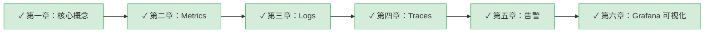

# 可观测性学习系列

> 从零开始系统学习可观测性（Observability），掌握 OpenTelemetry + Grafana Stack 技术栈

## 学习路径

## 章节目录

| 章节 | 标题 | 状态 | 内容 |
|------|------|------|------|
| 01 | [[01-core-concepts\|核心概念]] | 已完成 | 可观测性定义、三大支柱、信号关联 |
| 02 | [[02-metrics\|Metrics（指标）]] | 已完成 | 指标类型、Micrometer、Prometheus、PromQL |
| 03 | [[03-logs\|Logs（日志）]] | 已完成 | 结构化日志、Loki、LogQL、日志与 Trace 关联 |
| 04 | [[04-traces\|Traces（链路追踪）]] | 已完成 | OpenTelemetry、Span、Context Propagation、Tempo |
| 05 | [[05-alerting\|告警]] | 已完成 | Prometheus Rules、Alertmanager、通知渠道、OnCall |
| 06 | [[06-grafana\|Grafana 可视化]] | 已完成 | 数据源配置、仪表盘设计、信号关联、Provisioning |

## 技术栈

本系列基于以下技术栈：

- **采集层**：OpenTelemetry Java Agent + Micrometer
- **处理层**：OpenTelemetry Collector
- **存储层**：Prometheus（指标）+ Loki（日志）+ Tempo（链路）
- **展示层**：Grafana
- **告警层**：Alertmanager

## 相关资源

### 架构决策

- [[decisions/ADR-005-adopt-opentelemetry-grafana-stack-for-observability|ADR-005 采用 OTel + Grafana Stack]] - 为什么选择这个技术栈
- [[decisions/ADR-001-batch-native-observability|ADR-001 Batch 可观测性迁移]] - Spring Batch 原生可观测性支持

### 设计文档

- [[designs/observability/_MOC|可观测性系统设计]] - 完整的架构设计和实现方案
  - [[designs/observability/01-overview|概述]] - 问题陈述、目标、术语表
  - [[designs/observability/02-architecture|架构设计]] - 整体架构、数据流
  - [[designs/observability/03-starter-module|Starter 模块]] - 模块重构、自动配置
  - [[designs/observability/04-otel-integration|OTel 集成]] - Agent 配置、Bridge、日志集成
  - [[designs/observability/05-infrastructure|基础设施]] - Docker Compose、Collector 配置
  - [[designs/observability/06-grafana-visualization|Grafana 可视化]] - 仪表盘、信号关联、告警规则

### TIL

- [[til/2025/11/2025-11-29-observability-complete|可观测性体系完整学习]]

## 外部资源

- [OpenTelemetry 官方文档](https://opentelemetry.io/docs/)
- [Grafana LGTM Stack](https://grafana.com/oss/lgtm-stack/)
- [Spring Boot 3 Observability](https://spring.io/blog/2022/10/12/observability-with-spring-boot-3/)
