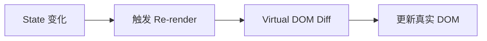
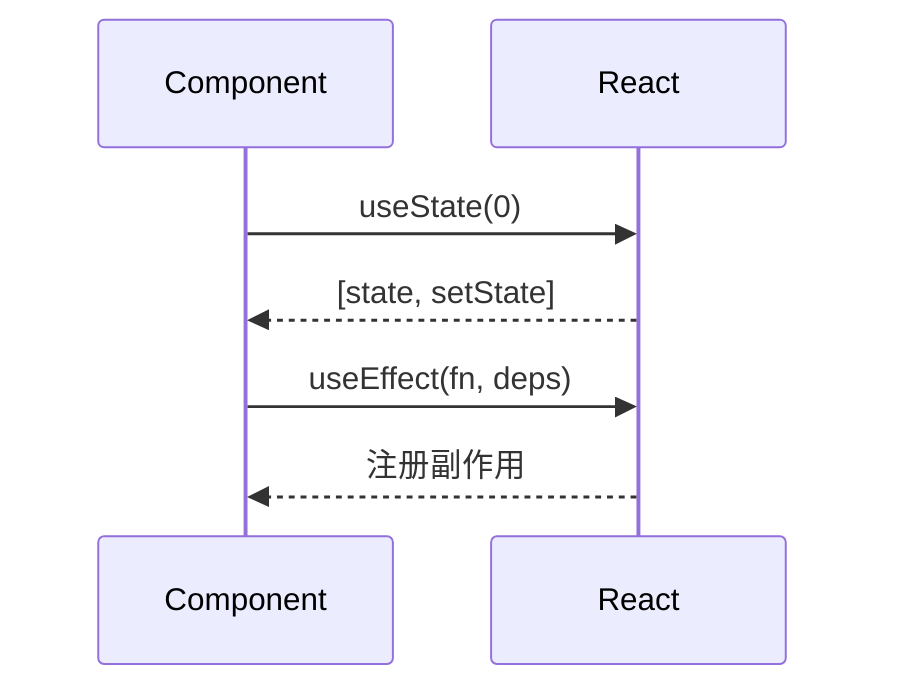

# React 学习助手

## 概述

本 skill 用于 **一节课结束后** 生成个性化学习笔记。核心职责：

1. **生成笔记** - 结合整节课的 context，包括学生的理解情况
2. **更新进度** - 同步更新 `_MOC.md` 进度表

## 触发条件

用户说：「生成笔记」「写笔记」「总结今天」「帮我记笔记」

---

## 核心路径

| 资源 | 路径 |
|------|------|
| **学习文档** | `/Users/linqibin/Desktop/Patra/Patra-docs/content/learning/react` |
| **练习项目** | `/Users/linqibin/Desktop/Patra/patra-react-playground` |
| **进度总览** | `_MOC.md` |

---

## 笔记生成

### 核心原则

> **笔记必须个性化！** 结合整节课的 context，包括学生的理解情况。

1. **回顾整节课** - 讲解内容 + 练习情况 + 批改反馈
2. **识别重难点** - 学生困惑过的地方要重点标注
3. **个性化内容** - 加入"你之前在这里困惑过"的提醒
4. **图表可视化** - 复杂概念**必须**配合适的图表（详见下文）

### 文件位置

```
content/learning/react/ch{XX}-{chapter-name}/
├── 00-overview.md          # 章节概述（如果是新章节）
├── {NN}-{topic}.md         # 本节笔记
└── ...
```

### Frontmatter 模板

```yaml
---
title: {节标题}
chapter: {XX}
section: {NN}
status: 已完成
progress:
  started_at: {开始日期}
  completed_at: {今天日期}
  mastery: {根据练习表现判断：入门/熟悉/掌握/精通}
tags:
  - learning/react/ch{XX}
  - {其他相关标签}
---
```

### 笔记结构

```markdown
# {标题}

> {一句话说明这是什么、为什么重要}

---

## 📋 学习目标

- [x] {已掌握的目标}
- [x] {已掌握的目标}
- [ ] {需要继续加强的目标，如果有}

---

## 📖 知识点

### 1. {概念名称}

{讲解内容 + 代码示例}

{如果学生曾在这里困惑，添加：}
> [!tip] 💡 重点回顾
> 你之前在这里有过疑问："{学生当时的问题}"
>
> 关键理解：{解答要点}

{配图：根据内容选择 Mermaid / D2 / Charts / ASCII}

### 2. {第二个概念}

{内容}

---

## ⚠️ 常见陷阱

{根据学生练习中的错误，总结常见陷阱}

> [!warning] 陷阱 1：{陷阱名称}
> {错误示例和正确做法}

---

## ✏️ 练习回顾

| 练习 | 结果 | 备注 |
|------|------|------|
| [练习 1](idea://...) | ✅ 通过 | {简要说明} |
| [练习 2](idea://...) | ⚠️ 需改进 | {改进建议} |

---

## 🔗 导航

- 上一节：[[{path}|{title}]]
- 下一节：[[{path}|{title}]]
```

### 个性化内容示例

根据学生的实际情况添加：

```markdown
> [!tip] 💡 你的成长记录
> 在今天的学习中，你最初对"闭包捕获变量"有疑惑，
> 但通过练习 2 的调试，你已经理解了其中的原理。
> 这个概念在后续的 useEffect 依赖数组中还会用到！
```

---

## 图表工具选择（重要）

> **优先级：D2 > Mermaid > ASCII / Charts**
>
> 优先使用 D2，它在嵌套结构、架构图、概念关系等场景表现最佳。

### 选择决策流程

```
需要可视化？
    │
    ▼
┌─────────────────────────────────────────────────────┐
│ 1️⃣ 首选 D2 - 问自己：能用 D2 表达吗？               │
│    ✓ 嵌套/层级结构（组件树、架构图）                 │
│    ✓ 概念关系（A 钩入 B、A 包含 B）                  │
│    ✓ 系统拓扑（模块间连接）                         │
│    ✓ 任何需要"容器包含元素"的场景                   │
└─────────────────────────────────────────────────────┘
    │ D2 不太适合？
    ▼
┌─────────────────────────────────────────────────────┐
│ 2️⃣ 次选 Mermaid - 问自己：有明确的流程/时序吗？     │
│    ✓ 流程图（步骤、条件分支）                       │
│    ✓ 时序图（调用顺序、消息传递）                   │
│    ✓ 状态图（状态转换）                             │
└─────────────────────────────────────────────────────┘
    │ 都不适合？
    ▼
┌─────────────────────────────────────────────────────┐
│ 3️⃣ 最后考虑                                        │
│    Charts → 数据统计、对比（柱状图、饼图）           │
│    ASCII  → 极简场景（2-3 个元素、内存布局）         │
└─────────────────────────────────────────────────────┘
```

### 选择决策表

| 内容类型 | 推荐工具 | 优先级 | 理由 |
|----------|----------|--------|------|
| **组件层级/嵌套结构** | D2 | 🥇 首选 | 支持容器嵌套、连接美观 |
| **架构图/系统结构** | D2 | 🥇 首选 | 复杂系统结构表达更清晰 |
| **概念关系图** | D2 | 🥇 首选 | 如 Hook 钩入 React 能力 |
| **流程/步骤** | Mermaid flowchart | 🥈 次选 | 支持条件分支、循环标注 |
| **状态变化** | Mermaid stateDiagram | 🥈 次选 | 清晰展示状态转换 |
| **时序交互** | Mermaid sequenceDiagram | 🥈 次选 | 展示组件/函数调用顺序 |
| **数据对比/统计** | Charts | 🥉 备选 | 柱状图、折线图、饼图 |
| **极简概念（2-3元素）** | ASCII | 🥉 备选 | 无需渲染，代码注释可用 |
| **内存布局/栈堆** | ASCII | 🥉 备选 | 传统表达方式，直观 |

### 典型场景示例

#### 🥇 组件树结构 → D2（首选）

```d2
App: {
  Header
  Main: {
    Sidebar
    Content: {
      Article
      Comments
    }
  }
  Footer
}
```

#### 🥇 概念关系图 → D2（首选）

```d2
direction: down

react: React 内部机制 {
  style.fill: "#e3f2fd"
  state: 状态
  lifecycle: 生命周期
  context: 上下文
}

hooks: Hooks {
  style.fill: "#fff3e0"
  useState
  useEffect
  useContext
}

component: 你的函数组件 {
  style.fill: "#e8f5e9"
}

react.state -> hooks.useState: 🪝
react.lifecycle -> hooks.useEffect: 🪝
react.context -> hooks.useContext: 🪝
hooks -> component: 提供能力
```

#### 🥈 React 渲染流程 → Mermaid flowchart



#### 🥈 Hook 调用时序 → Mermaid sequenceDiagram



#### 🥉 性能对比数据 → Charts

```chart
type: bar
labels: [无优化, useMemo, useCallback]
series:
  - title: 渲染次数
    data: [100, 20, 15]
```

#### 🥉 简单内存模型 → ASCII

```
栈内存          堆内存
┌─────────┐    ┌─────────────┐
│ count   │───→│ { value: 1 }│
└─────────┘    └─────────────┘
```

### 各工具注意事项

#### 🥇 D2 注意事项（首选工具）

- 容器用 `{}` 表示嵌套关系：`App: { Header; Main }`
- 连接线样式：`->` 实线，`-->` 虚线，`<->` 双向
- 样式集中管理：`style.fill: "#e3f2fd"`，不硬编码颜色
- 支持 `shape: oval`、`shape: diamond` 等形状
- 标签换行用 `\n`
- 方向控制：`direction: down` 或 `direction: right`

#### 🥈 Mermaid 注意事项

- 节点文字含特殊字符需用引号包裹：`A["State (初始)"]`
- 使用 `classDef` 集中定义样式，不要内联样式
- flowchart 推荐 LR（左到右）或 TB（上到下）方向
- 复杂图拆分成多个小图，避免过于拥挤

#### 🥉 Charts 注意事项

- 必须使用 YAML 格式
- `type` 支持：bar、line、pie、radar、doughnut
- 颜色不要硬编码，使用默认配色
- 数据标签简洁，避免过长文字

#### 🥉 ASCII 图注意事项

- 仅用于极简场景（2-3 个元素）或无法渲染的环境
- 使用制表符绘制边框：`┌ ─ ┐ │ └ ┘ ├ ┤ ┬ ┴ ┼`
- 箭头：`← → ↑ ↓ ──→`
- 保持对齐，使用等宽字体

---

## Obsidian 语法要点

### 必须遵守

| 规则 | 正确写法 | 错误写法 |
|------|----------|----------|
| 内部链接 | `[[path\|显示名]]` | `[显示名](path.md)` |
| 高亮文本 | `==高亮==` | `<mark>高亮</mark>` |
| 折叠块 | `> [!type]-` | `<details>` |
| 注释 | `%%注释%%` | `<!-- 注释 -->` |
| Callout 内代码块 | 每行以 `>` 开头 | 直接写代码块 |

### Callout 类型

```markdown
> [!note] 说明
> [!tip] 提示/技巧
> [!warning] 警告
> [!danger] 危险
> [!example] 示例
> [!question] 问题
```

### 链接规范

#### 文档内部链接

```markdown
同章节：[[02-destructuring|解构赋值]]
跨章节：[[../ch02-react-basics/01-jsx|JSX 基础]]
```

#### 文档到代码（IDEA 协议）

```markdown
[练习文件](idea://open?file=/Users/linqibin/Desktop/Patra/patra-react-playground/src/exercises/ch01/01-arrow-functions.tsx)
```

---

## 收尾：更新进度

笔记生成后，**必须**同步更新 `_MOC.md` 的进度表格：

```markdown
| 节 | 标题 | 状态 | 掌握程度 |
|---|------|------|---------|
| 01 | [[ch01-.../01-...|标题]] | ✅ 已完成 | 熟悉 |
```

**状态图标**：
- `✅ 已完成` - 笔记已生成
- `🔄 进行中` - 正在学习
- `⏳ 未开始` - 尚未开始

---

## 禁止行为

1. **禁止**生成与学生理解情况无关的通用笔记
2. **禁止**跳过 D2 直接用其他工具（优先级：D2 > Mermaid > ASCII/Charts）
3. **禁止**使用中文文件名
4. **禁止**使用 HTML 标签（用 Obsidian 原生语法）
5. **禁止**在 Callout 内直接写代码块（每行必须以 `>` 开头）
6. **禁止**忘记更新 `_MOC.md` 进度

---

## 参考资源

详细的图表语法规范见 `references/` 目录：

- `mermaid.md` - Mermaid 完整语法
- `d2.md` - D2 声明式图表语法
- `charts.md` - Obsidian Charts 语法
- `obsidian.md` - Obsidian 语法规范
