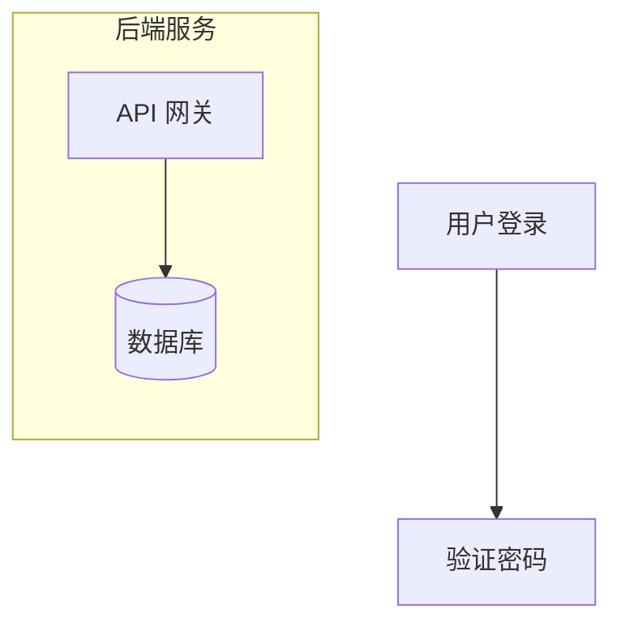
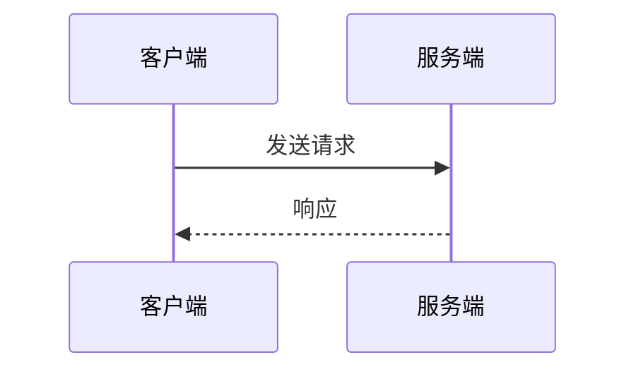

# Mermaid 图表规范

## 强制规则

1. 使用 `flowchart` 而非 `graph`（旧版语法）
2. 节点 ID 与标签分离：ID 仅英文+数字+下划线，标签用中文
3. 必须注入初始化指令（确保浅色模式可读）
4. 单图节点数 ≤50（超过则拆分子图）
5. 禁止 `quadrantChart`、`sankey-beta`（渲染不稳定）

## 图表类型兼容性

| 类型 | 关键词 | 支持 | 注意事项 |
|------|--------|------|----------|
| 流程图 | `flowchart` | ✅ | 首选，需注意子图方向 |
| 时序图 | `sequenceDiagram` | ✅ | 使用别名控制宽度 |
| 类图 | `classDiagram` | ✅ | 需注入 fontSize 修复 |
| 状态图 | `stateDiagram-v2` | ✅ | 强制使用 v2 |
| 饼图 | `pie` | ✅ | 简单数据分布 |
| ER 图 | `erDiagram` | ✅ | 数据库设计 |
| 甘特图 | `gantt` | ⚠️ | 日期格式严格 |
| 时间线 | `timeline` | ❌ | 降级为 gantt |

## 核心语法

### 流程图



**方向**：`TD`/`TB`（从上到下，推荐）、`LR`（从左到右）

**节点形状**：`[矩形]`、`(圆角)`、`{菱形}`、`[(圆柱体)]`、`([终端])`、`{{六边形}}`

### 时序图



长文本使用 `<br/>` 换行

## 样式配置

**必须注入初始化指令**：

```mermaid
%%{init: {
  'theme': 'base',
  'themeVariables': {
    'primaryColor': '#dbeafe',
    'primaryTextColor': '#1e293b',
    'primaryBorderColor': '#3b82f6',
    'lineColor': '#64748b',
    'edgeLabelBackground': '#f1f5f9'
  }
}}%%
```

### 语义化颜色（Tailwind CSS）

| 用途 | 背景色 | 边框色 |
|------|--------|--------|
| 默认 | `#dbeafe` | `#3b82f6` |
| 存储 | `#ede9fe` | `#8b5cf6` |
| 成功 | `#dcfce7` | `#22c55e` |
| 告警 | `#fecaca` | `#ef4444` |

### classDef 规范

**必须同时指定 fill、color、stroke**：

```mermaid
classDef normal fill:#dcfce7,stroke:#22c55e,color:#1e293b;
class A normal;
```

## 布局引擎

| 引擎 | 适用场景 |
|------|----------|
| `dagre`（默认） | 简单树状图（层级 <5） |
| `elk` | 复杂网络图（交叉连接多） |

启用 ELK：`%%{init: {"flowchart": {"defaultRenderer": "elk"}} }%%`

## 禁止行为

1. 禁止使用 `graph`（用 `flowchart`）
2. 禁止使用 `dark` 或 `default` 主题
3. 禁止节点 ID 使用中文或空格
4. 禁止 classDef 缺少 color 属性（导致文字不可见）
