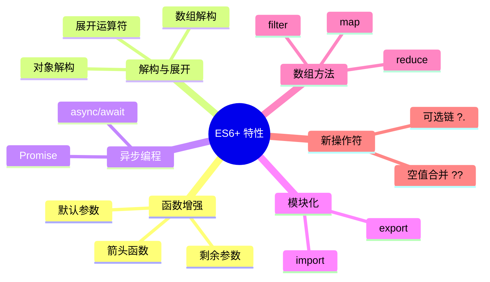

# 第 1 章：JavaScript 现代化

> 掌握 ES6+ 新特性，为 React 开发打下坚实基础

---

## 📋 学习目标

学完本章，你将能够：

- [ ] 使用箭头函数简化函数定义
- [ ] 使用解构赋值提取对象和数组中的值
- [ ] 使用展开运算符进行对象/数组的浅拷贝和合并
- [ ] 使用模板字符串进行字符串拼接
- [ ] 使用 async/await 处理异步操作
- [ ] 理解 ES6 模块化（import/export）
- [ ] 熟练使用数组高阶方法（map/filter/reduce）
- [ ] 使用可选链和空值合并操作符

---

## 🗺️ 知识地图

---

## 1. 箭头函数

### 1.1 基本语法

（待填充：箭头函数语法、与普通函数对比、this 绑定差异）

### 1.2 使用场景

（待填充：回调函数、数组方法、React 事件处理）

---

## 2. 解构赋值

### 2.1 对象解构

（待填充：基本语法、重命名、默认值、嵌套解构）

### 2.2 数组解构

（待填充：基本语法、跳过元素、剩余元素）

### 2.3 在 React 中的应用

（待填充：Props 解构、useState 返回值解构）

---

## 3. 展开运算符

### 3.1 数组展开

（待填充：合并数组、复制数组、函数参数）

### 3.2 对象展开

（待填充：合并对象、浅拷贝、覆盖属性）

### 3.3 不可变更新模式

（待填充：React 状态更新中的应用）

---

## 4. 模板字符串

### 4.1 基本语法

（待填充：反引号、变量插值、表达式）

### 4.2 多行字符串

（待填充：换行、缩进处理）

---

## 5. async/await

### 5.1 Promise 回顾

（待填充：Promise 基础、链式调用、错误处理）

### 5.2 async/await 语法

（待填充：async 函数、await 表达式、错误处理）

### 5.3 并行执行

（待填充：Promise.all、Promise.race）

---

## 6. ES6 模块化

### 6.1 导出（export）

（待填充：命名导出、默认导出、混合导出）

### 6.2 导入（import）

（待填充：命名导入、默认导入、重命名、动态导入）

---

## 7. 数组高阶方法

### 7.1 map

（待填充：语法、返回新数组、React 列表渲染）

### 7.2 filter

（待填充：语法、条件过滤、链式调用）

### 7.3 reduce

（待填充：语法、累加器、常见用例）

### 7.4 其他常用方法

（待填充：find、some、every、forEach）

---

## 8. 可选链和空值合并

### 8.1 可选链操作符 ?.

（待填充：对象属性访问、方法调用、数组访问）

### 8.2 空值合并操作符 ??

（待填充：与 || 的区别、默认值处理）

---

## ⚠️ 常见问题

（学习过程中遇到的问题将记录在这里）

---

## ✏️ 练习

### 练习 1：概念理解

（待添加选择题）

### 练习 2：代码填空

（待添加填空题）

### 练习 3：动手实践

（待添加实践任务）

---

## 📖 本章小结

（学习完成后总结要点）

**下一章预告**：我们将学习 React 的核心概念，包括组件、Props 和 State...
