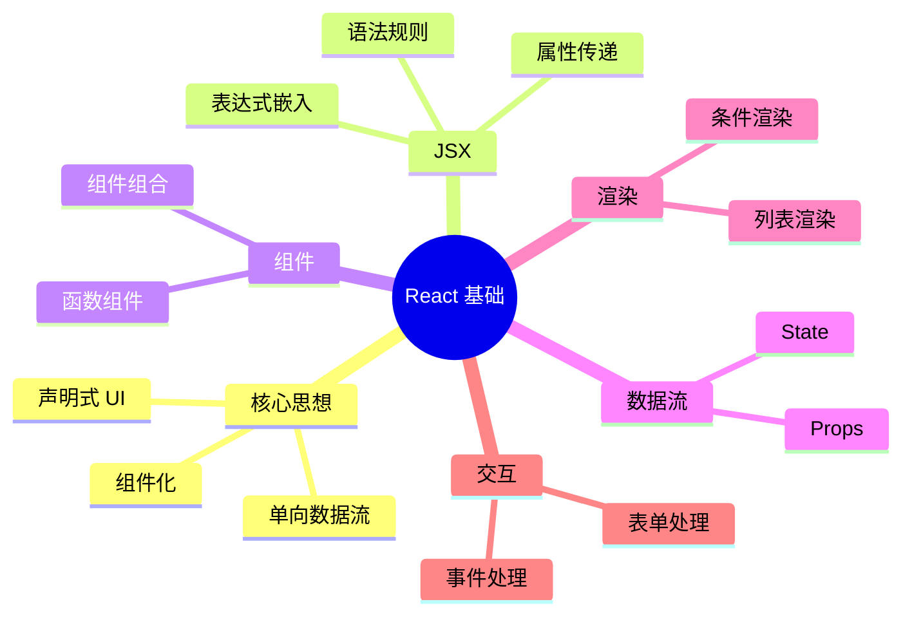

# 第 2 章：React 基础概念

> 理解 React 核心思想，掌握组件化开发基础

---

## 📋 学习目标

学完本章，你将能够：

- [ ] 理解 React 的声明式 UI 和组件化思想
- [ ] 掌握 JSX 语法，在 JavaScript 中编写 UI
- [ ] 创建函数组件，理解组件的基本结构
- [ ] 使用 Props 在组件间传递数据
- [ ] 使用 State 管理组件内部状态
- [ ] 处理用户事件（点击、输入等）
- [ ] 实现条件渲染和列表渲染
- [ ] 创建受控表单组件

---

## 🗺️ 知识地图

---

## 1. React 是什么

### 1.1 声明式 UI

（待填充：声明式 vs 命令式、React 如何描述 UI）

### 1.2 组件化思想

（待填充：组件是什么、组件的好处、组件树）

### 1.3 单向数据流

（待填充：数据从父到子流动、状态提升）

---

## 2. JSX 语法

### 2.1 什么是 JSX

（待填充：JSX 定义、为什么使用 JSX、编译过程）

### 2.2 基本规则

（待填充：单一根元素、闭合标签、className、style）

### 2.3 嵌入表达式

（待填充：花括号语法、条件表达式、函数调用）

---

## 3. 组件基础

### 3.1 函数组件

（待填充：组件定义、命名规范、返回 JSX）

### 3.2 组件组合

（待填充：组件嵌套、children、组件拆分）

### 3.3 组件导入导出

（待填充：export/import、文件组织）

---

## 4. Props

### 4.1 传递 Props

（待填充：属性传递语法、传递不同类型的值）

### 4.2 读取 Props

（待填充：函数参数解构、Props 类型）

### 4.3 默认值

（待填充：默认参数、defaultProps）

---

## 5. State

### 5.1 useState 基础

（待填充：useState 语法、初始值、更新函数）

### 5.2 状态更新

（待填充：不可变更新、函数式更新）

### 5.3 多个状态

（待填充：多个 useState、何时拆分状态）

---

## 6. 事件处理

### 6.1 事件绑定

（待填充：onClick、onChange、事件对象）

### 6.2 事件处理函数

（待填充：内联函数、独立函数、传递参数）

### 6.3 阻止默认行为

（待填充：preventDefault、stopPropagation）

---

## 7. 条件渲染

### 7.1 if 语句

（待填充：早期返回、条件变量）

### 7.2 三元表达式

（待填充：简洁条件渲染、嵌套三元）

### 7.3 逻辑与 &&

（待填充：短路求值、注意事项）

---

## 8. 列表渲染

### 8.1 map 渲染列表

（待填充：基本语法、返回 JSX 数组）

### 8.2 key 属性

（待填充：为什么需要 key、如何选择 key、常见错误）

### 8.3 过滤和排序

（待填充：filter + map、排序列表）

---

## 9. 表单处理

### 9.1 受控组件

（待填充：value + onChange、状态绑定）

### 9.2 常见表单元素

（待填充：input、textarea、select、checkbox）

### 9.3 表单提交

（待填充：onSubmit、阻止默认行为、收集数据）

---

## ⚠️ 常见问题

（学习过程中遇到的问题将记录在这里）

---

## ✏️ 练习

### 练习 1：概念理解

（待添加选择题）

### 练习 2：代码填空

（待添加填空题）

### 练习 3：动手实践

（待添加实践任务）

---

## 📖 本章小结

（学习完成后总结要点）

**下一章预告**：我们将深入学习 React Hooks，掌握 useEffect、useContext 等更多 Hook...
