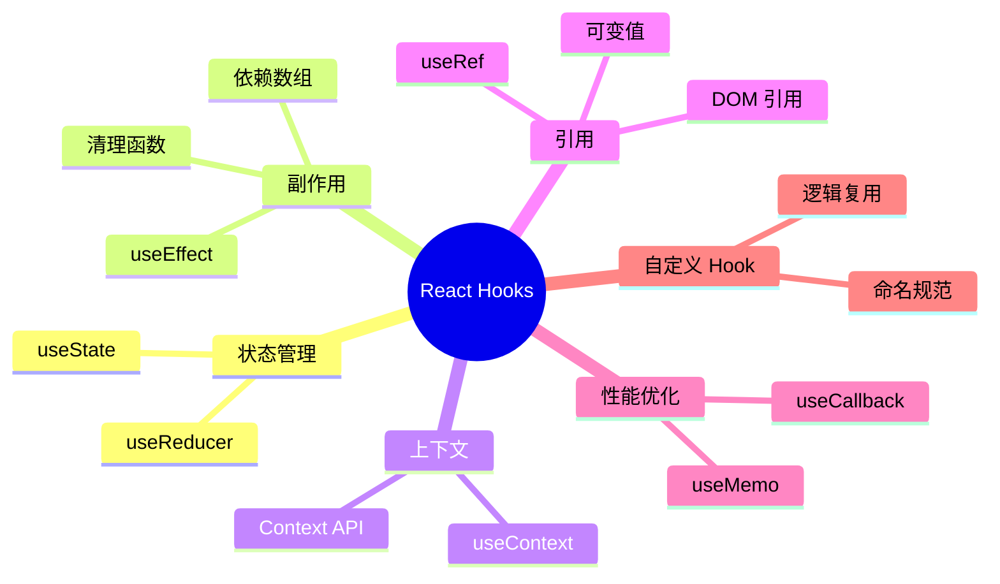

# 第 3 章：React Hooks 深入

> 深入理解 React Hooks，掌握状态管理和副作用处理

---

## 📋 学习目标

学完本章，你将能够：

- [ ] 深入理解 useState 的工作原理
- [ ] 使用 useEffect 处理副作用（数据获取、订阅等）
- [ ] 使用 useContext 实现跨组件状态共享
- [ ] 使用 useRef 获取 DOM 引用和保存可变值
- [ ] 使用 useMemo 和 useCallback 进行性能优化
- [ ] 创建自定义 Hook 复用逻辑
- [ ] 理解 Hooks 的规则和最佳实践

---

## 🗺️ 知识地图

---

## 1. useState 深入

### 1.1 状态更新机制

（待填充：批量更新、异步更新、闭包陷阱）

### 1.2 函数式更新

（待填充：使用场景、避免闭包问题）

### 1.3 惰性初始化

（待填充：传递函数作为初始值）

---

## 2. useEffect

### 2.1 什么是副作用

（待填充：副作用定义、常见副作用类型）

### 2.2 基本用法

（待填充：语法结构、执行时机）

### 2.3 依赖数组

（待填充：依赖追踪、空数组、省略数组）

### 2.4 清理函数

（待填充：返回清理函数、清理时机、避免内存泄漏）

### 2.5 常见用例

（待填充：数据获取、事件监听、定时器）

---

## 3. useContext

### 3.1 Context API 基础

（待填充：createContext、Provider、Consumer）

### 3.2 useContext 用法

（待填充：简化 Consumer、获取上下文值）

### 3.3 使用场景

（待填充：主题切换、用户认证、多语言）

---

## 4. useRef

### 4.1 获取 DOM 引用

（待填充：ref 属性、操作 DOM）

### 4.2 保存可变值

（待填充：不触发重渲染、保存前一个值）

### 4.3 与 useState 对比

（待填充：何时用 ref、何时用 state）

---

## 5. useMemo

### 5.1 计算缓存

（待填充：避免重复计算、依赖数组）

### 5.2 使用场景

（待填充：昂贵计算、引用稳定性）

### 5.3 注意事项

（待填充：不要过度使用、性能权衡）

---

## 6. useCallback

### 6.1 函数缓存

（待填充：避免函数重建、依赖数组）

### 6.2 与子组件优化

（待填充：配合 React.memo、避免不必要渲染）

### 6.3 与 useMemo 对比

（待填充：关系和区别）

---

## 7. 自定义 Hook

### 7.1 创建自定义 Hook

（待填充：命名规范、提取逻辑）

### 7.2 常见自定义 Hook

（待填充：useLocalStorage、useDebounce、useFetch）

### 7.3 组合 Hook

（待填充：Hook 嵌套使用）

---

## 8. Hooks 规则

### 8.1 只在顶层调用

（待填充：不能在条件、循环中调用）

### 8.2 只在函数组件中调用

（待填充：函数组件、自定义 Hook）

### 8.3 ESLint 插件

（待填充：eslint-plugin-react-hooks）

---

## ⚠️ 常见问题

（学习过程中遇到的问题将记录在这里）

---

## ✏️ 练习

### 练习 1：概念理解

（待添加选择题）

### 练习 2：代码填空

（待添加填空题）

### 练习 3：动手实践

（待添加实践任务）

---

## 📖 本章小结

（学习完成后总结要点）

**下一章预告**：我们将学习 TypeScript，为 React 开发添加类型安全...
