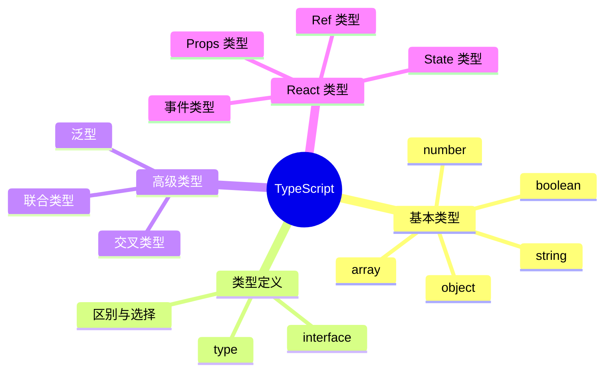

# 第 4 章：TypeScript 入门

> 为 React 开发添加类型安全，提升代码质量和开发体验

---

## 📋 学习目标

学完本章，你将能够：

- [ ] 理解 TypeScript 的价值和基本概念
- [ ] 使用基本类型（string、number、boolean、array）
- [ ] 定义接口（interface）和类型别名（type）
- [ ] 使用泛型编写可复用的类型
- [ ] 使用联合类型和交叉类型
- [ ] 在 React 组件中使用 TypeScript
- [ ] 为 Props、State、事件添加类型

---

## 🗺️ 知识地图

---

## 1. 为什么用 TypeScript

### 1.1 类型安全的价值

（待填充：编译时错误检查、IDE 智能提示）

### 1.2 与 JavaScript 的关系

（待填充：超集关系、渐进式采用）

### 1.3 开发体验提升

（待填充：自动补全、重构安全）

---

## 2. 基本类型

### 2.1 原始类型

（待填充：string、number、boolean、null、undefined）

### 2.2 数组类型

（待填充：两种语法、元组）

### 2.3 对象类型

（待填充：对象字面量类型、可选属性）

### 2.4 特殊类型

（待填充：any、unknown、void、never）

---

## 3. 接口与类型别名

### 3.1 接口（interface）

（待填充：定义语法、可选属性、只读属性）

### 3.2 类型别名（type）

（待填充：定义语法、与 interface 对比）

### 3.3 何时使用哪个

（待填充：选择建议、团队规范）

---

## 4. 泛型

### 4.1 泛型基础

（待填充：泛型函数、泛型接口）

### 4.2 泛型约束

（待填充：extends 关键字、约束类型）

### 4.3 常见泛型类型

（待填充：Array<T>、Promise<T>、Record<K, V>）

---

## 5. 联合类型与交叉类型

### 5.1 联合类型（|）

（待填充：多类型选择、类型收窄）

### 5.2 交叉类型（&）

（待填充：类型合并、对象扩展）

### 5.3 类型守卫

（待填充：typeof、in、instanceof、自定义守卫）

---

## 6. 类型断言

### 6.1 as 关键字

（待填充：断言语法、使用场景）

### 6.2 非空断言

（待填充：! 操作符、谨慎使用）

---

## 7. React + TypeScript

### 7.1 组件 Props 类型

（待填充：定义 Props 接口、可选 Props、children 类型）

### 7.2 useState 类型

（待填充：类型推断、显式类型）

### 7.3 事件处理类型

（待填充：React.MouseEvent、React.ChangeEvent）

### 7.4 Ref 类型

（待填充：useRef 泛型、DOM 元素类型）

---

## ⚠️ 常见问题

（学习过程中遇到的问题将记录在这里）

---

## ✏️ 练习

### 练习 1：概念理解

（待添加选择题）

### 练习 2：代码填空

（待添加填空题）

### 练习 3：动手实践

（待添加实践任务）

---

## 📖 本章小结

（学习完成后总结要点）

**下一章预告**：我们将学习 React Router，实现单页应用的路由功能...
