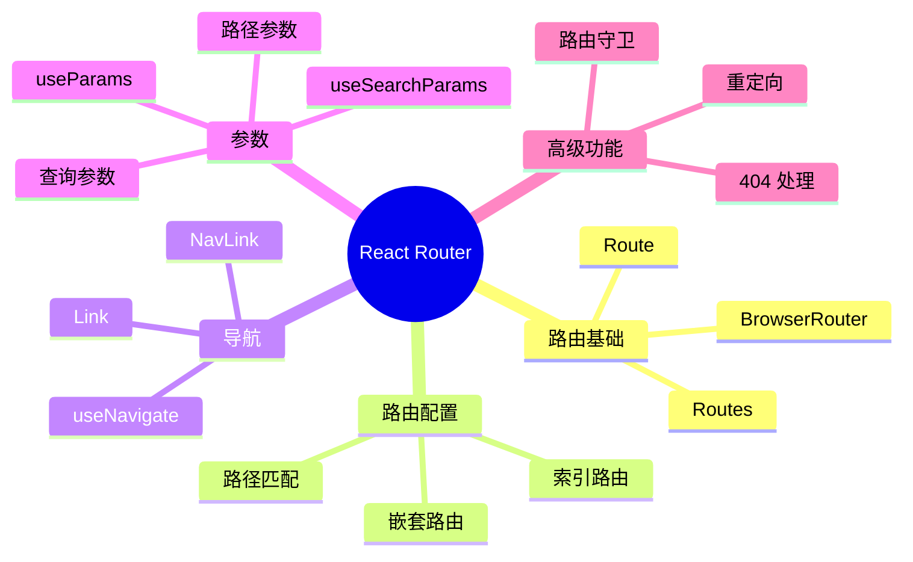

# 第 5 章：React Router 路由

> 实现单页应用的客户端路由，管理页面导航

---

## 📋 学习目标

学完本章，你将能够：

- [ ] 理解客户端路由的工作原理
- [ ] 配置 React Router 基本路由
- [ ] 实现嵌套路由和布局组件
- [ ] 使用动态路由和路径参数
- [ ] 使用 Link 和 useNavigate 进行导航
- [ ] 实现路由守卫（权限控制）
- [ ] 处理 404 页面和重定向

---

## 🗺️ 知识地图

---

## 1. 路由基础

### 1.1 什么是客户端路由

（待填充：SPA 路由原理、与服务端路由对比）

### 1.2 安装和配置

（待填充：安装 react-router-dom、BrowserRouter 设置）

### 1.3 基本路由定义

（待填充：Routes、Route 组件、path 和 element）

---

## 2. 路由模式

### 2.1 BrowserRouter

（待填充：HTML5 History API、需要服务器配置）

### 2.2 HashRouter

（待填充：Hash 模式、兼容性）

### 2.3 如何选择

（待填充：现代应用推荐 BrowserRouter）

---

## 3. 嵌套路由

### 3.1 布局组件

（待填充：Outlet 组件、共享布局）

### 3.2 嵌套配置

（待填充：子路由定义、路径拼接）

### 3.3 索引路由

（待填充：index 属性、默认子路由）

---

## 4. 动态路由

### 4.1 路径参数

（待填充：:param 语法、useParams Hook）

### 4.2 可选参数

（待填充：? 后缀、可选段）

### 4.3 通配符

（待填充：* 匹配、捕获剩余路径）

---

## 5. 导航

### 5.1 Link 组件

（待填充：声明式导航、to 属性）

### 5.2 NavLink 组件

（待填充：活动状态样式、isActive）

### 5.3 useNavigate Hook

（待填充：编程式导航、replace 选项）

---

## 6. 查询参数

### 6.1 useSearchParams

（待填充：获取和设置查询参数）

### 6.2 与状态结合

（待填充：URL 作为状态源）

---

## 7. 路由守卫

### 7.1 权限检查

（待填充：包装组件、认证判断）

### 7.2 重定向

（待填充：Navigate 组件、登录跳转）

### 7.3 加载状态

（待填充：loader 函数、数据预加载）

---

## 8. 错误处理

### 8.1 404 页面

（待填充：path="*" 捕获、NotFound 组件）

### 8.2 错误边界

（待填充：errorElement 属性）

---

## ⚠️ 常见问题

（学习过程中遇到的问题将记录在这里）

---

## ✏️ 练习

### 练习 1：概念理解

（待添加选择题）

### 练习 2：代码填空

（待添加填空题）

### 练习 3：动手实践

（待添加实践任务）

---

## 📖 本章小结

（学习完成后总结要点）

**下一章预告**：我们将学习状态管理，使用 Zustand 管理全局应用状态...
