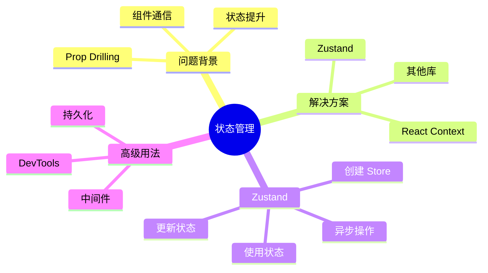

# 第 6 章：状态管理

> 使用 Zustand 管理全局应用状态，解决组件间通信问题

---

## 📋 学习目标

学完本章，你将能够：

- [ ] 理解为什么需要全局状态管理
- [ ] 理解 React Context 的优缺点
- [ ] 使用 Zustand 创建和使用 Store
- [ ] 设计合理的状态结构
- [ ] 处理异步操作和状态更新
- [ ] 实现状态持久化
- [ ] 掌握状态管理最佳实践

---

## 🗺️ 知识地图

---

## 1. 为什么需要状态管理

### 1.1 组件通信问题

（待填充：父子通信、跨层级通信、Prop Drilling）

### 1.2 状态提升的局限

（待填充：状态位置、重渲染问题）

### 1.3 全局状态场景

（待填充：用户认证、主题设置、购物车）

---

## 2. React Context

### 2.1 Context 基础

（待填充：createContext、Provider、useContext）

### 2.2 优缺点分析

（待填充：简单场景适用、性能问题）

### 2.3 何时使用 Context

（待填充：低频更新、主题/语言等）

---

## 3. Zustand 入门

### 3.1 为什么选择 Zustand

（待填充：轻量、简单、TypeScript 友好）

### 3.2 创建 Store

（待填充：create 函数、状态和操作）

### 3.3 使用状态

（待填充：Hook 调用、选择器）

### 3.4 更新状态

（待填充：set 函数、不可变更新）

---

## 4. Store 设计

### 4.1 状态结构

（待填充：扁平化、规范化）

### 4.2 拆分 Store

（待填充：按功能拆分、组合 Store）

### 4.3 TypeScript 类型

（待填充：Store 类型定义）

---

## 5. 异步操作

### 5.1 异步 Action

（待填充：async/await、加载状态）

### 5.2 错误处理

（待填充：错误状态、try/catch）

### 5.3 与 TanStack Query 配合

（待填充：职责划分、服务端状态 vs 客户端状态）

---

## 6. 高级用法

### 6.1 中间件

（待填充：日志、持久化）

### 6.2 状态持久化

（待填充：persist 中间件、localStorage）

### 6.3 DevTools

（待填充：Redux DevTools 集成）

---

## ⚠️ 常见问题

（学习过程中遇到的问题将记录在这里）

---

## ✏️ 练习

### 练习 1：概念理解

（待添加选择题）

### 练习 2：代码填空

（待添加填空题）

### 练习 3：动手实践

（待添加实践任务）

---

## 📖 本章小结

（学习完成后总结要点）

**下一章预告**：我们将学习数据获取，使用 TanStack Query 管理服务端状态...
