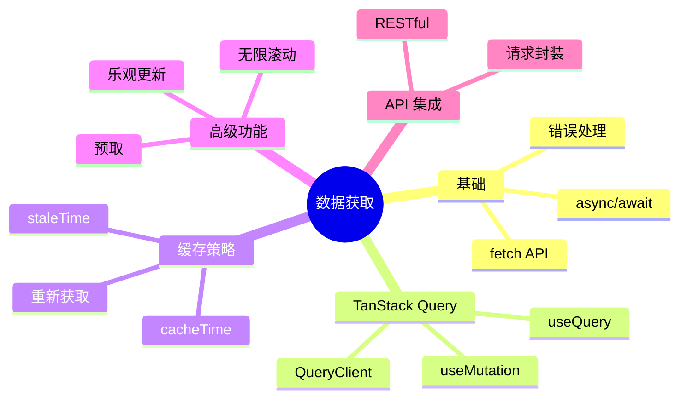

# 第 7 章：数据获取

> 使用 TanStack Query 管理服务端状态，优雅处理 API 请求

---

## 📋 学习目标

学完本章，你将能够：

- [ ] 理解服务端状态与客户端状态的区别
- [ ] 使用 fetch API 发送 HTTP 请求
- [ ] 使用 TanStack Query 的 useQuery 获取数据
- [ ] 使用 useMutation 进行数据变更
- [ ] 配置缓存策略和刷新策略
- [ ] 实现乐观更新优化用户体验
- [ ] 与 Patra 后端 API 集成

---

## 🗺️ 知识地图

---

## 1. fetch API

### 1.1 基本用法

（待填充：GET/POST 请求、请求配置）

### 1.2 错误处理

（待填充：HTTP 错误、网络错误）

### 1.3 封装请求函数

（待填充：基础 URL、拦截器模式）

---

## 2. 服务端状态 vs 客户端状态

### 2.1 概念区分

（待填充：定义、特征、管理方式）

### 2.2 为什么需要专门管理

（待填充：缓存、同步、加载状态）

---

## 3. TanStack Query 入门

### 3.1 安装和配置

（待填充：安装依赖、QueryClientProvider）

### 3.2 useQuery 基础

（待填充：查询键、查询函数、返回值）

### 3.3 加载和错误状态

（待填充：isLoading、isError、error）

---

## 4. 数据查询

### 4.1 查询键设计

（待填充：数组键、对象参数）

### 4.2 依赖查询

（待填充：enabled 选项）

### 4.3 并行查询

（待填充：useQueries）

---

## 5. 缓存策略

### 5.1 staleTime

（待填充：数据新鲜度、避免重复请求）

### 5.2 cacheTime

（待填充：缓存保留时间）

### 5.3 重新获取触发

（待填充：refetch、invalidate、window focus）

---

## 6. 数据变更

### 6.1 useMutation

（待填充：变更函数、返回值）

### 6.2 变更后更新

（待填充：invalidateQueries、setQueryData）

### 6.3 乐观更新

（待填充：onMutate、onError、onSettled）

---

## 7. 与后端 API 集成

### 7.1 API 请求封装

（待填充：统一错误处理、认证 token）

### 7.2 对接 Patra Gateway

（待填充：接口规范、响应格式）

---

## ⚠️ 常见问题

（学习过程中遇到的问题将记录在这里）

---

## ✏️ 练习

### 练习 1：概念理解

（待添加选择题）

### 练习 2：代码填空

（待添加填空题）

### 练习 3：动手实践

（待添加实践任务）

---

## 📖 本章小结

（学习完成后总结要点）

**下一章预告**：我们将学习 Ant Design 组件库，快速构建专业 UI...
