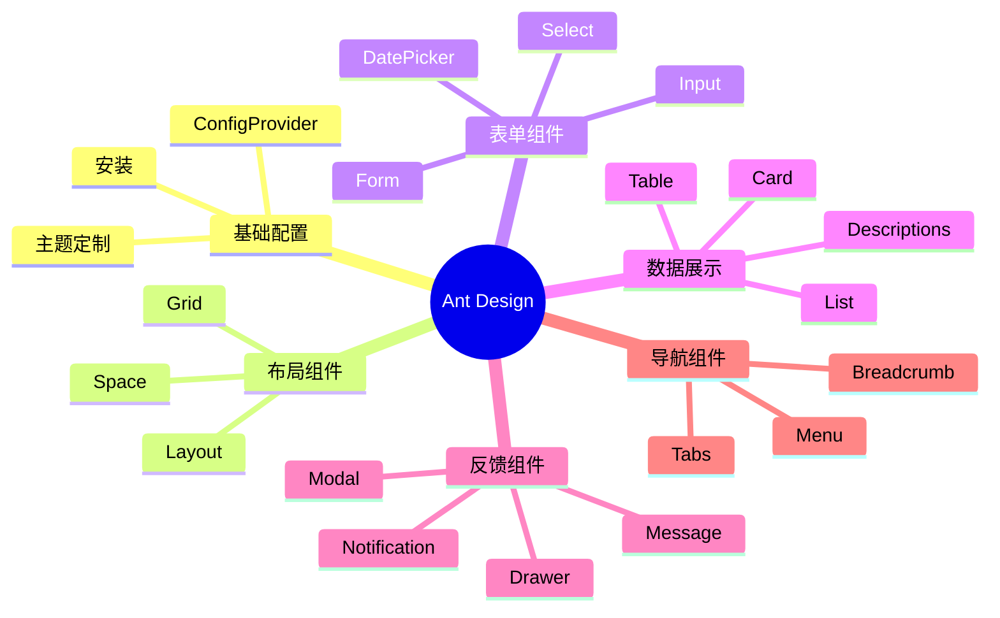

# 第 8 章：Ant Design 组件库

> 使用企业级 UI 组件库，快速构建专业美观的界面

---

## 📋 学习目标

学完本章，你将能够：

- [ ] 安装和配置 Ant Design
- [ ] 使用常用布局组件（Layout、Grid、Space）
- [ ] 使用表单组件（Form、Input、Select）
- [ ] 使用数据展示组件（Table、List、Card）
- [ ] 使用反馈组件（Message、Notification、Modal）
- [ ] 自定义主题和样式
- [ ] 按需加载优化包体积

---

## 🗺️ 知识地图

---

## 1. 安装和配置

### 1.1 安装 Ant Design

（待填充：npm install、版本选择）

### 1.2 基本使用

（待填充：导入组件、样式引入）

### 1.3 ConfigProvider

（待填充：全局配置、语言设置）

---

## 2. 布局组件

### 2.1 Layout 布局

（待填充：Header/Sider/Content/Footer、响应式）

### 2.2 Grid 栅格

（待填充：Row/Col、响应式断点）

### 2.3 Space 间距

（待填充：水平/垂直间距、对齐方式）

---

## 3. 表单组件

### 3.1 Form 表单

（待填充：Form/Form.Item、验证规则）

### 3.2 输入组件

（待填充：Input、TextArea、InputNumber）

### 3.3 选择组件

（待填充：Select、Radio、Checkbox）

### 3.4 日期时间

（待填充：DatePicker、TimePicker）

### 3.5 表单提交

（待填充：onFinish、表单实例方法）

---

## 4. 数据展示

### 4.1 Table 表格

（待填充：columns、dataSource、分页、排序）

### 4.2 List 列表

（待填充：基本列表、加载更多）

### 4.3 Card 卡片

（待填充：基本卡片、Grid 卡片）

### 4.4 Descriptions 描述列表

（待填充：详情页展示）

---

## 5. 反馈组件

### 5.1 Message 消息

（待填充：success/error/warning/info）

### 5.2 Notification 通知

（待填充：通知配置、位置）

### 5.3 Modal 对话框

（待填充：确认框、自定义内容）

### 5.4 Drawer 抽屉

（待填充：侧边抽屉、表单场景）

---

## 6. 导航组件

### 6.1 Menu 菜单

（待填充：垂直/水平菜单、子菜单）

### 6.2 Breadcrumb 面包屑

（待填充：导航路径、与路由结合）

### 6.3 Tabs 标签页

（待填充：基本标签、卡片式标签）

---

## 7. 主题定制

### 7.1 CSS 变量

（待填充：覆盖变量、动态主题）

### 7.2 ConfigProvider 主题

（待填充：token 配置、算法）

---

## ⚠️ 常见问题

（学习过程中遇到的问题将记录在这里）

---

## ✏️ 练习

### 练习 1：概念理解

（待添加选择题）

### 练习 2：代码填空

（待添加填空题）

### 练习 3：动手实践

（待添加实践任务）

---

## 📖 本章小结

（学习完成后总结要点）

**下一章预告**：我们将学习 Ant Design Pro，使用企业级脚手架快速搭建管理后台...
