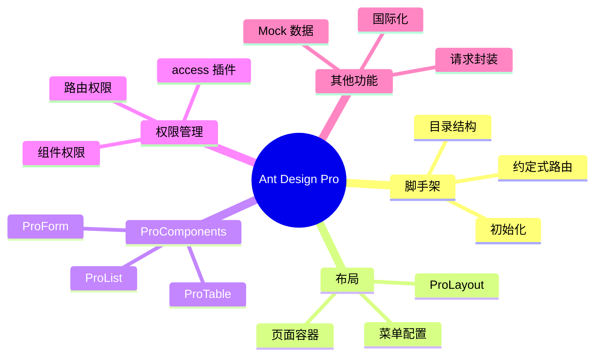

# 第 9 章：Ant Design Pro

> 使用企业级管理后台脚手架，快速搭建功能完善的后台系统

---

## 📋 学习目标

学完本章，你将能够：

- [ ] 使用 Ant Design Pro 脚手架初始化项目
- [ ] 理解项目目录结构和约定
- [ ] 使用 ProLayout 构建页面布局
- [ ] 使用 ProTable 创建高级数据表格
- [ ] 使用 ProForm 创建复杂表单
- [ ] 配置权限管理（access）
- [ ] 配置国际化（i18n）

---

## 🗺️ 知识地图

---

## 1. 项目初始化

### 1.1 创建项目

（待填充：pro-cli、模板选择）

### 1.2 目录结构

（待填充：src 目录、约定说明）

### 1.3 配置文件

（待填充：config/config.ts、代理配置）

---

## 2. UmiJS 基础

### 2.1 约定式路由

（待填充：文件即路由、动态路由）

### 2.2 插件体系

（待填充：常用插件、自定义插件）

### 2.3 请求封装

（待填充：umi-request、拦截器）

---

## 3. ProLayout

### 3.1 布局配置

（待填充：layout 属性、自定义布局）

### 3.2 菜单配置

（待填充：routes 菜单、图标、权限）

### 3.3 页面容器

（待填充：PageContainer、面包屑、标签）

---

## 4. ProTable

### 4.1 基础用法

（待填充：columns、request 函数）

### 4.2 搜索表单

（待填充：search 配置、表单项类型）

### 4.3 工具栏

（待填充：toolBarRender、操作按钮）

### 4.4 可编辑表格

（待填充：editable 配置）

---

## 5. ProForm

### 5.1 基础表单

（待填充：ProForm、表单项组件）

### 5.2 分步表单

（待填充：StepsForm）

### 5.3 弹窗表单

（待填充：ModalForm、DrawerForm）

### 5.4 查询筛选

（待填充：QueryFilter、LightFilter）

---

## 6. 权限管理

### 6.1 access 插件

（待填充：定义权限、access.ts）

### 6.2 路由权限

（待填充：路由配置权限）

### 6.3 组件权限

（待填充：Access 组件、useAccess）

---

## 7. 国际化

### 7.1 配置 i18n

（待填充：locale 配置、语言文件）

### 7.2 使用翻译

（待填充：useIntl、FormattedMessage）

---

## ⚠️ 常见问题

（学习过程中遇到的问题将记录在这里）

---

## ✏️ 练习

### 练习 1：概念理解

（待添加选择题）

### 练习 2：代码填空

（待添加填空题）

### 练习 3：动手实践

（待添加实践任务）

---

## 📖 本章小结

（学习完成后总结要点）

**下一章预告**：我们将进入项目实战，使用所学知识构建 Patra Admin 管理后台...
