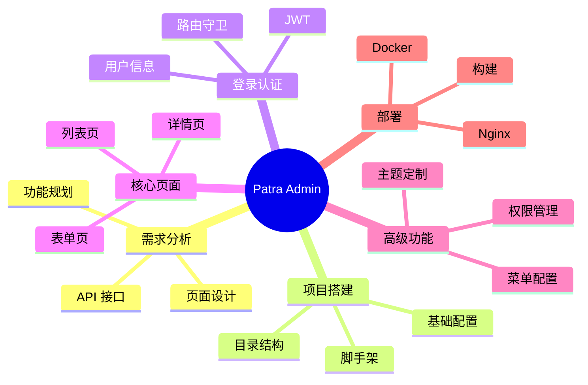

# 第 10 章：项目实战

> 综合运用所学知识，构建 Patra Admin 管理后台

---

## 📋 学习目标

学完本章，你将能够：

- [ ] 分析后台管理系统需求
- [ ] 使用 Ant Design Pro 初始化项目
- [ ] 对接 Patra Gateway 实现登录认证
- [ ] 开发列表页（分页、筛选、排序）
- [ ] 开发详情页（数据展示）
- [ ] 开发表单页（新增、编辑）
- [ ] 配置权限和菜单
- [ ] 部署上线

---

## 🗺️ 知识地图

---

## 1. 需求分析

### 1.1 Patra Admin 功能规划

（待填充：核心功能模块、优先级排序）

### 1.2 页面设计

（待填充：页面列表、交互设计）

### 1.3 API 接口

（待填充：接口文档、数据结构）

---

## 2. 项目初始化

### 2.1 创建项目

（待填充：使用 Ant Design Pro 脚手架）

### 2.2 项目配置

（待填充：代理配置、环境变量）

### 2.3 目录结构规划

（待填充：页面组织、公共组件）

---

## 3. 登录认证

### 3.1 登录页面

（待填充：表单设计、接口对接）

### 3.2 JWT 集成

（待填充：token 存储、请求拦截）

### 3.3 用户信息

（待填充：获取用户信息、全局状态）

### 3.4 路由守卫

（待填充：登录状态检查、重定向）

---

## 4. 列表页开发

### 4.1 ProTable 配置

（待填充：columns 定义、request 函数）

### 4.2 分页处理

（待填充：分页参数、后端对接）

### 4.3 筛选和排序

（待填充：搜索表单、排序参数）

### 4.4 操作按钮

（待填充：新增、编辑、删除）

---

## 5. 详情页开发

### 5.1 数据获取

（待填充：useQuery 获取详情）

### 5.2 数据展示

（待填充：Descriptions、Card 布局）

### 5.3 关联数据

（待填充：Tab 切换、列表展示）

---

## 6. 表单页开发

### 6.1 新增表单

（待填充：ProForm、提交处理）

### 6.2 编辑表单

（待填充：数据回填、更新提交）

### 6.3 表单验证

（待填充：验证规则、自定义验证）

---

## 7. 权限和菜单

### 7.1 角色权限

（待填充：access 配置、权限判断）

### 7.2 菜单配置

（待填充：routes 菜单、动态菜单）

---

## 8. 部署上线

### 8.1 构建优化

（待填充：生产构建、体积优化）

### 8.2 Nginx 配置

（待填充：静态资源、路由重定向）

### 8.3 Docker 部署

（待填充：Dockerfile、容器化）

---

## ⚠️ 常见问题

（项目开发中遇到的问题将记录在这里）

---

## ✏️ 练习

本章为实战项目，练习即为完成以下任务：

- [ ] 完成登录功能
- [ ] 完成至少一个 CRUD 模块
- [ ] 配置权限控制
- [ ] 完成构建部署

---

## 📖 本章小结

（项目完成后总结要点）

**恭喜完成！** 你已经掌握了 React 技术栈的核心知识，并成功构建了 Patra Admin 管理后台。
