# React 学习系列

> 从零开始系统学习 React 技术栈，为 Patra 项目构建网页应用和管理后台

---

## 📊 学习进度

| 章节 | 标题 | 状态 | 开始日期 | 耗时 | 掌握程度 |
|------|------|------|----------|------|----------|
| 01 | [[01-javascript-modern\|JavaScript 现代化]] | 未开始 | - | - | - |
| 02 | [[02-react-basics\|React 基础概念]] | 未开始 | - | - | - |
| 03 | [[03-react-hooks\|React Hooks 深入]] | 未开始 | - | - | - |
| 04 | [[04-typescript\|TypeScript 入门]] | 未开始 | - | - | - |
| 05 | [[05-react-router\|React Router 路由]] | 未开始 | - | - | - |
| 06 | [[06-state-management\|状态管理]] | 未开始 | - | - | - |
| 07 | [[07-data-fetching\|数据获取]] | 未开始 | - | - | - |
| 08 | [[08-ant-design\|Ant Design 组件库]] | 未开始 | - | - | - |
| 09 | [[09-ant-design-pro\|Ant Design Pro]] | 未开始 | - | - | - |
| 10 | [[10-project-practice\|项目实战]] | 未开始 | - | - | - |

**总进度**：0 / 10 章完成

---

## 🗺️ 学习路线图

```mermaid
flowchart LR
    A[JS 现代化] --> B[React 基础]
    B --> C[Hooks 深入]
    C --> D[TypeScript]
    D --> E[React Router]
    E --> F[状态管理]
    F --> G[数据获取]
    G --> H[Ant Design]
    H --> I[AntD Pro]
    I --> J[项目实战]

    style A fill:#f5f5f5,stroke:#999
    style B fill:#f5f5f5,stroke:#999
    style C fill:#f5f5f5,stroke:#999
    style D fill:#f5f5f5,stroke:#999
    style E fill:#f5f5f5,stroke:#999
    style F fill:#f5f5f5,stroke:#999
    style G fill:#f5f5f5,stroke:#999
    style H fill:#f5f5f5,stroke:#999
    style I fill:#f5f5f5,stroke:#999
    style J fill:#f5f5f5,stroke:#999
```

---

## 📚 章节目录

### 第一阶段：基础入门

打好 JavaScript 和 React 基础，理解核心概念。

- [[01-javascript-modern|第 1 章：JavaScript 现代化]] - ES6+ 新特性，React 开发必备
- [[02-react-basics|第 2 章：React 基础概念]] - 组件、Props、State、事件处理
- [[03-react-hooks|第 3 章：React Hooks 深入]] - useState、useEffect、自定义 Hooks

### 第二阶段：工程化

掌握现代前端工程化工具和实践。

- [[04-typescript|第 4 章：TypeScript 入门]] - 类型系统、接口、泛型
- [[05-react-router|第 5 章：React Router 路由]] - 路由配置、嵌套路由、路由守卫
- [[06-state-management|第 6 章：状态管理]] - Zustand 轻量级状态管理
- [[07-data-fetching|第 7 章：数据获取]] - TanStack Query、缓存策略

### 第三阶段：企业级实战

使用企业级组件库和脚手架，构建真实项目。

- [[08-ant-design|第 8 章：Ant Design 组件库]] - 常用组件、表单、表格
- [[09-ant-design-pro|第 9 章：Ant Design Pro]] - 脚手架、ProComponents
- [[10-project-practice|第 10 章：项目实战]] - Patra Admin 管理后台开发

---

## 🛠️ 技术栈

本系列将涵盖以下技术：

| 类别 | 技术 | 说明 |
|------|------|------|
| **核心框架** | React 19 | 最新版 React |
| **类型系统** | TypeScript | 类型安全开发 |
| **构建工具** | Vite | 极速开发体验 |
| **路由** | React Router | 客户端路由 |
| **状态管理** | Zustand | 轻量级状态管理 |
| **数据获取** | TanStack Query | 服务端状态管理 |
| **UI 组件** | Ant Design | 企业级组件库 |
| **脚手架** | Ant Design Pro | 管理后台脚手架 |

---

## 🎯 学习目标

完成本系列学习后，你将能够：

- [ ] 熟练使用 ES6+ 语法编写现代 JavaScript
- [ ] 理解 React 核心概念，编写函数组件
- [ ] 熟练使用 React Hooks 管理状态和副作用
- [ ] 使用 TypeScript 进行类型安全的 React 开发
- [ ] 配置和使用 React Router 实现 SPA 路由
- [ ] 使用 Zustand 管理全局状态
- [ ] 使用 TanStack Query 处理 API 请求
- [ ] 熟练使用 Ant Design 组件构建 UI
- [ ] 使用 Ant Design Pro 快速搭建管理后台
- [ ] 独立完成 Patra Admin 项目开发

---

## 📖 学习资源

### 官方文档

- [React 官方文档](https://react.dev/)
- [React 中文文档](https://zh-hans.react.dev/)
- [TypeScript 官方文档](https://www.typescriptlang.org/)
- [Ant Design](https://ant-design.antgroup.com/)
- [Ant Design Pro](https://pro.ant.design/)

### 推荐教程

- [JavaScript.info](https://javascript.info/) - 现代 JavaScript 教程
- [ES6 入门教程](https://es6.ruanyifeng.com/) - 阮一峰
- [React TypeScript Cheatsheet](https://react-typescript-cheatsheet.netlify.app/)
- [TanStack Query 文档](https://tanstack.com/query/latest)
