# React 学习系列

> 从零开始系统学习 React 技术栈，为 Patra 项目构建网页应用和管理后台

---

## 📊 学习进度

**状态说明**：✅ 已完成 | 🔄 进行中 | ⏳ 未开始

### 第 1 章：JavaScript 现代化

| 节 | 标题 | 状态 | 掌握程度 |
|---|------|------|---------|
| 00 | [[ch01-javascript-modern/00-overview\|概述]] | 🔄 进行中 | - |
| 01 | [[ch01-javascript-modern/01-arrow-functions\|箭头函数]] | 🔄 进行中 | 熟悉 |
| 02 | [[ch01-javascript-modern/02-destructuring\|解构赋值]] | ✅ 已完成 | 熟悉 |
| 03 | [[ch01-javascript-modern/03-spread-operator\|展开运算符]] | ✅ 已完成 | 熟悉 |
| 04 | [[ch01-javascript-modern/04-template-literals\|模板字符串]] | ✅ 已完成 | 熟悉 |
| 05 | [[ch01-javascript-modern/05-async-await\|async/await]] | ✅ 已完成 | 熟悉 |
| 06 | [[ch01-javascript-modern/06-modules\|ES6 模块化]] | ✅ 已完成 | 熟悉 |
| 07 | [[ch01-javascript-modern/07-array-methods\|数组高阶方法]] | ✅ 已完成 | 熟悉 |
| 08 | [[ch01-javascript-modern/08-optional-chaining\|可选链和空值合并]] | ⏳ 未开始 | - |
| 99 | [[ch01-javascript-modern/99-summary\|章节总结]] | ⏳ 未开始 | - |

**章节进度**：8 / 10 节

---

### 第 2 章：React 基础概念

| 节 | 标题 | 状态 | 掌握程度 |
|---|------|------|---------|
| 00 | [[ch02-react-basics/00-overview\|概述]] | ⏳ 未开始 | - |

**章节进度**：0 / ? 节（待规划）

---

### 第 3 章：React Hooks 深入

| 节 | 标题 | 状态 | 掌握程度 |
|---|------|------|---------|
| 00 | [[ch03-react-hooks/00-overview\|概述]] | ⏳ 未开始 | - |

**章节进度**：0 / ? 节（待规划）

---

### 第 4 章：TypeScript 入门

| 节 | 标题 | 状态 | 掌握程度 |
|---|------|------|---------|
| 00 | [[ch04-typescript/00-overview\|概述]] | ⏳ 未开始 | - |

**章节进度**：0 / ? 节（待规划）

---

### 第 5 章：React Router 路由

| 节 | 标题 | 状态 | 掌握程度 |
|---|------|------|---------|
| 00 | [[ch05-react-router/00-overview\|概述]] | ⏳ 未开始 | - |

**章节进度**：0 / ? 节（待规划）

---

### 第 6 章：状态管理

| 节 | 标题 | 状态 | 掌握程度 |
|---|------|------|---------|
| 00 | [[ch06-state-management/00-overview\|概述]] | ⏳ 未开始 | - |

**章节进度**：0 / ? 节（待规划）

---

### 第 7 章：数据获取

| 节 | 标题 | 状态 | 掌握程度 |
|---|------|------|---------|
| 00 | [[ch07-data-fetching/00-overview\|概述]] | ⏳ 未开始 | - |

**章节进度**：0 / ? 节（待规划）

---

### 第 8 章：Ant Design 组件库

| 节 | 标题 | 状态 | 掌握程度 |
|---|------|------|---------|
| 00 | [[ch08-ant-design/00-overview\|概述]] | ⏳ 未开始 | - |

**章节进度**：0 / ? 节（待规划）

---

### 第 9 章：Ant Design Pro

| 节 | 标题 | 状态 | 掌握程度 |
|---|------|------|---------|
| 00 | [[ch09-ant-design-pro/00-overview\|概述]] | ⏳ 未开始 | - |

**章节进度**：0 / ? 节（待规划）

---

### 第 10 章：项目实战

| 节 | 标题 | 状态 | 掌握程度 |
|---|------|------|---------|
| 00 | [[ch10-project-practice/00-overview\|概述]] | ⏳ 未开始 | - |

**章节进度**：0 / ? 节（待规划）

---

## 🗺️ 学习路线图

```mermaid
flowchart LR
    A[JS 现代化] --> B[React 基础]
    B --> C[Hooks 深入]
    C --> D[TypeScript]
    D --> E[React Router]
    E --> F[状态管理]
    F --> G[数据获取]
    G --> H[Ant Design]
    H --> I[AntD Pro]
    I --> J[项目实战]

    style A fill:#fef3c7,stroke:#f59e0b
    style B fill:#f5f5f5,stroke:#999
    style C fill:#f5f5f5,stroke:#999
    style D fill:#f5f5f5,stroke:#999
    style E fill:#f5f5f5,stroke:#999
    style F fill:#f5f5f5,stroke:#999
    style G fill:#f5f5f5,stroke:#999
    style H fill:#f5f5f5,stroke:#999
    style I fill:#f5f5f5,stroke:#999
    style J fill:#f5f5f5,stroke:#999
```

---

## 🛠️ 技术栈

| 类别 | 技术 | 说明 |
|------|------|------|
| **核心框架** | React 19 | 最新版 React |
| **类型系统** | TypeScript | 类型安全开发 |
| **构建工具** | Vite | 极速开发体验 |
| **路由** | React Router | 客户端路由 |
| **状态管理** | Zustand | 轻量级状态管理 |
| **数据获取** | TanStack Query | 服务端状态管理 |
| **UI 组件** | Ant Design | 企业级组件库 |
| **脚手架** | Ant Design Pro | 管理后台脚手架 |

---

## 🎯 学习目标

完成本系列学习后，你将能够：

- [ ] 熟练使用 ES6+ 语法编写现代 JavaScript
- [ ] 理解 React 核心概念，编写函数组件
- [ ] 熟练使用 React Hooks 管理状态和副作用
- [ ] 使用 TypeScript 进行类型安全的 React 开发
- [ ] 配置和使用 React Router 实现 SPA 路由
- [ ] 使用 Zustand 管理全局状态
- [ ] 使用 TanStack Query 处理 API 请求
- [ ] 熟练使用 Ant Design 组件构建 UI
- [ ] 使用 Ant Design Pro 快速搭建管理后台
- [ ] 独立完成 Patra Admin 项目开发

---

## 📖 学习资源

### 官方文档

- [React 官方文档](https://react.dev/)
- [React 中文文档](https://zh-hans.react.dev/)
- [TypeScript 官方文档](https://www.typescriptlang.org/)
- [Ant Design](https://ant-design.antgroup.com/)
- [Ant Design Pro](https://pro.ant.design/)

### 推荐教程

- [JavaScript.info](https://javascript.info/) - 现代 JavaScript 教程
- [ES6 入门教程](https://es6.ruanyifeng.com/) - 阮一峰
- [React TypeScript Cheatsheet](https://react-typescript-cheatsheet.netlify.app/)
- [TanStack Query 文档](https://tanstack.com/query/latest)
