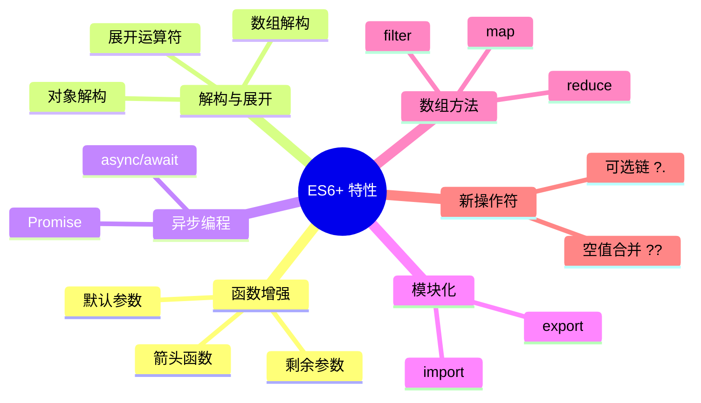

# 第 1 章：JavaScript 现代化

> 掌握 ES6+ 新特性，为 React 开发打下坚实基础

---

## 📋 学习目标

学完本章，你将能够：

- [x] 使用箭头函数简化函数定义，理解 `this` 绑定差异
- [x] 使用解构赋值提取对象和数组中的值
- [x] 使用展开运算符进行对象/数组的浅拷贝和合并
- [x] 使用模板字符串进行字符串拼接
- [x] 使用 async/await 处理异步操作
- [x] 理解 ES6 模块化（import/export）
- [x] 熟练使用数组高阶方法（map/filter/reduce）
- [x] 使用可选链和空值合并操作符

---

## 🗺️ 知识地图

---

## 📚 本章内容

| 节 | 标题 | 状态 | 掌握程度 |
|---|------|------|---------|
| 01 | [[01-arrow-functions\|箭头函数]] | 🔄 进行中 | 熟悉 |
| 02 | [[02-destructuring\|解构赋值]] | ⏳ 未开始 | - |
| 03 | [[03-spread-operator\|展开运算符]] | ⏳ 未开始 | - |
| 04 | [[04-template-literals\|模板字符串]] | ⏳ 未开始 | - |
| 05 | [[05-async-await\|async/await]] | ⏳ 未开始 | - |
| 06 | [[06-modules\|ES6 模块化]] | ⏳ 未开始 | - |
| 07 | [[07-array-methods\|数组高阶方法]] | ⏳ 未开始 | - |
| 08 | [[08-optional-chaining\|可选链和空值合并]] | ⏳ 未开始 | - |
| 总结 | [[99-summary\|章节总结]] | ⏳ 未开始 | - |

**状态说明**：✅ 已完成 | 🔄 进行中 | ⏳ 未开始

---

## ⏱️ 预计学习时间

本章共 8 节 + 1 总结，预计 **4-6 小时**

---

## 🔗 导航

- 上一章：无（这是第一章）
- 下一章：[[../ch02-react-basics/00-overview|React 基础概念]]
