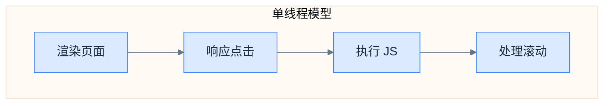
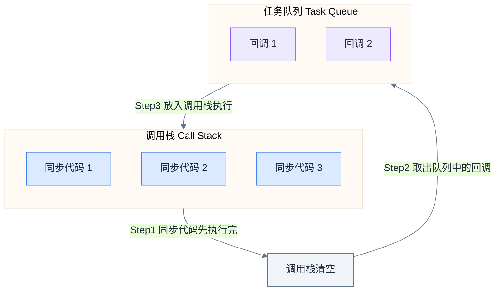
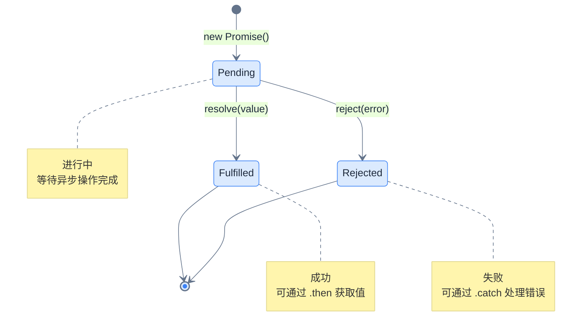
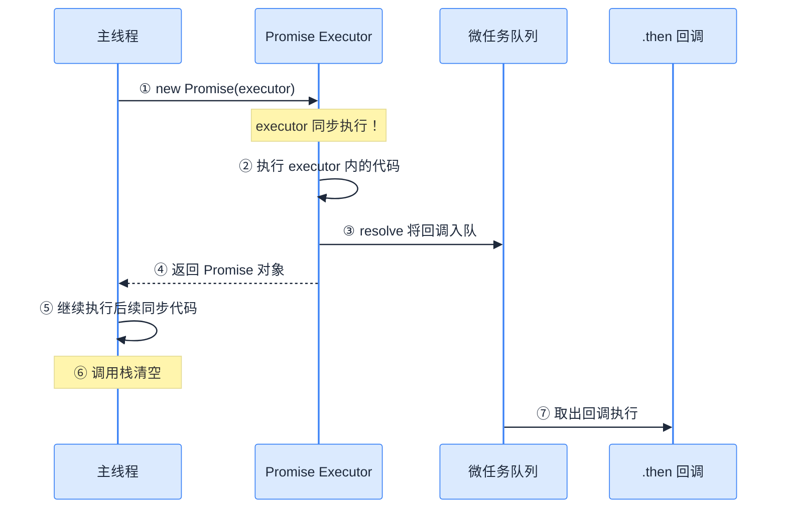
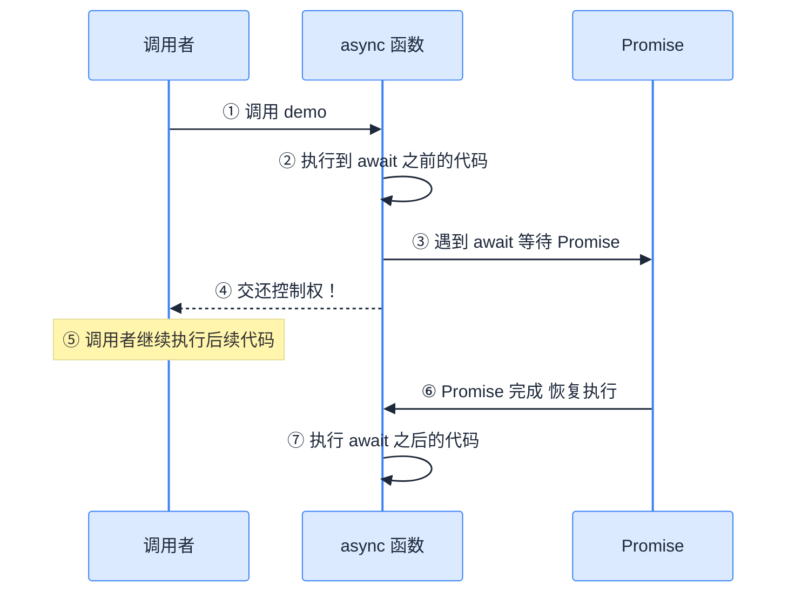
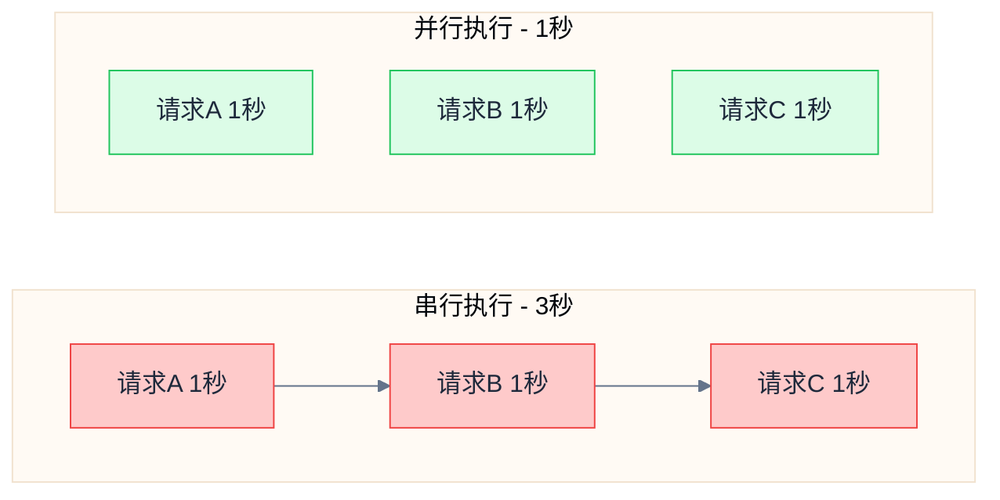
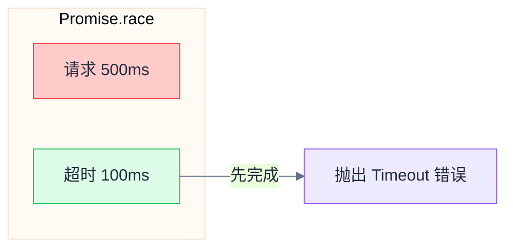

# async/await

> 用同步的写法处理异步操作——数据获取必备

---

## 📋 学习目标

- [x] 理解 JavaScript 单线程与异步编程的必要性
- [x] 理解 Promise 的状态与执行机制
- [x] 掌握 async/await 语法及其执行流程
- [x] 正确处理异步操作中的错误
- [x] 使用 Promise.all 并行执行多个异步操作

---

## 📖 知识点

### 1. 为什么需要异步编程

#### 1.1 JavaScript 的单线程模型

JavaScript 在浏览器中是**单线程**的，这意味着：

- 只有一个主线程处理所有事情：渲染页面、响应用户交互、执行代码
- 如果代码"阻塞"等待（比如网络请求），整个页面就会**卡住**



#### 1.2 同步 vs 异步

| 同步模式（阻塞） | 异步模式（非阻塞） |
|------------------|-------------------|
| 服务员站在厨房门口等菜做好 | 服务员先去服务其他桌 |
| 其他客人只能干等 | 菜好了厨房会"通知"服务员 |
| 效率低下 | 一个服务员可以服务多桌 |

#### 1.3 事件循环 (Event Loop)



> [!important] 核心规则
> 1. **同步代码**先全部执行完（放在"调用栈"里）
> 2. **异步回调**被放入"任务队列"等待
> 3. 只有调用栈**清空**后，才会从队列取出回调执行

#### 1.4 验证：setTimeout(fn, 0) 不会立即执行

```javascript
console.log('1. 开始');

setTimeout(() => {
  console.log('2. 定时器回调');
}, 0);  // 延迟是 0 毫秒！

console.log('3. 结束');

// 输出顺序：1, 3, 2
// 即使延迟是 0，回调也要排队等待同步代码执行完！
```

---

### 2. Promise 详解

#### 2.1 Promise 的三种状态



> [!warning] 状态不可逆
> Promise 状态一旦从 `pending` 变为 `fulfilled` 或 `rejected`，就**不能再改变**。

#### 2.2 Promise 与 CompletableFuture 对比

| CompletableFuture (Java) | Promise (JavaScript) |
|--------------------------|---------------------|
| `CompletableFuture<User>` | `Promise<User>` |
| `.thenApply(user -> ...)` | `.then(user => ...)` |
| `.exceptionally(e -> ...)` | `.catch(error => ...)` |
| `.thenCompose(...)` | 链式 `.then()` |
| `CompletableFuture.completedFuture(value)` | `Promise.resolve(value)` |
| `CompletableFuture.failedFuture(e)` | `Promise.reject(error)` |

#### 2.3 Promise 执行机制（重点！）

> [!danger] 常见误区
> 很多人以为 `new Promise()` 里面的代码是异步的——**错！**



**关键区分**：

| 部分 | 执行时机 | 说明 |
|------|----------|------|
| `new Promise(executor)` 中的 executor | **同步执行** | 立即执行 |
| `.then()` / `.catch()` 的回调 | **异步执行** | 放入微任务队列，等调用栈清空后执行 |

#### 2.4 resolve() 的真正作用

```javascript
const promise = new Promise((resolve, reject) => {
  console.log('1. 发起请求...');

  // 模拟网络请求需要 1 秒
  setTimeout(() => {
    console.log('2. 后端响应到达');
    resolve('用户数据');  // 在异步操作完成后调用
    console.log('3. resolve 之后的代码也会执行');
  }, 1000);

  console.log('4. 请求已发起');
});

promise.then((data) => {
  console.log('5. then 收到:', data);
});

console.log('6. 主程序继续');

// 输出顺序：1, 4, 6, (等待1秒), 2, 3, 5
```

> [!tip] resolve() 做了什么？
> 1. 把 Promise 状态从 `pending` 改为 `fulfilled`
> 2. 把 `.then()` 回调放入**微任务队列**
> 3. **不会中断当前代码**（不像 `return`）

---

### 3. async/await 语法

#### 3.1 基本语法

```javascript
// Promise 链式写法
getUser(userId)
  .then(user => getOrders(user.id))
  .then(orders => getProduct(orders[0].productId))
  .then(product => console.log(product.name));

// async/await 写法（推荐）
async function showProduct(userId) {
  const user = await getUser(userId);
  const orders = await getOrders(user.id);
  const product = await getProduct(orders[0].productId);
  console.log(product.name);
}
```

#### 3.2 async 函数的本质

> [!important] 核心概念
> - `async` 函数**总是返回 Promise**
> - 即使你 `return 普通值`，也会被自动包装成 `Promise.resolve(普通值)`

```javascript
async function getData() {
  return '我是数据';
}

const result = getData();
console.log(result);  // Promise { '我是数据' }
console.log(result instanceof Promise);  // true
```

#### 3.3 await 的执行机制（重点！）



> [!danger] 常见误区
> `await` 会让**函数内部**等待，但**不会阻塞调用者**！

```javascript
async function demo() {
  console.log('1. 函数开始');
  await somePromise;  // 函数在这里"暂停"，控制权交还给调用者
  console.log('2. 拿到结果');
}

console.log('A. 调用前');
demo();  // 调用后，demo() 在 await 处暂停，立即返回
console.log('B. 调用后');

// 输出顺序：A, 1, B, 2
```

---

### 4. 错误处理

#### 4.1 使用 try/catch

```javascript
async function safeGetUser(id) {
  try {
    const user = await fetchUser(id);
    return user;
  } catch (error) {
    console.error('获取失败:', error);
    return null;
  }
}
```

#### 4.2 对比 Java

| Java | JavaScript (async/await) |
|------|-------------------------|
| `try { future.join(); }` | `try { await promise; }` |
| `catch (Exception e)` | `catch (error)` |
| `finally { cleanup(); }` | `finally { cleanup(); }` |

> [!warning] 必须处理错误
> 如果不用 `try/catch` 包裹 `await`，未捕获的错误会导致 `UnhandledPromiseRejection`。

---

### 5. 并行执行

#### 5.1 串行 vs 并行



```javascript
// ❌ 串行（慢）：3 秒
const a = await fetchA();  // 等 1 秒
const b = await fetchB();  // 再等 1 秒
const c = await fetchC();  // 再等 1 秒

// ✅ 并行（快）：1 秒
const [a, b, c] = await Promise.all([
  fetchA(),  // 同时发起
  fetchB(),  // 同时发起
  fetchC()   // 同时发起
]);
```

#### 5.2 Promise.all 特点

| 特点 | 说明 |
|------|------|
| 并行执行 | 所有 Promise 同时开始 |
| 保持顺序 | 结果数组与输入数组顺序一致 |
| 总耗时 | 取决于最慢的那个 |
| 快速失败 | 任何一个失败，整体就失败 |

#### 5.3 Promise.race

让多个 Promise "赛跑"，只取**第一个完成的**结果：

```javascript
// 实现请求超时
async function fetchWithTimeout(promise, timeoutMs) {
  const timeout = new Promise((_, reject) => {
    setTimeout(() => reject(new Error('Timeout')), timeoutMs);
  });

  return Promise.race([promise, timeout]);
}
```



#### 5.4 Promise.allSettled

等所有 Promise 完成（不管成功失败）：

```javascript
const results = await Promise.allSettled([p1, p2, p3]);
// [
//   { status: 'fulfilled', value: 'A' },
//   { status: 'rejected', reason: Error },
//   { status: 'fulfilled', value: 'C' }
// ]
```

---

## ⚠️ 常见错误总结

### 错误 1：忘记 await

```javascript
// ❌ 错误：try/catch 无法捕获错误
try {
  return fetchUser(id);  // 返回的是 Promise，不是结果！
} catch (e) {
  // 这里永远不会执行
}

// ✅ 正确：加上 await
try {
  return await fetchUser(id);
} catch (e) {
  console.error(e);
}
```

### 错误 2：误以为 await 会阻塞调用者

```javascript
// 错误理解：以为 demo() 调用会等待完成
demo();
console.log('这行会立即执行，不会等待 demo() 完成！');
```

### 错误 3：在 Promise.race 中先 await 超时

```javascript
// ❌ 错误：先等待超时，失去赛跑意义
const timeout = await new Promise(...);  // 这会一直等到超时！
return Promise.race([promise, timeout]);

// ✅ 正确：直接让两个 Promise 赛跑
const timeout = new Promise(...);  // 不要 await
return Promise.race([promise, timeout]);
```

---

## ✏️ 练习

完成练习并运行测试验证：

| 练习 | 文件 | 难度 |
|------|------|------|
| 1. 基本 async/await | [05-async-await.tsx](idea://open?file=/Users/linqibin/Desktop/Patra/patra-react-playground/src/exercises/ch01/05-async-await.tsx&line=49) | ⭐ |
| 2. 错误处理 | [05-async-await.tsx](idea://open?file=/Users/linqibin/Desktop/Patra/patra-react-playground/src/exercises/ch01/05-async-await.tsx&line=62) | ⭐ |
| 3. 顺序执行 | [05-async-await.tsx](idea://open?file=/Users/linqibin/Desktop/Patra/patra-react-playground/src/exercises/ch01/05-async-await.tsx&line=75) | ⭐ |
| 4. 并行执行 | [05-async-await.tsx](idea://open?file=/Users/linqibin/Desktop/Patra/patra-react-playground/src/exercises/ch01/05-async-await.tsx&line=89) | ⭐⭐ |
| 5. 带超时的请求 | [05-async-await.tsx](idea://open?file=/Users/linqibin/Desktop/Patra/patra-react-playground/src/exercises/ch01/05-async-await.tsx&line=101) | ⭐⭐⭐ |

**验证命令**：`pnpm test 05-async-await`

---

## 🧪 测验

1. **为什么 `setTimeout(() => {}, 0)` 的回调不会立即执行？**

> [!note]- 答案
> 因为 JavaScript 的事件循环机制：同步代码先全部执行完，异步回调被放入任务队列等待。即使延迟是 0ms，回调也必须等调用栈清空后才能执行。

2. **下面代码的输出顺序是什么？**

```javascript
async function test() {
  console.log('1');
  await Promise.resolve();
  console.log('2');
}
console.log('A');
test();
console.log('B');
```

> [!note]- 答案
> `A, 1, B, 2`
>
> 解析：
> - `A` 同步执行
> - 调用 `test()`，`1` 同步执行
> - 遇到 `await`，函数暂停，控制权交还给调用者
> - `B` 同步执行
> - 调用栈清空，`test()` 恢复执行，`2` 输出

3. **`Promise.all` 和 `Promise.allSettled` 有什么区别？**

> [!note]- 答案
> - `Promise.all`：任一 Promise 失败则整体失败（快速失败）
> - `Promise.allSettled`：等所有 Promise 完成，返回每个的状态和结果/错误

---

## 🔗 导航

- 上一节：[[04-template-literals|模板字符串]]
- 下一节：[[06-modules|ES6 模块化]]
