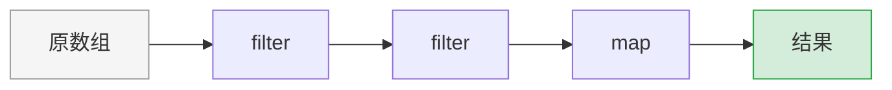

# 数组高阶方法

> JavaScript 数组的高阶方法是函数式编程的核心，也是 React 列表渲染和数据处理的基础。

---

## 📋 学习目标

- [x] 掌握 map、filter、reduce 三大核心方法
- [x] 理解链式调用模式
- [x] 熟悉 find、some、every 等辅助方法
- [x] 掌握不可变性原则，避免引用类型的坑

---

## 📖 知识点

### 1. map - 一对一转换

`map` 对每个元素执行相同的转换，返回**新数组**。

```
原数组:    [🍎, 🍊, 🍋]
           ↓   ↓   ↓     ← 每个元素都经过同一个函数
转换函数:  榨汁  榨汁  榨汁
           ↓   ↓   ↓
新数组:    [🧃, 🧃, 🧃]
```

```javascript
const products = [
  { id: 1, name: "iPhone", price: 999 },
  { id: 2, name: "MacBook", price: 1999 }
];

// 提取名称
const names = products.map(p => p.name);
// → ["iPhone", "MacBook"]

// 格式化价格
const prices = products.map(p => `$${p.price}`);
// → ["$999", "$1999"]

// 转换为简化对象
const simplified = products.map(p => ({ id: p.id, name: p.name }));
// → [{ id: 1, name: "iPhone" }, { id: 2, name: "MacBook" }]
```

> [!warning] 引用类型的坑
> `map` 返回的是**新数组**（新容器），但数组里的**对象仍是同一个引用**！
>
> ```javascript
> // ❌ 危险：直接修改原对象
> const updated = users.map(user => {
>   user.age = user.age + 1;  // 副作用！原数组也被改了
>   return user;
> });
>
> // ✅ 安全：返回新对象
> const updated = users.map(user => ({
>   ...user,           // 展开原对象
>   age: user.age + 1  // 覆盖 age 属性
> }));
> ```

---

### 2. filter - 筛选子集

`filter` 返回满足条件的元素组成的**新数组**。

```
原数组:    [🍎, 🍊, 🍋, 🍎, 🍇]
           ↓   ↓   ↓   ↓   ↓
条件:      是🍎? 是🍎? 是🍎? 是🍎? 是🍎?
           ✓    ✗    ✗    ✓    ✗
新数组:    [🍎,           🍎      ]
```

```javascript
const products = [
  { name: "iPhone", price: 999, inStock: true },
  { name: "MacBook", price: 1999, inStock: true },
  { name: "T-Shirt", price: 29, inStock: false }
];

// 筛选有库存的产品
const inStock = products.filter(p => p.inStock);

// 筛选价格范围
const midRange = products.filter(p => p.price >= 50 && p.price <= 500);

// 筛选指定类别
const electronics = products.filter(p => p.category === "electronics");
```

---

### 3. reduce - 最强大的方法

`reduce` 把数组「折叠」成一个值。累积器可以是**任何类型**。

```
原数组:    [1, 2, 3, 4]
              ↘ ↓ ↙
           累加、聚合、合并...
              ↓
结果:         10
```

#### 3.1 基本语法

```javascript
array.reduce((accumulator, currentValue) => {
  return newAccumulator;
}, initialValue);
```

| 参数 | 含义 | 类比 |
|------|------|------|
| `accumulator` | 累积器，上一次的结果 | 滚雪球的雪球 |
| `currentValue` | 当前正在处理的元素 | 新加入的雪 |
| `initialValue` | 初始值 | 雪球的起点 |

#### 3.2 执行过程可视化

```javascript
[1, 2, 3, 4].reduce((acc, cur) => acc + cur, 0)
```

```
┌──────────────────────────────────────────────┐
│  初始:  acc = 0                              │
│                                              │
│  第1次: acc=0,  cur=1  → 返回 0+1  = 1       │
│  第2次: acc=1,  cur=2  → 返回 1+2  = 3       │
│  第3次: acc=3,  cur=3  → 返回 3+3  = 6       │
│  第4次: acc=6,  cur=4  → 返回 6+4  = 10      │
│                                              │
│  结果:  10                                   │
└──────────────────────────────────────────────┘
```

#### 3.3 常见用法

| 累积器类型 | 用途 | 示例 |
|-----------|------|------|
| `number` | 求和、求最大值 | 计算总价 |
| `object` | 分组、构建索引 | 按类别分组 |
| `object` | 计数 | 统计各类别数量 |
| `array` | 实现 map/filter | 扁平化数组 |

```javascript
// 求和
const total = products.reduce((sum, p) => sum + p.price, 0);

// 按类别分组
const grouped = products.reduce((acc, p) => {
  (acc[p.category] ??= []).push(p);
  return acc;
}, {});
// → { electronics: [...], clothing: [...] }

// 统计数量
const count = products.reduce((acc, p) => {
  acc[p.category] = (acc[p.category] || 0) + 1;
  return acc;
}, {});
// → { electronics: 3, clothing: 2 }

// 建立 ID → 对象 索引
const productMap = products.reduce((map, p) => {
  map[p.id] = p;
  return map;
}, {});
// → { 1: {...}, 2: {...} }
```

> [!tip] 与 Java 的对比
> JavaScript 的 `reduce` 比 Java Stream 的 `Collectors` 更底层但更灵活。
> ```java
> // Java: Collectors 提供了现成的收集器
> Map<String, List<Product>> grouped = products.stream()
>     .collect(Collectors.groupingBy(Product::getCategory));
> ```
> ```javascript
> // JavaScript: 需要自己写 reduce 逻辑，但更灵活
> const grouped = products.reduce((acc, p) => {
>   (acc[p.category] ??= []).push(p);
>   return acc;
> }, {});
> ```

---

### 4. 链式调用

因为 `map`、`filter` 都返回新数组，所以可以连续调用：

```javascript
products
  .filter(p => p.inStock)      // 第1步：筛选有库存的
  .filter(p => p.price < 100)  // 第2步：筛选便宜的
  .map(p => p.name)            // 第3步：提取名称
  .sort()                      // 第4步：排序
```



#### 4.1 计算平均值

```javascript
// 计算有库存产品的平均价格
const inStock = products.filter(p => p.inStock);
const total = inStock.reduce((sum, p) => sum + p.price, 0);
const avg = total / inStock.length;

// 四舍五入到两位小数
const avgRounded = Math.round(avg * 100) / 100;
```

> [!tip] 四舍五入技巧
> ```javascript
> // 四舍五入到 N 位小数的通用公式
> Math.round(value * 10^N) / 10^N
>
> // 两位小数：Math.round(x * 100) / 100
> // 三位小数：Math.round(x * 1000) / 1000
> ```

---

### 5. 其他常用方法

| 方法 | 用途 | 返回值 | 示例 |
|------|------|--------|------|
| `find` | 找第一个满足条件的元素 | 元素或 `undefined` | `arr.find(x => x > 3)` |
| `findIndex` | 找第一个满足条件的索引 | 索引或 `-1` | `arr.findIndex(x => x > 3)` |
| `some` | 是否**存在**满足条件的元素 | `boolean` | `arr.some(x => x > 3)` |
| `every` | 是否**所有**都满足条件 | `boolean` | `arr.every(x => x > 3)` |
| `includes` | 是否包含指定元素 | `boolean` | `arr.includes(5)` |

```javascript
const nums = [1, 2, 3, 4, 5];

nums.find(n => n > 3)       // → 4（第一个 > 3 的元素）
nums.findIndex(n => n > 3)  // → 3（索引）
nums.some(n => n > 3)       // → true（存在 > 3 的吗？）
nums.every(n => n > 3)      // → false（全都 > 3 吗？）
nums.includes(3)            // → true（包含 3 吗？）
```

---

## 💡 最佳实践

### 1. 先建索引，避免重复查找

```javascript
// ❌ 每次都遍历查找，O(n²)
cartIds.forEach(id => {
  const product = products.find(p => p.id === id);  // 每次 O(n)
});

// ✅ 先建索引，查找 O(1)
const productMap = products.reduce((map, p) => {
  map[p.id] = p;
  return map;
}, {});

cartIds.forEach(id => {
  const product = productMap[id];  // O(1)
});
```

### 2. 保持不可变性

```javascript
// ❌ 修改原对象
users.map(u => { u.age++; return u; });

// ✅ 返回新对象
users.map(u => ({ ...u, age: u.age + 1 }));
```

### 3. 复用中间结果

```javascript
// ❌ filter 两次
const total = products.filter(p => p.inStock).reduce(...);
const count = products.filter(p => p.inStock).length;

// ✅ 只 filter 一次
const inStock = products.filter(p => p.inStock);
const total = inStock.reduce(...);
const count = inStock.length;
```

---

## ✏️ 练习

完成练习并运行测试验证：

| 练习文件 | 验证命令 |
|----------|----------|
| [07-array-methods.tsx](idea://open?file=/Users/linqibin/Desktop/Patra/patra-react-playground/src/exercises/ch01/07-array-methods.tsx) | `pnpm test 07-array-methods` |

---

## 🔗 导航

- 上一节：[[06-modules|ES6 模块化]]
- 下一节：[[08-optional-chaining|可选链和空值合并]]
