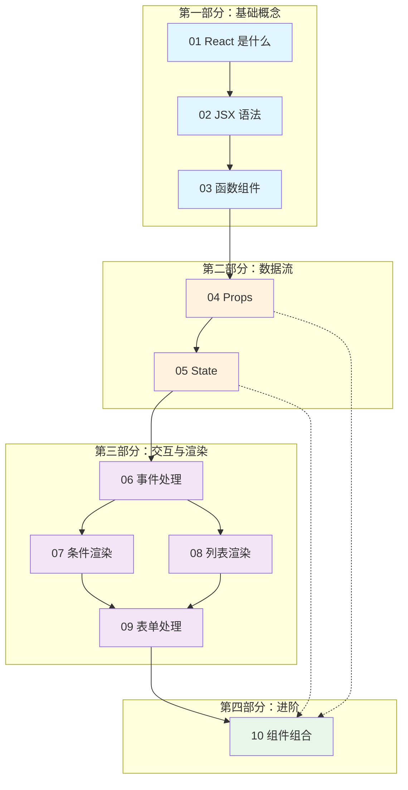

# 第 2 章：React 基础概念

> 从零开始理解 React 的核心理念，学会编写现代化的 React 组件

---

## 本章目标

完成本章学习后，你将能够：

- [ ] 理解 React 的核心理念（声明式、组件化、单向数据流）
- [ ] 熟练使用 JSX 语法编写 UI
- [ ] 创建函数组件并通过 Props 传递数据
- [ ] 使用 useState 管理组件状态
- [ ] 处理用户事件（点击、输入等）
- [ ] 实现条件渲染和列表渲染
- [ ] 处理表单输入（受控组件）
- [ ] 合理拆分和组合组件

---

## 学习路线



---

## 章节内容

### 第一部分：基础概念（约 2 小时）

| 节 | 标题 | 核心内容 |
|---|------|----------|
| [[01-what-is-react\|01]] | React 是什么 | 声明式、组件化、单向数据流、虚拟 DOM |
| [[02-jsx-syntax\|02]] | JSX 语法 | JSX 规则、表达式插值、与 HTML 的区别 |
| [[03-function-components\|03]] | 函数组件 | 组件定义、命名规范、组件复用 |

### 第二部分：数据流（约 2 小时）

| 节 | 标题 | 核心内容 |
|---|------|----------|
| [[04-props\|04]] | Props 属性传递 | props 传递、解构、默认值、children |
| [[05-state-usestate\|05]] | State 状态管理 | useState、状态不可变、函数式更新 |

### 第三部分：交互与渲染（约 2.5 小时）

| 节 | 标题 | 核心内容 |
|---|------|----------|
| [[06-event-handling\|06]] | 事件处理 | 事件绑定、合成事件、参数传递 |
| [[07-conditional-rendering\|07]] | 条件渲染 | 三元、&&、if 语句、常见陷阱 |
| [[08-list-rendering\|08]] | 列表渲染与 key | map 渲染、key 的作用和选择 |

### 第四部分：表单与组合（约 2 小时）

| 节 | 标题 | 核心内容 |
|---|------|----------|
| [[09-form-handling\|09]] | 表单处理 | 受控组件、onChange、表单验证 |
| [[10-component-composition\|10]] | 组件组合与拆分 | 拆分原则、提升状态、组合模式 |

---

## 前置知识

> [!tip] 来自第 1 章的知识储备
> 本章会大量使用第 1 章学到的 JavaScript 现代语法，确保你对以下内容足够熟悉：

| 知识点 | 本章应用场景 |
|--------|-------------|
| [[../ch01-javascript-modern/01-arrow-functions\|箭头函数]] | 事件处理器、回调函数 |
| [[../ch01-javascript-modern/02-destructuring\|解构赋值]] | Props 解构、useState 返回值 |
| [[../ch01-javascript-modern/03-spread-operator\|展开运算符]] | 状态更新 `{...state, key: value}` |
| [[../ch01-javascript-modern/07-array-methods\|数组高阶方法]] | 列表渲染中的 map/filter |
| [[../ch01-javascript-modern/08-optional-chaining\|可选链]] | 安全访问 props 和 API 数据 |
| [[../ch01-javascript-modern/06-modules\|ES6 模块]] | 组件导入导出 |

---

## 练习项目

本章的所有代码练习都在 `patra-react-playground` 项目中进行：

```bash
# 启动开发服务器
cd /Users/linqibin/Desktop/Patra/patra-react-playground
pnpm dev

# 运行测试
pnpm test

# 可视化测试界面
pnpm test:ui
```

练习文件位置：`src/exercises/ch02/`

---

## 下一步

准备好了吗？让我们从 [[01-what-is-react|React 是什么]] 开始吧！
