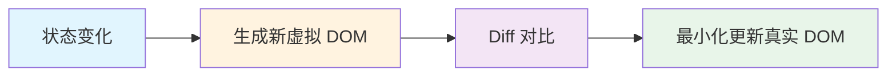

# React 是什么

> React 是一个用于构建用户界面的 JavaScript 库，核心理念是**声明式编程**和**组件化开发**。

---

## 📋 学习目标

- [x] 理解声明式 vs 命令式编程的区别
- [x] 理解组件化思想
- [x] 理解单向数据流
- [x] 了解虚拟 DOM 的作用

---

## 📖 核心理念

### 1. 声明式编程

**命令式**：一步步告诉计算机"怎么做"

```javascript
// 原生 JS：命令式
const counterDiv = document.getElementById('counter');
const button = document.getElementById('btn');
let count = 0;

button.addEventListener('click', () => {
  count = count + 1;              // 1. 更新数据
  counterDiv.textContent = count; // 2. 手动同步 DOM
});
```

**声明式**：只描述"结果是什么"

```jsx
// React：声明式
function Counter() {
  const [count, setCount] = useState(0);

  return (
    <div>
      <div>{count}</div>
      <button onClick={() => setCount(count + 1)}>+1</button>
    </div>
  );
}
```

```
┌─────────────────────────────────────────────────────────────┐
│                    命令式 vs 声明式                          │
├─────────────────────────┬───────────────────────────────────┤
│  命令式（原生 JS）        │  声明式（React）                   │
├─────────────────────────┼───────────────────────────────────┤
│  ❌ 获取 DOM 节点         │  ✅ 不需要                         │
│  ❌ 手动绑定事件          │  ✅ JSX 中声明 onClick             │
│  ❌ 手动更新 DOM          │  ✅ React 自动处理                 │
├─────────────────────────┴───────────────────────────────────┤
│  类比：命令式像写菜谱（切菜→热油→下锅）                         │
│        声明式像点外卖（我要宫保鸡丁，厨房自己搞定）              │
└─────────────────────────────────────────────────────────────┘
```

> [!tip] Spring 类比
> 就像 `@Autowired` 声明"我需要这个依赖"，Spring 自动注入。
> React 中你声明"数据是 X 时 UI 长这样"，React 自动同步。

---

### 2. 组件化

**组件 = 封装 UI + 逻辑的独立单元**

```
┌─ ShoppingCart ──────────────────────────┐
│                                          │
│  ┌─ CartHeader ─────────────────────┐   │
│  │  🛒 购物车                  [清空] │   │
│  └──────────────────────────────────┘   │
│                                          │
│  ┌─ CartItem ───────────────────────┐   │
│  │  📦 iPhone 15      ×2    ¥9998   │   │  ← 可复用
│  └──────────────────────────────────┘   │
│  ┌─ CartItem ───────────────────────┐   │
│  │  📦 AirPods Pro    ×1    ¥1999   │   │  ← 可复用
│  └──────────────────────────────────┘   │
│                                          │
│  ┌─ CartFooter ─────────────────────┐   │
│  │          总计：¥11997   [去结算]  │   │
│  └──────────────────────────────────┘   │
│                                          │
└──────────────────────────────────────────┘
```

| Java 概念 | React 概念 |
|-----------|------------|
| 类（Class） | 组件（Component） |
| 封装数据和行为 | 封装 UI 和逻辑 |
| `new UserService()` | `<UserCard />` |
| 类可复用 | 组件可复用 |

---

### 3. 单向数据流

**数据只能从父组件向下流向子组件**，通过 `props` 传递。

```d2
direction: down

ShoppingCart: ShoppingCart {
  style.fill: "#f8fafc"
  style.stroke: "#64748b"

  state: "state: { items, total }" {
    style.fill: "#dbeafe"
    style.stroke: "#3b82f6"
  }

  CartItem: CartItem {
    style.fill: "#fef3c7"
    style.stroke: "#f59e0b"

    props: "props: item (只读)" {
      style.fill: "#fef9c3"
      style.font-size: 12
    }
  }

  CartFooter: CartFooter {
    style.fill: "#fef3c7"
    style.stroke: "#f59e0b"

    props: "props: total (只读)" {
      style.fill: "#fef9c3"
      style.font-size: 12
    }
  }

  state -> CartItem: props {
    style.stroke: "#10b981"
    style.stroke-width: 2
  }
  state -> CartFooter: props {
    style.stroke: "#10b981"
    style.stroke-width: 2
  }
}
```

> [!tip] Spring 类比
> 类似 Spring 的构造器注入：组件不创建自己的依赖，而是从外部接收。
> 好处：数据变化可追踪，出问题往上找就行。

---

### 4. 虚拟 DOM

React 不直接操作真实 DOM（慢），而是：



**类比**：就像 Git 的 diff，不复制整个文件，只记录变化的行。

---

## 🎯 核心公式

```
UI = f(state)
```

- **state**：应用的数据状态
- **f**：React 组件（描述如何渲染）
- **UI**：用户界面

**你只需要维护 state，React 自动计算 UI。**

---

## 📝 本节要点

| 理念 | 一句话解释 |
|------|-----------|
| **声明式** | 描述"结果是什么"，不关心"怎么做到" |
| **组件化** | UI 拆成独立、可复用的组件 |
| **单向数据流** | 数据从父到子流动，变化可追踪 |
| **虚拟 DOM** | 高效更新，只改变真正需要变的部分 |

---

## 🔗 导航

- 上一节：[[00-overview|第 2 章概述]]
- 下一节：[[02-jsx-syntax|JSX 语法]]
