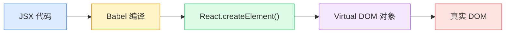

# JSX 语法

> JSX 是 React 用来描述 UI 的语法糖，看起来像 HTML，但本质是 JavaScript。

---

## 📋 学习目标

- [x] 理解 JSX 的本质（编译成 `React.createElement()`）
- [x] 掌握表达式插值 `{}`
- [x] 区分表达式和语句
- [x] 掌握 JSX 与 HTML 的属性差异
- [x] 掌握 style 对象写法

---

## 📖 核心概念

### 1. JSX 的本质

**JSX 不是 HTML**，它会被 Babel 编译成 `React.createElement()` 调用：

```jsx
// 你写的 JSX
const element = <div className="greeting">Hello!</div>;

// 编译后的 JavaScript
const element = React.createElement(
  'div',
  { className: 'greeting' },
  'Hello!'
);
```



> [!tip] 核心理解
> 理解了 JSX 的本质，很多规则就不用死记了：
> - 为什么用 `className`？→ 因为 `class` 是 JS 保留字
> - 为什么 `style` 要对象？→ 因为 JSX 属性值就是 JS 值
> - 为什么用 `{}`？→ 因为那是 JS 表达式的入口

---

### 2. 表达式插值 `{}`

花括号 `{}` 是 **JSX 通往 JavaScript 的窗口**：

```jsx
// 变量
const name = "React";
<h1>Hello, {name}!</h1>

// 运算
<p>1 + 1 = {1 + 1}</p>

// 函数调用
<p>{new Date().toLocaleTimeString()}</p>

// 三元表达式
<p>{isLoggedIn ? '欢迎回来' : '请登录'}</p>

// 对象属性
<p>姓名：{user.name}</p>
```

---

### 3. 表达式 vs 语句（重要！）

```
┌─────────────────────────────────────────────────────────────┐
│                   {} 里只能放表达式！                         │
├─────────────────────────────────────────────────────────────┤
│                                                             │
│  ✅ 表达式（能产生值）          ❌ 语句（执行动作）            │
│  ─────────────────────        ─────────────────────        │
│  • 1 + 1                      • if (...) { }               │
│  • user.name                  • for (...) { }              │
│  • isAdmin ? 'yes' : 'no'     • while (...) { }            │
│  • getData()                  • switch (...) { }           │
│  • arr.map(...)               • const x = ...              │
│                                                             │
└─────────────────────────────────────────────────────────────┘
```

```jsx
// ❌ 错误：if 是语句
<div>{if (isAdmin) { return '管理员' }}</div>

// ✅ 正确：三元表达式
<div>{isAdmin ? '管理员' : '用户'}</div>
```

---

### 4. `{}`、`{{}}`、不加？

> [!warning] 易混淆点
> 这是你在练习中问到的问题，务必掌握！

```
┌─────────────────────────────────────────────────────────────┐
│                    JSX 属性值规则                            │
├─────────────────────────────────────────────────────────────┤
│                                                             │
│  字符串？ ──────→ 直接用引号                                 │
│                   <div className="box" />                   │
│                   <input type="text" />                     │
│                                                             │
│  其他 JS 值？ ──→ 用 {}                                      │
│                   <div id={myId} />                         │
│                   <input tabIndex={1} />      ← 数字        │
│                   <button onClick={handleClick} /> ← 函数   │
│                                                             │
│  对象？ ────────→ {} 里面再放 {}                             │
│                   <div style={{ color: 'red' }} />          │
│                            ↑      ↑                         │
│                   JSX入口──┘      └──对象字面量              │
│                                                             │
└─────────────────────────────────────────────────────────────┘
```

**速记**：
- 字符串 → `"value"`
- 数字/变量/函数 → `{value}`
- 对象（如 style）→ `{{ key: value }}`

---

### 5. HTML → JSX 属性转换

| HTML 属性 | JSX 属性 | 原因 |
|-----------|----------|------|
| `class` | `className` | `class` 是 JS 保留字 |
| `for` | `htmlFor` | `for` 是 JS 保留字 |
| `tabindex` | `tabIndex` | 驼峰命名 |
| `readonly` | `readOnly` | 驼峰命名 |
| `onclick` | `onClick` | 驼峰命名 |
| `onchange` | `onChange` | 驼峰命名 |

```jsx
// ❌ HTML 写法
<div class="container">
  <label for="email">邮箱</label>
  <input tabindex="1" />
</div>

// ✅ JSX 写法
<div className="container">
  <label htmlFor="email">邮箱</label>
  <input tabIndex={1} />
</div>
```

---

### 6. style 对象写法

JSX 的 `style` 必须是**对象**，不能是字符串：

```jsx
// ❌ 错误：字符串
<div style="color: red; font-size: 16px;">

// ✅ 正确：对象
<div style={{ color: 'red', fontSize: '16px' }}>

// ✅ 正确：数字自动加 px
<div style={{ color: 'red', fontSize: 16 }}>
```

**CSS → JSX style 转换规则**：

| CSS 写法 | JSX style 对象 |
|----------|----------------|
| `font-size: 16px` | `fontSize: 16` |
| `background-color: #fff` | `backgroundColor: '#fff'` |
| `margin-top: 10px` | `marginTop: 10` |
| `z-index: 100` | `zIndex: 100` |

---

### 7. JSX 基本规则

| 规则 | 说明 | 示例 |
|------|------|------|
| 单根元素 | 必须有一个根元素 | `<div>...</div>` 或 `<>...</>` |
| 标签闭合 | 所有标签必须闭合 | `` `<br />` |
| 驼峰属性 | 属性名用驼峰命名 | `tabIndex` `onClick` |

```jsx
// ✅ Fragment 语法：不产生额外 DOM 节点
return (
  <>
    <h1>标题</h1>
    <p>段落</p>
  </>
);
```

---

### 8. return 后面的括号

> [!warning] 你问到的问题
> 为什么 `return` 后面要加 `()`？

```jsx
// ❌ 危险：JS 会自动插入分号
return
  <div>Hello</div>;
// 等价于：return; <div>...</div>;

// ✅ 安全：括号阻止自动分号
return (
  <div>Hello</div>
);
```

**建议**：多行 JSX 一律加括号。

---

## 📝 核心公式

```
┌─────────────────────────────────────────────────────────────┐
│                                                             │
│              JSX = JavaScript + XML-like 语法               │
│                                                             │
│         本质：React.createElement() 的语法糖                 │
│                                                             │
│         {} = JavaScript 表达式入口                           │
│                                                             │
└─────────────────────────────────────────────────────────────┘
```

---

## ✏️ 练习

完成练习并运行测试验证：

| 练习文件 | 验证命令 |
|----------|----------|
| [01-jsx-syntax.tsx](idea://open?file=/Users/linqibin/Desktop/Patra/patra-react-playground/src/exercises/ch02/01-jsx-syntax.tsx) | `pnpm test 01-jsx-syntax` |

**练习内容**：
1. 表达式插值（`greeting`、`mathResult`）
2. 属性转换（`fixedForm`）
3. style 对象（`styledCard`、`progressBar`）
4. 条件渲染（`loginStatus`、`stockStatus`）
5. 综合练习（`userCard`）

**完成状态**：✅ 32/32 测试通过

---

## 🧪 测验

### Q1: 下面哪个可以放在 JSX 的 `{}` 中？

- [ ] A. `if (x > 0) { return 'positive' }`
- [x] B. `x > 0 ? 'positive' : 'negative'`
- [ ] C. `for (let i = 0; i < 10; i++) {}`
- [x] D. `items.map(item => <li>{item}</li>)`

> [!success]- 查看答案
> **答案：B、D**
> `{}` 中只能放表达式（能产生值的代码），不能放语句（if、for、while 等）。

### Q2: JSX 中设置行内样式，正确的写法是？

- [ ] A. `<div style="color: red">`
- [ ] B. `<div style={color: 'red'}>`
- [x] C. `<div style={{ color: 'red' }}>`
- [ ] D. `<div style="{{color: 'red'}}">`

> [!success]- 查看答案
> **答案：C**
> JSX 的 style 必须是对象。外层 `{}` 是 JSX 表达式入口，内层 `{}` 是对象字面量。

### Q3: HTML 的 `class` 和 `for` 在 JSX 中应该写成？

- [ ] A. `class` 和 `for`
- [x] B. `className` 和 `htmlFor`
- [ ] C. `cssClass` 和 `labelFor`
- [ ] D. `Class` 和 `For`

> [!success]- 查看答案
> **答案：B**
> `class` 和 `for` 是 JavaScript 保留字，所以 JSX 使用 `className` 和 `htmlFor`。

---

## 🔗 导航

- 上一节：[[01-what-is-react|React 是什么]]
- 下一节：[[03-function-components|函数组件]]
