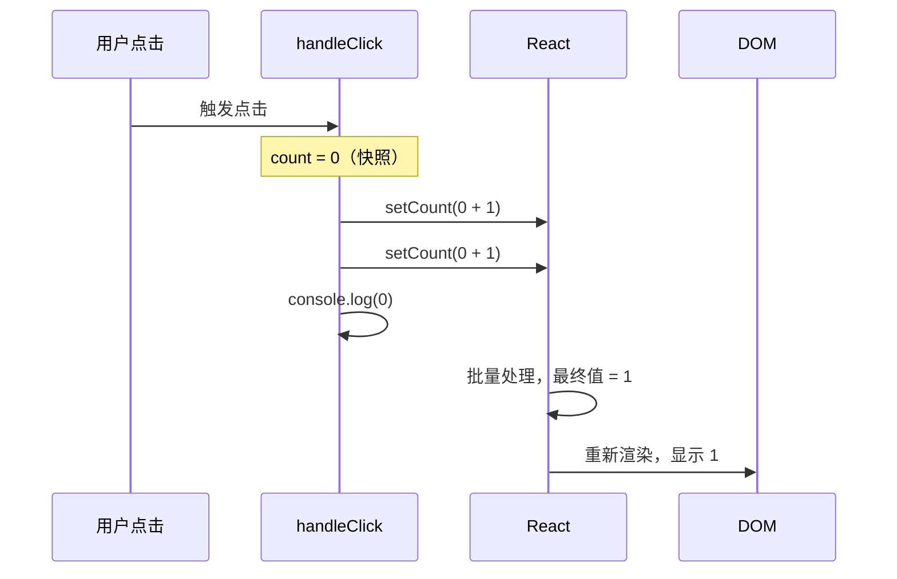

# State 状态管理 (useState)

> State 是组件的「记忆」，让 React 组件从静态变为动态。

---

## 📋 学习目标

- [x] 理解 State 和 Props 的区别
- [x] 掌握 useState 的基本用法
- [x] 理解状态快照原理
- [x] 熟练使用函数式更新
- [x] 掌握对象和数组的不可变更新
- [x] 理解 Fiber 机制（状态如何持久化）

---

## 📖 知识点

### 1. State vs Props

Props 和 State 都能触发 UI 更新，但职责不同：

| 特性 | Props | State |
|------|-------|-------|
| **来源** | 父组件传入 | 组件内部创建 |
| **可变性** | 只读，不可修改 | 可通过 setState 更新 |
| **触发更新** | 父组件传新值时 | 调用 setState 时 |
| **类比** | 函数参数 | 函数内的局部变量（但会持久化） |

```d2
direction: right

Parent: 父组件 {
  parentState: "state: { name }"
  parentState.style.fill: "#e3f2fd"
}

Child: 子组件 {
  childState: "state: count"
  childState.style.fill: "#fff3e0"
}

Parent.parentState -> Child: props {
  style.stroke: "#1976d2"
  style.font-size: 14
}

legend: |md
  🔵 父组件状态 → 通过 props 传递
  🟠 子组件状态 → 组件内部管理
|
```

---

### 2. useState 基本用法

```tsx
import { useState } from 'react';

function Counter() {
  const [count, setCount] = useState(0);
  //     ↑        ↑              ↑
  //   状态值   更新函数       初始值

  return (
    <button onClick={() => setCount(count + 1)}>
      {count}
    </button>
  );
}
```

**解构语法**：`useState` 返回一个数组 `[当前值, 更新函数]`，我们用数组解构取出。

---

### 3. 状态快照原理 ⭐

> 这是本节最重要的概念！

**核心理解**：在一次渲染中，state 的值是**固定的快照**，调用 setState 不会立即改变当前的变量。

```tsx
function Counter() {
  const [count, setCount] = useState(0);

  const handleClick = () => {
    setCount(count + 1);  // 请求更新为 1
    setCount(count + 1);  // 还是请求更新为 1（count 仍是 0）
    console.log(count);   // 输出 0（快照值不变）
  };

  return <button onClick={handleClick}>{count}</button>;
}
// 点击后页面显示 1，不是 2！
```

**时序图解**：



---

### 4. 函数式更新 ⭐

当新值需要基于旧值计算时，使用**函数式更新**：

```tsx
// ❌ 直接传值：基于快照，连续调用会被"覆盖"
setCount(count + 1);
setCount(count + 1);
// 结果：1

// ✅ 函数式更新：React 会传入最新值
setCount(prev => prev + 1);
setCount(prev => prev + 1);
// 结果：2
```

**执行流程**：

```
初始 count = 0

第一次 setCount(prev => prev + 1)
  └─ React 传入 prev = 0 → 返回 1 → 队列中：1

第二次 setCount(prev => prev + 1)
  └─ React 传入 prev = 1 → 返回 2 → 队列中：2

渲染时 count = 2
```

**使用场景对比**：

| 场景 | 推荐方式 | 示例 |
|------|----------|------|
| 新值与旧值无关 | 直接传值 | `setName('Tom')` |
| 基于旧值计算 | 函数式更新 | `setCount(prev => prev + 1)` |
| 连续多次更新 | 函数式更新 | 批量增加 |

---

### 5. 不可变更新原则 ⭐

React 通过**比较引用**来判断状态是否变化。如果直接修改对象/数组，引用不变，React 检测不到变化。

#### 为什么不用深度比较？

```
引用比较：O(1) —— 只比较内存地址
深度比较：O(n) —— 递归遍历所有属性
```

React 组件可能每秒渲染几十次，引用比较性能更好。

#### 对象的不可变更新

```tsx
const [user, setUser] = useState({ name: 'Tom', age: 18 });

// ❌ 直接修改（React 检测不到变化）
user.age = 19;
setUser(user);  // 同一个引用，不会重新渲染！

// ✅ 创建新对象
setUser({ ...user, age: 19 });
```

#### 数组的不可变更新

| 操作 | ❌ 可变方法 | ✅ 不可变写法 |
|------|-----------|-------------|
| 添加 | `push()` | `[...arr, newItem]` |
| 删除 | `splice()` | `arr.filter(item => item.id !== id)` |
| 修改 | `arr[i] = x` | `arr.map(item => item.id === id ? {...item, done: true} : item)` |
| 排序 | `sort()` | `[...arr].sort()` |

#### 完整示例：Todo List

```tsx
const [todos, setTodos] = useState([
  { id: 1, text: '学习 React', done: false }
]);

// 添加
const addTodo = (text: string) => {
  setTodos(prev => [...prev, { id: nextId++, text, done: false }]);
};

// 删除
const deleteTodo = (id: number) => {
  setTodos(prev => prev.filter(todo => todo.id !== id));
};

// 切换完成状态
const toggleTodo = (id: number) => {
  setTodos(prev => prev.map(todo =>
    todo.id === id ? { ...todo, done: !todo.done } : todo
  ));
};
```

---

### 6. 对象键的动态操作 ⭐

> 这是本节的难点，需要特别注意！

#### 计算属性名

```tsx
const id = 1;

// ❌ 字面量键名：id 被当成字符串 "id"
const obj1 = { id: 100 };
// 结果：{ id: 100 }

// ✅ 计算属性名：用方括号包裹变量
const obj2 = { [id]: 100 };
// 结果：{ 1: 100 }
```

#### 在 setState 中使用

```tsx
const [cart, setCart] = useState<{ [id: number]: number }>({});

const addToCart = (id: number) => {
  setCart(prev => ({
    ...prev,
    [id]: (prev[id] || 0) + 1  // 注意 [id] 不是 id
  }));
};
```

#### 删除对象中的键

```tsx
// 方式 1：解构 + rest 运算符
const { [keyToRemove]: _, ...rest } = obj;
// rest 就是删除了 keyToRemove 后的新对象

// 方式 2：filter + Object.fromEntries
const result = Object.fromEntries(
  Object.entries(obj).filter(([key]) => key !== keyToRemove)
);
```

---

### 7. Fiber 机制：状态如何持久化

> 函数组件每次渲染都重新执行，那状态存在哪里？

#### 答案：Fiber 节点

整个应用只有**一棵 Fiber 树**，每个组件实例是树中的一个节点：

```d2
direction: down

Fiber Tree: {
  label: "Fiber 树（整个应用只有一棵）"

  App: {
    label: "App\nhooks: []"

    Header: {
      label: "Header\nhooks: []"
    }

    Main: {
      label: "Main\nhooks: []"

      Counter1: {
        label: "Counter\nhooks: [5]"
        style.fill: "#e8f5e9"
      }
      Counter2: {
        label: "Counter\nhooks: [3]"
        style.fill: "#e8f5e9"
      }
    }

    Footer: {
      label: "Footer\nhooks: []"
    }
  }
}
```

**关键理解**：
- 每个组件实例对应一个 Fiber 节点
- hooks 数组存储该实例的所有状态
- 同一组件的不同实例有独立状态（图中绿色高亮）

#### useState 的工作流程

```
首次渲染：
  useState(0) 调用
       ↓
  React: "第 0 个 hook，初始值 0，存到 Fiber"
       ↓
  返回 [0, setCount]

后续渲染：
  useState(0) 调用
       ↓
  React: "第 0 个 hook，从 Fiber 读取当前值"
       ↓
  返回 [当前值, setCount]  // 初始值被忽略
```

#### Hooks 规则

由于 React 按**调用顺序**存取 hooks，所以：

```tsx
// ❌ 绝对不能在条件中使用 Hook！
if (someCondition) {
  const [a, setA] = useState(0);  // 有时是 hooks[0]
}
const [b, setB] = useState(0);    // 顺序会乱！

// ✅ 始终在组件顶层调用
const [a, setA] = useState(0);
const [b, setB] = useState(0);
```

---

## 🧠 核心心法

```
1. setState 触发重新渲染，不是直接修改变量
2. 一次渲染中，state 是固定的快照
3. 基于旧值计算 → 用函数式更新
4. 对象/数组 → 永远返回新引用（不可变更新）
5. 动态键名 → 用 [变量] 语法
6. Hooks 调用顺序必须稳定
```

---

## ✏️ 练习

完成以下练习并运行测试验证：

| 练习 | 文件 | 知识点 |
|------|------|--------|
| 基础计数器 | [05-state-usestate.tsx](idea://open?file=/Users/linqibin/Desktop/Patra/patra-react-playground/src/exercises/ch02/05-state-usestate.tsx&line=42) | useState 基础 |
| 批量计数器 | [05-state-usestate.tsx](idea://open?file=/Users/linqibin/Desktop/Patra/patra-react-playground/src/exercises/ch02/05-state-usestate.tsx&line=85) | 函数式更新 |
| 用户信息编辑 | [05-state-usestate.tsx](idea://open?file=/Users/linqibin/Desktop/Patra/patra-react-playground/src/exercises/ch02/05-state-usestate.tsx&line=139) | 对象不可变更新 |
| Todo List | [05-state-usestate.tsx](idea://open?file=/Users/linqibin/Desktop/Patra/patra-react-playground/src/exercises/ch02/05-state-usestate.tsx&line=215) | 数组增删改 |
| 购物车 | [05-state-usestate.tsx](idea://open?file=/Users/linqibin/Desktop/Patra/patra-react-playground/src/exercises/ch02/05-state-usestate.tsx&line=315) | 综合应用 |

```bash
# 运行测试
pnpm test 05-state-usestate
```

---

## 🧪 测验

### Q1: 下面代码点击后页面显示什么？

```tsx
const [count, setCount] = useState(0);
const handleClick = () => {
  setCount(count + 1);
  setCount(count + 1);
};
```

- [ ] A. 0
- [x] B. 1
- [ ] C. 2

> [!success]- 查看答案
> **答案：B**
> 两次 `setCount(count + 1)` 都是 `setCount(0 + 1)`，因为 count 在这次渲染中是快照值 0。

### Q2: 如何让上面的代码点击后显示 2？

- [ ] A. `setCount(count + 2)`
- [x] B. `setCount(prev => prev + 1)` 调用两次
- [ ] C. 无法实现

> [!success]- 查看答案
> **答案：B**
> 使用函数式更新，React 会传入最新值。第一次 0→1，第二次 1→2。

### Q3: 下面哪种写法是正确的不可变更新？

```tsx
const [user, setUser] = useState({ name: 'Tom', age: 18 });
```

- [ ] A. `user.age = 19; setUser(user);`
- [ ] B. `setUser({ age: 19 })`
- [x] C. `setUser({ ...user, age: 19 })`

> [!success]- 查看答案
> **答案：C**
> A 直接修改原对象，引用不变，React 检测不到。B 丢失了 name 字段。C 正确展开原对象并覆盖 age。

### Q4: 动态设置对象键的正确语法是？

```tsx
const id = 1;
setCart(prev => ({ ...prev, ??? }));
```

- [ ] A. `id: 100`
- [x] B. `[id]: 100`
- [ ] C. `${id}: 100`

> [!success]- 查看答案
> **答案：B**
> 计算属性名需要用方括号 `[变量]`。A 会创建字符串键 `"id"`，C 是无效语法。

---

## 💡 学习反思

### 掌握较好的部分
- 状态快照原理理解透彻
- 函数式更新使用正确
- 能将之前学的 `reduce` 应用到新场景

### 需要加强的部分
- 对象键的动态操作语法（`[id]` vs `id`）
- JavaScript 对象方法的熟练度

### 下一步计划
- 继续学习事件处理，与 State 配合使用
- 多练习对象和数组的操作

---

## 🔗 导航

- 上一节：[[04-props|Props 属性传递]]
- 下一节：[[06-event-handling|事件处理]]
