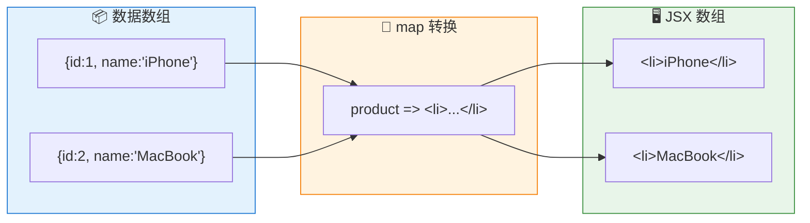
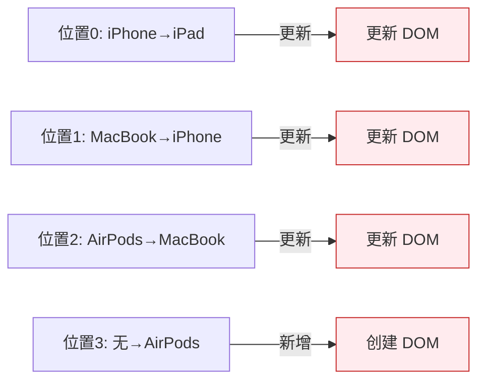
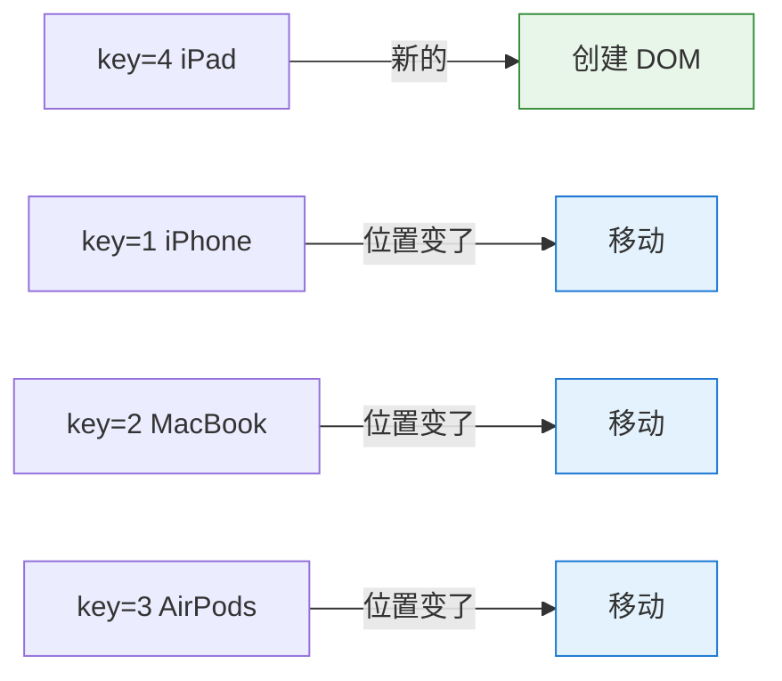
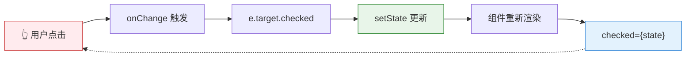

# 列表渲染与 key

> 用 `map` 将数据转换为 UI，用 `key` 告诉 React "这是谁"。

---

## 📋 学习目标

- [x] 掌握用 `map` 渲染列表的基本模式
- [x] 理解 key 的作用（身份标识，不是位置）
- [x] 掌握 key 的选择原则
- [x] 避开 index 作为 key 的陷阱
- [x] 理解受控组件的 checked + onChange 模式

---

## 📖 知识点

### 1. 用 map 渲染列表 ⭐

还记得第 1 章学的 `map` 吗？它在 React 中的用法一模一样：

```tsx
const products = [
  { id: 1, name: 'iPhone', price: 999 },
  { id: 2, name: 'MacBook', price: 1999 },
];

function ProductList() {
  return (
    <ul>
      {products.map(product => (
        <li key={product.id}>
          {product.name} - ${product.price}
        </li>
      ))}
    </ul>
  );
}
```

**原理**：`map` 返回一个 JSX 数组，React 自动将数组展开渲染。



---

### 2. 为什么需要 key？ ⭐⭐

没有 key 时，控制台会报警告：

> Each child in a list should have a unique "key" prop.

**核心问题**：当列表变化时，React 怎么知道发生了什么？

```
原列表:  iPhone, MacBook, AirPods
新列表:  iPad, iPhone, MacBook, AirPods  ← 在开头插入了 iPad
```

#### ❌ 没有 key（按位置对比）



结果：**4 次 DOM 操作**，效率低！

#### ✅ 有 key（按身份对比）



结果：**1 次创建 + 移动**，效率高！

| 方式 | DOM 操作 | 效率 |
|------|----------|------|
| 没有 key | 4 次更新/创建 | ❌ 低 |
| 有 key | 1 次创建 + 移动 | ✅ 高 |

---

### 3. Key 的本质：身份标识 ⭐⭐

```
┌─────────────────────────────────────────────────────┐
│  key 就像学号                                        │
│                                                     │
│  没有学号：老师只能说 "第一排第一个"                  │
│           → 换座位后就找不到人了                     │
│                                                     │
│  有学号：老师说 "学号 001 的同学"                    │
│         → 不管坐哪里都能找到                        │
└─────────────────────────────────────────────────────┘
```

**key 告诉 React**："这是谁"，而不是 "这在哪"。

---

### 4. index 作为 key 的陷阱 ⚠️

用 index 作为 key 会导致**状态错乱**：

```tsx
// ❌ 危险：用 index 作为 key
{items.map((item, index) => (
  <li key={index}>
    {item.name}
    <input placeholder="备注..." />
  </li>
))}
```

**实验结果**：
1. 给 iPhone 输入备注 "aaa"
2. 在开头插入新商品
3. 备注 "aaa" 跑到新商品上了！

**原因**：

```
添加前: key=0 → iPhone 的 input（有 "aaa"）
添加后: key=0 → 新商品 的 input  ← React: "key=0 还在，复用 DOM"
```

React 认为 key=0 的组件"还是同一个"，所以复用了 DOM，导致输入框内容错位。

---

### 5. Key 选择原则 ⭐⭐

| 来源 | 示例 | 是否推荐 |
|------|------|----------|
| **数据库 ID** | `key={user.id}` | ✅ 最佳 |
| **业务唯一标识** | `key={product.sku}` | ✅ 推荐 |
| **值本身（如果唯一）** | `key={tag}` | ✅ 可用 |
| **数组索引** | `key={index}` | ⚠️ 仅特定场景 |

#### index 安全的情况

```
┌─────────────────────────────────────────────────────┐
│  满足【所有】条件时，index 作为 key 是安全的：        │
│                                                     │
│  1. 列表是静态的，或只在末尾追加                     │
│  2. 列表项不会重新排序                               │
│  3. 列表项不会从中间删除                             │
│  4. 列表项没有内部状态（如 input、checkbox）         │
└─────────────────────────────────────────────────────┘
```

**实用建议**：当你犹豫要不要用 index 时，直接用 id 就对了。

---

### 6. 受控组件：checked + onChange ⭐

在练习中学到的额外知识点：

```tsx
<input
  type="checkbox"
  checked={showInStockOnly}                          // 状态 → 显示
  onChange={e => setShowInStockOnly(e.target.checked)} // 操作 → 更新状态
/>
```

```
┌─────────────────────────────────────────────────────┐
│  checked  = 灯现在是开着还是关着？（读取状态）        │
│  onChange = 有人拨动了开关，要做什么？（更新状态）    │
└─────────────────────────────────────────────────────┘
```

**数据流**：



这是一个**单向数据流循环**：用户操作 → 更新状态 → 重新渲染 → 显示新状态。

---

## 🧠 核心心法

```
┌─────────────────────────────────────────────────────┐
│                                                     │
│   列表渲染 = map 返回 JSX 数组 + key 标识身份        │
│                                                     │
│   key 的本质：告诉 React "这是谁"，而不是 "这在哪"   │
│                                                     │
└─────────────────────────────────────────────────────┘
```

---

## ✏️ 练习

完成以下练习：

| 练习 | 文件 | 知识点 |
|------|------|--------|
| key 对比演示 | [08-key-index-problem.tsx](idea://open?file=/Users/linqibin/Desktop/Patra/patra-react-playground/src/exercises/ch02/08-key-index-problem.tsx) | index vs id 的差异 |
| 商品筛选列表 | [08-list-rendering.tsx](idea://open?file=/Users/linqibin/Desktop/Patra/patra-react-playground/src/exercises/ch02/08-list-rendering.tsx) | 综合：map + filter + key + 受控组件 |

---

## 💡 学习反思

### 掌握较好的部分
- 通过"学号"类比理解了 key 的本质
- 亲眼看到了 index 作为 key 导致的状态错乱
- 综合练习中成功运用了 map、filter、条件渲染

### 额外收获
- checkbox 的受控组件模式（checked + onChange）
- 理解了 `e.target.checked` 获取 checkbox 状态

### 实用建议
- 数据有 id 时，永远用 id 作为 key
- 犹豫时选 id，不要用 index

---

## 🔗 导航

- 上一节：[[07-conditional-rendering|条件渲染]]
- 下一节：[[09-form-handling|表单处理]]
