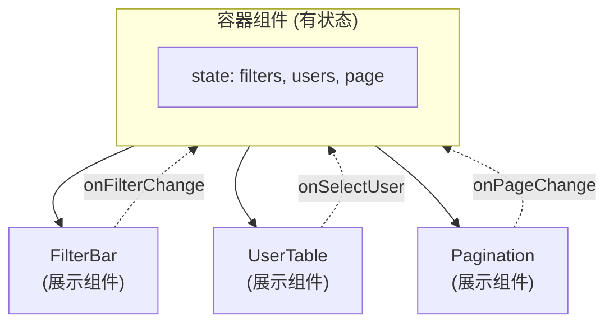
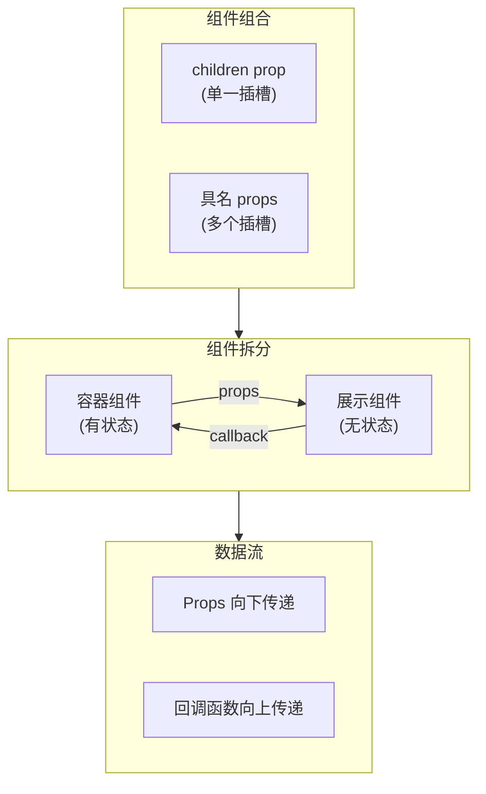

# 组件组合与拆分

> React 推崇「组合优于继承」，通过组件嵌套和 props 传递实现灵活的 UI 构建。这是从「会写组件」到「会设计组件」的关键转折点。

---

## 📋 学习目标

- [x] 理解 children prop 的使用（插槽模式）
- [x] 掌握具名插槽（多个 props 传递组件）
- [x] 实践组件拆分与状态提升
- [x] 理解容器组件与展示组件的区别
- [x] 掌握 key 的正确使用位置

---

## 📖 核心概念

### 1. 组合优于继承

React 组件**从不使用继承**，只使用组合。这与 Java 中的设计原则一致，但 React 贯彻得更彻底。

```
┌─────────────────────────────────────────────────────────┐
│  Java 传统方式                 React 方式               │
│  ─────────────                ──────────               │
│  class UserTable              <Table>                  │
│    extends BaseTable            <UserRow />            │
│                                 <UserRow />            │
│  ↓                            </Table>                 │
│  继承复用                      组合复用                 │
└─────────────────────────────────────────────────────────┘
```

**组合的优势**：
- 更灵活：想放什么就放什么
- 更易测试：组件之间松耦合
- 更易复用：不受继承层级限制

---

### 2. children prop（插槽模式）

React 自动将组件标签之间的内容作为 `children` prop 传递。

```tsx
// 定义 - 接收 children
function Card({ title, children }) {
  return (
    <div className="card">
      <div className="card-header">{title}</div>
      <div className="card-body">{children}</div>
    </div>
  );
}

// 使用 - 标签之间的内容自动成为 children
<Card title="用户信息">
  <p>姓名：张三</p>    ←─┐
  <p>年龄：25</p>      ←─┴─ 这些就是 children
</Card>
```

**底层原理**：

```tsx
// 你写的 JSX
<Card title="标题">
  <p>内容</p>
</Card>

// React 实际处理成
Card({
  title: "标题",
  children: <p>内容</p>  // 自动注入
})
```

> [!tip] 类比 Spring
> children 类似 Spring 的依赖注入：容器组件不关心注入的是什么，只负责「放置」。

---

### 3. 具名插槽（多个 props 传递组件）

当需要多个「插槽」时，使用具名 props：

```tsx
function Layout({ header, sidebar, footer, children }) {
  return (
    <div className="layout">
      <header>{header}</header>
      <div className="body">
        <aside>{sidebar}</aside>
        <main>{children}</main>
      </div>
      <footer>{footer}</footer>
    </div>
  );
}

// 使用
<Layout
  header={<NavBar />}
  sidebar={<Menu />}
  footer={<Copyright />}
>
  <UserTable />  {/* children 放主内容 */}
</Layout>
```

```
┌─────────────────────────────────────┐
│  header={<NavBar />}                │
├──────────┬──────────────────────────┤
│ sidebar  │                          │
│    =     │     children             │
│ <Menu /> │   = <UserTable />        │
│          │                          │
├──────────┴──────────────────────────┤
│  footer={<Copyright />}             │
└─────────────────────────────────────┘
```

---

### 4. 组件拆分原则

#### 何时拆分？

| 信号 | 说明 | 举例 |
|------|------|------|
| **重复出现** | 相同结构出现 2 次以上 | 用户卡片、商品卡片 |
| **逻辑独立** | 有独立的状态或行为 | 搜索框、分页器 |
| **概念清晰** | 对应一个明确的业务概念 | 订单列表、购物车 |

#### 拆分粒度

> 如果你很难给组件起一个好名字，说明拆分可能不合理。

```tsx
// ❌ 过度拆分 - 名字很尴尬
function UserTableRowButtonsContainer() { ... }

// ✅ 合理粒度 - 名字自然
function UserTable() { ... }
function UserDetailModal() { ... }
```

**实践建议**：先写在一起，感到痛苦时再拆分（不要过早优化）。

---

### 5. 状态提升与数据流

当多个组件需要共享状态时，将状态提升到最近的公共父组件。



**数据流动**：
- **向下**：通过 props 传递数据
- **向上**：通过回调函数传递事件

---

### 6. 容器组件 vs 展示组件

| 类型 | 职责 | 特点 |
|------|------|------|
| **容器组件** | 管理状态和逻辑 | 有 state，处理业务逻辑 |
| **展示组件** | 纯 UI 渲染 | 无 state，只接收 props |

```tsx
// 展示组件：纯函数，相同输入 → 相同输出
function FilterBar({ filters, onFilterChange }) {
  return (
    <div className="filter-bar">
      <input
        value={filters.keyword}
        onChange={e => onFilterChange({ ...filters, keyword: e.target.value })}
      />
    </div>
  );
}

// 容器组件：管理状态，协调子组件
function UserManagePage() {
  const [filters, setFilters] = useState({ keyword: '', status: 'all' });
  const [users, setUsers] = useState([]);

  return (
    <div>
      <FilterBar filters={filters} onFilterChange={setFilters} />
      <UserTable users={users} />
    </div>
  );
}
```

> [!note] 类比 DDD
> - 展示组件 ≈ 值对象（Value Object）
> - 容器组件 ≈ 聚合根（Aggregate Root）

---

## ⚠️ 常见陷阱

### key 的正确位置

> [!danger] 关键规则
> **key 必须放在 `.map()` 直接返回的那个元素上**，不是组件内部。

```tsx
// ❌ 错误：key 放在组件内部
function ProductCard({ product }) {
  return <div key={product.id}>...</div>;  // React 看不到这个 key！
}

function ProductGrid({ products }) {
  return products.map(p => <ProductCard product={p} />);  // 缺少 key
}

// ✅ 正确：key 放在 map 返回的元素上
function ProductGrid({ products }) {
  return products.map(p =>
    <ProductCard key={p.id} product={p} />  // key 在这里
  );
}
```

**原因**：React 在父组件（ProductGrid）层面做列表比对，它需要在「看到列表」的那一层知道每个元素的身份。

```
ProductGrid 视角：
  ├── <ProductCard key=1 ???>  ← React 在这里需要 key
  ├── <ProductCard key=2 ???>
  └── <ProductCard key=3 ???>

ProductCard 内部的 key，ProductGrid 看不到！
```

> [!tip] 简单记忆
> 看到 `.map()` 就要想到 `key`，key 放在 map 直接返回的元素上。

---

## 📊 概念关系图



---

## ✏️ 练习

完成练习并运行测试验证：

| 练习 | 主题 | 验证命令 |
|------|------|----------|
| [10-component-composition.tsx](idea://open?file=/Users/linqibin/Desktop/Patra/patra-react-playground/src/exercises/ch02/10-component-composition.tsx) | 组件组合与拆分 | `pnpm test 10-component-composition` |

**练习内容**：
1. Card 组件 - 基础 children 使用
2. Modal 组件 - children + 条件渲染
3. Layout 组件 - 具名插槽
4. TodoApp - 组件拆分与状态提升
5. ProductPage - 综合应用

---

## 🧪 测验

### Q1: children 是怎么来的？

- [ ] A. 需要在父组件中显式传递 `children={...}`
- [x] B. React 自动将组件标签之间的内容作为 children 传递
- [ ] C. 需要在子组件中声明 `static children`
- [ ] D. 通过 Context 传递

> [!success]- 查看答案
> **答案：B**
> React 会自动把 `<Card>` 和 `</Card>` 之间的内容作为 children prop 传递给 Card 组件。

### Q2: key 应该放在哪里？

```tsx
{users.map(user => (
  <UserCard user={user} />
))}
```

- [ ] A. UserCard 组件内部的根元素上
- [x] B. map 返回的 UserCard 组件上
- [ ] C. 两个地方都可以
- [ ] D. 不需要 key

> [!success]- 查看答案
> **答案：B**
> key 必须放在 `.map()` 直接返回的元素上，即 `<UserCard key={user.id} user={user} />`。放在组件内部 React 看不到。

### Q3: 状态应该放在哪个组件？

当 FilterBar 和 UserTable 都需要使用筛选条件时，状态应该放在：

- [ ] A. FilterBar 中，通过 props 传给 UserTable
- [ ] B. UserTable 中，通过 props 传给 FilterBar
- [x] C. 它们的公共父组件中
- [ ] D. 使用全局变量

> [!success]- 查看答案
> **答案：C**
> 这就是「状态提升」原则。当多个组件需要共享状态时，将状态放到最近的公共父组件中，通过 props 向下传递数据，通过回调函数向上传递事件。

---

## 🔗 导航

- 上一节：[[09-form-handling|表单处理]]
- 下一节：[[99-summary|章节总结]]
- 返回：[[_MOC|学习进度总览]]
