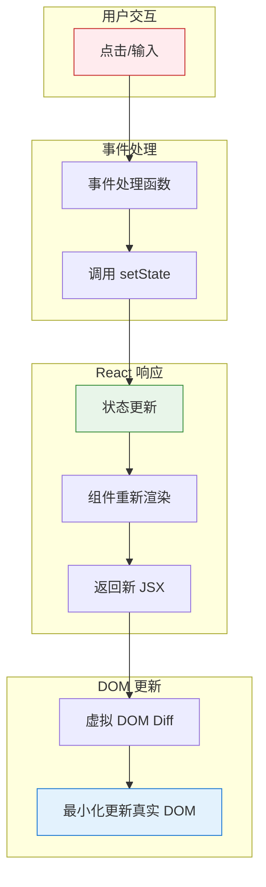

# 第 2 章总结：React 基础概念

> 本章系统学习了 React 的核心理念和基础用法，从理解 React 是什么到能够编写完整的交互式组件。

---

## 📋 知识地图

```
React 基础概念
├── 核心理念
│   └── 01 React 是什么      → 声明式、组件化、单向数据流、虚拟 DOM
│
├── 语法基础
│   ├── 02 JSX 语法          → 本质是 JS、表达式插值、属性转换
│   └── 03 函数组件          → PascalCase 命名、组件复用
│
├── 数据流动
│   ├── 04 Props            → 父传子、只读、children 插槽
│   └── 05 State (useState) → 组件记忆、快照原理、不可变更新
│
├── 交互渲染
│   ├── 06 事件处理          → 函数引用、preventDefault、传参
│   ├── 07 条件渲染          → 三元、&&、提前 return
│   └── 08 列表渲染          → map 转换、key 身份标识
│
└── 进阶模式
    ├── 09 表单处理          → 受控组件、多字段管理
    └── 10 组件组合          → children、状态提升、容器/展示组件
```

---

## 🎯 核心公式

```
┌─────────────────────────────────────────────────────────────┐
│                                                             │
│                     UI = f(state)                           │
│                                                             │
│  state 变化 → React 重新调用组件函数 → 返回新 JSX → 更新 DOM   │
│                                                             │
└─────────────────────────────────────────────────────────────┘
```

---

## 📖 核心概念速查

### 1. React 核心理念

```
┌─────────────────────────────────────────────────────────────┐
│  声明式：描述"结果是什么"，不关心"怎么做到"                     │
│  组件化：UI 拆成独立、可复用的组件                             │
│  单向数据流：数据从父到子流动，通过 props 传递                  │
│  虚拟 DOM：高效更新，只改变真正需要变的部分                     │
└─────────────────────────────────────────────────────────────┘
```

---

### 2. JSX 语法

```jsx
// {} 是 JSX 通往 JavaScript 的窗口
const name = "React";
<h1>Hello, {name}!</h1>

// 字符串用引号，其他用 {}
<div className="box" tabIndex={1} onClick={handleClick}>

// style 必须是对象
<div style={{ color: 'red', fontSize: 16 }}>
```

**HTML → JSX 属性转换**：

| HTML | JSX | 原因 |
|------|-----|------|
| `class` | `className` | class 是 JS 保留字 |
| `for` | `htmlFor` | for 是 JS 保留字 |
| `tabindex` | `tabIndex` | 驼峰命名 |
| `onclick` | `onClick` | 驼峰命名 |

---

### 3. 函数组件

```tsx
// 组件 = 接收 props，返回 JSX
function Greeting({ name }: { name: string }) {
  return <h1>Hello, {name}!</h1>;
}

// 使用：大写开头，像 HTML 标签一样
<Greeting name="React" />
```

**要点**：组件名必须 **PascalCase**（大写开头），否则被当作 HTML 标签。

---

### 4. Props 属性传递

```tsx
// 类型定义用 type
type CardProps = {
  title: string;
  size?: number;        // 可选属性
  children: React.ReactNode;  // 插槽内容
};

// 解构 + 默认值
function Card({ title, size = 64, children }: CardProps) {
  return <div style={{ width: size }}>{children}</div>;
}
```

**要点**：Props 是**只读**的，永远不要修改它！

---

### 5. State 状态管理

```tsx
const [count, setCount] = useState(0);
//      ↑        ↑              ↑
//    状态值   更新函数       初始值

// 直接传值
setCount(5);

// 函数式更新（基于旧值时推荐）
setCount(prev => prev + 1);
```

**状态快照原理**：

```tsx
const handleClick = () => {
  setCount(count + 1);  // count 是快照值 0
  setCount(count + 1);  // 还是 0 + 1
  console.log(count);   // 输出 0
};
// 点击后页面显示 1，不是 2！
```

**不可变更新**：

```tsx
// 对象：展开 + 覆盖
setUser({ ...user, age: 19 });

// 数组：用返回新数组的方法
setItems([...items, newItem]);           // 添加
setItems(items.filter(i => i.id !== id)); // 删除
setItems(items.map(i => i.id === id ? {...i, done: true} : i)); // 修改
```

---

### 6. 事件处理

```tsx
// ✅ 传递函数引用
onClick={() => setCount(count + 1)}
onClick={handleClick}

// ❌ 立即调用（会在渲染时执行！）
onClick={handleClick()}
```

**常用事件操作**：

| 操作 | 方法 | 场景 |
|------|------|------|
| 获取输入值 | `e.target.value` | 输入框 |
| 获取选中状态 | `e.target.checked` | checkbox |
| 阻止默认行为 | `e.preventDefault()` | 表单不刷新 |
| 阻止事件冒泡 | `e.stopPropagation()` | 点击内部不触发外部 |

---

### 7. 条件渲染

```tsx
// 三元表达式：二选一
{isLoggedIn ? <LogoutBtn /> : <LoginBtn />}

// &&：显示或隐藏
{count > 0 && <Badge count={count} />}

// 提前 return：多分支
if (isLoading) return <Loading />;
if (error) return <Error />;
return <Content />;
```

> [!warning] `&&` 的 0 陷阱
> `{count && <Badge />}` 当 count 为 0 时会渲染出 `0`！
> 正确写法：`{count > 0 && <Badge />}`

---

### 8. 列表渲染与 key

```tsx
{products.map(product => (
  <li key={product.id}>      {/* key 放在 map 返回的元素上 */}
    {product.name}
  </li>
))}
```

**key 的本质**：告诉 React "这是谁"（身份），而不是 "这在哪"（位置）。

| key 来源 | 推荐度 | 说明 |
|----------|--------|------|
| 数据库 ID | ✅ 最佳 | `key={user.id}` |
| 业务唯一标识 | ✅ 推荐 | `key={product.sku}` |
| 数组索引 | ⚠️ 谨慎 | 仅静态列表可用 |

---

### 9. 表单处理

```tsx
// 受控组件模式
const [value, setValue] = useState('');

<input
  value={value}                              // 状态 → UI
  onChange={(e) => setValue(e.target.value)} // UI → 状态
/>

// 表单提交
const handleSubmit = (e) => {
  e.preventDefault();  // 阻止页面刷新
  // 处理数据...
};

<form onSubmit={handleSubmit}>
  <button type="submit">提交</button>
</form>
```

**多字段管理**：

```tsx
const [form, setForm] = useState({ username: '', password: '' });

const handleChange = (e) => {
  const { name, value } = e.target;
  setForm(prev => ({ ...prev, [name]: value }));  // 动态键名
};

<input name="username" value={form.username} onChange={handleChange} />
```

---

### 10. 组件组合与拆分

```tsx
// children 插槽
function Card({ title, children }) {
  return (
    <div className="card">
      <h2>{title}</h2>
      <div>{children}</div>
    </div>
  );
}

<Card title="用户信息">
  <p>姓名：张三</p>  {/* 自动成为 children */}
</Card>
```

**容器组件 vs 展示组件**：

| 类型 | 职责 | 特点 |
|------|------|------|
| 容器组件 | 管理状态和逻辑 | 有 state，处理业务 |
| 展示组件 | 纯 UI 渲染 | 无 state，只接收 props |

---

## 📊 数据类型对比表

| 数据类型 | 来源 | 可变性 | 改变时 UI 更新？ |
|----------|------|--------|------------------|
| **Props** | 父组件传入 | 只读 | 父组件传新值时 |
| **State** | 组件内部创建 | 通过 setState | ✅ 调用 setter 时 |
| **普通变量** | 函数内定义 | 可随意修改 | ❌ 永不更新 |

---

## ⚠️ 常见陷阱

### 1. 事件处理：函数引用 vs 立即调用

```tsx
// ❌ 错误：渲染时就执行了
<button onClick={handleClick()}>

// ✅ 正确：点击时才执行
<button onClick={handleClick}>
<button onClick={() => handleClick()}>
```

### 2. 状态更新：快照 vs 最新值

```tsx
// ❌ 连续调用基于快照，只加 1
setCount(count + 1);
setCount(count + 1);

// ✅ 函数式更新基于最新值，加 2
setCount(prev => prev + 1);
setCount(prev => prev + 1);
```

### 3. 不可变更新：引用 vs 值

```tsx
// ❌ 直接修改，React 检测不到变化
user.age = 19;
setUser(user);

// ✅ 创建新对象
setUser({ ...user, age: 19 });
```

### 4. 条件渲染：0 会被渲染

```tsx
// ❌ count 为 0 时显示 "0"
{count && <Badge />}

// ✅ 用比较表达式
{count > 0 && <Badge />}
```

### 5. key 的位置

```tsx
// ❌ key 放在组件内部，React 看不到
function Item({ item }) {
  return <li key={item.id}>...</li>;
}

// ✅ key 放在 map 返回的元素上
{items.map(item => <Item key={item.id} item={item} />)}
```

---

## 🧪 综合测验

### Q1: 下面代码点击后 console 输出什么？页面显示什么？

```tsx
const [count, setCount] = useState(0);

const handleClick = () => {
  setCount(count + 1);
  setCount(count + 1);
  setCount(count + 1);
  console.log(count);
};
```

> [!success]- 查看答案
> **console 输出：0**（快照值）
> **页面显示：1**（三次都是 0+1，批量处理后结果是 1）

### Q2: 如何让上面的代码点击后显示 3？

> [!success]- 查看答案
> 使用函数式更新：
> ```tsx
> setCount(prev => prev + 1);
> setCount(prev => prev + 1);
> setCount(prev => prev + 1);
> ```

### Q3: 下面代码有什么问题？

```tsx
{todos.map((todo, index) => (
  <TodoItem key={index} todo={todo} />
))}
```

> [!success]- 查看答案
> 使用 index 作为 key 在列表重排序、插入、删除时会导致状态错乱。
> 应该使用 `key={todo.id}` 等唯一标识。

---

## 🔗 React 思维模型



---

## ✅ 完成检查清单

- [x] 01 React 是什么 - 四大核心理念理解透彻
- [x] 02 JSX 语法 - `{}` 表达式、属性转换、style 对象
- [x] 03 函数组件 - PascalCase 命名、组件复用
- [x] 04 Props - 只读性、children、类型定义
- [x] 05 State - 快照原理、函数式更新、不可变更新
- [x] 06 事件处理 - 函数引用、preventDefault、传参
- [x] 07 条件渲染 - 三元、&&、提前 return、0 陷阱
- [x] 08 列表渲染 - map + key、index 陷阱
- [x] 09 表单处理 - 受控组件、多字段管理
- [x] 10 组件组合 - children、状态提升、容器/展示组件
- [x] 99 章节总结 - 知识体系建立完成

---

## 🚀 下一步

**第 3 章：React Hooks 深入**

你将学习：
- useEffect 副作用管理
- useRef 引用 DOM 和保存值
- useMemo / useCallback 性能优化
- 自定义 Hook 封装逻辑

带着第二章打下的基础，Hooks 的学习会更加得心应手！

---

## 🔗 导航

- 上一节：[[10-component-composition|组件组合与拆分]]
- 下一章：[[../ch03-react-hooks/00-overview|React Hooks 深入]]
- 返回：[[../_MOC|学习进度总览]]
