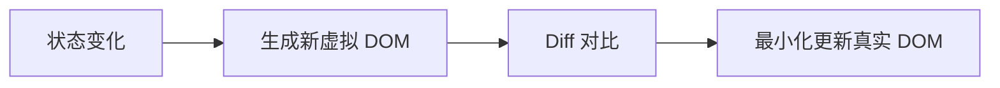

# 复习笔记：React 基础四要素

> 本笔记整理第二章 01-04 节的核心知识点，适合快速复习和查阅。

---

## 🎯 核心公式（必背）

```
UI = f(state)
```

- **state**：数据状态
- **f**：组件函数（描述 UI 长什么样）
- **UI**：用户界面

**你只需要维护 state，React 自动帮你算出 UI。**

---

## 📖 四大核心概念速查

### 1. 声明式 vs 命令式

| 命令式（原生 JS） | 声明式（React） |
|------------------|-----------------|
| 获取 DOM 节点 | 不需要 |
| 手动绑定事件 | JSX 中声明 `onClick` |
| 手动更新 DOM | React 自动处理 |

**类比**：命令式像写菜谱（切菜→热油→下锅），声明式像点外卖（我要宫保鸡丁）。

### 2. 组件化

组件 = **封装 UI + 逻辑的独立单元**

```
组件 = 函数
输入：props（数据）→ 输出：JSX（UI）
```

### 3. 单向数据流

数据只能从**父组件流向子组件**，通过 Props 传递。

好处：
- 可预测性 —— 数据变化路径清晰
- 易于调试 —— 出问题往上找
- 组件独立 —— 子组件不会意外影响父组件

### 4. 虚拟 DOM



**类比**：就像 Git 的 diff，不复制整个文件，只记录变化的行。

---

## 🔧 JSX 语法速查

### JSX 本质

```jsx
// 你写的 JSX
<div className="box">Hello</div>

// 编译后
React.createElement('div', { className: 'box' }, 'Hello')
```

**理解了这个，很多规则就不用死记：**
- 为什么用 `className`？→ `class` 是 JS 保留字
- 为什么 `style` 要对象？→ JSX 属性值就是 JS 值
- 为什么用 `{}`？→ 那是 JS 表达式的入口

### `{}` 的三种用法 ⭐

```
┌─────────────────────────────────────────────────────────────┐
│                    JSX 属性值规则                            │
├─────────────────────────────────────────────────────────────┤
│                                                             │
│  字符串？ ──────→ 直接用引号                                 │
│                   className="box"                           │
│                                                             │
│  JS 变量/数字？ ──→ 用 {}                                   │
│                   id={myId}                                 │
│                   tabIndex={1}                              │
│                                                             │
│  对象值？ ────────→ {} 里面再放 {}                           │
│                   style={{ color: 'red' }}                  │
│                         ↑      ↑                            │
│                  JSX 入口   对象字面量                        │
│                                                             │
└─────────────────────────────────────────────────────────────┘
```

**速记**：
- 字符串 → `"value"`
- 变量/数字 → `{value}`
- 对象 → `{{ key: value }}`

### 表达式 vs 语句

```
┌─────────────────────────────────────────────────────────────┐
│                   {} 里只能放表达式！                         │
├─────────────────────────────────────────────────────────────┤
│                                                             │
│  ✅ 表达式（能产生值）          ❌ 语句（执行动作）            │
│  ─────────────────────        ─────────────────────        │
│  • 1 + 1                      • if (...) { }               │
│  • user.name                  • for (...) { }              │
│  • isAdmin ? 'yes' : 'no'     • while (...) { }            │
│  • getData()                  • switch (...) { }           │
│  • arr.map(...)               • const x = ...              │
│                                                             │
└─────────────────────────────────────────────────────────────┘
```

### HTML → JSX 属性转换

| HTML | JSX | 原因 |
|------|-----|------|
| `class` | `className` | JS 保留字 |
| `for` | `htmlFor` | JS 保留字 |
| `tabindex` | `tabIndex` | 驼峰命名 |
| `onclick` | `onClick` | 驼峰命名 |

### style 对象写法

```jsx
// ❌ 错误：字符串
<div style="color: red">

// ✅ 正确：对象，属性名驼峰
<div style={{ color: 'red', fontSize: 16 }}>
```

---

## 🧩 函数组件速查

### 基本语法

```tsx
// 推荐：function 声明
function Greeting() {
  return <h1>Hello!</h1>;
}

// 也可以：箭头函数
const Greeting = () => <h1>Hello!</h1>;
```

### 命名规范（必须遵守！）

```tsx
// ✅ 正确：PascalCase
function UserCard() { ... }

// ❌ 错误：小写开头
function userCard() { ... }  // 会被当成 HTML 标签！
```

**原理**：
```tsx
<Greeting />  →  React.createElement(Greeting, null)  // 大写：组件
<greeting />  →  React.createElement('greeting', null) // 小写：标签
```

### 组件组合

```tsx
function Header() {
  return (
    <header>
      <Logo />      {/* 组件嵌套 */}
      <NavMenu />
    </header>
  );
}
```

### 易错点：JSX vs 模板字符串

```tsx
// ❌ 错误：混用模板字符串语法
<p>¥${price}</p>  // 显示：¥$299

// ✅ 正确：JSX 直接用 {}
<p>¥{price}</p>   // 显示：¥299
```

---

## 📦 Props 速查

### Props 本质

Props 是组件的输入参数，本质是一个 **JavaScript 对象**。

```tsx
<Greeting name="React" age={25} />
// props = { name: "React", age: 25 }
```

### 传递方式

```tsx
// 方式 1：逐个传递
<UserCard name="张三" age={25} />

// 方式 2：展开运算符
const user = { name: '张三', age: 25 };
<UserCard {...user} />
```

### 接收方式（推荐解构）

```tsx
// ✅ 推荐：解构 + 默认值
function Avatar({ src, size = 64 }: AvatarProps) {
  return ;
}
```

### TypeScript 类型定义

```tsx
// 推荐用 type（不是 interface）
type ButtonProps = {
  text: string;
  size?: 'sm' | 'md' | 'lg';  // 可选 + 联合类型
  disabled?: boolean;
};
```

### children 特殊属性 ⭐

```tsx
type CardProps = {
  title: string;
  children: React.ReactNode;  // 最通用的类型
};

function Card({ title, children }: CardProps) {
  return (
    <div>
      <h2>{title}</h2>
      <div>{children}</div>  {/* 直接渲染 */}
    </div>
  );
}

// 使用
<Card title="公告">
  <p>这就是 children</p>
</Card>
```

### Props 只读性（重要！）

```tsx
// ❌ 错误：不能修改 props
function Greeting({ name }: { name: string }) {
  name = 'World';  // TypeScript 会报错！
}

// ✅ 正确：创建新变量
function Greeting({ name }: { name: string }) {
  const displayName = name || 'Guest';
}
```

---

## ⚡ 条件渲染：`&&` 运算符 ⭐

### 返回值规则

```
左边为 truthy  →  返回【右边的值】
左边为 falsy   →  返回【左边的值】
```

```tsx
85 && '有成绩'   // → '有成绩'（不是 true！）
false && '优秀'  // → false
0 && '显示'      // → 0（会渲染成 "0"！）
```

### React 渲染规则

- `false`、`null`、`undefined` → **不渲染**
- `0` → **会渲染成 "0"**（常见坑！）

```tsx
// ✅ 正确用法
{isHot && <span>[热卖]</span>}

// ⚠️ 小心：count 为 0 时会显示 "0"
{count && <span>{count}条消息</span>}

// ✅ 安全写法
{count > 0 && <span>{count}条消息</span>}
```

---

## 🎭 默认值与 undefined/null

```tsx
function Button({ size = 'md' }: { size?: string }) {
  // ...
}

<Button />                  // size = 'md' ✅ 默认值生效
<Button size="lg" />        // size = 'lg' ✅ 使用传入值
<Button size={undefined} /> // size = 'md' ✅ 默认值生效！
<Button size={null} />      // size = null ❌ 默认值不生效！
```

**记住**：`undefined` 触发默认值，`null` 不触发。

---

## 🔄 数据类型与 UI 更新

| 数据类型 | 用途 | 改变时 UI 更新？ |
|----------|------|------------------|
| **Props** | 接收外部数据 | 父组件重新传入时更新 |
| **State** | 组件内部可变数据 | ✅ 调用 setter 时更新 |
| **普通变量** | 临时计算 | ❌ 永不更新 |

---

## 📝 快速检查清单

写组件时对照检查：

- [ ] 组件名是否 PascalCase？
- [ ] Props 类型是否用 `type` 定义？
- [ ] 可选属性是否有默认值？
- [ ] style 是否用对象语法 `{{}}`？
- [ ] className 而不是 class？
- [ ] 条件渲染是否考虑了 0 的情况？
- [ ] children 类型是否是 `React.ReactNode`？

---

## 🔗 相关练习

| 练习 | 文件 | 考核点 |
|------|------|--------|
| JSX 语法 | [01-jsx-syntax.tsx](idea://open?file=/Users/linqibin/Desktop/Patra/patra-react-playground/src/exercises/ch02/01-jsx-syntax.tsx) | 表达式插值、属性转换、style |
| 函数组件 | [02-function-components.tsx](idea://open?file=/Users/linqibin/Desktop/Patra/patra-react-playground/src/exercises/ch02/02-function-components.tsx) | 组件定义、组合、复用 |
| Props | [03-props.tsx](idea://open?file=/Users/linqibin/Desktop/Patra/patra-react-playground/src/exercises/ch02/03-props.tsx) | 传递、解构、children |
| 综合复习 | [review-01.tsx](idea://open?file=/Users/linqibin/Desktop/Patra/patra-react-playground/src/exercises/ch02/review-01.tsx) | 全部知识点 |

---

## 🔗 导航

- 下一节：[[05-state-usestate|State 状态管理]]
- 返回目录：[[_MOC|学习进度总览]]
