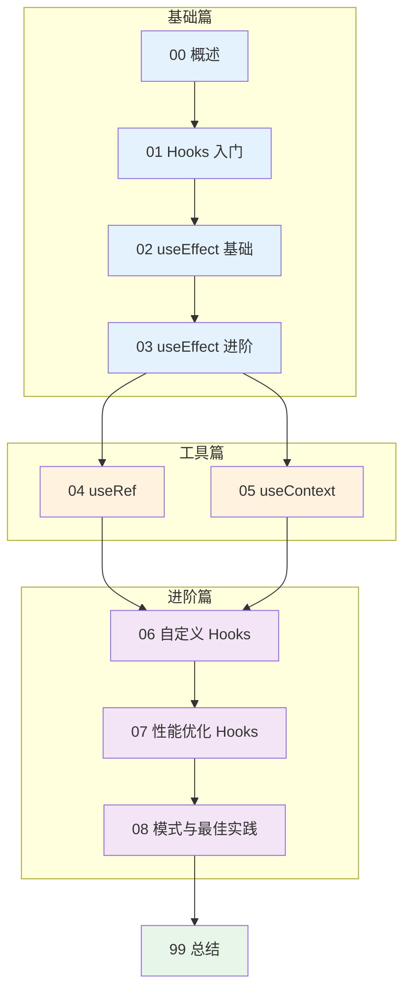
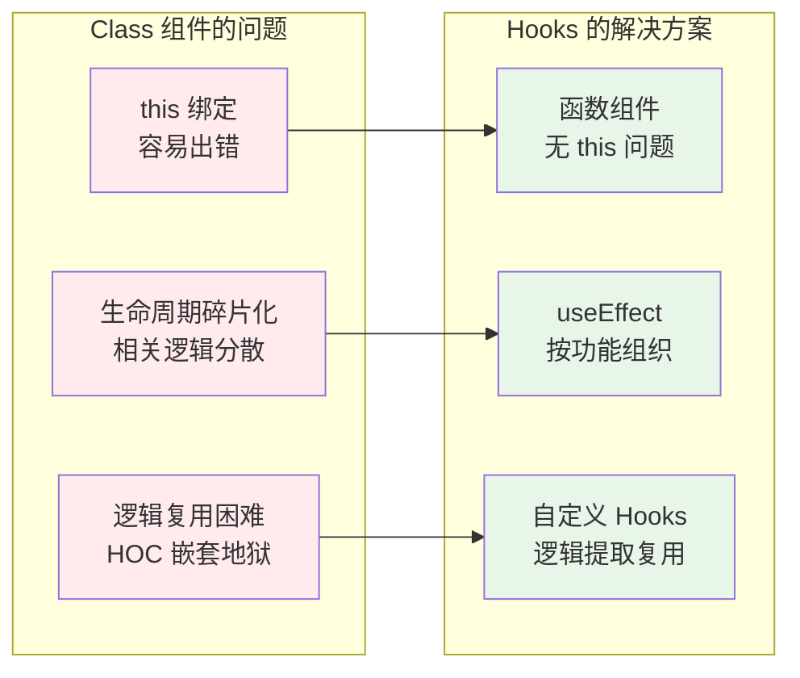

# 第 3 章：React Hooks 深入

> 系统理解 React Hooks 的概念与设计哲学，掌握副作用处理、状态共享和性能优化

---

## 本章目标

完成本章学习后，你将能够：

- [ ] 理解 Hooks 的本质、分类和调用规则
- [ ] 使用 useEffect 正确处理副作用（数据获取、订阅、DOM 操作）
- [ ] 使用 useRef 获取 DOM 引用和存储可变值
- [ ] 使用 useContext 实现跨组件状态共享
- [ ] 设计和实现自定义 Hooks 复用逻辑
- [ ] 使用 useMemo/useCallback 进行性能优化
- [ ] 识别和避免常见的 Hooks 陷阱（闭包、无限循环等）

---

## 前置知识

> [!tip] 来自第 2 章的知识储备
> 本章建立在第 2 章的基础上，确保你对以下内容足够熟悉：

| 知识点 | 本章应用场景 |
|--------|-------------|
| [[../ch02-react-basics/05-state-usestate\|useState]] | 所有 Hooks 的基础，状态管理 |
| [[../ch02-react-basics/06-event-handling\|事件处理]] | useCallback 优化事件处理器 |
| [[../ch02-react-basics/04-props\|Props 传递]] | useContext 解决 props drilling |
| [[../ch02-react-basics/10-component-composition\|组件组合]] | 自定义 Hooks 提取复用逻辑 |

---

## 学习路线



---

## 章节内容

### 基础篇：Hooks 概念与副作用（约 5.5 小时）

| 节 | 标题 | 核心内容 | 预计时间 |
|---|------|----------|----------|
| [[01-hooks-intro\|01]] | Hooks 入门 | Hooks 本质、分类全景图、调用规则、与 Class 对比 | 1h |
| [[02-useeffect-basics\|02]] | useEffect 基础 | 副作用概念、基本语法、执行时机、依赖数组入门 | 1.5h |
| [[03-useeffect-advanced\|03]] | useEffect 进阶 | 依赖数组详解、清理函数、闭包陷阱、问题诊断 | 2h |

### 工具篇：引用与上下文（约 2.5 小时）

| 节 | 标题 | 核心内容 | 预计时间 |
|---|------|----------|----------|
| [[04-useref\|04]] | useRef | DOM 引用、可变值存储、与 state 区别 | 1h |
| [[05-usecontext\|05]] | useContext | Context 机制、跨组件通信、避免滥用 | 1.5h |

### 进阶篇：复用与优化（约 5.5 小时）

| 节 | 标题 | 核心内容 | 预计时间 |
|---|------|----------|----------|
| [[06-custom-hooks\|06]] | 自定义 Hooks | 逻辑提取、命名规范、常用模式 | 2h |
| [[07-performance-hooks\|07]] | 性能优化 Hooks | useMemo、useCallback、React.memo | 2h |
| [[08-hooks-patterns\|08]] | 模式与最佳实践 | 常见陷阱、ESLint 规则、调试技巧 | 1.5h |

**预计总学习时间：约 13.5 小时**

---

## Java 开发者视角

作为 Java/Spring 开发者，你可以这样理解 Hooks：

| React Hook | Java/Spring 类比 | 说明 |
|------------|-----------------|------|
| `useState` | 实例变量 + setter | 但声明式、不可变 |
| `useEffect(() => {}, [])` | `@PostConstruct` | 组件挂载后执行 |
| `useEffect` 清理函数 | `@PreDestroy` | 组件卸载前执行 |
| `useContext` | `@Autowired` | 依赖注入，跨组件共享 |
| `useRef` | 实例变量（不触发更新） | 存储可变值 |
| `useMemo` | 方法级缓存 | 类似 Guava Cache |
| 自定义 Hooks | 工具类 / 组合模式 | 逻辑复用 |

---

## 为什么需要 Hooks？

在 React 16.8 之前，复杂逻辑只能用 Class 组件实现。Class 组件有三个痛点：



---

## 与 Ant Design Pro 的关联

本章学习的 Hooks 知识，将直接应用于 Ant Design Pro 开发：

| 本章内容 | Ant Design Pro 应用 |
|---------|-------------------|
| useEffect | 页面初始化数据加载 |
| useContext | 全局配置（主题、国际化） |
| 自定义 Hooks | `useRequest`、`useModel` 的理解基础 |
| 性能优化 | 大型表格、复杂表单优化 |

---

## 练习项目

本章的所有代码练习都在 `patra-react-playground` 项目中进行：

```bash
# 启动开发服务器
cd /Users/linqibin/Desktop/Patra/patra-react-playground
pnpm dev

# 运行测试
pnpm test

# 可视化测试界面
pnpm test:ui
```

练习文件位置：`src/exercises/ch03/`

---

## 下一步

准备好了吗？让我们从 [[01-hooks-intro|Hooks 入门]] 开始，建立对 React Hooks 的整体认知！
