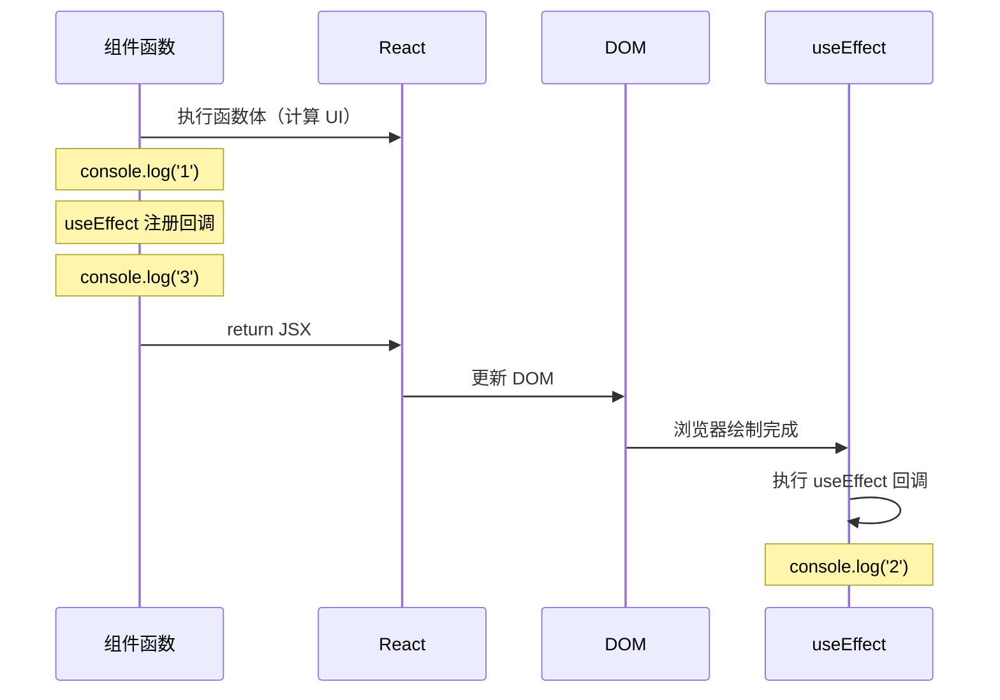
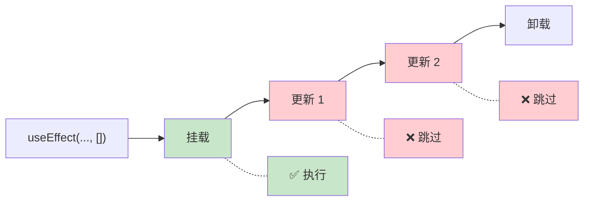
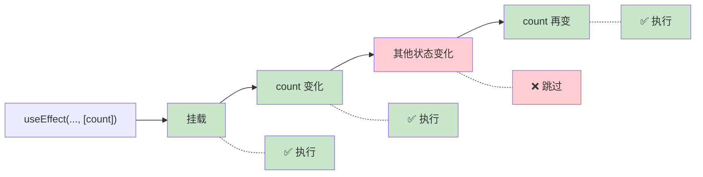
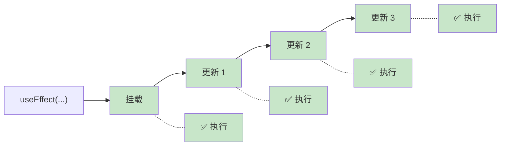
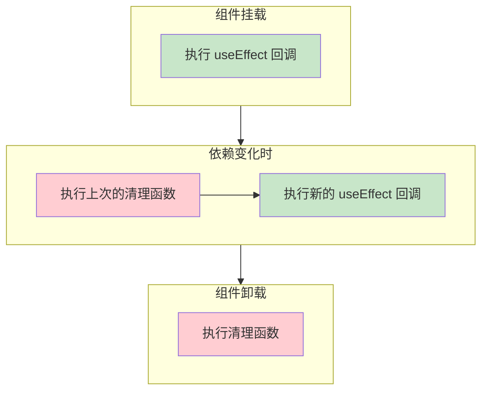

# useEffect 基础

> useEffect 让你在渲染后执行「副作用」操作——数据获取、订阅、DOM 操作等

---

## 📋 学习目标

- [x] 理解什么是「副作用」（Side Effect）
- [x] 掌握 useEffect 的基本语法和执行时机
- [x] 理解依赖数组的三种形态及其区别
- [x] 掌握清理函数的使用场景和执行时机
- [x] 理解为什么在 useEffect 中调用 setState 是安全的

---

## 📖 核心概念

### 1. 什么是副作用？

**副作用 = 与渲染 UI 无关的操作**

```tsx
function MyComponent() {
  // ✅ 渲染逻辑：计算 UI 长什么样
  const name = 'Alice';
  const element = <div>{name}</div>;

  // ❌ 副作用：与计算 UI 无关的操作
  // - fetch 数据
  // - setInterval / setTimeout
  // - document.title = ...
  // - WebSocket 订阅

  return element;
}
```

> [!tip] 函数式编程视角
> 「纯函数」只根据输入计算输出，不影响外部世界。「副作用」就是那些**会影响外部世界**的操作。React 希望渲染过程是「纯」的，所以把副作用隔离到 `useEffect` 中。

### 2. useEffect 基本语法

```tsx
useEffect(() => {
  // 副作用代码
  console.log('组件渲染完成！');
}, [依赖数组]);
```

```d2
direction: right

useEffect: useEffect( ) {
  style.fill: "#fff3e0"
}

syntax: 语法结构 {
  style.fill: "#e3f2fd"

  callback: 回调函数 {
    style.fill: "#bbdefb"
    desc: 副作用代码
  }

  deps: 依赖数组 {
    style.fill: "#c8e6c9"
    desc: 控制执行时机
  }
}

useEffect -> syntax.callback: 参数 1
useEffect -> syntax.deps: 参数 2
```

### 3. 执行时机：渲染后执行



**关键点**：useEffect 在渲染**之后**执行，不阻塞页面显示。

---

## 📦 依赖数组详解

依赖数组决定了 useEffect「**何时重新执行**」，这是 useEffect 最核心的概念之一。

### 三种形态对比

| 依赖数组 | 执行时机 | Java 类比 | 使用场景 |
|---------|---------|----------|---------|
| `[]` 空数组 | 只在挂载时执行一次 | `@PostConstruct` | 初始化数据、建立连接 |
| `[a, b]` 有依赖 | 挂载时 + a 或 b 变化时 | 属性变化监听器 | 同步状态、响应变化 |
| 不传 | 每次渲染后都执行 | ⚠️ 谨慎使用 | 极少使用 |

### 1️⃣ 空数组 `[]`：只执行一次



> 适用于：初始化数据获取、建立 WebSocket 连接、添加全局事件监听

### 2️⃣ 有依赖 `[dep]`：依赖变化时执行



> 适用于：同步文档标题、根据 ID 获取数据、响应 props 变化

### 3️⃣ 不传依赖：每次渲染都执行



> ⚠️ **谨慎使用**：容易导致性能问题或无限循环，通常是遗漏依赖数组的错误

### 记忆口诀

> [!tip] 一句话记住
> - **空数组** `[]` = "只跑一次"（像 `@PostConstruct`）
> - **有依赖** `[x]` = "x 变我就跑"
> - **无依赖** = "每次都跑"（⚠️ 通常是错误用法）

### 代码示例

```tsx
// 1️⃣ 空数组：只执行一次（挂载时）
useEffect(() => {
  console.log('只在挂载时执行');
}, []);

// 2️⃣ 有依赖：count 变化时重新执行
useEffect(() => {
  document.title = `Count: ${count}`;
}, [count]);

// 3️⃣ 不传：每次渲染后都执行（慎用）
useEffect(() => {
  console.log('每次渲染后都执行');
});
```

---

## 🧹 清理函数

有些副作用需要「清理」，比如定时器、事件监听、WebSocket 连接。

### 语法

```tsx
useEffect(() => {
  // 建立副作用
  const timer = setInterval(() => console.log('tick'), 1000);

  // 返回清理函数
  return () => {
    clearInterval(timer);
  };
}, []);
```

### 执行时机



### 实际案例：聊天室连接

```tsx
function ChatRoom({ roomId }) {
  useEffect(() => {
    const connection = createConnection(roomId);
    connection.connect();       // 建立连接

    return () => {
      connection.disconnect();  // 断开连接
    };
  }, [roomId]);
}
```

当 `roomId` 从 `"general"` 变成 `"random"` 时：
1. 执行清理函数 → 断开 `"general"`
2. 执行新的回调 → 连接 `"random"`

---

## ⚠️ 重要：setState 的调用位置

> [!warning] 与 [[01-hooks-intro#2. 渲染过程中不能调用 setState|上一节知识点]] 的关联
> 在 [[01-hooks-intro|Hooks 入门]] 中我们学过：**渲染过程中直接调用 setState 会导致无限循环**。但在 useEffect 中调用 setState 是安全的，原因在于**执行时机不同**。

### 对比分析

| 场景 | 调用位置 | 会无限循环吗？ | 原因 |
|------|---------|--------------|------|
| 函数体直接调用 | 渲染**过程中** | ✅ 会 | 每次渲染都执行 → 无限触发 |
| useEffect `[]` | 渲染**之后** | ❌ 不会 | 只执行一次 |
| useEffect `[dep]` | 渲染**之后** | ❌ 不会 | 只在依赖变化时执行 |
| useEffect 无依赖 | 渲染**之后** | ⚠️ 可能 | 需要条件判断避免 |

```tsx
function MyComponent() {
  const [count, setCount] = useState(0);

  // ❌ 渲染过程中调用 → 无限循环！
  // setCount(1);

  // ✅ useEffect 中调用 → 安全
  useEffect(() => {
    setCount(1);
  }, []);  // 空数组确保只执行一次

  return <div>{count}</div>;
}
```

### 核心理解

```
渲染过程中调用 setState
= 做饭的同时又点了一份新菜 → 厨房混乱

useEffect 中调用 setState
= 吃完饭后再点下一份 → 正常流程
```

> [!caution] useEffect 也可能无限循环！
> ```tsx
> // ❌ 错误示例
> useEffect(() => {
>   setCount(count + 1);
> }, [count]);  // count 变 → effect 执行 → count 又变 → 无限循环！
> ```

---

## 💡 函数式更新技巧

在 useEffect 中使用定时器时，推荐使用**函数式更新**避免闭包问题：

```tsx
// ❌ 可能有问题：闭包捕获了旧的 count
useEffect(() => {
  const timer = setInterval(() => {
    setCount(count + 1);  // count 始终是初始值
  }, 1000);
  return () => clearInterval(timer);
}, [count]);  // 需要把 count 加入依赖，导致定时器反复重启

// ✅ 推荐：函数式更新
useEffect(() => {
  const timer = setInterval(() => {
    setCount(prev => prev + 1);  // 不依赖外部 count
  }, 1000);
  return () => clearInterval(timer);
}, []);  // 空依赖，定时器只创建一次
```

---

## 📝 常见使用场景

| 场景 | 依赖数组 | 需要清理 | 示例 |
|------|---------|---------|------|
| 获取初始数据 | `[]` | 通常不需要 | `fetch('/api/user')` |
| 同步文档标题 | `[title]` | 不需要 | `document.title = title` |
| 设置定时器 | `[]` | ✅ 需要 | `setInterval(...)` |
| 事件监听 | `[]` 或 `[dep]` | ✅ 需要 | `addEventListener(...)` |
| WebSocket | `[roomId]` | ✅ 需要 | `socket.connect()` |

---

## ✏️ 练习

| 练习文件 | 验证命令 |
|----------|----------|
| [02-useeffect-basics.tsx](idea://open?file=/Users/linqibin/Desktop/Patra/patra-react-playground/src/exercises/ch03/02-useeffect-basics.tsx) | `pnpm test 02-useeffect-basics` |

**练习内容**：
- 练习 1：预测 useEffect 执行顺序
- 练习 2A：同步文档标题
- 练习 2B：实现自动计时器 + 清理函数
- 练习 2C：模拟数据获取
- 练习 3：修复依赖数组和清理函数问题

**完成状态**：✅ 12/12 测试通过

---

## 🔗 相关知识

- [[01-hooks-intro#2. 渲染过程中不能调用 setState|渲染过程中不能调用 setState]] — 理解为什么 useEffect 中调用 setState 是安全的
- [[01-hooks-intro#🎯 重要模式：Map 模式管理列表状态|Map 模式管理列表状态]] — useEffect 中更新复杂状态的模式

---

## 🔗 导航

- 上一节：[[01-hooks-intro|Hooks 入门]]
- 下一节：[[03-useeffect-advanced|useEffect 进阶]]
