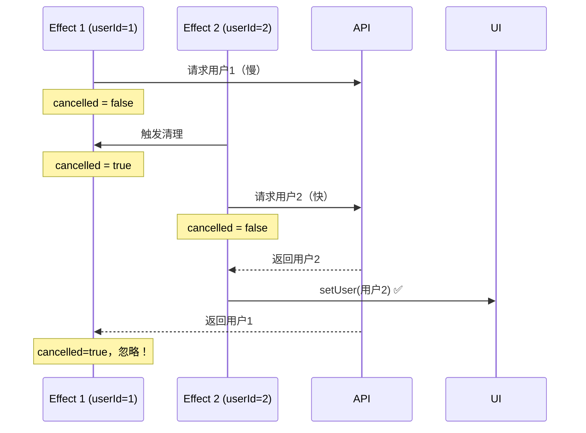

# useEffect 进阶

> 掌握 useEffect 最容易出错的地方——闭包陷阱、依赖数组问题和竞态条件

---

## 📋 学习目标

- [x] 理解闭包陷阱（Stale Closure）的原因和表现
- [x] 掌握函数式更新解决闭包问题
- [x] 学会用 useRef 作为「逃生舱」保存最新值
- [x] 正确判断依赖数组该包含哪些值
- [x] 理解对象/函数依赖导致无限循环的原因
- [x] 掌握 cancelled 标记解决竞态条件

---

## 🕳️ 闭包陷阱（Stale Closure）

### 问题现象

```tsx
function Counter() {
  const [count, setCount] = useState(0);

  useEffect(() => {
    const timer = setInterval(() => {
      console.log('count:', count);  // 永远输出 0！
      setCount(count + 1);           // 永远设置为 1！
    }, 1000);
    return () => clearInterval(timer);
  }, []);

  return <div>{count}</div>;  // 页面永远显示 1
}
```

### 原因分析

```
第一次渲染时：
┌─────────────────────────────────────────────────────────┐
│  useEffect 回调被创建，「拍摄」了当时的 count 值          │
│                                                         │
│  setInterval 回调：                                     │
│    count = 0  ← 被「冻结」在闭包中                       │
│    setCount(0 + 1) → 永远是 1                           │
│                                                         │
│  📸 闭包快照：count = 0（永不更新）                      │
└─────────────────────────────────────────────────────────┘
```

> [!important] 闭包的本质
> JavaScript 函数会「记住」它被创建时的环境。当 useEffect 的回调在第一次渲染时创建，它捕获的 `count` 就是当时的值 `0`。即使后来 `count` 变了，这个回调里的 `count` 还是 `0`。

### 解决方案一：函数式更新

```tsx
// ❌ 闭包陷阱
setCount(count + 1);     // count 永远是旧值

// ✅ 函数式更新
setCount(prev => prev + 1);  // React 传入最新值
```

```
对比：
┌─────────────────────────────────────────────────────────┐
│  setCount(count + 1)                                    │
│  └─ "把 count 设为 count + 1"                           │
│  └─ 需要知道 count 当前是多少 ← 依赖闭包中的旧值！        │
├─────────────────────────────────────────────────────────┤
│  setCount(prev => prev + 1)                             │
│  └─ "把 count 设为 (当前值 + 1)"                        │
│  └─ React 传入最新值 ← 不依赖闭包！                      │
└─────────────────────────────────────────────────────────┘
```

### 解决方案二：加入依赖数组

```tsx
useEffect(() => {
  const timer = setInterval(() => {
    setCount(count + 1);
  }, 1000);
  return () => clearInterval(timer);
}, [count]);  // count 变化时重新执行
```

**缺点**：定时器会反复销毁重建，不够优雅。

### 解决方案三：useRef 逃生舱

当需要在回调中**读取**最新值（而非更新）时，使用 `useRef`：

```tsx
const countRef = useRef(count);

// 同步最新值到 ref
useEffect(() => {
  countRef.current = count;
}, [count]);

// 在延迟回调中读取最新值
const handleDelayed = () => {
  setTimeout(() => {
    console.log(countRef.current);  // 总是最新值！
  }, 2000);
};
```

> [!tip] useRef 为什么能解决？
> `useRef` 返回一个**可变对象**，它的 `.current` 属性可以随时修改。闭包捕获的是**这个对象的引用**（不变），而对象的内容（`.current`）可以更新。这就像闭包拍了张「相框」的照片，但相框里的照片可以换。

---

## 📦 依赖数组详解

### 黄金法则

> **Effect 内部用到的、来自组件的值，都要放进依赖数组**

### 速查表

| 值的类型 | 是否需要加入依赖 | 原因 |
|---------|-----------------|------|
| **props** | ✅ 需要 | 可能会变化 |
| **state** | ✅ 需要 | 可能会变化 |
| **组件内定义的变量/函数** | ✅ 需要 | 每次渲染都是新的 |
| **setState 函数** | ❌ 不需要 | React 保证稳定 |
| **useRef 的 ref 对象** | ❌ 不需要 | React 保证稳定 |
| **组件外部的常量** | ❌ 不需要 | 永远不变 |

### 示例

```tsx
const API_URL = 'https://api.example.com';  // 组件外常量

function UserPosts({ userId, sortOrder }) {  // props
  const [posts, setPosts] = useState([]);    // state

  useEffect(() => {
    fetch(`${API_URL}/users/${userId}/posts?sort=${sortOrder}`)
    //     ^^^^^^^ 不需要  ^^^^^^ 需要      ^^^^^^^^^ 需要
      .then(res => res.json())
      .then(setPosts);
    //     ^^^^^^^^ 不需要（setter 稳定）
  }, [userId, sortOrder]);  // ✅ 只需要 props
}
```

---

## ⚠️ 对象/函数依赖陷阱

### 问题：无限循环

```tsx
function SearchBox() {
  const options = { limit: 10 };  // 🚨 每次渲染都是新对象！

  useEffect(() => {
    search(options);
  }, [options]);  // options 每次都「变」→ 无限循环！
}
```

### 原因

```tsx
// JavaScript 引用相等性
{ limit: 10 } === { limit: 10 }  // false！不同对象

// 每次渲染
const options = { limit: 10 };  // 新对象
const options = { limit: 10 };  // 又一个新对象
// React 认为依赖变了 → 重新执行 effect → 又渲染...
```

### 解决方案

```tsx
// 方案 1：移到 useEffect 内部
useEffect(() => {
  const options = { limit: 10 };
  search(options);
}, []);

// 方案 2：移到组件外部（如果不依赖 props/state）
const options = { limit: 10 };
function SearchBox() { ... }

// 方案 3：useMemo 缓存
const options = useMemo(() => ({ limit: 10 }), []);
```

---

## 🏃 竞态条件（Race Condition）

### 问题场景

```
时间线：userId 从 1 快速切换到 2
─────────────────────────────────────────────────────────→
├─ userId=1，发起请求 A（慢，500ms）
├─ userId=2，发起请求 B（快，100ms）
│        │     │
│        │     └─ 请求 B 返回 → setUser(用户2) ✅
│        └─ 请求 A 返回 → setUser(用户1) 🚨 覆盖了！

结果：显示用户1，但当前 userId 是 2！
```

### 解决方案：cancelled 标记

```tsx
useEffect(() => {
  let cancelled = false;  // 标记

  fetchUser(userId).then(data => {
    if (!cancelled) {     // 只有未取消时才更新
      setUser(data);
    }
  });

  return () => {
    cancelled = true;     // 清理时标记为已取消
  };
}, [userId]);
```



---

## 💡 箭头函数清理函数的小坑

```tsx
// ❌ 错误：隐式返回 boolean
return () => cancelled = true
// 等价于 return () => { return cancelled = true }
// 返回类型是 boolean，TypeScript 报错

// ✅ 正确：花括号包裹
return () => { cancelled = true }
// 返回 void，符合清理函数类型
```

> [!tip] 最佳实践
> 清理函数总是使用花括号，意图更清晰、类型更安全。

---

## 📝 三大技巧总结

| 问题 | 技巧 | 代码 |
|------|------|------|
| 定时器中更新状态 | 函数式更新 | `setCount(prev => prev + 1)` |
| 延迟回调读取最新值 | useRef 逃生舱 | `countRef.current` |
| 异步请求顺序问题 | cancelled 标记 | `if (!cancelled) { ... }` |

---

## ✏️ 练习

| 练习文件 | 验证命令 |
|----------|----------|
| [03-useeffect-advanced.tsx](idea://open?file=/Users/linqibin/Desktop/Patra/patra-react-playground/src/exercises/ch03/03-useeffect-advanced.tsx) | `pnpm test 03-useeffect-advanced` |

**练习内容**：
- 练习 1：预测闭包陷阱结果
- 练习 2A：函数式更新修复定时器
- 练习 2B：useRef 保存最新值
- 练习 3：依赖数组判断与修复
- 练习 4：cancelled 标记修复竞态条件

**完成状态**：✅ 9/9 测试通过

---

## 🔗 相关知识

- [[02-useeffect-basics|useEffect 基础]] — 依赖数组和清理函数的基础用法
- [[02-useeffect-basics#⚠️ 重要：setState 的调用位置|setState 调用位置]] — 理解 useEffect 中调用 setState 为什么安全
- [[04-useref|useRef]] — 下一节深入学习 useRef 的更多用法

---

## 🔗 导航

- 上一节：[[02-useeffect-basics|useEffect 基础]]
- 下一节：[[04-useref|useRef]]
