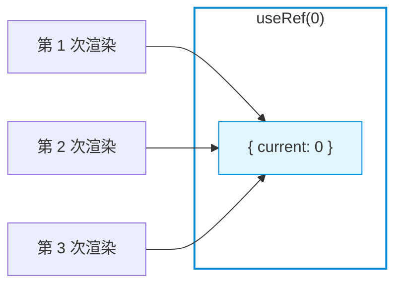
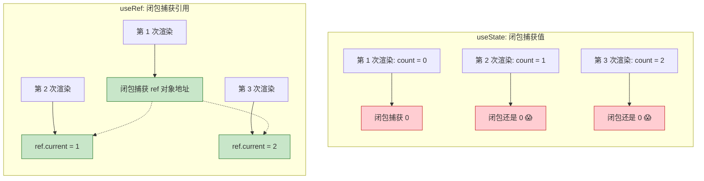
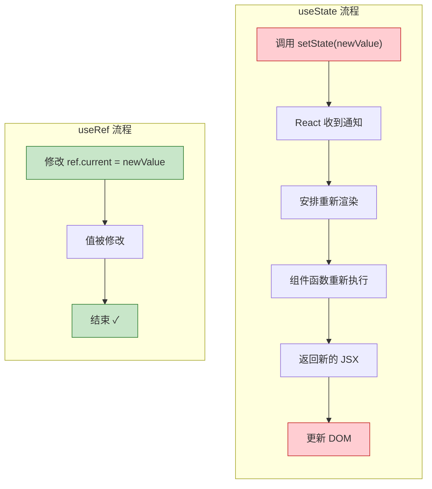
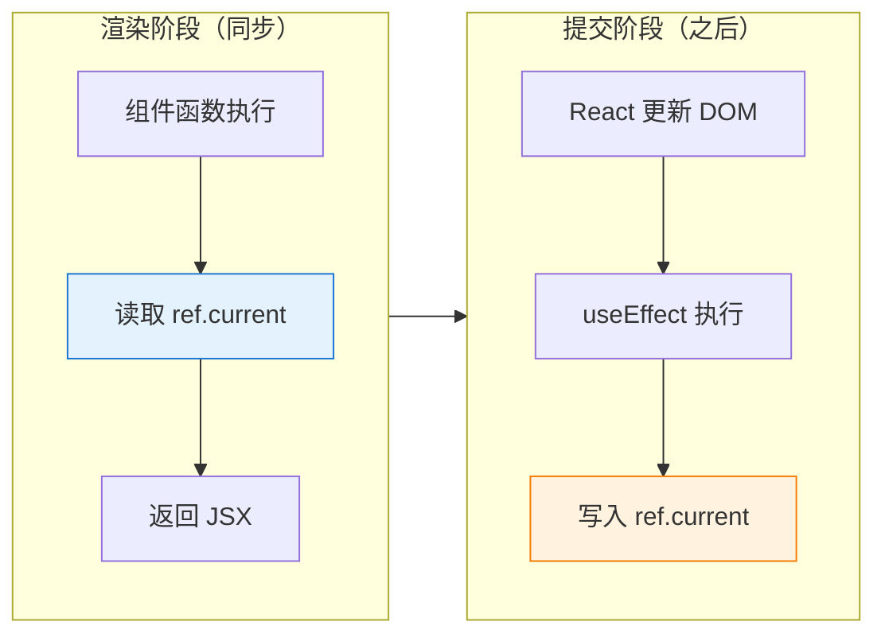
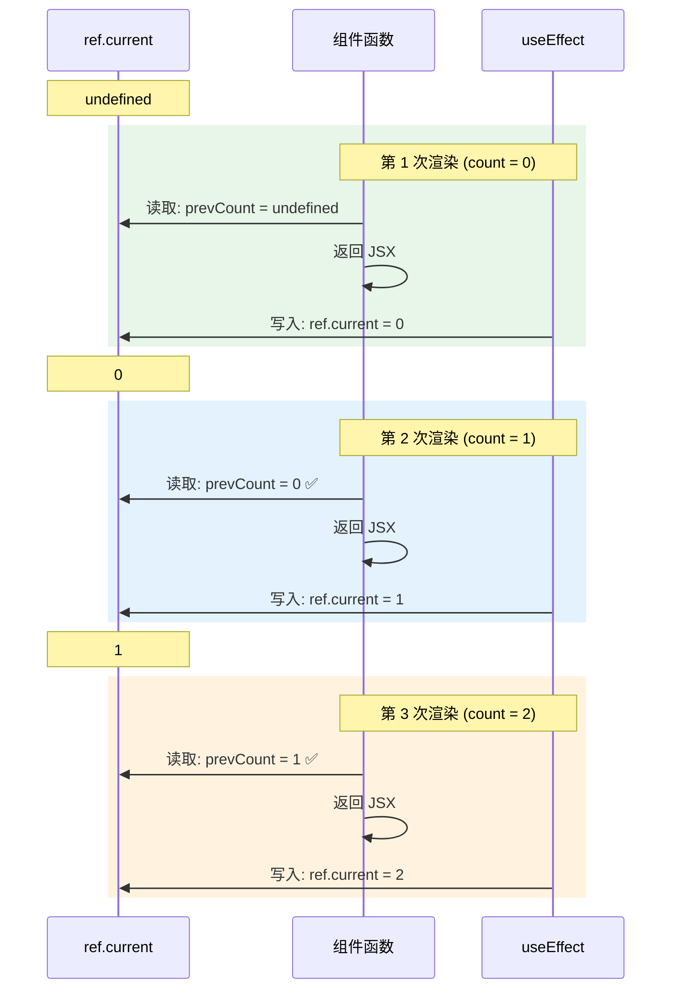

# useRef

> 掌握 useRef 的两大核心用途——保存可变值和获取 DOM 引用

---

## 📋 学习目标

- [x] 理解 useRef 的本质——一个「可变容器」
- [x] 区分 useState 和 useRef 的核心差异
- [x] 掌握 useRef 获取 DOM 引用的三步走
- [x] 理解 ref 的赋值时机
- [x] 学会 usePrevious 模式保存上一次的值
- [x] 处理边界情况（falsy 值、undefined）

---

## 🔑 核心概念：useRef 是什么？

```tsx
const countRef = useRef(0);
console.log(countRef);  // { current: 0 }
```

**useRef 返回一个对象**，这个对象：
- 有一个 `.current` 属性存储值
- **引用在整个组件生命周期中保持稳定**（同一个对象）
- `.current` 可以随时修改



> 无论渲染多少次，`useRef` 返回的始终是**同一个对象**

### useRef 为什么能解决闭包陷阱？



> 闭包拍了一张「相框」的照片。相框本身不会变（引用不变），但相框里的照片可以换（`.current` 可以修改）。

---

## ⚡ 重要：useState vs useRef

> [!warning] 必须牢记
> **setState() 触发重新渲染，ref.current = x 不触发渲染！**

```
UI = f(state)

setState() → React: "状态变了！重新渲染！" → 组件函数重新执行
ref.current = x → React: "......" （完全不知道，也不关心）
```

### 对比示例

```tsx
// 方案 A：用 useState 保存 timer ID
const handleSaveId = () => {
  const id = setTimeout(() => {}, 1000);
  setTimerId(id);  // 触发 1 次渲染
};

// 方案 B：用 useRef 保存 timer ID
const handleSaveId = () => {
  timerRef.current = setTimeout(() => {}, 1000);
  // 不触发渲染（0 次）
};
```

### 选择依据

| 情况 | 选择 | 例子 |
|------|------|------|
| 需要显示在页面上 | `useState` | 计数器数字、用户名、列表 |
| 不需要显示，只是内部用 | `useRef` | 定时器 ID、DOM 元素、上一次的值 |

> [!tip] 记忆口诀
> **要渲染，用 State；不渲染，用 Ref。**

### 流程对比图



---

## 🎯 用途一：保存可变值

适用于不需要触发渲染的数据：

```tsx
function Timer() {
  const intervalRef = useRef<number | null>(null);
  const [count, setCount] = useState(0);

  const start = () => {
    if (!intervalRef.current) {  // 防止重复启动
      intervalRef.current = setInterval(() => {
        setCount(c => c + 1);
      }, 1000);
    }
  };

  const stop = () => {
    if (intervalRef.current) {
      clearInterval(intervalRef.current);
      intervalRef.current = null;  // 重置
    }
  };

  // 组件卸载时清理
  useEffect(() => {
    return () => {
      if (intervalRef.current) {
        clearInterval(intervalRef.current);
      }
    };
  }, []);

  return (/* ... */);
}
```

---

## 🎯 用途二：获取 DOM 引用

### 三步走

```tsx
function SearchBox() {
  // 1️⃣ 创建 ref
  const inputRef = useRef<HTMLInputElement>(null);

  const handleClick = () => {
    // 3️⃣ 使用 ref.current 访问 DOM
    inputRef.current?.focus();
  };

  return (
    <div>
      {/* 2️⃣ 绑定到元素 */}
      <input ref={inputRef} placeholder="搜索..." />
      <button onClick={handleClick}>聚焦</button>
    </div>
  );
}
```

### ref 赋值时机

```mermaid
sequenceDiagram
    participant C as 组件函数
    participant R as React
    participant D as DOM
    participant E as useEffect

    Note over C: ref.current = null
    C->>R: 返回 JSX
    R->>D: 创建 DOM 元素
    Note over D: <input> 被创建
    R->>R: 赋值 ref.current = <input>
    Note over R: ref.current ✅ 有值了
    R->>E: 执行 useEffect
    Note over E: 可以安全访问 ref.current
```



> [!important] 安全访问
> 在 **useEffect** 和 **事件处理函数** 中访问 ref 是安全的，因为此时 DOM 已经存在。

### 为什么用可选链 `?.`

```tsx
inputRef.current?.focus();  // ✅ 推荐

inputRef.current!.focus();  // ⚠️ 可行但不推荐
```

**TypeScript 只看类型定义**，不知道运行时的时序。虽然在事件处理函数中 ref.current 几乎肯定有值，但 `?.` 更安全：

| 方式 | 如果真的是 null |
|------|-----------------|
| `?.` | 静默跳过 |
| `!` | 运行时崩溃 💥 |

---

## 🎯 用途三：usePrevious 模式

保存「上一次」的值：

```tsx
function usePrevious<T>(value: T): T | undefined {
  const ref = useRef<T>();

  useEffect(() => {
    ref.current = value;  // 渲染后更新
  });  // 没有依赖数组，每次渲染都执行

  return ref.current;  // 返回更新前的值
}

// 使用
const [count, setCount] = useState(0);
const prevCount = usePrevious(count);
```

### 为什么能工作？

关键在于 **useEffect 在渲染之后执行**：



**精髓**：==先读后写==，所以读到的永远是「上一次」的值！

### 完整时序图



---

## ⚠️ 易错点

### 1. 忘记调用函数

```tsx
// ❌ 错误：返回函数引用，没有调用
inputRef.current?.focus

// ✅ 正确：调用函数
inputRef.current?.focus()
```

### 2. falsy 值判断

```tsx
// ❌ 错误：0 是 falsy，会显示 '无'
{prevCount ? prevCount : '无'}

// ✅ 正确：显式判断 undefined
{prevCount !== undefined ? prevCount : '无'}

// ✅ 或使用空值合并
{prevCount ?? '无'}
```

> [!tip] `??` vs `||`
> - `??` 只在 `null` 或 `undefined` 时取右值
> - `||` 在任何 falsy 值（0, '', false）时都取右值

### 3. 初始状态判断

```tsx
// ❌ 错误：初始时 undefined !== 1 也是 true
const hasChanged = userId !== prevUserId;

// ✅ 正确：必须先有"上一次"的值
const hasChanged = prevUserId !== undefined && userId !== prevUserId;
```

---

## 📊 useRef 速查表

| 场景 | 是否用 useRef | 原因 |
|------|--------------|------|
| 定时器 ID | ✅ | 不需要显示在 UI |
| DOM 元素引用 | ✅ | 需要直接操作 DOM |
| 上一次的值 | ✅ | 不需要触发渲染 |
| 表单输入值 | ❌ 用 useState | 需要实时显示 |
| 列表数据 | ❌ 用 useState | 需要渲染到页面 |
| 加载状态 | ❌ 用 useState | 需要控制 UI |

---

## ✏️ 练习

| 练习文件 | 验证命令 |
|----------|----------|
| [04-useref.tsx](idea://open?file=/Users/linqibin/Desktop/Patra/patra-react-playground/src/exercises/ch03/04-useref.tsx) | `pnpm test 04-useref` |

**练习内容**：
- 练习 1A/1B：预测 useState vs useRef 的渲染次数
- 练习 2A/2B/2C：DOM 引用（自动聚焦、点击聚焦、测量尺寸）
- 练习 3A/3B/3C：usePrevious 模式
- 练习 4：综合应用 - 秒表

**完成状态**：✅ 14/14 测试通过

---

## 🔗 相关知识

- [[03-useeffect-advanced#解决方案三：useRef 逃生舱|useRef 逃生舱]] — 用 useRef 解决闭包陷阱
- [[05-usecontext|useContext]] — 下一节学习跨组件共享状态
- [[06-custom-hooks|自定义 Hooks]] — 封装 usePrevious 等通用逻辑

---

## 🔗 导航

- 上一节：[[03-useeffect-advanced|useEffect 进阶]]
- 下一节：[[05-usecontext|useContext]]
