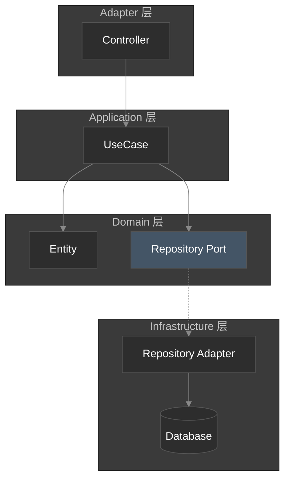

# {{title}}

## 概述

### 一句话描述

<!-- 用一句话概括这个设计要解决什么问题 -->

### 问题陈述

<!-- 描述当前的问题或需求背景 -->

### 目标

-

### 非目标

<!-- 明确边界，说明这个设计不解决什么问题 -->

-

---

## 架构设计

> [!tip] 本章节是核心，以图表为主

### 组件关系图

<!-- 使用 Mermaid 或 D2 绘制组件之间的关系 -->

### 数据流图

<!-- 描述数据如何在系统中流动 -->

### 时序图

<!-- 如有复杂交互，绘制时序图（可选） -->

### 六边形架构视图

| 层级 | 组件 | 职责 |
|------|------|------|
| **Adapter** |  |  |
| **Application** |  |  |
| **Domain** |  |  |
| **Infrastructure** |  |  |

---

## 相关链接

- 关联 ADR：
- 关联设计：
