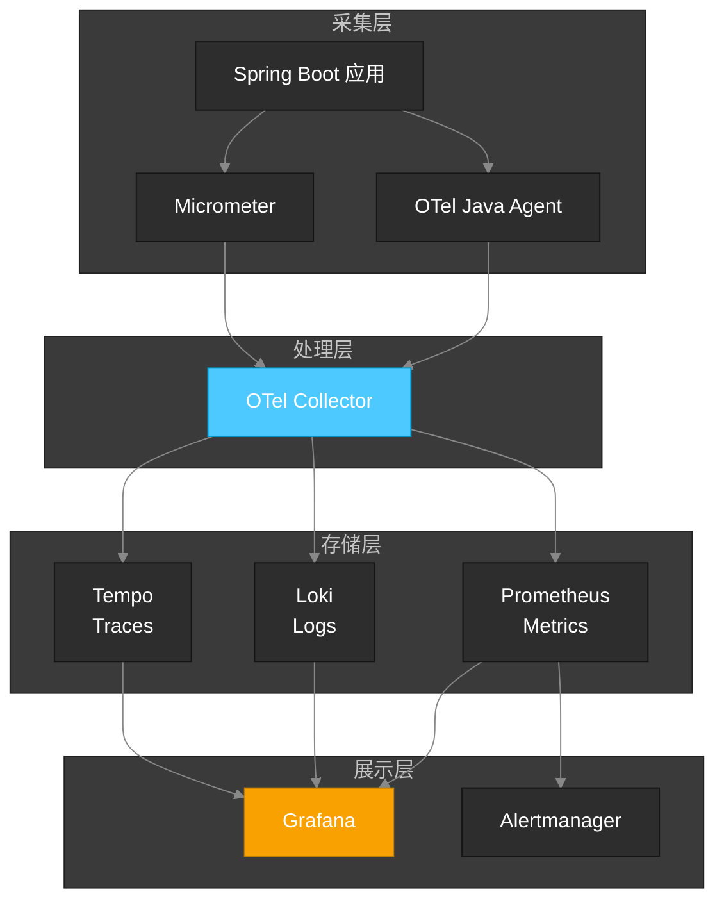

# 今日学习：可观测性系列完结

## 学习概要

今天完成了**可观测性（Observability）学习系列**的全部 6 个章节，系统性地掌握了 OpenTelemetry + Grafana Stack 技术栈。从核心概念到三大支柱（Metrics/Logs/Traces），再到告警系统和 Grafana 可视化，建立了完整的可观测性知识体系。

## 核心收获

### 1. 可观测性 vs 监控

- **监控**：已知问题的阈值告警（Known Unknowns）
- **可观测性**：回答未知问题的能力（Unknown Unknowns）
- 关键区别：监控告诉你"坏了"，可观测性告诉你"为什么坏了"

### 2. 三大支柱

| 支柱 | 数据类型 | 适用场景 | 存储工具 |
|------|----------|----------|----------|
| **Metrics** | 聚合数值 | 告警、趋势分析 | Prometheus |
| **Logs** | 离散事件 | 调试、审计 | Loki |
| **Traces** | 请求路径 | 性能分析、依赖追踪 | Tempo |

### 3. Metrics（指标）

- **四种类型**：Counter（累计）、Gauge（瞬时）、Histogram（分布）、Summary（摘要）
- **Micrometer**：Java 应用的指标门面，类似 SLF4J 之于日志
- **PromQL**：`rate()` 计算速率、`histogram_quantile()` 计算分位数

### 4. Logs（日志）

- **结构化日志**：JSON 格式，便于查询和聚合
- **日志级别**：ERROR（告警）→ WARN（需关注）→ INFO（业务事件）→ DEBUG（开发调试）
- **LogQL**：`{app="patra"} |= "error"` 标签选择 + 管道过滤
- **Trace 关联**：通过 `traceId` 字段实现日志到链路的跳转

### 5. Traces（链路追踪）

- **核心概念**：Trace（完整请求）→ Span（单个操作）→ SpanContext（传播上下文）
- **Context Propagation**：W3C Trace Context 标准，`traceparent` Header
- **OpenTelemetry**：CNCF 标准，统一 Metrics/Logs/Traces 采集
- **Spring Boot 集成**：`micrometer-tracing` + `opentelemetry-exporter`

### 6. 告警（Alerting）

- **告警规则**：Prometheus Alerting Rules，`for` 子句防止误报
- **Alertmanager**：路由、分组、静默、抑制
- **通知渠道**：Webhook → 企业微信/钉钉/Slack
- **黄金法则**：只告警可操作的问题，避免告警疲劳

### 7. Grafana 可视化

- **数据源配置**：Prometheus + Loki + Tempo 统一查询
- **仪表盘设计**：Overview → Service → Instance 三层结构
- **信号关联**：Metrics → Logs → Traces 的 Exemplar 跳转
- **Provisioning**：YAML 配置实现 GitOps 管理

## 详细学习材料

- [[learning/observability/01-core-concepts|第一章：核心概念]]
- [[learning/observability/02-metrics|第二章：Metrics（指标）]]
- [[learning/observability/03-logs|第三章：Logs（日志）]]
- [[learning/observability/04-traces|第四章：Traces（链路追踪）]]
- [[learning/observability/05-alerting|第五章：告警]]
- [[learning/observability/06-grafana|第六章：Grafana 可视化]]

## 技术栈总结

## 项目应用

- 架构决策：[[decisions/ADR-005-adopt-opentelemetry-grafana-stack-for-observability|ADR-005 采用 OTel + Grafana Stack]]
- Starter 模块：`patra-spring-boot-starter-observability` 已集成

## 后续计划

- [ ] 实践：为 Patra 服务配置完整的可观测性基础设施
- [ ] 深入：学习 OpenTelemetry Collector 的高级配置
- [ ] 扩展：探索 Grafana Alloy 作为下一代采集器
